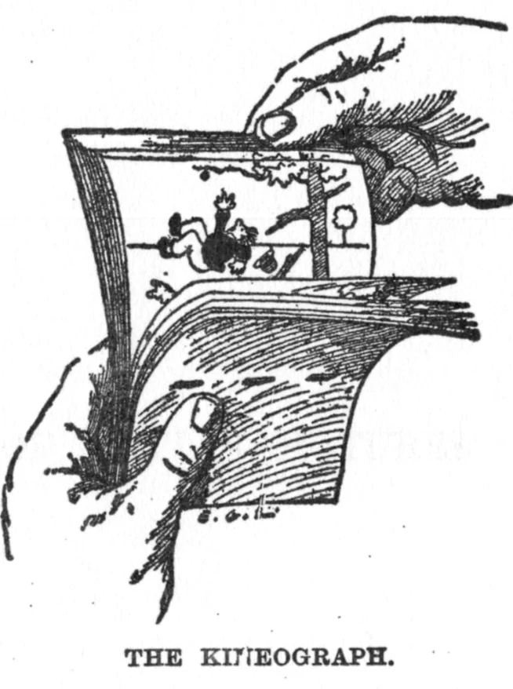
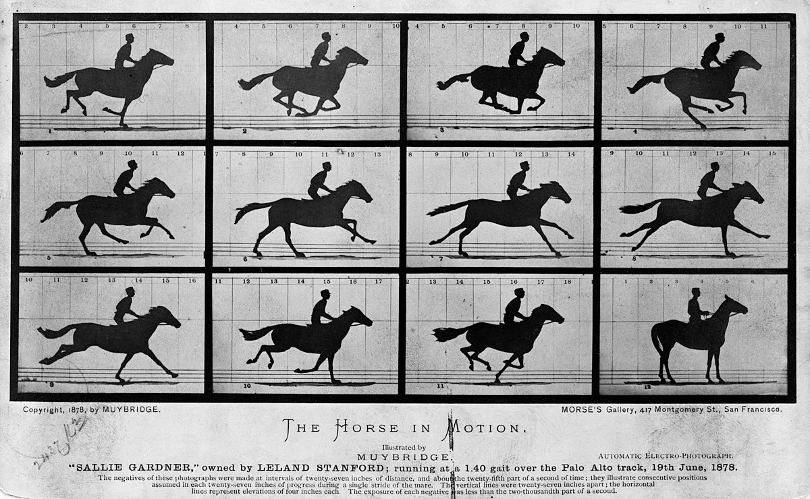
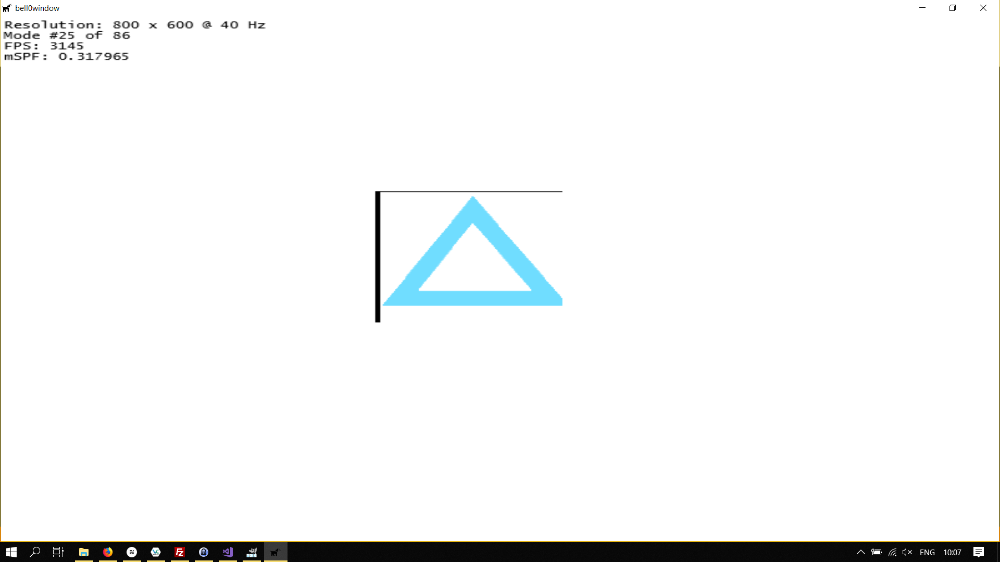
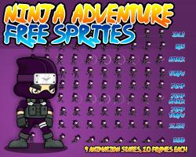
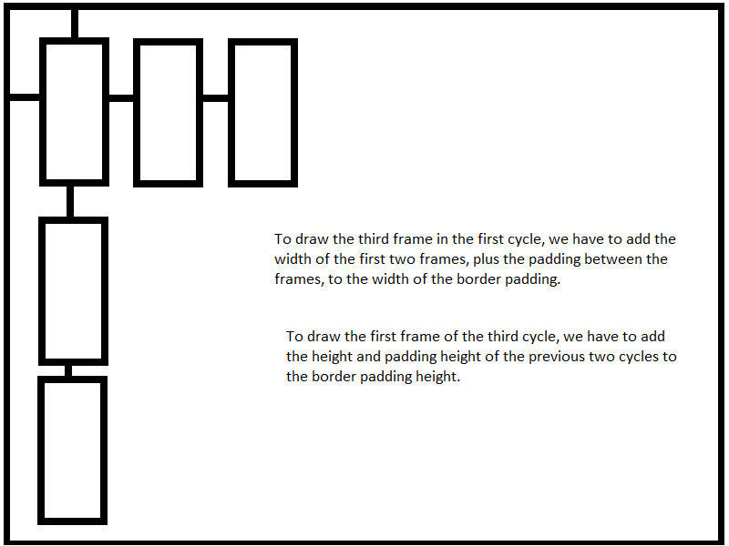
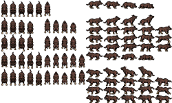
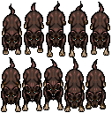
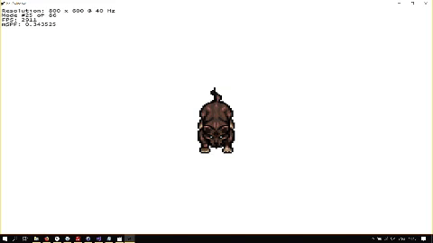

> Animation is about creating the illusion of life. And you can't create it if you don't have one.
>
> – Brad Bird

Animation in most 2D games is based on the [Flip Book](https://en.wikipedia.org/wiki/Flip_book) animation principle, which creates the illusion of motion by playing a series of static two-dimensional images in rapid succession.



In 1872, the former governor of California, Leland Stanford, a businessman and racehorse owner, hired [Edward Muybridge](https://en.wikipedia.org/wiki/Eadweard_Muybridge), a renowned photographer and scholar, to settle the question, whether all four feet of a horse were off the ground at the same time while trotting.

Muybridge set up a series of cameras along a racetrack, taking pictures in quick succession, and he was thus able to capture the following images:



As we can see, in at least one picture, the horse had all of its four legs off the ground.

About seven years later, Muybridge repeated the experiment and placed each photo onto a [Zoopraxiscope](https://en.wikipedia.org/wiki/Zoopraxiscope) to create an animation of a running horse:


To create a smooth looking animation, at least 24 FPS, the traditional frame rate used in films, is required. Obviously, this means that for every single second of animation, 24 individual images are needed.

In this tutorial, we will discover the basics of Sprite Animation and how to use Sprite Sheets to efficiently store the animation images.

## Animating Sprites
The *standard* approach to animated sprites is to create an array of images that represent the different stages of all the animations of a game character or object. For example, a player character in a small RPG, could have a walking and a running animation, each consisting of ten images, resulting in an array of twenty images in total, the first ten defining the walking cycle and the last ten the running cycle. 

### The Atlas Effect
As briefly mentioned in an early tutorial, Direct2D offers an effect to do just this. From the MSDN: 

> You can use the atlas effect to output a portion of an image but retain the region outside of the portion for use in subsequent operations. The CLSID for this effect is CLSID_D2D1Atlas. The atlas effect is useful if you want to load a large image made up of many smaller images, such as various frames of a sprite.

To create the effect, we use the [ID2D1DeviceContext::CreateEffect](https://msdn.microsoft.com/en-us/library/windows/desktop/hh404500(v=vs.85).aspx) method:

```cpp
HRESULT CreateEffect(
        REFCLSID    effectId,
  [out] ID2D1Effect **effect
);
```

#### REFCLSID effectId
This specifies the class ID of the desired effect to create. Direct2D offers the following [standard effects](https://msdn.microsoft.com/en-us/library/windows/desktop/hh706316(v=vs.85).aspx). The ID for the atlas effect is *CLSID_D2D1Atlas*.

#### ID2D1Effect **effect
When the method returns, this parameter contains the address of a pointer to the new effect.

To add the effect to an image, the [ID2D1Effect::SetInput](https://msdn.microsoft.com/en-us/library/windows/desktop/hh404591(v=vs.85).aspx) method is used:

```cpp
void SetInput(
                 UINT32     index,
  [in, optional] ID2D1Image *input,
                 BOOL       invalidate = TRUE
);

```

#### UINT32 index
This unsigned integer specifies the index of the image to set.

#### ID2D1Image *input
This is a pointer to the input image.

#### BOOL invalidate = TRUE
This boolean specifies whether to invalidate the graph at the location of the effect input or not.

Okay, so let us try it out.

```cpp
// declarations
Microsoft::WRL::ComPtr<ID2D1Effect> atlasEffect;
Microsoft::WRL::ComPtr<ID2D1Bitmap1> msdnAtlas;


// atlas effect
if (FAILED(d2d->devCon->CreateEffect(CLSID_D2D1Atlas, atlasEffect.ReleaseAndGetAddressOf())))
	return std::runtime_error("Critical error: Failed to create the atlas effect");

// load image
...

// set input
atlasEffect->SetInput(0, msdnAtlas.Get());
```

So far, so easy.

Now, for Direct2D to know which image to load from the sprite sheet, we have to specify the width of each image, and the padding width between images.

```cpp
// size of each image
float size = 150.0f;

// padding
float padding = 10.0f;

// define the input rectangle
D2D1_RECT_F inputRect = {padding, padding, padding+size, padding+size};
```

Still easy. Now what is left to do is to tell the atlas about the rectangle; this is done using the ID2D1Effect::SetValue function, for which, strangely enough, no MSDN page exists?

```cpp
atlasEffect->SetValue(D2D1_ATLAS_PROP_INPUT_RECT, &inputRect);
```

Drawing one of the rectangles (can you guess which one from the definition of the input rectangle?) is now straightforward:

```cpp
util::Expected<int> DirectXGame::render(double /*farSeer*/)
{
	...
	
    d2d->devCon->DrawImage(atlasEffect.Get());
    
    ...
}
```



As you can see, the example from the MSDN is a bit messy, the padding isn't right, and thus the image doesn't really look the way it should.

While the effects are interesting and useful, I feel like the atlas effect isn't powerful enough to do what we want to do. We will therefore create our own class to work with sprite sheets.

## bell0Atlas
We can emulate the behaviour of the atlas effect with a simple structure:

```cpp
// structure to define animation cycles
struct AnimationCycleData
{
	LPCWSTR name;					// name of the animation
	unsigned int startFrame;		// the index of the first frame of an animation
	unsigned int numberOfFrames;	// the total numbers of frames in the animation
	float	width,					// the width of each frame
			height,					// the height of each frame
            rotationCenterX,		// rotation center x-coordinate
			rotationCenterY;		// rotation center y-coordinate
			paddingWidth,			// width of the padding
			paddingHeight,			// height of the padding
			borderPaddingWidth,		// width of the border padding
			borderPaddingHeight,	// height of the border padding
};
```

### LPWSTR name
This specifies the name of the animation cycle.

### unsigned int startFrame
This unsigned integer defines the first frame of the cycle.

### unsigned int numberOfFrames
This unsigned specifies the actual number of frames in this cycle.

### float width, height
Those two variables define the width and height of each sprite in the cycle.

### float rotationCenterX, rotationCenterY
The rotation centre of each sprite in this animation cycle, given in relative coordinates between 0.0f and 1.0f. This is of the outmost importance when we want to apply affine maps such as scaling or rotations to the sprites.

### float paddingWidth, paddingHeight
These two variables define the padding width and height between the sprites.

### float borderPaddingWidth, borderPaddingHeight
These two variables define the border padding width and height.

---

The question now is how to store all those images for each stage of the animation. Clearly, loading hundreds of sprites as individual images would consume far too much memory and processing power. This question also is the reason for the many *width* and *height* parameters in the above structure; as the standard solution is to create so-called

## Sprite Sheets
A sprite sheet, as seen above, is a single image file containing all the sprites/animations for a game character or object. In such a sprite sheet, it is possible to pack the sprites closely together, this means that when the sprite sheet is opened, a bit of work is necessary to reconstruct the correct images in memory, but the file size can be significantly reduced.

Another advantage of sprite sheets is that most GPUs need to have textures loaded into their own memory before drawing them, which means that switching between different images all the time will result in a huge performance drop.

Basically speaking, sprite sheets are made up of two parts, the *frames* and the *cycles*. In the above example, the individual photos of the horse would be the frames, and the frames played in rapid succession, in the correct order, would constitute the running *cycle*.

---

To create sprite sheets, you can either draw your own images and nicely stash them into a sprite sheet, or you can try to find some great art on websites like [OpenGameArt](https://opengameart.org/). A popular tool to create sprite sheets from loose images is the *[texturepacker](https://www.codeandweb.com/texturepacker)* software.

Our structure plays well with the following sprite sheet layouts:



The sprite sheet has different animation cycles, with the frames of each cycle being in a single row. The following code assumes each image in the same cycle to have the same size and padding.

---

To use those sprite sheets together with the frame data structure we defined earlier, we create a new class to store animations:

```cpp
// class to store animations
class AnimationData
{
private:
	Microsoft::WRL::ComPtr<ID2D1Bitmap1> spriteSheet;	// the image containing all the animations
	std::vector<AnimationCycleData> cyclesData;			// the cycle data for all the different cycles in this animation

public:
	AnimationData(Direct2D* d2d, LPCWSTR spriteSheetFile, std::vector<AnimationCycleData> frameData);
	~AnimationData();

	friend class AnimatedSprite;
};
```

This class simply holds a pointer to a sprite sheet together with the data of each animation cycle in the sprite sheet. The implementation of the constructor is analogical to the constructor of the sprite class, with the addition of the vector being stored.

---

## Animated Sprites
To use the animation data, we create the *AnimatedSprite* class, which inherits from *Sprite*. The *AnimatedSprite* must keep track of its current animation, the current frame in the animation, and the amount of game time the current frame has been displayed. In addition, the animation's own FPS is stored in a member variable to allow the animation to slow down or speed up, for instance, as a game character speeds up, the running animation would be played more rapidly.

```cpp
class AnimatedSprite : public Sprite
{
private:
	AnimationData* animationData;							// the data and the spritesheet for this sprite
	unsigned int activeAnimation;							// the currently active animation
	unsigned int activeAnimationFrame;						// the currently active frame
	float animationFPS = 24.0f;								// the animation's own FPS
	double frameTime;										// the time the current frame has been displayed

public:
	// constructor and destructor
	AnimatedSprite(Direct2D* d2d, AnimationData* animData, unsigned int activeAnimation = 0, float animationFPS = 24, float x = 0.0f, float y = 0.0f, Layers layer = Layers::Characters, unsigned int drawOrder = 0);	// creates an animated sprite with corresponding animation data structure and sets the active animation as specified
	~AnimatedSprite();

	// drawing
	void draw();											// computes the source and destination rectangle, based on the currently active animation cycle and frame, and then calls on the Sprite::draw method to actually draw the AnimatedSprite

	// update
	void updateAnimation(double deltaTime);					// updates the currently active animation cycle based on the passed time
    void changeAnimation(unsigned int cycleToActivate);		// activated the specified animation cycle
};
```

### AnimationData* animationData
This member variable simply holds the data and the spritesheet for this sprite.

### unsigned int activeAnimation
This member variable is used to define the currently active animation cycle. It is used in the *draw* method to find the correct row of images to cycle through.

### unsigned int activeAnimationFrame
This member variable defines the currently active frame in the active animation cycle. This is used in the update method to figure out which frame to play next.

### float animationFPS = 24.0f
This float sets the speed at which the animation is being played. The standard speed for animations, as in movies, is at 24 frames per second. This is used in the update method to figure out which frame to play next.

### double frameTime
This double stores the time the currently active frame has been on display. This is used in the update method to figure out which frame to play next.

---

The **constructor** is completely trivial, as it only fills the member variables with the given input. The same goes for the **destructor**, it simply sets the pointer to the AnimationData class to null.

---

Now the **draw** method is already a lot more interesting, but still straightforward. Two problems must be solved: we have to compute a destination and a source rectangle; the destination rectangle, as in previous tutorials, specifies where to draw the sprite, and the source rectangle defines the portion of the sprite sheet to draw.

Let us start with the destination rectangle. To facilitate the use of mathematical operations, such as affine maps, like rotation and scaling, on our sprites, we want the rotation centre of each sprite to be at the desired location, i.e. if the sprite should be at screen coordinates (400,300), we want the actual rotation centre to be at (400, 300).

Thankfully we know the coordinates of the rotation centre in relation to the width and height of the sprite, thus computing the coordinates of the upper-left and lower-right corner of the destination rectangle is still easy. Let $(x,y)$ be the desired location, $w$ the width of the sprite, $h$ the height of the sprite and $(rX, rY)$ the rotation centre of the sprite in relative coordinates.

The coordinates of the upper-left corner of the destination rectangle, $(ulX, ulY)$ can be computed as follows: $ulX := x + w \cdot rX$ and $ulY := y + h \cdot rY$.

The coordinates of the lower-right corner of the destination rectangle, $(lrX, lrY)$ can be computed as $lrX := x + w \cdot (1-rX)$ and $lrY := y + h \cdot (1-rY)$.

```cpp
D2D1_RECT_F destRect = {this->x-(cycleData.width*cycleData.rotationCenterX), 
						this->y-(cycleData.height*cycleData.rotationCenterY), 
						this->x+(cycleData.width*(1.0f-cycleData.rotationCenterX)),
						this->y+(cycleData.height*(1.0f-cycleData.rotationCenterY))};
```

To compute the source rectangle, we have to get the information about the currently active cycle. Assume that we want to draw the $i$-th frame of the $k$-th cycle. $h,w$ the height and width of each frame in the cycle, $pw, ph$ the padding width and padding height of each frame in the cycle and $bh, bw$ the border padding width and height of the corresponding cycle. Furthermore, let $h_k$ and $ph_k$ be the added height of all frames before the $k$-th cycle and the added padding height of all frames prior to the $k$-th cycle.  Note that the first cycle/frame is the $0$-th cycle/frame.

The coordinates of the upper-left corner of the source rectangle $(ulX, ulY)$ can be computed as follows: $ulX := bw + i*(w+pw)$ and $ulY := bh + h_k + ph_k$. For the x-coordinate, we simply add the width and padding width of each image to the border padding width. For the y-coordinate, we simply add the height and padding heights of the images in all previous cycles to the border height. 

The coordinates of the lower-right corner of the source rectangle $(lrX, lrY)$ can now easily be computed as follows: $lrX := ulX + w$ and $lrY := ulY + h$.

While this might sound complicated, it is actually straightforward, just try it out for yourself and perhaps sketch the situation for yourself.



---

Now the real fun begins with the **update** method. This method is quite complex because it can't be assumed that the animation speed is slower than the game FPS. For example, a game might run at 60 fps, but we want to play a 24fps animation at triple speed, or 72 fps (just imaging running away from a Säbelzinntager (inside joke!)).

Once the animation fps is higher than the game fps, animation frames have to be skipped. The update method has to figure out how many frames to skip ahead. Once a particular frame has been displayed longer than the animation fps, it is necessary to calculate how many frames to jump ahead. Note that this also means that once a cycle comes to an end, it can't be restarted with the first frame, as maybe we had to jump ahead for multiple frames and have to restart at frame 1 or 2.

I will just throw the update method at you now, and then try to explain it after you have had a chance to read the code:

```cpp
void AnimatedSprite::updateAnimation(double deltaTime)
{
	// update how long the currently active frame has been displayed
	frameTime += deltaTime;

	// check whether it is time to change to another frame
	if (frameTime > (1.0f / (double)animationFPS))
	{
		// the number of frames to increment is the integral result of frameTime / (1 / animationFPS), thus frameTime * animationFPS
		activeAnimationFrame += (unsigned int)(frameTime * animationFPS);

		// use modulo computation to make sure to not jump past the last frame
		if (activeAnimationFrame >= animationData->cyclesData[activeAnimation].numberOfFrames)
			activeAnimationFrame = activeAnimationFrame % animationData->cyclesData[activeAnimation].numberOfFrames;
	}

	// set the frame time
	frameTime = std::fmod(frameTime, 1.0f / (double)animationFPS);
}
```

Remember that the *deltaTime* is computed in the game loop. The update method now keeps adding the deltaTime to the time the frame has been displayed, the *frameTime*. Let $a$ be the animation fps, that is $a = \frac{f}{s}$, where $f$ is the desired number of frames per second, then $\frac{1}{a} = \frac{s}{f}$, now, obviously, if the computed frameTime is bigger than the reciprocal of the desired animation fps, it is time to go to the next frame.

If this first condition is fulfilled, we have to compute how many frames to jump ahead. Let $f_s$ be the number of seconds the current frame has been displayed already, then the number of frames $f_n$ to increment is $f_n := \frac{f_s}{\frac{1}{a}} = a \cdot f_s$, that is, the number of frames to jump ahead is equal to the product of the time this frame has been displayed already and the animation fps.

Finally, to wrap correctly at the end of the cycle, we use a simple modulo calculation. Imagine a cycle with 24 images, with the 23-rd frame currently being active. Now if we have to jump by 3 frames, we compute $23+3=26\equiv_{24}2$, which means that we have to restart the animation cycle with the second frame.

---

This wasn't so bad, was it? At least we got to do some mathematics. Let us see all of our work in action.

For the next demo, I used two cycles from this fantastic wolf sprite:





The first cycle, or row, represents a running wolf. The second cycle, or row, shows an angry wolf in attack position.

Creating an animated sprite is now surprisingly easy:

```cpp
// definitions
graphics::AnimationData* wolfAnimations;
graphics::AnimatedSprite* wolf;

// initialize graphics
util::Expected<void> DirectXGame::initGraphics()
{	
	std::vector<graphics::AnimationCycleData> wolfAnimationsCycles;
	graphics::AnimationCycleData cycle;
	
	// wolf on attention cycle
	cycle.name = L"Wolf Running";
	cycle.startFrame = 0;
	cycle.numberOfFrames = 5;
	cycle.width = 25;
	cycle.height = 64;
	cycle.paddingWidth = 0;
	cycle.paddingHeight = 1;
	cycle.borderPaddingHeight = cycle.borderPaddingWidth = 1;
	cycle.rotationCenterX = cycle.rotationCenterY = 0.5f;
	wolfAnimationsCycles.push_back(cycle);

	// angry wolf animation cycle
	cycle.name = L"Wolf Attack";
	cycle.startFrame = 0;
	cycle.numberOfFrames = 5;
	cycle.width = 24;
	cycle.height = 62;
	cycle.paddingWidth = cycle.paddingHeight = 0;
	cycle.borderPaddingWidth = 1;
	cycle.borderPaddingHeight = 0;
	cycle.rotationCenterX = cycle.rotationCenterY = 0.5f;
	wolfAnimationsCycles.push_back(cycle);

	// create wolf animations
	try { wolfAnimations = new graphics::AnimationData(d2d, L"O:/Documents/GitLab/bell0tutorial/bell0tutorial/Art/wolfAnimations.png", wolfAnimationsCycles); }
	catch (std::runtime_error& e){ return e; }

	// create wolf
	wolf = new graphics::AnimatedSprite(d2d, wolfAnimations, 0, 24, 400, 300);

	wolfAnimationsCycles.clear();
	std::vector<graphics::AnimationCycleData>(wolfAnimationsCycles).swap(wolfAnimationsCycles);

	// return success
	return {};
}
```

Most of this is self-explanatory and works just as in the previous tutorial for normal sprites. We just have to tell Direct2D about our sprite sheet, how large each image is, where to find the rotation centre, and how far apart from each other they are, that is all.

Finally, animating and drawing the sprite is equally easy:

```cpp
util::Expected<int> DirectXGame::update(double deltaTime)
{	
	// update the game world
	wolf->updateAnimation(deltaTime);

	// return success
	return 0;
}

util::Expected<int> DirectXGame::render(double /*farSeer*/)
{
    ...
	wolf->draw();
	...
}
```

This was almost too easy! Run Wolf, Run!



---

Okay, so far for drawing one animation, but what if someone evil approaches and our wolf companion wants to warn us by barking? We need a way to change animations. Doing that is actually straightforward, we simply set the desired animation as active, activate the first frame of the new cycle and set the time the frame was displayed to 0. This is the job of the **changeAnimation** method:

```cpp
void AnimatedSprite::changeAnimation(unsigned int cycleToActivate)
{
	if (cycleToActivate > this->animationData->cyclesData.size())
	{
		// print error
		util::ServiceLocator::getFileLogger()->print<util::SeverityType::warning>("Unable to activate the desired animation cycle! Reverting to the default cycle!");

		// activate the first animation cycle
		activeAnimation = 0;
		activeAnimationFrame = 0;
		frameTime = 0.0f;
	}
	else
	{
		// activate the first frame of the new animation and set the active time to 0
		activeAnimation = cycleToActivate;
		activeAnimationFrame = 0;
		frameTime = 0.0f;
	}
}
```

We now have a simple implementation of a Sprite system, and it will work well enough for simple games, but it only works for looping animations. It will glitch once we try to transition between animations. To also support transitions, we will need a finite state machine, but that is a topic for a later, more advanced, tutorial.

It is also possible to not only load a sprite sheet, but also a LUA file with all the information about the sprite sheet, allowing for even more different sheet layouts to be used in our application, but that as well is a topic for a later tutorial.

---

You can download the source code from [here](https://filedn.eu/ltgnTcOBnsYpGSo6BiuFrPL/Game%20Programming/Flatland/Direct2D/animatedSprites.7z).

---

## References
### Literature
(in alphabetic order)
* Game Programming Algorithms, by Sanjay Madhav
* Game Programming Patterns, by Robert Nystrom
* Microsoft Developer Network ([MSDN](https://msdn.microsoft.com/en-us/library/windows/desktop/ee663274(v=vs.85)))
* Tricks of the Windows Game Programming Gurus, by André LaMothe
* Wikipedia
### Sprites
* [OpenGameArt](https://opengameart.org/content/lpc-wolf-animation)
* [Texturepacker](https://www.codeandweb.com/texturepacker)