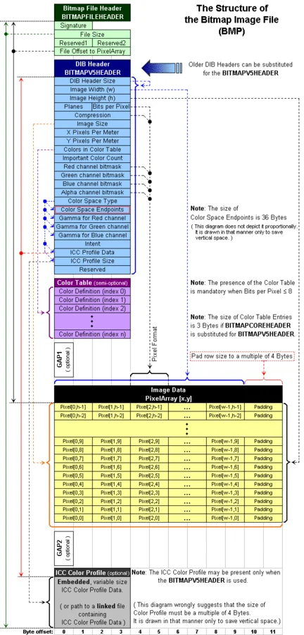
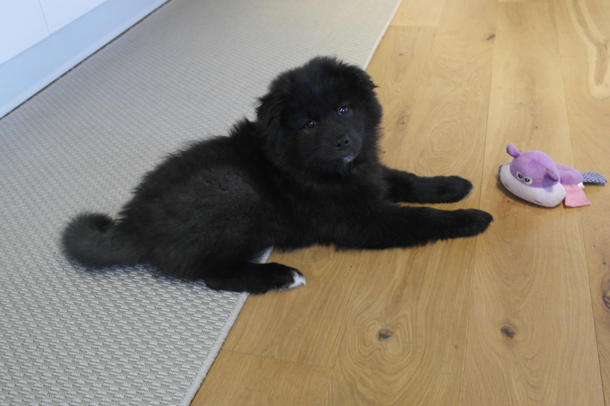
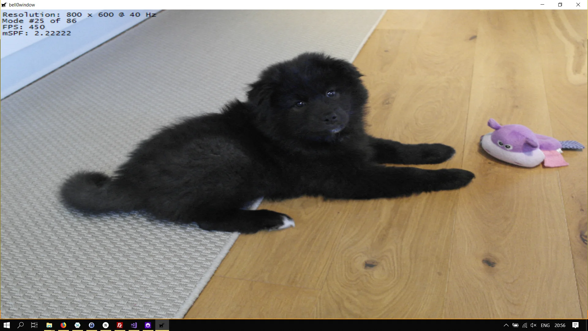
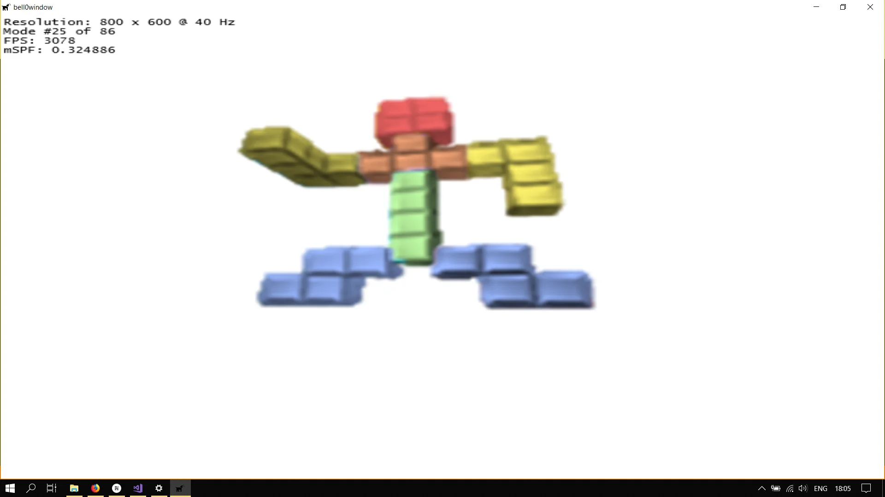

> Bitmap display is media compatible with dot matrix or laser printers.
>
> – Bill Joy

A bitmap is a map from an arbitrary domain, for example $\mathbb{Z}$, $\mathbb{Q}$ or $\mathbb{R}$, into the field with two elements: $(F_2, +_2, \cdot_2) = (\mathbb{Z}_2, +_2, \cdot_2) = (\{0,1\}, +_2, \cdot_2)$, with $$+_2: F_2 \times F_2 \to F_2, (z_1, z_2) \mapsto (z_1+z_2) \mod 2$$ and $$\cdot_2: F_2 \times F_2 \to F_2, (z_1, z_2) \mapsto (z_1 \cdot z_2) \mod 2.$$ 
Those maps can be used in computer graphics to store a binary image, that is, an image in which each pixel is either black or white (or any two colours). To achieve this, the domain is chosen to be a rectangle, i.e. $\mathbb{R} \times \mathbb{R}$. 

The more general term pixmap refers to a similar map from an arbitrary domain into a finite field $F_p$, with $p$ being a prime number bigger than $2$, or even more generally, into a finite subset of $\mathbb{N}$. In computer graphics, those pixmaps can be used to create images with multiple bits per pixel. Pixmaps are also called bitmaps, for simplicity of use.

A bitmap can be imagined as a format to store data. It commonly refers to the similar concept of a spatially mapped array of pixels. Raster images in general may be referred to as bitmaps or pixmaps, whether synthetic or photographic. 

The native Windows format to store bitmaps is the *[BMP](https://en.wikipedia.org/wiki/BMP_file_format)* format. Another interesting format, though not purely a bitmap, is the *[Portable Networks Graphics, or PNG](https://en.wikipedia.org/wiki/Portable_Network_Graphics)* format, which uses compressed formats internally.

In this tutorial, we will learn how to use bitmaps in Direct2D to load images into our games. As an example for bitmap file formats, we will have a closer look at the Windows native BMP format.

---

## BMP File Format
The BMP file format, also known as device independent bitmap (DIB) file format, is a raster graphics image file format used to store bitmap digital images, independently of the display device (such as a graphics adapter), especially on Microsoft Windows and OS/2 operating systems. The BMP file format is capable of storing two-dimensional digital images both monochrome and in colour, in various colour depths, and optionally with data compression, alpha channels, and colour profiles.

In the Dark Ages of game programming, i.e. during the time of DirectX 8, working with BitMaps was quite tedious, as there are about a trillion different bitmap file formats. To load a bitmap, one has to study the bitmap file format and write some code to load the data from a bitmap file. Let us examine the Windows native BMP file format.



As you can see, a BMP file consists of seven parts or blocks, four of which are optional. We will cover each of those.

### [Bitmap file header](https://msdn.microsoft.com/en-us/library/dd183374(v=vs.85).aspx)
The bitmap file header is a block of bytes that is always at the start of a bitmap file and holds general information about the bitmap. You would read this block first to make sure the file is actually a valid BMP file.

```cpp
typedef struct tagBITMAPFILEHEADER {
  WORD  bfType;
  DWORD bfSize;
  WORD  bfReserved1;
  WORD  bfReserved2;
  DWORD bfOffBits;
} BITMAPFILEHEADER, *PBITMAPFILEHEADER;
```

#### WORD bfType
This specifies the file type and must be *BM* (0x4D42) for a valid *.BMP* file.

#### DWORD bfSize
This member stores the size in bytes of the bitmap file.

#### WORD bfReserved1
#### WORD bfReserved2
Those are reserved fields that must be zero.

#### DWORD bfOffBits
This specifies the offset, in bytes, from the beginning of the BITMAPFILEHEADER structure to the actual bitmap bits.

---

### DIB header
Also known as the the [bitmap information section](https://msdn.microsoft.com/en-us/library/dd183375(v=vs.85).aspx), this block of bytes stores detailed information about the image, namely its dimensions and colour information:

```cpp
typedef struct tagBITMAPINFO {
  BITMAPINFOHEADER bmiHeader;
  RGBQUAD          bmiColors[1];
} BITMAPINFO, *PBITMAPINFO;

```

#### BITMAPINFOHEADER bmiHeader
This structure contains detailed colour information.

#### [RGBQUAD](https://msdn.microsoft.com/en-us/library/dd162938(v=vs.85).aspx) bmiColors[1]
This member holds the colour palette, if there actually is one. More precisely, it either contains an array of RGBQUADs whose elements made up the colour palette, or an array of 16-bit unsigned integers that specifies indexes into the currently realized logical palette. The number of entries in this array depends on the *biBitCount* and *biClrUsed* members of the *BITMAPINFOHEADER*.

Let us thus have a look at this info header:

```cpp
typedef struct tagBITMAPINFOHEADER {
  DWORD biSize;
  LONG  biWidth;
  LONG  biHeight;
  WORD  biPlanes;
  WORD  biBitCount;
  DWORD biCompression;
  DWORD biSizeImage;
  LONG  biXPelsPerMeter;
  LONG  biYPelsPerMeter;
  DWORD biClrUsed;
  DWORD biClrImportant;
} BITMAPINFOHEADER, *PBITMAPINFOHEADER;
```

#### DWORD biSize
This member specifies the number of bytes required by the structure.

#### LONG biWidth
This member specifies the width of the bitmap, in pixels.

If *biCompression* is *BI_JPEG* or *BI_PNG*, the biWidth member specifies the width of the decompressed JPEG or PNG file, respectively.

#### LONG biHeight
This member specifies the height of the bitmap, in pixels. We have already noticed that if biHeight is positive, the bitmap is *bottom-up* bitmap with the origin in the lower-left corner, else it is a *top-down* bitmap with the origin in the upper-left corner. 

Furthermore, if this member is negative, biCompression must either be *BI_RGB* or *BI_BITFIELDS*, as top-down bitmaps cannot be compressed. 

If biCompression is BI_JPEG or BI_PNG, the biHeight member specifies the height of the decompressed JPEG or PNG image file, respectively.

#### WORD biPlanes
This member specifies the number of colour planes and must be set to 1.

#### WORD biBitCount
This member specifies the number of bits per pixel.

The following pixel formats are possible (remember that bit maps are actually maps from $\mathbb{N}$ to a finite subset of $\mathbb{N}$:

- **0 bits-per-pixel** means that the number of bits-per-pixel is specified or implied by the JPEG or PNG format.

- **1 bit-per-pixel** means that the bitmap is monochrome. The 1-bit-per-pixel format supports 2 distinct colours. Each bit is an index into a table of 2 colours. An unset bit will refer to the first colour table entry, and a set bit will refer to the second colour table entry.

- **4 bits-per-pixel** means that the bitmap has a maximum of $2^4=16$ distinct colours and stores 2 pixels per 1 byte. Each pixel value is a 4-bit index into a table of up to 16 colours.

- The **8-bits-per-pixel** format supports $2^8=256$ distinct colours and stores 1 pixel per 1 byte. Each byte is an index into a table of up to 256 colours.

- The **16-bits-per-pixel** format supports $2^{16}=65536$ distinct colours and stores 1 pixel per 2-byte WORD. Each WORD can define the alpha, red, green, and blue samples of the pixel.

- The **24-bits-per-pixel** format supports $2^{24}=16777216$ distinct colours and stores 1 pixel value per 3 bytes. Each pixel value defines the red, green, and blue samples of the pixel.

- The **32-bits-per-pixel** format supports $2^{32}=4294967296$ distinct colours and stores 1 pixel per 4-byte DWORD. Each DWORD can define the alpha, red, green and blue samples of the pixel.

#### DWORD biCompression
This member specifies the type of compression used. Check the MSDN for all possible values, but note that **BI_RGB** stands for an uncompressed format, and **BI_JPG** and **BI_PNG** indicate that the image is a JPEG or PNG respectively.

#### DWORD biSizeImage
This member specifies the size of the image in bytes. This may be set to zero for BI_RGB bitmaps.

If biCompression is BI_JPEG or BI_PNG, biSizeImage indicates the size of the JPEG or PNG image buffer, respectively.

#### LONG biXPelsPerMeter
#### LONG biYPelsPerMeter
These members specify the pixels per meter on the x-axis and y-axis respectively.

#### DWORD biClrUsed
This member specifies the number of colours used by the bitmap. 

#### DWORD biClrImportant
This member specifies the important colours that are required to display the bitmap. If this value is zero, all colours are required.

---

### Bitmap Data Area
The bits representing the bitmap pixels are packed in rows. The size of each row is rounded up to a multiple of 4 bytes by padding. For images with height $\| h \| > 1$, multiple padded rows are stored consecutively, forming an array of pixels. 

The total number of bytes necessary to store one row of pixels $r$, with $n$ bits per pixel and an image width of $w$, can thus be calculated as:$$r=\lfloor \frac{w \cdot n + 31}{32} \rfloor \cdot 4.$$
The total amount of memory $m$, in bytes, needed to store an array of pixels in an $n$ bits per pixel image, with $2^n$ colours and an image height $h$, can thus be computed as follows:$$m = r \cdot \| h \|.$$The absolute value is necessary because the height of an image can be negative (which means that the image is saved upside down).

The actual pixel array is a block of 32-bit DWORDs, that describes the image pixel by pixel. Usually pixels are stored *upside-down* with respect to normal image raster scan order, starting in the lower-left corner, going from left to right, and then row by row from the bottom to the top of the image, unless BITMAPCOREHEADER is used, uncompressed Windows bitmaps also can be stored from the top to bottom, resulting in negative image height (c.f. above).

## Loading Bitmaps
As you can see, writing a method to load bitmaps isn't too easy, there are so many details to be wary of. We have three possibilities now, we can write our own method, we can use an open-source method like the *stb* library, or use the [Windows Imaging Component](https://msdn.microsoft.com/en-us/library/windows/desktop/ee719902(v=vs.85).aspx) (WIC) that Microsoft provides.

Let us see what the WIC can do.

### The Windows Imaging Component
The Windows Imaging Component (WIC) is a Component Object Model-based imaging codec framework for working with digital images and image metadata. It allows applications supporting the framework to automatically get support of installed codecs for graphics file formats.

WIC enables image processing operations on any image format through a single set of common APIs, without requiring prior knowledge of specific image formats. Which is super nice, as you have seen how messy those image formats can be. By default, WIC supports JPEG, TIFF, GIF, PNG, BMP, DDS and HD Photo encoders and decoders, and an .ICO decoder (see below for more information on encoders and decoders).

#### What's new in Windows Imaging Content
The Windows Imaging Component has been updated with new releases of Windows. This section provides a brief introduction to these new features.

##### Windows 7
###### TIFF Codec
With Windows 7 came an update to the TIFF codec to support large TIFF files.

###### [Progressive Decoding](https://msdn.microsoft.com/en-us/library/windows/desktop/ee720036(v=vs.85).aspx)
Progressive decoding provides the ability to incrementally decode and render portions of an image before the entire image has finished downloading.

###### Extended Metadata Support
In Windows 7, the WIC provides extended support for JPEGs, PNGs, and GIFs.

###### Multithreading
Objects within a multithreaded apartment may be called concurrently by any number of threads within the same apartment, allowing for better performance on multicore systems. In addition, WIC codecs that live in an apartment can call other objects that live within the same apartment without the marshalling cost associated of calling between threads that live in different singlethread apartments.

In Windows 7, all in-box WIC codecs have been updated to support multithreaded apartments, including JPEG, TIFF, PNG, GIF, ICO, and BMP. 

It is highly recommended to use codecs that support multithreaded apartments, as other codecs will cause significant performance degradation in multithreaded applications due to marshalling. 

###### [Metadata Working Group](http://www.metadataworkinggroup.com/)
There are currently various metadata storage formats that contain overlapping properties, without any clear industry standard or guidance on consistent methods for reading and writing these metadata formats. To help with this variety of formats and properties, the Metadata Working Group (MWG) was formed. 

The aim of the MWG is to provide guidelines that ensure interoperability among a wide variety of platforms, applications, and devices. The guidelines established by the MWG apply to the XMP, Exif, and IPTC metadata fields, and to the JPEG, TIFF, and PSD image formats.

In Windows 7, the photo metadata handler and the metadata policy layer have been updated to read and write image metadata according to the guidelines established by the MWG.

##### Windows 8

###### Improved Direct2D Integration
A new factory, the [IWICImagingFactory2](https://msdn.microsoft.com/en-us/library/windows/desktop/hh880848(v=vs.85).aspx) is capable of creating [IWICImageEncoders](https://msdn.microsoft.com/en-us/library/windows/desktop/hh880844(v=vs.85).aspx).

###### Changes to the BMP codec alpha support
WIC in Windows 8 supports loading [BITMAPV5HEADER](https://msdn.microsoft.com/en-us/library/windows/desktop/dd183381(v=vs.85).aspx) image files as [WICPixelFormat32bppBGRA](https://msdn.microsoft.com/en-us/library/windows/desktop/ee719797(v=vs.85).aspx)-formatted images.

###### New Pixel Formats
WIC in Windows defines and supports various new pixel formats.

##### Windows 8.1
###### JPEG [Y'CbCr](https://en.wikipedia.org/wiki/YCbCr)
Starting in Windows 8.1, WIC provides support for decoding, transforming and encoding JPEG Y'CbCr image data in its native format, resulting in a significant decrease in the processing time and memory consumption for certain imaging operations when working with Y'CbCr encoded JPEGs.

###### Block Compressed Formats
WIC now supports DDS images encoded in the following formats: *DXGI_FORMAT_BC1_UNORM*, *DXGI_FORMAT_BC2_UNORM*, and *DXGI_FORMAT_BC3_UNORM*. DDS block compressed data can be accessed in a decoded form using standard WIC interfaces, or directly accessed using new DDS-specific interfaces.

##### Windows 10
###### Low-Level JPEG
Starting in Windows 10, version 1507, WIC provides access to low-level JPEG data structures, including [Huffman](https://en.wikipedia.org/wiki/Huffman_coding) and [quantization tables](https://en.wikipedia.org/wiki/JPEG#Quantization).

###### JPEG Indexing
JPEG indexing is a technique that significantly improves the performance of randomly accessing small sub regions of a large JPEG image, at the cost of some additional memory usage. The *ID2D1ImageSourceFromWic* interface is designed to leverage JPEG indexing if it is turned on.

### Initializing the Windows Imaging Component
First we have to initialize COM, as WIC relies on COM to create its objects. Each thread that needs COM, needs to initialize COM, and uninitialize it when it is done. We can do this in the constructor and destructor of the Direct2D class.

To initialize COM, we simply call the [CoInitialize](https://msdn.microsoft.com/en-us/library/windows/desktop/ms678543(v=vs.85).aspx) method in the constructor:

```cpp
Direct2D::Direct2D(core::DirectXApp* dxApp) : ...
{
	// initialize COM
	CoInitialize(NULL);

    ...
}
```

And to *end* COM, we simply call the CoUnitialize method in the desctructor:

```cpp
Direct2D::~Direct2D()
{
	// release the WICFactory
	WICFactory.ReleaseAndGetAddressOf();
		
	// end COM
	CoUninitialize();

	util::ServiceLocator::getFileLogger()->print<util::SeverityType::info>("Direct2D was shut down successfully.");
}
```
Now with COM properly running, we can create the Windows Imaging Component Factory using the [CoCreateInstance](https://msdn.microsoft.com/en-us/library/windows/desktop/ms686615(v=vs.85).aspx) function, which creates a single uninitialized object of a specified class:

```cpp
HRESULT CoCreateInstance(
  _In_  REFCLSID  rclsid,
  _In_  LPUNKNOWN pUnkOuter,
  _In_  DWORD     dwClsContext,
  _In_  REFIID    riid,
  _Out_ LPVOID    *ppv
);
```

#### REFCLSID rclsid
The CLSID associated with the data and code that will be used to create the object. The ID for a new WIC Factory is *CLSID_WICImagingFactory2*.

#### LPUNKNOWN pUnkOuter
We can set this to NULL to indicate that the object is not being created as part of an aggregate.

#### DWORD dwClsContext
This member specifies the context in which the code that manages the newly created object will run. The values are taken from the enumeration [CLSCTX](https://msdn.microsoft.com/en-us/library/windows/desktop/ms693716(v=vs.85).aspx). We will use *CLSCTX_INPROC_SERVER*, indicating that the code that creates and manages objects of this class is a DLL that runs in the same process as the caller of the function specifying the class context.

#### REFIID riid
This parameter is a reference to the identifier of the interface to be used to communicate with the object.

#### LPVOID *ppv
This is the address of pointer variable that receives the interface pointer requested in riid. Upon successful return, *ppv contains the requested interface pointer. Upon failure, *ppv contains NULL.

Here is the C++-code to create the Windows Imaging Component Factory:

```cpp
// includes
#include <wincodec.h>	// Windows Imaging Component
#include <WTypes.h>

#pragma comment (lib, "Windowscodecs.lib")

// definition (header)
Microsoft::WRL::ComPtr<IWICImagingFactory2> WICFactory;	// Windows Imaging Component factory

util::Expected<void> Direct2D::createDevice()
{
	// create the DirectWrite factory
    ...
	
    // create WIC factory
    if (FAILED(CoCreateInstance(CLSID_WICImagingFactory2, NULL, CLSCTX_INPROC_SERVER, IID_IWICImagingFactory2, &WICFactory)))
		return std::runtime_error("Critical error: Unable to create the WIC factory!");

	// create the Direct2D factory
    ...
	
    // return success
	return {};
}
```

We can now use the WICFactory to handle all our imaging needs!

### Loading Images
We will learn how to load images from the hard disk by an example using a *BMP* file.

In WIC images are not loaded directly, instead the factory is used to create a [decoder](https://msdn.microsoft.com/en-us/library/windows/desktop/ee690086(v=vs.85).aspx), which is capable of reading a certain image format first.

Let us create a decoder for the following *BMP* image of little Cosmo.



To create a bitmap decoder from a file on the hard drive, Microsoft offers the [IWICImagingFactory::CreateDecoderFromFilename](https://msdn.microsoft.com/en-us/library/windows/desktop/ee690307(v=vs.85).aspx) method:

```cpp
HRESULT CreateDecoderFromFilename(
  [in]                LPCWSTR           wzFilename,
  [in]          const GUID              *pguidVendor,
  [in]                DWORD             dwDesiredAccess,
  [in]                WICDecodeOptions  metadataOptions,
  [out, retval]       IWICBitmapDecoder **ppIDecoder
);
```

Let us go over the parameters rapidly:

#### LPWSTR wzFilename
This parameter is a pointer to a null-terminated string that specifies the name of the image to load.

#### GUID *pguidVendor
This is the ID for the preferred decoder vendor. We will use NULL as we have no special wishes so far.

#### DWORD dwDesiredAccess
The access to the object, which can be read, write, or both.

#### [WICDecodeOptions](https://msdn.microsoft.com/en-us/library/windows/desktop/ee719824(v=vs.85).aspx) metadataOptions
This parameter specifies when to load the metadata, we will set this to *WICDecodeMetadataCacheOnLoad*

#### [IWICBitmapDecoder](https://msdn.microsoft.com/en-us/library/windows/desktop/ee690086(v=vs.85).aspx) **ppIDecoder
When the function returns, this pointer stores a pointer to the new bitmap decoder object.

This isn't so bad, let us see how this looks in C++:

```cpp
// initialize graphics
util::Expected<void> DirectXGame::initGraphics()
{
	// cosmo image

	// create decoder
	Microsoft::WRL::ComPtr<IWICBitmapDecoder> bitmapDecoder;
	if(FAILED(d2d->WICFactory->CreateDecoderFromFilename(L"O:\\Downloads\\quatschmo.bmp", NULL, GENERIC_READ, WICDecodeMetadataCacheOnLoad, bitmapDecoder.GetAddressOf())))
		return std::runtime_error("Failed to create decoder from filename!");

	// return success
	return {};
}
```

Some formats allow multiple frames in the same image, and thus we have to tell WIC which frame we want. Most of the time we will only have one frame, and thus we will request the 0-th frame using the [GetFrame](https://msdn.microsoft.com/en-us/library/windows/desktop/ee690098(v=vs.85).aspx) method:

```cpp
HRESULT GetFrame(
  [in]  UINT                  index,
  [out] IWICBitmapFrameDecode **ppIBitmapFrame
);
```

#### UINT index
This specifies the particular frame to retrieve.

#### [IWICBitmapFrameDecode](https://msdn.microsoft.com/en-us/library/windows/desktop/ee690134(v=vs.85).aspx) **ppIBitmapFrame
A pointer that receives a pointer to the newly created bitmap with the retrieved frame.

This sounds easy, so let us try it out:

```cpp
// initialize graphics
util::Expected<void> DirectXGame::initGraphics()
{
	// cosmo image

	// create decoder
	Microsoft::WRL::ComPtr<IWICBitmapDecoder> bitmapDecoder;
	if(FAILED(d2d->WICFactory->CreateDecoderFromFilename(L"O:\\Downloads\\quatschmo.bmp", NULL, GENERIC_READ, WICDecodeMetadataCacheOnLoad, bitmapDecoder.GetAddressOf())))
		return std::runtime_error("Failed to create decoder from filename!");

	// get the correct frame
	Microsoft::WRL::ComPtr<IWICBitmapFrameDecode> frame;
	if(FAILED(bitmapDecoder->GetFrame(0, frame.GetAddressOf())))
		return std::runtime_error("Failed to retrieve frame from bitmap!");
	
	// return success
	return {};
}
```

### Format Conversion
So far, this was surprisingly, even if a bit cumbersome just to load one image. Nevertheless, we shall march on!

The next thing to do is to finally create the actual bitmap image. To do so, we have to create a converter, which is capable to convert images into whatever format Direct2D desires. To create the [format converter](https://msdn.microsoft.com/en-us/library/windows/desktop/ee690274(v=vs.85).aspx), we use the [CreateFormatConverter](https://msdn.microsoft.com/en-us/library/windows/desktop/ee690317(v=vs.85).aspx) method:

```cpp
HRESULT CreateFormatConverter(
  [out] IWICFormatConverter **ppIFormatConverter
);
```

The only parameter is a pointer that receives a pointer to a new IWICFormatConverter.

Before being able to finally create the desired Direct2D bitmap image, this newly created WIC image must be initialized. This is necessary because we have to tell the converter how the pixels of the image should appear on the render target. We would like to work with the 32-bits-per-pixel format, more specifically, Direct2D requires bitmap sources to be in the 32bppPBGRA format for rendering, but there are many variants of this format, and we have thus to make sure that we get the right data layout.

To initialize the WIC image, a call to the [IWICFormatConverter::Initialize](https://msdn.microsoft.com/en-us/library/windows/desktop/ee690279(v=vs.85).aspx) method is sufficient:

```cpp
HRESULT Initialize(
  [in] IWICBitmapSource      *pISource,
  [in] REFWICPixelFormatGUID dstFormat,
  [in] WICBitmapDitherType   dither,
  [in] IWICPalette           *pIPalette,
  [in] double                alphaThresholdPercent,
  [in] WICBitmapPaletteType  paletteTranslate
);
```

#### IWICBitmapSource *pISource
This parameter specifies the bitmap to convert. We can simply input our frame here.

#### [REFWICPixelFormatGUID](https://msdn.microsoft.com/en-us/library/windows/desktop/ee719797(v=vs.85).aspx#pixelformats) dstFormat
This specifies the GUID of the destination pixel format. We will use *GUID_WICPixelFormat32bppPBGRA*, according to our render target.

#### [WICBitmapDitherType](https://msdn.microsoft.com/en-us/library/windows/desktop/ee719808(v=vs.85).aspx) dither
This parameter specifies the [dither](https://en.wikipedia.org/wiki/Dither) type, basically an intentionally applied form of noise used to randomize [quantization](https://en.wikipedia.org/wiki/Quantization_(signal_processing)) errors, to use when converting between image formats. We will set this to *WICBitmapDitherTypeNone*, which means that we want to use a solid colour algorithm without dither.

#### [IWICPalette](https://msdn.microsoft.com/en-us/library/windows/desktop/ee719741(v=vs.85).aspx) *pIPalette
The palette to use for format conversion. We can pass NULL here.

#### double alphaThresholdPercent
This specifies the alpha threshold to use for conversion. We will set this to 0.

#### [WICBitmapPaletteType](https://msdn.microsoft.com/en-us/library/windows/desktop/ee719812(v=vs.85).aspx) paletteTranslate
This specifies the palette translation type to use for conversion. We will set this to *WICBitmapPaletteTypeCustom*, indicating that a custom palette is provided.

Phew, this sounds complicated, and I must admit that it is a bit of an overkill, but actually using the method is rather easy:

```cpp
// initialize graphics
util::Expected<void> DirectXGame::initGraphics()
{
	// cosmo image

	// create decoder
	Microsoft::WRL::ComPtr<IWICBitmapDecoder> bitmapDecoder;
	if(FAILED(d2d->WICFactory->CreateDecoderFromFilename(L"O:\\Downloads\\quatschmo.bmp", NULL, GENERIC_READ, WICDecodeMetadataCacheOnLoad, bitmapDecoder.GetAddressOf())))
		return std::runtime_error("Failed to create decoder from filename!");

	// get the correct frame
	Microsoft::WRL::ComPtr<IWICBitmapFrameDecode> frame;
	if(FAILED(bitmapDecoder->GetFrame(0, frame.GetAddressOf())))
		return std::runtime_error("Failed to retrieve frame from bitmap!");
	
	// create the format converter
	if(FAILED(d2d->WICFactory->CreateFormatConverter(cosmoImage.GetAddressOf())))
		return std::runtime_error("Failed to create the format converter!");

	// initialize the WIC image
	if (FAILED(cosmoImage->Initialize(frame.Get(), GUID_WICPixelFormat32bppPBGRA, WICBitmapDitherTypeNone, NULL, 0, WICBitmapPaletteTypeCustom)))
		return std::runtime_error("Failed to initialize the WIC image!");

	// return success
	return {};
}
```

## Bitmap Creation
There is only one more step to complete before we can finally render our image. Obviously, we still have to create a render target-specific bitmap resource to ensure that the bitmap will physically reside in memory as close to the GPU as possible.

To create the bitmap, we use the [ID2D1DeviceContext::CreateBitmapFromWicBitmap](https://msdn.microsoft.com/en-us/library/windows/desktop/hh847971(v=vs.85).aspx) method:

```cpp
HRESULT CreateBitmapFromWicBitmap(
  [in]                 IWICBitmapSource        *wicBitmapSource,
  [in, optional] const D2D1_BITMAP_PROPERTIES1 *bitmapProperties,
  [out]                ID2D1Bitmap1            **bitmap
);
```

### IWICBitmapSource *wicBitmapSource
This parameter specifies the WIC bitmap source to copy from.

### [D2D1_BITMAP_PROPERTIES1](https://msdn.microsoft.com/en-us/library/windows/desktop/hh847944(v=vs.85).aspx) *bitmapProperties
This parameter is optional and we do not need it. When it is not specified, the created bitmap inherits the pixel format and alpha mode from wicBitmapSource.

### ID2D1Bitmap1 **bitmap
When the function returns, this parameters holds the address of the newly created bitmap object.

This is easy to use:

```cpp
// initialize graphics
util::Expected<void> DirectXGame::initGraphics()
{
	// cosmo image

	// create decoder
	Microsoft::WRL::ComPtr<IWICBitmapDecoder> bitmapDecoder;
	if(FAILED(d2d->WICFactory->CreateDecoderFromFilename(L"O:\\Downloads\\quatschmo.bmp", NULL, GENERIC_READ, WICDecodeMetadataCacheOnLoad, bitmapDecoder.GetAddressOf())))
		return std::runtime_error("Failed to create decoder from filename!");

	// get the correct frame
	Microsoft::WRL::ComPtr<IWICBitmapFrameDecode> frame;
	if(FAILED(bitmapDecoder->GetFrame(0, frame.GetAddressOf())))
		return std::runtime_error("Failed to retrieve frame from bitmap!");
	
	// create the format converter
	if(FAILED(d2d->WICFactory->CreateFormatConverter(cosmoImage.GetAddressOf())))
		return std::runtime_error("Failed to create the format converter!");

	// initialize the WIC image
	if (FAILED(cosmoImage->Initialize(frame.Get(), GUID_WICPixelFormat32bppPBGRA, WICBitmapDitherTypeNone, NULL, 0, WICBitmapPaletteTypeCustom)))
		return std::runtime_error("Failed to initialize the WIC image!");

	if(FAILED(d2d->devCon->CreateBitmapFromWicBitmap(cosmoImage.Get(), cosmoBitmap.ReleaseAndGetAddressOf())))
		return std::runtime_error("Failed to create the bitmap image!");

	// return success
	return {};
}
```

We have to remember, though, that **resources depending on the render target must be recreated when the render target changes**, although Microsoft states the following: 

> DXGI surface render targets do not support the ID2D1RenderTarget::Resize method. To resize a DXGI surface render target, the application must release and re-create it.

This operation can potentially create performance issues. The render target might be the last active Direct2D resource that keeps a reference to the Direct3D device associated with the render target's DXGI surface. If the application releases the render target and the Direct3D reference is destroyed, a new one must be recreated.

You can avoid this potentially expensive operation by keeping at least one Direct2D resource that was created by the render target while you re-create that render target. The following are some Direct2D resources that work for this approach:

 - ID2D1Bitmap (which may be held indirectly by an ID2D1BitmapBrush)
 - ID2D1Layer
 - ID2D1Mesh

To accommodate this approach, the resize method should test to see whether the Direct3D device is available. If it is available, release and re-create the DXGI surface render targets, but keep all the resources that they created previously and reuse them. This works because, as described in the Resources Overview, resources created by two render targets are compatible when both render targets are associated with the same Direct3D device.

---

Now all that is left to do is to draw the bitmap. Cosmo will finally come to live! To draw Cosmo, we can use the [ID2D1DeviceContext::DrawBitmap](https://msdn.microsoft.com/en-us/library/windows/desktop/dn441539(v=vs.85).aspx) method:

```cpp
void DrawBitmap(
  [in]                 ID2D1Bitmap             *bitmap,
  [in, optional]       D2D1_RECT_F             *destinationRectangle,
                       FLOAT                   opacity,
                       D2D1_INTERPOLATION_MODE interpolationMode,
  [in, optional] const D2D1_RECT_F             sourceRectangle,
  [in, optional] const D2D1_MATRIX_4X4_F       perspectiveTransform
);
```

### ID2D1Bitmap *bitmap
This is the bitmap to draw.

### D2D1_RECT_F *destinationRectangle
This specifies the destination rectangle. The default is the size of the bitmap and the location is the upper-left corner of the render target.

### FLOAT opacity
This parameter sets the opacity of the bitmap.

### [D2D1_INTERPOLATION_MODE](https://msdn.microsoft.com/en-us/library/windows/desktop/hh447004(v=vs.85).aspx) interpolationMode
This parameter specifies the interpolation mode to use.

### D2D1_RECT_F sourceRectangle
This parameter specifies an optional source rectangle. The sourceRectangle parameter defines the sub-rectangle of the source bitmap (in DIPs). DrawBitmap will clip this rectangle to the size of the source bitmap, thus making it impossible to sample outside of the bitmap. If NULL is specified, then the source rectangle is taken to be the size of the source bitmap. 

### D2D1_MATRIX_4X4_F perspectiveTransform
This parameter specifies an optional perspective transformation. If a perspectiveTransform is specified, it is applied to the rectangle in addition to the transform set on the render target.

And here is the C++-code to finally render Cosmo:

```cpp
util::Expected<int> DirectXGame::render(double /*farSeer*/)
{
	// clear the back buffer and the depth/stencil buffer
	d3d->clearBuffers();

	// draw the bitmap image
	d2d->devCon->BeginDraw();
	const D2D1_RECT_F rect = D2D1::RectF(0, 0, 800, 600);
	d2d->devCon->DrawBitmap(cosmoBitmap.Get(), &rect, 1.0f, D2D1_BITMAP_INTERPOLATION_MODE_NEAREST_NEIGHBOR, NULL);
	if (FAILED(d2d->devCon->EndDraw()))
		return std::runtime_error("Failed to draw Cosmo!");

	// print FPS information
	if (!d2d->printFPS(d2d->blackBrush).wasSuccessful())
		return std::runtime_error("Failed to print FPS information!");

    ...
}
```



## Bitmap Brushes
Instead of saving the image into a Direct2D Bitmap, we can also create a brush with a bitmap image. The code to load the image from the hard drive does not change, but we now store the image in a Direct2D [Bitmap Brush](https://msdn.microsoft.com/en-us/library/windows/desktop/dd371122(v=vs.85).aspx).

A bitmap brush is used to fill a geometry with a bitmap. Like all brushes, it defines an infinite plane of content. Because bitmaps are finite, the brush relies on an *extend mode* to determine how the plane is filled horizontally and vertically.

To create bitmap brushes, we use the [ID2D1DeviceContext::CreateBitmapBrush](https://msdn.microsoft.com/en-us/library/windows/desktop/hh847970(v=vs.85).aspx) method:

```cpp
HRESULT CreateBitmapBrush(
  [in]           ID2D1Bitmap                   *bitmap,
  [in, optional] D2D1_BITMAP_BRUSH_PROPERTIES1 *bitmapBrushProperties,
  [in, optional] D2D1_BRUSH_PROPERTIES         *brushProperties,
  [out]          ID2D1BitmapBrush1             **bitmapBrush
);
```

### ID2D1Bitmap *bitmap
This is a pointer to the desired bitmap to use as a brush.

### [D2D1_BITMAP_BRUSH_PROPERTIES1](https://msdn.microsoft.com/en-us/library/windows/desktop/hh847943(v=vs.85).aspx) *bitmapBrushProperties
This structure specifies the properties of the bitmap:

```cpp
struct D2D1_BITMAP_BRUSH_PROPERTIES1 {
  D2D1_EXTEND_MODE        extendModeX;
  D2D1_EXTEND_MODE        extendModeY;
  D2D1_INTERPOLATION_MODE interpolationMode;
};
```

#### [D2D1_EXTEND_MODE](https://msdn.microsoft.com/en-us/library/windows/desktop/dd368100(v=vs.85).aspx) extendModeX
This value specifies how the brush horizontally tiles those areas that extend past its bitmap.

#### [D2D1_EXTEND_MODE](https://msdn.microsoft.com/en-us/library/windows/desktop/dd368100(v=vs.85).aspx) extendModeY
A value that describes how the brush vertically tiles those areas that extend past its bitmap.

#### [D2D1_INTERPOLATION_MODE](https://msdn.microsoft.com/en-us/library/windows/desktop/hh447004(v=vs.85).aspx) interpolationMode
This member specifies how the bitmap is interpolated when it is scaled or rotated.

### [D2D1_BRUSH_PROPERTIES](https://msdn.microsoft.com/en-us/library/windows/desktop/dd368077(v=vs.85).aspx) *brushProperties
We already know how to use this properties structure from previous tutorials. Simply put in the desired opacity and transformation matrix.

### ID2D1BitmapBrush1 **bitmapBrush
After the function finishes, this holds a pointer to the newly created bitmap brush.

This function is really easy to use; the two property structures are optional.

Let us see the code in action. To see the power of the WIC, we will load a Tetronimo, saved as a PNG, and create a bitmap brush:

```cpp
// the core game class, derived from DirectXApp
class DirectXGame : core::DirectXApp
{
private:
	Microsoft::WRL::ComPtr<IWICFormatConverter> tetronimoImage;
	Microsoft::WRL::ComPtr<ID2D1BitmapBrush1> tetronimoBitmapBrush;
	D2D1_RECT_F rect;

public:
	...
    
    // 
};

// initialize graphics
util::Expected<void> DirectXGame::initGraphics()
{
	// create game graphics
	
	// tetronimo

	// create decoder
	Microsoft::WRL::ComPtr<IWICBitmapDecoder> bitmapDecoder;
	if (FAILED(d2d->WICFactory->CreateDecoderFromFilename(L"O:\\Downloads\\rsz_tetronimo.png", NULL, GENERIC_READ, WICDecodeMetadataCacheOnLoad, bitmapDecoder.GetAddressOf())))
		return std::runtime_error("Failed to create decoder from filename!");

	// get the correct frame
	Microsoft::WRL::ComPtr<IWICBitmapFrameDecode> frame;
	if (FAILED(bitmapDecoder->GetFrame(0, frame.GetAddressOf())))
		return std::runtime_error("Failed to retrieve frame from bitmap!");

	// create the format converter
	if (FAILED(d2d->WICFactory->CreateFormatConverter(tetronimoImage.GetAddressOf())))
		return std::runtime_error("Failed to create the format converter!");

	// initialize the WIC image
	if (FAILED(tetronimoImage->Initialize(frame.Get(), GUID_WICPixelFormat32bppPBGRA, WICBitmapDitherTypeNone, NULL, 0, WICBitmapPaletteTypeCustom)))
		return std::runtime_error("Failed to initialize the WIC image!");

	// rectangle to fill with the brush
	rect = { 0, 0, 420, 420 };

	// create render target dependent graphics
	this->onResize();

	// return success
	return {};
}

// resize graphics
util::Expected<void> DirectXGame::onResize()
{
	// run the core DirectX app update method
	if (!DirectXApp::onResize().wasSuccessful())
		return std::runtime_error("Failed to resize graphics!");
	
	// create the tetronimo bitmap brush
	Microsoft::WRL::ComPtr<ID2D1Bitmap1> tetronimoBitmap;
	if (FAILED(d2d->devCon->CreateBitmapFromWicBitmap(tetronimoImage.Get(),tetronimoBitmap.GetAddressOf())))
		return std::runtime_error("Failed to create the bitmap image!");

	if (FAILED(d2d->devCon->CreateBitmapBrush(tetronimoBitmap.Get(), tetronimoBitmapBrush.ReleaseAndGetAddressOf())))
		return std::runtime_error("Failed to create the bitmap brush!");

	// return success
	return { };
}

util::Expected<int> DirectXGame::render(double /*farSeer*/)
{
	// clear the back buffer and the depth/stencil buffer
	d3d->clearBuffers();

	////////////////////////////////////////////////////////////////////////////////////////
	///////////////////////////// Direct2D /////////////////////////////////////////////////
	////////////////////////////////////////////////////////////////////////////////////////
	d2d->devCon->BeginDraw();

	// translate away from upper left corner
	d2d->matrixTranslation.dx = 200;
	d2d->matrixTranslation.dy = 100;
	d2d->devCon->SetTransform(d2d->matrixTranslation);

	// draw the rectangle
	d2d->devCon->FillRectangle(rect, tetronimoBitmapBrush.Get());

	// reset transformation
	d2d->devCon->SetTransform(D2D1::IdentityMatrix());

	// print FPS information
	d2d->printFPS(d2d->blackBrush.Get());

	if(FAILED(d2d->devCon->EndDraw()))
		return std::runtime_error("Failed to draw 2D graphics!");
	
	////////////////////////////////////////////////////////////////////////////////////////
	///////////////////////////// Direct3D /////////////////////////////////////////////////
	////////////////////////////////////////////////////////////////////////////////////////
	
	// present the scene
	if (!d3d->present().wasSuccessful())
		return std::runtime_error("Failed to present the scene!");

	// return success
	return 0;
}

```



---

This is a lot of information to process, nonetheless, we now have a robust framework to load images, in various formats, and to render them to the screen.

## References
 * Microsoft Developer Network ([MSDN](https://msdn.microsoft.com/en-us/library/windows/desktop/ee663274(v=vs.85)))
 * Wikipedia

## Photos
 * Donald Acker
 * [Mr. Tetronimo](http://fantendo.wikia.com/wiki/Mr._Tetromino)