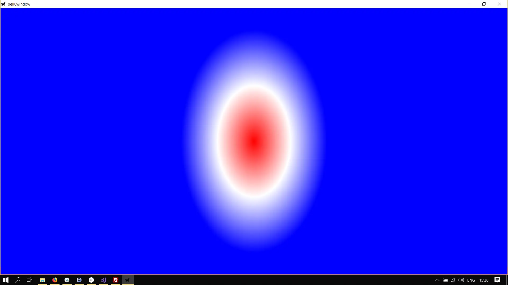

> It fills all Space, and what It fills, It is. What It thinks, that It utters; and what It utters, that It hears; and
> It itself is Thinker, Utterer, Hearer, Thought, Word, Audition; it is the One, and yet the All in All. Ah, the
> happiness, ah, the happiness of Being!
>
> --- Edwin A. Abbott

In the previous tutorials, we have used different brushes to print text to the screen or to draw simple geometric
shapes. In this tutorial, we will learn more about those brushes and the different brushes that Direct2D can provide us
with.

Remember that brushes are device dependent resources.

## Solid Brushes

We have used solid brushes in the previous tutorials, and thus there is not much new to learn. The first thing to note,
however, is that Direct2D brushes are mutable, that is, their properties can be changed on the fly.

### Colour

For example, if you would rather not save a brush object for each different colour, you can change the colour whenever
you want:

```cpp
d2d->redBrush->SetColor(D2D1::ColorF(D2D1::ColorF::Blue));
```

### Opacity

One can also change the opacity of the brush:

```cpp
d2d->yellowBrush->SetOpacity(0.2f);
```

The *SolidColorBrush* is very lightweight though, it does not eat up many ressources, and thus it might be a good idea
to save a few different colours, just for ease of use.

## The Linear Gradient Brush

This brush paints a linear gradient between two points (of different colours) on the so-called gradient axis.

Here is an image of a rectangle filled with a linear gradient brush:


Okay, so now that you have seen an image, let us continue the explanation of what a linear gradient brush actually does.
The colours along the gradient axis are computed using linear interpolation between given colours, and the gradient is
extended perpendicularly to the axis.

While the start and endpoints can be changed on the fly, the actual colours can not be changed, however, as they form
the basis of a rather costly interpolation algorithm.

To define the *stops*, that is, specific colours that appear at certain points along the gradient axis, we must create
an array of *[D2D1_GRADIENT_STOP](https://msdn.microsoft.com/en-us/library/windows/desktop/dd368119(v=vs.85).aspx)*
structures:

```cpp
struct D2D1_GRADIENT_STOP {
  FLOAT        position;
  D2D1_COLOR_F color;
};
```

### float position

This value indicates the relative position of the gradient stop in the brush. It must be set to a value between 0.0f and
1.0f, if one desires the gradient stop to be seen, else the gradient stop will still affect the gradient change of
colours, but it will not be seen explicitly.

### D2D1_COLOR_F color

This defines the colour of the stop.

---

Once the stops are defined, a gradient stop collection must be created using
the [CreateGradientStopCollection](https://msdn.microsoft.com/en-us/library/windows/desktop/dd371832(v=vs.85).aspx)
method:

```cpp
HRESULT CreateGradientStopCollection(
  [in]  D2D1_GRADIENT_STOP          *gradientStops,
        UINT                        gradientStopsCount,
  [out] ID2D1GradientStopCollection **gradientStopCollection
);
```

### D2D1_GRADIENT_STOP *gradientStops

This specifies the stops, given as a pointer to an array of stops.

### UINT gradientStopsCount

This value defines the number of gradient stops in the gradientStops array and can most often be set by using the *
_countof* function.

### [ID2D1GradientStopCollection](https://msdn.microsoft.com/en-us/library/windows/desktop/dd316783(v=vs.85).aspx) **gradientStopCollection

Once the method returns, this parameter contains a pointer to a pointer to the new gradient stop collection. Check the
MSDN for further information.

This sounds complicated, but it is actually quite easy. As an example, we will recreate the Luxembourgish flag with a
linear gradient brush:

```cpp
// define the stops
Microsoft::WRL::ComPtr<ID2D1GradientStopCollection> stopCollection;
D2D1_GRADIENT_STOP stops[] = { { 0.0f, D2D1::ColorF(D2D1::ColorF::Red) }, { 0.5f, D2D1::ColorF(D2D1::ColorF::White)},  { 1.0f, D2D1::ColorF(D2D1::ColorF::Blue) } };
if(FAILED(devCon->CreateGradientStopCollection(stops, _countof(stops), stopCollection.GetAddressOf())))
	return std::runtime_error("Critical error: Unable to create the gradient stop collection!");
```

To finally create the linear gradient brush, we call the
*[CreateLinearGradientBrush](https://msdn.microsoft.com/en-us/library/windows/desktop/dd371845(v=vs.85).aspx)* method:

```cpp
HRESULT CreateLinearGradientBrush(
  [ref] const D2D1_LINEAR_GRADIENT_BRUSH_PROPERTIES &linearGradientBrushProperties,
  [in]        ID2D1GradientStopCollection           *gradientStopCollection,
  [out]       ID2D1LinearGradientBrush              **linearGradientBrush
);

```

### const [D2D1_LINEAR_GRADIENT_BRUSH_PROPERTIES](https://msdn.microsoft.com/en-us/library/windows/desktop/dd368128(v=vs.85).aspx) &linearGradientBrushProperties

This stores the start and end points of the gradient.

### ID2D1GradientStopCollection *gradientStopCollection

This defines the stops to use, that is, the colours and locations of the stops along the gradient line.

### ID2D1LinearGradientBrush **linearGradientBrush

When the function returns, this contains the address of a pointer to the newly created brush.

Here is an actual example in C++:

```cpp
// create the linear gradient brush
D2D1_LINEAR_GRADIENT_BRUSH_PROPERTIES linearGradientBrushProperties = {};
if(FAILED(devCon->CreateLinearGradientBrush(linearGradientBrushProperties, stopCollection.Get(), linearGradientBrush.ReleaseAndGetAddressOf())))
	return std::runtime_error("Critical error: Unable to create the linear gradient brush!");
```

To finally use the brush, we have to define the start and end points of the gradient in a very straightforward way:

```cpp
// rectangle 
D2D1_RECT_F rect = { 0, 0, 800, 600 };
	
d2d->devCon->BeginDraw();

d2d->linearGradientBrush->SetStartPoint(D2D1_POINT_2F({ 0, 0 }));
d2d->linearGradientBrush->SetEndPoint(D2D1_POINT_2F({ 0, 600 }));
d2d->devCon->FillRectangle(rect, d2d->linearGradientBrush.Get());

if (FAILED(d2d->devCon->EndDraw()))
...
```


As it so happens, the Luxembourgish flag, drawn with a linear gradient brush, just looks like a sunset on the beach.

## The Radial Gradient Brush

While the linear gradient brush interpolates colours along a gradient axis, the radial gradient brush interpolates
colours based on an ellipse, defined by its centre point and both a horizontal and vertical axis, or radius, and an
offset from the origin. The gradient stops and gradient stops collection are exactly the same as for the linear gradient
brush, with a stop with a relative position of 0 is closest to the centre of the ellipse.

The mathematics behind a radial gradient brush is a bit more complicated, and the algorithms a bit slow, yet thankfully
Direct2D hides all the nasty stuff and performs all critical tasks on the GPU!

Creating the radial gradient brush is straightforward now, we simply use the
*[CreateRadialGradientBrush](https://msdn.microsoft.com/en-us/library/windows/desktop/dd371861(v=vs.85).aspx)* method:

```cpp
// create the radial gradient brush
	D2D1_RADIAL_GRADIENT_BRUSH_PROPERTIES radialGradientBrushProperties = {};
	if (FAILED(devCon->CreateRadialGradientBrush(radialGradientBrushProperties, stopCollection.Get(), radialGradientBrush.ReleaseAndGetAddressOf())))
		return std::runtime_error("Critical error: Unable to create the linear gradient brush!");
```

Using is as just as easy as using the linear gradient brush:

```cpp
// rectangle 
D2D1_RECT_F rect = { 0, 0, 800, 600 };
	
d2d->devCon->BeginDraw();

d2d->radialGradientBrush->SetCenter(D2D1_POINT_2F({ d3d->currentModeDescription.Width / 2.0f, d3d->currentModeDescription.Height / 2.0f }));
d2d->radialGradientBrush->SetRadiusX(115.0f);
d2d->radialGradientBrush->SetRadiusY(250.5f);

d2d->devCon->FillRectangle(rect, d2d->radialGradientBrush.Get());

if (FAILED(d2d->devCon->EndDraw()))
...
```



### Offset

Note that we have not used the *offset* parameters yet. To illustrate the effects of the offset, we will let the offset
increase over time, from the far-left edge of the screen to the far-right:

```cpp
if (offsetX < 800 )
	offsetX += 0.1f;

// rectangle 
D2D1_RECT_F rect = { 0, 0, 800, 600 };
	
d2d->devCon->BeginDraw();

d2d->radialGradientBrush->SetCenter(D2D1_POINT_2F({ d3d->currentModeDescription.Width / 2.0f, d3d->currentModeDescription.Height / 2.0f }));
d2d->radialGradientBrush->SetRadiusX(115.0f);
d2d->radialGradientBrush->SetRadiusY(250.5f);

d2d->radialGradientBrush->SetGradientOriginOffset(D2D1_POINT_2F({ offsetX, 0}));

d2d->devCon->FillRectangle(rect, d2d->radialGradientBrush.Get());

if (FAILED(d2d->devCon->EndDraw()))
...
```


## Strokes

So far we have always drawn filled surfaces, what about the equivalent of the *draw* methods for brushes? Well, those
are called *strokes* and they are used to draw the outlines of geometrical shapes.

### Stroke Styles

To specify the looks of a stroke, Direct2D uses so
called [stroke style properties](https://msdn.microsoft.com/en-us/library/windows/desktop/dd368164(v=vs.85).aspx). Those
stroke styles are created by the Direct2D factory and thus do not need to be recreated each time, but they are
immutable. Moreover, please note that using dashed, or dotted stroke styles is very FPS heavy!

Stroke styles can define the following properties:

```cpp
struct D2D1_STROKE_STYLE_PROPERTIES {
  D2D1_CAP_STYLE  startCap;
  D2D1_CAP_STYLE  endCap;
  D2D1_CAP_STYLE  dashCap;
  D2D1_LINE_JOIN  lineJoin;
  FLOAT           miterLimit;
  D2D1_DASH_STYLE dashStyle;
  FLOAT           dashOffset;
};

```

#### [D2D1_CAP_STYLE](https://msdn.microsoft.com/en-us/library/windows/desktop/dd368079(v=vs.85).aspx) startCap

#### [D2D1_CAP_STYLE](https://msdn.microsoft.com/en-us/library/windows/desktop/dd368079(v=vs.85).aspx) endCap

For open shapes, such as lines, for example, these properties define start and end caps, describing how the ends of the
geometric shape are drawn.

#### [D2D1_CAP_STYLE](https://msdn.microsoft.com/en-us/library/windows/desktop/dd368079(v=vs.85).aspx) dashCap

This defines the shape at either end of a dashed segment.

#### [D2D1_LINE_JOIN](https://msdn.microsoft.com/en-us/library/windows/desktop/dd368130(v=vs.85).aspx) lineJoin

This parameter defines how different lines are joined together.

#### FLOAT miterLimit

The miter limit defines the maximal thickness of joins on mitered corners. This value is always treated as greater or
equal to 1.

#### [D2D1_DASH_STYLE](https://msdn.microsoft.com/en-us/library/windows/desktop/dd368087(v=vs.85).aspx) dashStyle

This parameter defines the dash style of a stroke.

#### FLOAT dashOffset

This value specifies the offset in the dash sequence.

## A Dashed Rectangle

As an example of the above theoretical discussion, we will create a rectangle with a dashed outline and rounded corners:

```cpp
D2D1_STROKE_STYLE_PROPERTIES strokeProperties = { };
strokeProperties.lineJoin = D2D1_LINE_JOIN_ROUND;
strokeProperties.dashStyle = D2D1_DASH_STYLE_DASH_DOT_DOT;
strokeProperties.dashCap = D2D1_CAP_STYLE_ROUND;
```

To actually create the style, we use the
*[CreateStrokeStyle](https://msdn.microsoft.com/en-us/library/windows/desktop/hh404605(v=vs.85).aspx)* method:

```cpp
HRESULT CreateStrokeStyle(
  [in]  const D2D1_STROKE_STYLE_PROPERTIES1 *strokeStyleProperties,
  [in]  const FLOAT                         *dashes,
              UINT                          dashesCount,
  [out] const ID2D1StrokeStyle1             **strokeStyle
);
```

### const D2D1_STROKE_STYLE_PROPERTIES1 *strokeStyleProperties

This parameter takes the stroke style properties we defined above.

### const FLOAT *dashes

This array specifies the widths for the dashes and gaps.

### UINT dashesCount

This unsigned integer defines the size of the dash array.

### ID2D1StrokeStyle1 **strokeStyle

When the method returns, this parameter contains the address of a pointer to the newly created stroke style.

```cpp
if(FAILED(factory->CreateStrokeStyle(strokeProperties, nullptr, 0, dashedStroke.GetAddressOf())))
	return std::runtime_error("Critical error: Unable to create the dashed stroke style!");
```

Now to actually draw the rectangle with the given style, we use the overloaded *DrawRectangle* method, as follows:

```cpp
d2d->devCon->BeginDraw();

D2D1_RECT_F rect = { 200, 200, 600, 300 };
d2d->devCon->DrawRectangle(rect, d2d->yellowBrush.Get(), 5, d2d->dashedStroke.Get());

if (FAILED(d2d->devCon->EndDraw()))
	...
```


---

So much for brushes for now. In the next tutorial, we will have a look at creating intrinsic geometric shapes.

---

You can download the updated DirectX Framework with more brushes and strokes
from [here](https://filedn.eu/ltgnTcOBnsYpGSo6BiuFrPL/Game%20Programming/Flatland/Direct2D/funWithBrushes.7z).


## References

* Microsoft Developer Network ([MSDN](https://msdn.microsoft.com/en-us/library/windows/desktop/ee663274(v=vs.85)))
* Wikipedia