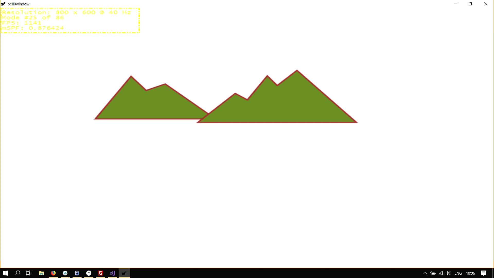

> In a word, to comport oneself with perfect propriety in Polygonal society, one ought to be a Polygon oneself. Such at least is the painful teaching of my experience.
>
> --- Edwin A. Abbott


Now that we have a deeper understanding of the simple shapes, brushes, and strokes that Direct2D provides, we will focus on creating geometrical objects.

---

A Direct2D geometry is an [ID2D1Geometry](https://msdn.microsoft.com/en-us/library/windows/desktop/dd316578(v=vs.85).aspx) object. This object can be a simple geometry, like a rectangle, rounded rectangle or an ellipse, a [path geometry](https://msdn.microsoft.com/en-us/library/windows/desktop/dd371512(v=vs.85).aspx), or a composite geometry.

Why do we want to create new objects, if it is already so easy to draw simple shapes? Well, Direct2D geometries enable the description of complex two-dimensional figures, and they pack a lot of power, such as being able to define hit-test regions, clip regions, and even animation paths. We will talk about those advanced features in later tutorials.

Direct2D geometries are immutable and device-independent resources created by ID2D1Factory. Generally, we will create those geometries one time and keep them for the life of the application, or until they have to be changed. 

To draw Direct2D geometries, the [DrawGeometry](https://msdn.microsoft.com/en-us/library/windows/desktop/dd371890(v=vs.85).aspx) or [FillGeometry](https://msdn.microsoft.com/en-us/library/windows/desktop/dd371933(v=vs.85).aspx) methods must be called. We will now give an overview of the different possible Direct2D geometries. 

## Simple Geometrical Figures
To start with, we will create rectangles, rounded rectangles and ellipses, once again, but this time as an intrinsic geometrical object, instead of a shape.

To store the geometries, we will create three new COM pointers in the header file of the Direct2D class:

```cpp
Microsoft::WRL::ComPtr<ID2D1RectangleGeometry> unitRectangleGeometry;				// a unit rectangle as a geometric object
Microsoft::WRL::ComPtr<ID2D1RoundedRectangleGeometry> unitRoundedRectangleGeometry;	// a unit rounded rectangle as a geometric object
Microsoft::WRL::ComPtr<ID2D1EllipseGeometry> unitEllipseGeometry;					// an unit ellipse (circle with radius 1) as a geometric object
```

### Rectangle
To create the unit rectangle, we use the [CreateRectangleGeometry](https://msdn.microsoft.com/en-us/library/windows/desktop/dd371286(v=vs.85).aspx) method:

```cpp
D2D1_RECT_F unitRectangle = { 0.0f, 0.0f, 1.0f, 1.0f };
if(FAILED(factory->CreateRectangleGeometry(&unitRectangle, unitRectangleGeometry.GetAddressOf())))
	return std::runtime_error("Critical error: Unable to create the unit rectangle geometry!");
```

### Rounded Rectangle
To create the rounded rectangle, we use the [CreateRoundedRectangleGeometry](https://msdn.microsoft.com/en-us/library/windows/desktop/dd371293(v=vs.85).aspx) method as follows:

```cpp
// create unit rounded rectangle
D2D1_ROUNDED_RECT unitRoundedRectangle = { unitRectangle, 45, 45 };
if (FAILED(factory->CreateRoundedRectangleGeometry(&unitRoundedRectangle, unitRoundedRectangleGeometry.GetAddressOf())))
	return std::runtime_error("Critical error: Unable to create the unit rounded rectangle geometry!");
```

### Ellipse
To create the ellipse, we use the [CreateEllipseGeometry](https://msdn.microsoft.com/en-us/library/windows/desktop/dd371270(v=vs.85).aspx) method as follows:

```cpp
// create unit ellipse (unit circle)
D2D1_ELLIPSE unitEllipse = { {0.0f, 0.0f} , 1.0f, 1.0f };
if (FAILED(factory->CreateEllipseGeometry(&unitEllipse, unitEllipseGeometry.GetAddressOf())))
	return std::runtime_error("Critical error: Unable to create the unit ellipse geometry!");
```

Take note though that drawing geometries might be slower than drawing primitives.

## Path Geometries
Path geometries can be used to describe complex geometric figures composed of segments such as arcs, curves, and lines.

Path geometries are represented by the [ID2D1PathGeometry](https://msdn.microsoft.com/en-us/library/windows/desktop/dd371512(v=vs.85).aspx) interface. To instantiate a path geometry, the [CreatePathGeometry](https://msdn.microsoft.com/en-us/library/windows/desktop/dd371282(v=vs.85).aspx) method is used. To populate a path geometry with figures and segments, the [Open](https://msdn.microsoft.com/en-us/library/windows/desktop/dd371522(v=vs.85).aspx) method must be called to retrieve an [ID2D1GeometrySink](https://msdn.microsoft.com/en-us/library/windows/desktop/dd316592(v=vs.85).aspx), which can then be used to add figures and segments to the path geometry.

To recapitulate, creating a path geometry requires four steps:

1. Create an empty path geometry.
2. Open the geometry and retrieve a sink.
3. Fill the sink with points, lines, and curves.
4. Close the geometry.

Let us try to learn by example, but be warned, trying to draw a path geometry that is not fully constructed yet, hits a breakpoint.

We will recreate the examples from the MSDN, and we will start with the two mountains:

```cpp
// path geometries
Microsoft::WRL::ComPtr<ID2D1PathGeometry> leftMountain;
Microsoft::WRL::ComPtr<ID2D1PathGeometry> rightMountain; 
```

Now we can create the empty path geometries:

```cpp
// create empty path geometries
if (FAILED(factory->CreatePathGeometry(leftMountain.GetAddressOf())))
	return std::runtime_error("Critical error: Unable to create the path geometry!");
if (FAILED(factory->CreatePathGeometry(rightMountain.GetAddressOf())))
	return std::runtime_error("Critical error: Unable to create the path geometry!");
```

So far, so easy. 

Now we can add points to the geometries. We open the geometry, and then we first set the fill mode to *D2D1_FILL_MODE_WINDING*, using the [D2D1_FILL_MODE](https://msdn.microsoft.com/en-us/library/windows/desktop/dd316937(v=vs.85).aspx) method; check the [MSDN](https://msdn.microsoft.com/en-us/library/windows/desktop/dd368110(v=vs.85).aspx) for a detailed explanation. Adding the points to the geometry is straightforward, we simply fill an array with 2D-coordinates and then add that array to the sink using the [AddLines](https://msdn.microsoft.com/en-us/library/windows/desktop/dd316925(v=vs.85).aspx) method:

```cpp
// fill left mountain
if(FAILED(leftMountain->Open(sink.GetAddressOf())))
	return std::runtime_error("Critical error: Unable to open the sink!");
sink->SetFillMode(D2D1_FILL_MODE_WINDING);

sink->BeginFigure(D2D1::Point2F(346, 255), D2D1_FIGURE_BEGIN_FILLED);
D2D1_POINT_2F points[] = {
	D2D1::Point2F(267, 177),
	D2D1::Point2F(236, 192),
	D2D1::Point2F(212, 160),
	D2D1::Point2F(156, 255),
	D2D1::Point2F(346, 255),
};
sink->AddLines(points, ARRAYSIZE(points));
sink->EndFigure(D2D1_FIGURE_END_CLOSED);

if(FAILED(sink->Close()))
	return std::runtime_error("Critical error: Failed to close the sink!");
```

Drawing the mountain is straightforward:

```cpp
d2d->devCon->BeginDraw();
	
d2d->devCon->DrawGeometry(leftMountain.Get(), d2d->brownBrush.Get(), 5);	// draw left mountain
d2d->devCon->FillGeometry(leftMountain.Get(), d2d->oliveDrabBrush.Get());	// fill the mountain

d2d->devCon->EndDraw();
```

The creation of the path geometry for the right mountain is left as an exercise to the reader.



To create the little river and the sun, we need the power of arc and Bézier segments.

## Arc Segments
Creating arcs is actually quite difficult, thankfully Direct2D takes care of the difficult mathematics behind all of this. Basically, arc segments are parts of a Path Geometry, and all we have to do is to add points and tell Direct2D how to join those points together (note that there are quite many possibilities how to join two points by an elliptical arc). To define the elliptical arc, we have to fill out a [D2D1_ARC_SEGMENT](https://msdn.microsoft.com/en-us/library/windows/desktop/dd368065(v=vs.85).aspx) structure:

```cpp
struct D2D1_ARC_SEGMENT {
  D2D1_POINT_2F        point;
  D2D1_SIZE_F          size;
  FLOAT                rotationAngle;
  D2D1_SWEEP_DIRECTION sweepDirection;
  D2D1_ARC_SIZE        arcSize;
};
```

### D2D1_POINT_2F point
Those coordinates specify the end point of the segment. Note that the starting point is automatically known to the geometry sink.

### [D2D1_SIZE_F](https://msdn.microsoft.com/en-us/library/windows/desktop/dd368160(v=vs.85).aspx) size
This defines the x and y-radia of the ellipse.

### FLOAT rotationAngle
This member value specifies how many degrees in the clockwise direction the ellipse is rotated relative to the current coordinate system.

### [D2D1_SWEEP_DIRECTION](https://msdn.microsoft.com/en-us/library/windows/desktop/dd368166(v=vs.85).aspx) sweepDirection
This defines whether the arc sweep is clockwise or counterclockwise.

### [D2D1_ARC_SIZE](https://msdn.microsoft.com/en-us/library/windows/desktop/dd368068(v=vs.85).aspx) arcSize
This member specifies whether the given arc is larger than 180 degrees.

Okay then, before finishing our little drawing, let us see how arcs work on a simpler example, perhaps. We will simply create four arcs with different properties.

First, we need four new COM pointer, obviously:

```cpp
// arc geometries
Microsoft::WRL::ComPtr<ID2D1PathGeometry> arc1;
Microsoft::WRL::ComPtr<ID2D1PathGeometry> arc2;
Microsoft::WRL::ComPtr<ID2D1PathGeometry> arc3;
Microsoft::WRL::ComPtr<ID2D1PathGeometry> arc4;
```

By now we know how to create path geometries, but to avoid having to type the same code over and over again, we will create a little helper function in the Direct2D class to create arc segments:

```cpp
util::Expected<void> Direct2D::createArcPathGeometry(Microsoft::WRL::ComPtr<ID2D1PathGeometry>* arc, D2D1_POINT_2F startPoint, D2D1_POINT_2F endPoint, float radiusX, float radiusY, float rotationAngle, D2D1_SWEEP_DIRECTION sweepDirection, D2D1_ARC_SIZE arcSize)
{
	// fill the arc segment structure
	D2D1_ARC_SEGMENT arcStructure = 
	{
		endPoint,
		{radiusX, radiusY},
		rotationAngle,
		sweepDirection,
		arcSize,
	};

	// create the path geometry
	if(FAILED(factory->CreatePathGeometry(arc->ReleaseAndGetAddressOf())))
		return std::runtime_error("Critical error: Unable to create path geometry for the arc segment!");

	// open and fill the path geometry
	Microsoft::WRL::ComPtr<ID2D1GeometrySink> sink;
	if(FAILED(arc->Get()->Open(sink.GetAddressOf())))
		return std::runtime_error("Critical error: Unable to create the sink for the arc segment!");

	sink->BeginFigure(startPoint, D2D1_FIGURE_BEGIN_FILLED);
	sink->AddArc(arcStructure);
	sink->EndFigure(D2D1_FIGURE_END_OPEN);

	if(FAILED(sink->Close()))
		return std::runtime_error("Critical error: Unable to close the sink of the arc segment!");

	// return success
	return { };
}
```

As you can see, the helper function is completely straightforward, we simply fill out an arc segment description structure and use the [AddArc](https://msdn.microsoft.com/en-us/library/windows/desktop/dd316597(v=vs.85).aspx) method to add our arc to the Path Geometry object.

We want to illustrate why all those variables are needed to define an arc segment, and thus we will fix a starting and an end point and showcase four possible arcs running through those two points; two counterclockwise and two clockwise arcs, one small and one large, in each case:

```cpp
// start and end points - in the game class definition
D2D1_POINT_2F startPoint = D2D1::Point2F(250.0f, 100.0f);
D2D1_POINT_2F endPoint = D2D1::Point2F(450.0f, 400.0f);


// initialize graphics
util::Expected<void> DirectXGame::initGraphics()
{
	// create path geometries
	if (FAILED(d2d->factory->CreatePathGeometry(leftMountain.GetAddressOf())))
		return std::runtime_error("Critical error: Unable to create the path geometry!");
	if (FAILED(d2d->factory->CreatePathGeometry(rightMountain.GetAddressOf())))
		return std::runtime_error("Critical error: Unable to create the path geometry!");
	if (FAILED(d2d->factory->CreatePathGeometry(arc1.GetAddressOf())))
		return std::runtime_error("Critical error: Unable to create the path geometry!");
	if (FAILED(d2d->factory->CreatePathGeometry(arc2.GetAddressOf())))
		return std::runtime_error("Critical error: Unable to create the path geometry!");
	if (FAILED(d2d->factory->CreatePathGeometry(arc3.GetAddressOf())))
		return std::runtime_error("Critical error: Unable to create the path geometry!");
	if (FAILED(d2d->factory->CreatePathGeometry(arc4.GetAddressOf())))
		return std::runtime_error("Critical error: Unable to create the path geometry!");

	if(!d2d->createArcPathGeometry(&arc1, startPoint, endPoint, 200.0f, 200.0f, 0.0f, D2D1_SWEEP_DIRECTION_COUNTER_CLOCKWISE, D2D1_ARC_SIZE_LARGE).wasSuccessful())
		return std::runtime_error("Critical error: Unable to create arc segment!");
	if (!d2d->createArcPathGeometry(&arc2, startPoint, endPoint, 200.0f, 200.0f, 0.0f, D2D1_SWEEP_DIRECTION_COUNTER_CLOCKWISE, D2D1_ARC_SIZE_SMALL).wasSuccessful())
		return std::runtime_error("Critical error: Unable to create arc segment!");
	if (!d2d->createArcPathGeometry(&arc3, startPoint, endPoint, 200.0f, 200.0f, 0.0f, D2D1_SWEEP_DIRECTION_CLOCKWISE, D2D1_ARC_SIZE_LARGE).wasSuccessful())
		return std::runtime_error("Critical error: Unable to create arc segment!");
	if (!d2d->createArcPathGeometry(&arc4, startPoint, endPoint, 200.0f, 200.0f, 0.0f, D2D1_SWEEP_DIRECTION_CLOCKWISE, D2D1_ARC_SIZE_SMALL).wasSuccessful())
		return std::runtime_error("Critical error: Unable to create arc segment!");

	
	// return success
	return {};
}
    
```

Now all that is left is to draw the arcs. We will draw the larger arcs with a blue brush, and the smaller ones with a red brush. To highlight the starting (yellow) and end (green) points, we draw an ellipse at their positions, with a high opaque value:

```cpp
util::Expected<int> DirectXGame::render(double /*farSeer*/)
{
	// clear the back buffer and the depth/stencil buffer
	d3d->clearBuffers();

	// render the scene
	d2d->devCon->BeginDraw();
	
	d2d->devCon->DrawGeometry(arc1.Get(), d2d->blueBrush.Get(), 5);
	d2d->devCon->DrawGeometry(arc2.Get(), d2d->redBrush.Get(), 5);
	d2d->devCon->DrawGeometry(arc3.Get(), d2d->blueBrush.Get(), 5);
	d2d->devCon->DrawGeometry(arc4.Get(), d2d->redBrush.Get(), 5);

	// highlight the start and end points
	d2d->yellowBrush->SetOpacity(0.75f);
	d2d->greenBrush->SetOpacity(0.75f);
	d2d->devCon->FillEllipse(D2D1::Ellipse(startPoint, 25.0f, 25.0f), d2d->yellowBrush.Get());
	d2d->devCon->FillEllipse(D2D1::Ellipse(endPoint, 25.0f, 25.0f), d2d->greenBrush.Get());
	d2d->devCon->EndDraw();

	// print FPS information
	if (!d2d->printFPS().wasSuccessful())
		return std::runtime_error("Failed to print FPS information!");

	// present the scene
	if (!d3d->present().wasSuccessful())
		return std::runtime_error("Failed to present the scene!");

	// return success
	return 0;
}
```


We now have enough knowledge to create the sun for our little scenery. We will also create a new brush to give the sun a small radial effect.

```cpp
// in the game class
Microsoft::WRL::ComPtr<ID2D1PathGeometry> sun;
Microsoft::WRL::ComPtr<ID2D1RadialGradientBrush> sunBrush;

// initialize graphics
util::Expected<void> DirectXGame::initGraphics()
{
    // define the stops
	Microsoft::WRL::ComPtr<ID2D1GradientStopCollection> stopCollection;
	D2D1_GRADIENT_STOP stops[] = { { 0.0f, D2D1::ColorF(D2D1::ColorF::Yellow) },{ 0.5f, D2D1::ColorF(D2D1::ColorF::OrangeRed) },{ 1.0f, D2D1::ColorF(D2D1::ColorF::Red) } };
	if (FAILED(d2d->devCon->CreateGradientStopCollection(stops, _countof(stops), stopCollection.GetAddressOf())))
		return std::runtime_error("Critical error: Unable to create the gradient stop collection!");

	// create the radial gradient brush
	D2D1_RADIAL_GRADIENT_BRUSH_PROPERTIES radialGradientBrushProperties = {};
	if (FAILED(d2d->devCon->CreateRadialGradientBrush(radialGradientBrushProperties, stopCollection.Get(), sunBrush.ReleaseAndGetAddressOf())))
		return std::runtime_error("Critical error: Unable to create the radial gradient brush!");

	sunBrush->SetCenter(D2D1::Point2F((270.0f+444.0f) / 2.0f, 255));	// centre of the sun
	sunBrush->SetRadiusX(150.0f);
	sunBrush->SetRadiusY(150.0f);
    
	// create path geometries
	...
	if (FAILED(d2d->factory->CreatePathGeometry(sun.GetAddressOf())))
		return std::runtime_error("Critical error: Unable to create the path geometry!");

	Microsoft::WRL::ComPtr<ID2D1GeometrySink> sink;

	// create left mountain
	...
	

	// create right mountain
	...

	// create the sun
	if(!d2d->createArcPathGeometry(&sun, D2D1::Point2F(270.0f, 255.0f), D2D1::Point2F(444.0f, 255.0f), 85.0f, 85.0f, 0.0f, D2D1_SWEEP_DIRECTION_CLOCKWISE, D2D1_ARC_SIZE_SMALL).wasSuccessful())
		return std::runtime_error("Critical error: Unable to create arc path geometry!");
	
	// return success
	return {};
}

util::Expected<int> DirectXGame::render(double /*farSeer*/)
{
	// clear the back buffer and the depth/stencil buffer
	d3d->clearBuffers();

	// render the scene
	d2d->devCon->BeginDraw();

	// draw the sun
	d2d->devCon->FillGeometry(sun.Get(), sunBrush.Get());						// fill the sun with radial gradient colours

	// draw the mountains
	d2d->devCon->DrawGeometry(leftMountain.Get(), d2d->brownBrush.Get(), 5);	// draw left mountain
	d2d->devCon->FillGeometry(leftMountain.Get(), d2d->oliveDrabBrush.Get());	// fill the mountain
	d2d->devCon->DrawGeometry(rightMountain.Get(), d2d->brownBrush.Get(), 5);	// draw left mountain
	d2d->devCon->FillGeometry(rightMountain.Get(), d2d->oliveDrabBrush.Get());	// fill the mountain


	d2d->devCon->EndDraw();


	// print FPS information
	if (!d2d->printFPS().wasSuccessful())
		return std::runtime_error("Failed to print FPS information!");

	// update the constant buffers

	// set the vertex buffer

	// set primitive topology

	// draw

	// present the scene
	if (!d3d->present().wasSuccessful())
		return std::runtime_error("Failed to present the scene!");

	// return success
	return 0;
}
```


To create the flares and the river, we need to learn how to use Bézier segments.

## Bézier Segments
The last, but definitely not least, segment types that Path Geometries support, are Bézier segments, named after the French engineer [Pierre Bézier](https://en.wikipedia.org/wiki/Pierre_B%C3%A9zier).

A Bézier curve is a parametric curve. In vector graphics, Bézier curves are used to model smooth curves, and *Paths*, combinations of linked Bézier curves, are not bound by the limits of rasterized images and are intuitive to modify.

We will not talk much about the mathematics behind Bézier curves until later in more advanced tutorials. For now, we will *simply* learn how to use Bézier curves in Direct2D.

Direct2D supports quadratic and cubic Bézier curves, the difference being that quadratic Bézier curves only have one *control point*, whereas cubic Bézier curves have two of those. You can think of the control points as magnets, or black holes: Imagine a straight line between two points, and imagine the line being pulled towards the magnets or black holes.

We will learn by example again. We create another COM pointer to a Path Geometry and create the empty geometry:

```cpp
Microsoft::WRL::ComPtr<ID2D1PathGeometry> bezier;

if (FAILED(d2d->factory->CreatePathGeometry(bezier.GetAddressOf())))
	return std::runtime_error("Critical error: Unable to create the path geometry!");

Microsoft::WRL::ComPtr<ID2D1GeometrySink> sink;

if(FAILED(bezier->Open(sink.GetAddressOf())))
	return std::runtime_error("Critical error: Unable to open the sink!");

... 

if(FAILED(sink->Close()))
	return std::runtime_error("Critical error: Failed to close the sink!");
```

Now to fill the geometry with a Bézier segment, we have to use the [AddBezier](https://msdn.microsoft.com/en-us/library/windows/desktop/dd316601(v=vs.85).aspx) which takes a [Bezier segment structure](https://msdn.microsoft.com/en-us/library/windows/desktop/dd368070(v=vs.85).aspx), which represents a cubic Bézier segment, as input:

```cpp
struct D2D1_BEZIER_SEGMENT {
  D2D1_POINT_2F point1;
  D2D1_POINT_2F point2;
  D2D1_POINT_2F point3;
};
```

A cubic Bézier curve is defined by four points: a start point (the last point in the Geometry Path figure), an end point (point3), and two control points (point1 and point2).

The two control points of a cubic Bézier curve behave like magnets, attracting portions of what would otherwise be a straight line toward themselves and producing a curve. The first control point, point1, affects the beginning portion of the curve; the second control point, point2, affects the ending portion of the curve. 

Let's see an example:

```cpp
sink->BeginFigure(D2D1::Point2F(100, 500), D2D1_FIGURE_BEGIN_FILLED);
sink->AddBezier(D2D1::BezierSegment(D2D1::Point2F(50,90), D2D1::Point2F(600,50), D2D1::Point2F(750,450)));
sink->EndFigure(D2D1_FIGURE_END_OPEN);

// draw
d2d->devCon->BeginDraw();

// highlight the start and end point
d2d->devCon->FillEllipse(D2D1::Ellipse(D2D1::Point2F(100, 500), 25, 25), d2d->yellowBrush.Get());
d2d->devCon->FillEllipse(D2D1::Ellipse(D2D1::Point2F(750, 450), 25, 25), d2d->yellowBrush.Get());

// draw line between start and end point
d2d->devCon->DrawLine(D2D1::Point2F(100, 500), D2D1::Point2F(750, 450), d2d->blueBrush.Get());

// highlight the control points
d2d->devCon->FillEllipse(D2D1::Ellipse(D2D1::Point2F(50, 90), 25, 25), d2d->redBrush.Get());
d2d->devCon->FillEllipse(D2D1::Ellipse(D2D1::Point2F(600, 50), 25, 25), d2d->redBrush.Get());

// draw the Bézier curve
d2d->devCon->DrawGeometry(bezier.Get(), d2d->blackBrush.Get(), 5);

d2d->devCon->EndDraw();
```

This code creates the following figure: The start and end points are highlighted with a yellow ellipse, the control points are highlighted by a red ellipse, the line between the start and end points is drawn in blue, and the actual Bézier segment is drawn with a red brush:


Okay, this is fun, let us add a few more points:

```cpp
if(FAILED(bezier->Open(sink.GetAddressOf())))
	return std::runtime_error("Critical error: Unable to open the sink!");

sink->BeginFigure(D2D1::Point2F(100, 500), D2D1_FIGURE_BEGIN_FILLED);
sink->AddBezier(D2D1::BezierSegment(D2D1::Point2F(20,480), D2D1::Point2F(10,460), D2D1::Point2F(200, 300)));
sink->AddBezier(D2D1::BezierSegment(D2D1::Point2F(200, 500), D2D1::Point2F(600, 400), D2D1::Point2F(300, 400)));
sink->AddBezier(D2D1::BezierSegment(D2D1::Point2F(100, 400), D2D1::Point2F(100,300), D2D1::Point2F(80, 320)));
sink->AddBezier(D2D1::BezierSegment(D2D1::Point2F(200, 100), D2D1::Point2F(300, 50), D2D1::Point2F(400, 150)));
sink->AddBezier(D2D1::BezierSegment(D2D1::Point2F(50, 90), D2D1::Point2F(600, 50), D2D1::Point2F(750, 450)));
sink->EndFigure(D2D1_FIGURE_END_OPEN);

if(FAILED(sink->Close()))
	return std::runtime_error("Critical error: Failed to close the sink!");
```
<br></br>

And we get the following crazy figure:


Bézier curves are fascinating, but as promised, we won't talk about the astonishing mathematical properties until later.

---

For now, we will finish our scenery, adding flares to the sun and a little river flowing from the mountains.

First, we add the flares to the sun geometry:

```cpp
// initialize graphics
util::Expected<void> DirectXGame::initGraphics()
{
	// define the stops
	Microsoft::WRL::ComPtr<ID2D1GradientStopCollection> stopCollection;
	D2D1_GRADIENT_STOP stops[] = { { 0.0f, D2D1::ColorF(D2D1::ColorF::Yellow) },{ 0.5f, D2D1::ColorF(D2D1::ColorF::OrangeRed) },{ 1.0f, D2D1::ColorF(D2D1::ColorF::Red) } };
	if (FAILED(d2d->devCon->CreateGradientStopCollection(stops, _countof(stops), stopCollection.GetAddressOf())))
		return std::runtime_error("Critical error: Unable to create the gradient stop collection!");

	// create the radial gradient brush
	D2D1_RADIAL_GRADIENT_BRUSH_PROPERTIES radialGradientBrushProperties = {};
	if (FAILED(d2d->devCon->CreateRadialGradientBrush(radialGradientBrushProperties, stopCollection.Get(), sunBrush.ReleaseAndGetAddressOf())))
		return std::runtime_error("Critical error: Unable to create the radial gradient brush!");

	sunBrush->SetCenter(D2D1::Point2F((270.0f+444.0f) / 2.0f, 255));	// centre of the sun
	sunBrush->SetRadiusX(150.0f);
	sunBrush->SetRadiusY(150.0f);

	// create path geometries
	if (FAILED(d2d->factory->CreatePathGeometry(leftMountain.GetAddressOf())))
		return std::runtime_error("Critical error: Unable to create the path geometry!");
	if (FAILED(d2d->factory->CreatePathGeometry(rightMountain.GetAddressOf())))
		return std::runtime_error("Critical error: Unable to create the path geometry!");
	if (FAILED(d2d->factory->CreatePathGeometry(sun.GetAddressOf())))
		return std::runtime_error("Critical error: Unable to create the path geometry!");

	Microsoft::WRL::ComPtr<ID2D1GeometrySink> sink;

	// create left mountain
	if(FAILED(leftMountain->Open(sink.GetAddressOf())))
		return std::runtime_error("Critical error: Unable to open the sink!");

	sink->SetFillMode(D2D1_FILL_MODE_WINDING);
	sink->BeginFigure(D2D1::Point2F(346, 255), D2D1_FIGURE_BEGIN_FILLED);
	D2D1_POINT_2F points[] = {
		D2D1::Point2F(267, 177),
		D2D1::Point2F(236, 192),
		D2D1::Point2F(212, 160),
		D2D1::Point2F(156, 255),
		D2D1::Point2F(346, 255),
	};
	sink->AddLines(points, ARRAYSIZE(points));
	sink->EndFigure(D2D1_FIGURE_END_CLOSED);
	if(FAILED(sink->Close()))
		return std::runtime_error("Critical error: Failed to close the sink!");
	

	// create right mountain
	if (FAILED(rightMountain->Open(sink.ReleaseAndGetAddressOf())))
		return std::runtime_error("Critical error: Unable to open the sink!");

	sink->SetFillMode(D2D1_FILL_MODE_WINDING);
	sink->BeginFigure(D2D1::Point2F(575, 263), D2D1_FIGURE_BEGIN_FILLED);
	D2D1_POINT_2F points2[] = {
		D2D1::Point2F(481, 146),
		D2D1::Point2F(449, 181),
		D2D1::Point2F(433, 159),
		D2D1::Point2F(401, 214),
		D2D1::Point2F(381, 199),
		D2D1::Point2F(323, 263),
		D2D1::Point2F(575, 263)
	};
	sink->AddLines(points2, ARRAYSIZE(points2));
	sink->EndFigure(D2D1_FIGURE_END_CLOSED);
	if (FAILED(sink->Close()))
		return std::runtime_error("Critical error: Failed to close the sink!");

	// create the sun
	if (FAILED(sun->Open(sink.ReleaseAndGetAddressOf())))
		return std::runtime_error("Critical error: Unable to create the sink for the sun segment!");

	D2D1_ARC_SEGMENT arcStructure =
	{
		D2D1::Point2F(444,255),
		{ 85, 85 },
		0,
		D2D1_SWEEP_DIRECTION_CLOCKWISE,
		D2D1_ARC_SIZE_SMALL
	};

	sink->BeginFigure(D2D1::Point2F(270,255), D2D1_FIGURE_BEGIN_FILLED);
	sink->AddArc(arcStructure);
	sink->EndFigure(D2D1_FIGURE_END_OPEN);
	
	// add the flares to the sun

	sink->BeginFigure(
		D2D1::Point2F(299, 182),
		D2D1_FIGURE_BEGIN_HOLLOW
	);
	sink->AddBezier(
		D2D1::BezierSegment(
			D2D1::Point2F(299, 182),
			D2D1::Point2F(294, 176),
			D2D1::Point2F(285, 178)
		));
	sink->AddBezier(
		D2D1::BezierSegment(
			D2D1::Point2F(276, 179),
			D2D1::Point2F(272, 173),
			D2D1::Point2F(272, 173)
		));
	sink->EndFigure(D2D1_FIGURE_END_OPEN);

	sink->BeginFigure(
		D2D1::Point2F(354, 156),
		D2D1_FIGURE_BEGIN_HOLLOW
	);
	sink->AddBezier(
		D2D1::BezierSegment(
			D2D1::Point2F(354, 156),
			D2D1::Point2F(358, 149),
			D2D1::Point2F(354, 142)
		));
	sink->AddBezier(
		D2D1::BezierSegment(
			D2D1::Point2F(349, 134),
			D2D1::Point2F(354, 127),
			D2D1::Point2F(354, 127)
		));
	sink->EndFigure(D2D1_FIGURE_END_OPEN);

	sink->BeginFigure(
		D2D1::Point2F(322, 164),
		D2D1_FIGURE_BEGIN_HOLLOW
	);
	sink->AddBezier(
		D2D1::BezierSegment(
			D2D1::Point2F(322, 164),
			D2D1::Point2F(322, 156),
			D2D1::Point2F(314, 152)
		));
	sink->AddBezier(
		D2D1::BezierSegment(
			D2D1::Point2F(306, 149),
			D2D1::Point2F(305, 141),
			D2D1::Point2F(305, 141)
		));
	sink->EndFigure(D2D1_FIGURE_END_OPEN);

	sink->BeginFigure(
		D2D1::Point2F(385, 164),
		D2D1_FIGURE_BEGIN_HOLLOW
	);
	sink->AddBezier(
		D2D1::BezierSegment(
			D2D1::Point2F(385, 164),
			D2D1::Point2F(392, 161),
			D2D1::Point2F(394, 152)
		));
	sink->AddBezier(
		D2D1::BezierSegment(
			D2D1::Point2F(395, 144),
			D2D1::Point2F(402, 141),
			D2D1::Point2F(402, 142)
		));
	sink->EndFigure(D2D1_FIGURE_END_OPEN);

	sink->BeginFigure(
		D2D1::Point2F(408, 182),
		D2D1_FIGURE_BEGIN_HOLLOW
	);
	sink->AddBezier(
		D2D1::BezierSegment(
			D2D1::Point2F(408, 182),
			D2D1::Point2F(416, 184),
			D2D1::Point2F(422, 178)
		));
	sink->AddBezier(
		D2D1::BezierSegment(
			D2D1::Point2F(428, 171),
			D2D1::Point2F(435, 173),
			D2D1::Point2F(435, 173)
		));
	sink->EndFigure(D2D1_FIGURE_END_OPEN);

	if (FAILED(sink->Close()))
		return std::runtime_error("Critical error: Failed to close the sink!");
	
	// return success
	return {};
}
```

Note that a Geometry Path may consist of multiple figures.

We draw the scene like this:

```cpp
util::Expected<int> DirectXGame::render(double /*farSeer*/)
{
	// clear the back buffer and the depth/stencil buffer
	d3d->clearBuffers();

	// render the scene
	d2d->devCon->BeginDraw();

	// draw the sun
	d2d->devCon->FillGeometry(sun.Get(), sunBrush.Get());						// fill the sun with radial gradient colours
	d2d->devCon->DrawGeometry(sun.Get(), d2d->blackBrush.Get());				// draw the sun flares

	// draw the mountains
	d2d->devCon->DrawGeometry(leftMountain.Get(), d2d->brownBrush.Get(), 5);	// draw left mountain
	d2d->devCon->FillGeometry(leftMountain.Get(), d2d->oliveDrabBrush.Get());	// fill the mountain
	d2d->devCon->DrawGeometry(rightMountain.Get(), d2d->brownBrush.Get(), 5);	// draw left mountain
	d2d->devCon->FillGeometry(rightMountain.Get(), d2d->oliveDrabBrush.Get());	// fill the mountain

	d2d->devCon->EndDraw();


	// print FPS information
	if (!d2d->printFPS().wasSuccessful())
		return std::runtime_error("Failed to print FPS information!");

	// update the constant buffers

	// set the vertex buffer

	// set primitive topology

	// draw

	// present the scene
	if (!d3d->present().wasSuccessful())
		return std::runtime_error("Failed to present the scene!");

	// return success
	return 0;
}
```


And to finish this tutorial, we will create the little river:

```cpp
class DirectXGame : core::DirectXApp
{
private:
	// path geometries
	Microsoft::WRL::ComPtr<ID2D1PathGeometry> leftMountain;
	Microsoft::WRL::ComPtr<ID2D1PathGeometry> rightMountain;
	Microsoft::WRL::ComPtr<ID2D1PathGeometry> sun;
	Microsoft::WRL::ComPtr<ID2D1PathGeometry> river;

	// extra brushes
	Microsoft::WRL::ComPtr<ID2D1RadialGradientBrush> sunBrush;


public:
	...
};

// initialize graphics
util::Expected<void> DirectXGame::initGraphics()
{
	// change standard colours
	...

	// define the stops
	...

	// create the radial gradient brush
	...

	// create path geometries
	...
	if (FAILED(d2d->factory->CreatePathGeometry(river.GetAddressOf())))
		return std::runtime_error("Critical error: Unable to create the path geometry!");

	Microsoft::WRL::ComPtr<ID2D1GeometrySink> sink;

	// create left mountain
	...

	// create right mountain
	...
    
	// create the sun
	...
    
	// create the river
	if (FAILED(river->Open(sink.ReleaseAndGetAddressOf())))
		return std::runtime_error("Critical error: Unable to create the sink for the river segment!");

	sink->SetFillMode(D2D1_FILL_MODE_WINDING);
	sink->BeginFigure(
		D2D1::Point2F(183, 392),
		D2D1_FIGURE_BEGIN_FILLED
	);
	sink->AddBezier(
		D2D1::BezierSegment(
			D2D1::Point2F(238, 284),
			D2D1::Point2F(472, 345),
			D2D1::Point2F(356, 303)
		));
	sink->AddBezier(
		D2D1::BezierSegment(
			D2D1::Point2F(237, 261),
			D2D1::Point2F(333, 256),
			D2D1::Point2F(333, 256)
		));
	sink->AddBezier(
		D2D1::BezierSegment(
			D2D1::Point2F(335, 257),
			D2D1::Point2F(241, 261),
			D2D1::Point2F(411, 306)
		));
	sink->AddBezier(
		D2D1::BezierSegment(
			D2D1::Point2F(574, 350),
			D2D1::Point2F(288, 324),
			D2D1::Point2F(296, 392)
		));
	sink->EndFigure(D2D1_FIGURE_END_OPEN);

	if (FAILED(sink->Close()))
		return std::runtime_error("Critical error: Failed to close the sink!");

	// return success
	return {};
}

util::Expected<int> DirectXGame::render(double /*farSeer*/)
{
	// clear the back buffer and the depth/stencil buffer
	d3d->clearBuffers();

	// render the scene
	d2d->devCon->BeginDraw();

	// draw the sun
	d2d->devCon->FillGeometry(sun.Get(), sunBrush.Get());						// fill the sun with radial gradient colours
	d2d->devCon->DrawGeometry(sun.Get(), d2d->blackBrush.Get());				// draw the sun flares

	// draw the left mountain
	d2d->devCon->DrawGeometry(leftMountain.Get(), d2d->brownBrush.Get(), 5);	// draw left mountain
	d2d->devCon->FillGeometry(leftMountain.Get(), d2d->greenBrush.Get());		// fill the mountain
	
	// draw the river
	d2d->devCon->FillGeometry(river.Get(), d2d->blueBrush.Get());
	d2d->devCon->DrawGeometry(river.Get(), d2d->brownBrush.Get(), 2);

	// draw the right mountain
	d2d->devCon->DrawGeometry(rightMountain.Get(), d2d->brownBrush.Get(), 5);	// draw left mountain
	d2d->devCon->FillGeometry(rightMountain.Get(), d2d->greenBrush.Get());	// fill the mountain

	if(FAILED(d2d->devCon->EndDraw()))
		return std::runtime_error("Critical runtime error: Direct2D draw failed!");

	// print FPS information
	if (!d2d->printFPS(d2d->blackBrush).wasSuccessful())
		return std::runtime_error("Failed to print FPS information!");

	// update the constant buffers

	// set the vertex buffer

	// set primitive topology

	// draw

	// present the scene
	if (!d3d->present().wasSuccessful())
		return std::runtime_error("Failed to present the scene!");

	// return success
	return 0;
}
```

Enjoy the scenery!


## Combining Geometries
It is possible to combine different Path Geometries to form a [Geometry Group](https://msdn.microsoft.com/en-us/library/windows/desktop/dd316581(v=vs.85).aspx), using the [D2D1Factory::CreateGeometryGroup](https://msdn.microsoft.com/en-us/library/windows/desktop/dd371273(v=vs.85).aspx) method:

```cpp
virtual HRESULT CreateGeometryGroup(
        D2D1_FILL_MODE     fillMode,
  [in]  ID2D1Geometry      **geometries,
        UINT               geometriesCount,
  [out] ID2D1GeometryGroup **geometryGroup
) = 0;
```

### D2D1_FILL_MODE fillMode
This specifies the fill mode, i.e. the rule that a composite shape uses to determine whether a given point is part of the geometry. 

### [ID2D1Geometry](https://msdn.microsoft.com/en-us/library/windows/desktop/dd316578(v=vs.85).aspx) **geometries
An array containing the geometry objects to add to the geometry group. The number of elements in this array is indicated by the geometriesCount parameter.

### UINT geometriesCount
This integer specifies the number of elements in *geometries*.

### ID2D1GeometryGroup **geometryGroup
When this method returns, this parameter contains the address of a pointer to the newly created geometry group.

---

As an example let us add the two mountains to the same group:

```cpp
// definition
Microsoft::WRL::ComPtr<ID2D1GeometryGroup> mountains;

// creation
Microsoft::WRL::ComPtr<ID2D1Geometry> geometries[] =
{
	leftMountain,
	rightMountain,
};

if (FAILED(d2d->factory->CreateGeometryGroup(D2D1_FILL_MODE_WINDING, geometries->GetAddressOf(), ARRAYSIZE(geometries), mountains.GetAddressOf())))
	return std::runtime_error("Critical error: Failed to create the geometry group!");
    
// drawing
d2d->devCon->FillGeometry(mountains.Get(), d2d->greenBrush.Get());
d2d->devCon->DrawGeometry(mountains.Get(), d2d->brownBrush.Get(), 2);
```


Please note that I *cheated* a little bit in this last example, I translated the right mountain a bit further to the right to avoid *overlapping*, as that is a topic for a later tutorial.

---

This was interesting! Direct2D allows us to use even quite difficult concepts such as Bézier curves in a very intuitive manner!

In the next tutorial, we will learn about how to transform those geometries.

You can download the source code of the final example in this tutorial from [here](https://filedn.eu/ltgnTcOBnsYpGSo6BiuFrPL/Game%20Programming/Flatland/Direct2D/geometries.7z). I made a few changes to the Direct2D class, there are more standard brushes now, and only standard brushes, as well as standard strokes. The method to show the FPS information now also accepts a brush, or rather a ComPtr to a brush, to specify the colour of the text.

---

## References
* Microsoft Developer Network ([MSDN](https://msdn.microsoft.com/en-us/library/windows/desktop/ee663274(v=vs.85)))
* Wikipedia