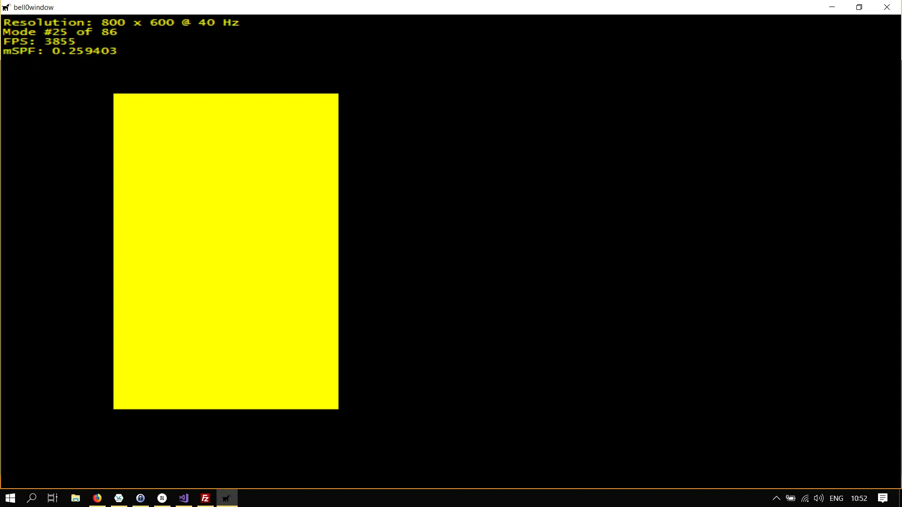
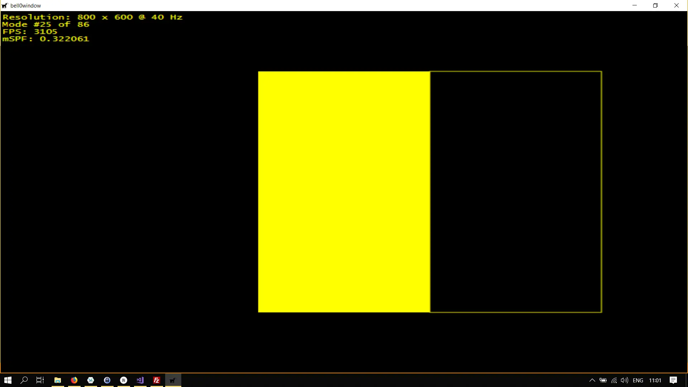
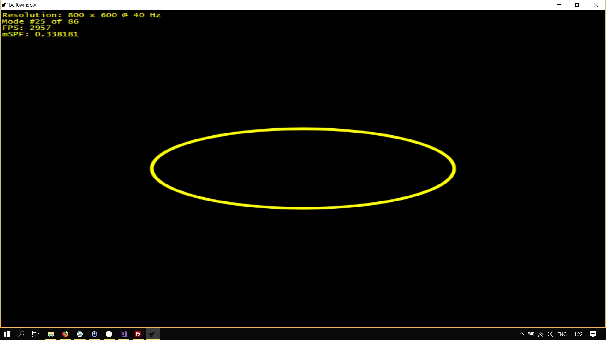
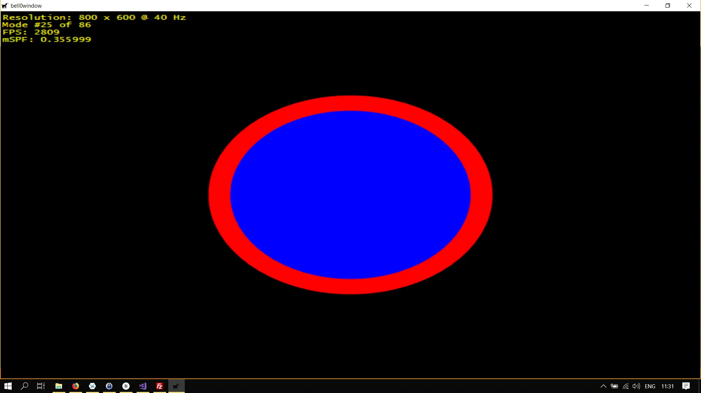
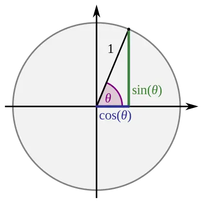
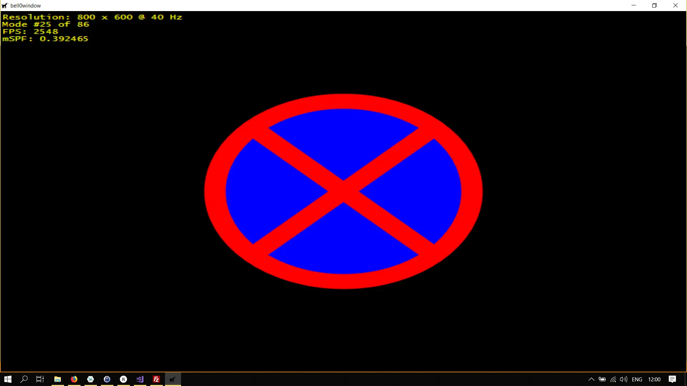

> I call our world Flatland, not because we call it so, but to make its nature clearer to you, my happy readers, who are privileged to live in Space.
>
> – Edwin A. Abbott

Obviously the big fuss about making games nowadays is all about creating vast 3D worlds, but if we are honest with ourselves, it is clear that we will not create the next big AAA-title on our own. It is not such a bad idea then to start slowly, and what better place is there to begin our journey than in *Flatland*?

With the robust framework from the previous DirectX tutorials, using Direct2D is surprisingly easy.

## Rectangles
The first thing we want to try is to draw rectangles — both boring and easy. We can draw a rectangle by calling the *[FillRectangle](https://msdn.microsoft.com/en-us/library/windows/desktop/dd371954(v=vs.85).aspx)* method:

```cpp
// draw a 2d rectangle
D2D1_RECT_F rect = { 100,100, 300, 500 };

d2d->devCon->BeginDraw();
d2d->devCon->FillRectangle(&rect, d2d->yellowBrush.Get());

if (FAILED(d2d->devCon->EndDraw()))
    ...
```
Et voilà, a yellow rectangle!



Direct2D distinguishes between *filling* and *drawing* objects. *Drawing* an object results in only the contours of the geometrical figure being rendered to the screen. To *draw* a rectangle, we use the *[DrawRectangle](https://msdn.microsoft.com/en-us/library/windows/desktop/dd742846(v=vs.85).aspx)* method:

```cpp
D2D1_RECT_F rect = { 300,100, 500, 500 };
d2d->devCon->BeginDraw();
d2d->devCon->FillRectangle(&rect, d2d->yellowBrush.Get());

// draw the outline of a rectangle
rect = { 500,100,700,500 };
d2d->devCon->DrawRectangle(&rect, d2d->yellowBrush.Get());

if (FAILED(d2d->devCon->EndDraw()))
    ...
```

Behold: two rectangles. One filled and one drawn!



## Ellipses
To draw an ellipse, we have to define its center coordinate, as well as the x and y-radia before calling the *[FillEllipse](https://msdn.microsoft.com/en-us/library/windows/desktop/dd742849(v=vs.85).aspx)* or *[DrawEllipse](https://msdn.microsoft.com/en-us/library/windows/desktop/dd742845(v=vs.85).aspx)* methods:

```cpp
struct D2D1_ELLIPSE {
  D2D1_POINT_2F point;
  FLOAT         radiusX;
  FLOAT         radiusY;
};
```

Here is the C++-code:

```cpp
D2D1_POINT_2F centre = { d3d->currentModeDescription.Width / 2.0f, d3d->currentModeDescription.Height / 2.0f};
D2D1_ELLIPSE ellipse = { centre, 200, 75 };
	
d2d->devCon->BeginDraw();

// draw an ellipse
d2d->devCon->DrawEllipse(ellipse, d2d->yellowBrush.Get(), 5);

if (FAILED(d2d->devCon->EndDraw()))
	...
```

Note that the third parameter of the *DrawEllipse* function (and of all other draw functions) specifies the *thickness* of the border.



## No Parking!
To have some fun, let us try to recreate a *no parking* sign.

Creating the blue and red brushes as well as the outer and inner ellipses is straightforward:

```cpp
// no parking here!
D2D1_POINT_2F centre = { d3d->currentModeDescription.Width / 2.0f, d3d->currentModeDescription.Height / 2.0f};
D2D1_ELLIPSE ellipse = { centre, 150, 150 };
	
d2d->devCon->BeginDraw();

// draw an ellipse
d2d->devCon->FillEllipse(ellipse, d2d->blueBrush.Get());
d2d->devCon->DrawEllipse(ellipse, d2d->redBrush.Get(), 25);

if (FAILED(d2d->devCon->EndDraw()))
	...
```



What we need to do now is to draw two single lines. While drawing lines is easy (hint: *[DrawLine](https://msdn.microsoft.com/en-us/library/windows/desktop/dd371895(v=vs.85).aspx)*), finding the endpoints of the lines might be a little bit of a challenge.

Remembering trigonometry, it is clear that we can find the x and y-coordinates of a point on a circle by putting the angle into a circular function:



```cpp
util::Expected<D2D1_POINT_2F> Direct2D::computeCoordinatesOnEllipse(D2D1_ELLIPSE *const ellipse, const float angle)
{
	// the x and y-coordinates can be computed by circular functions
	return D2D1_POINT_2F({ ellipse->point.x + ellipse->radiusX * cos(angle*M_PI/180) , ellipse->point.y + ellipse->radiusY * sin(angle*M_PI/180) });
}
```

Just note that since Windows puts the centre of the screen at the upper left edge of the screen, we have to add the x and y-offsets to the computation. The radius of the ellipse must be multiplied by the sine or cosine of the angle, to account for circles or ellipses with radii not equal to 1. The *sin* and *cos* functions require the angle to be specified in radians, which can easily be computed using pi: Let $\alpha$ be the angle in question, in degrees, then $\beta = \frac{\alpha * \pi}{180}$ is the angle in radian. Pi is defined in `math.h` as *M_PI*.

Now, drawing the two lines is rather easy:

```cpp
// no parking here!
D2D1_POINT_2F centre = { d3d->currentModeDescription.Width / 2.0f, d3d->currentModeDescription.Height / 2.0f};
D2D1_ELLIPSE ellipse = { centre, 150, 150 };
	
d2d->devCon->BeginDraw();

// draw the ellipses
d2d->devCon->FillEllipse(ellipse, d2d->blueBrush.Get());
d2d->devCon->DrawEllipse(ellipse, d2d->redBrush.Get(), 25);

// draw the lines
d2d->devCon->DrawLine(d2d->computeCoordinatesOnEllipse(&ellipse, 135).get(), d2d->computeCoordinatesOnEllipse(&ellipse, 315).get(), d2d->redBrush.Get(), 25);
d2d->devCon->DrawLine(d2d->computeCoordinatesOnEllipse(&ellipse, 225).get(), d2d->computeCoordinatesOnEllipse(&ellipse, 45).get(), d2d->redBrush.Get(), 25);

if (FAILED(d2d->devCon->EndDraw()))
	...
```



This was all rather easy. In the next tutorial, we will have some fun with brushes.

## References
 * Microsoft Developer Network ([MSDN](https://msdn.microsoft.com/en-us/library/windows/desktop/ee663274(v=vs.85)))