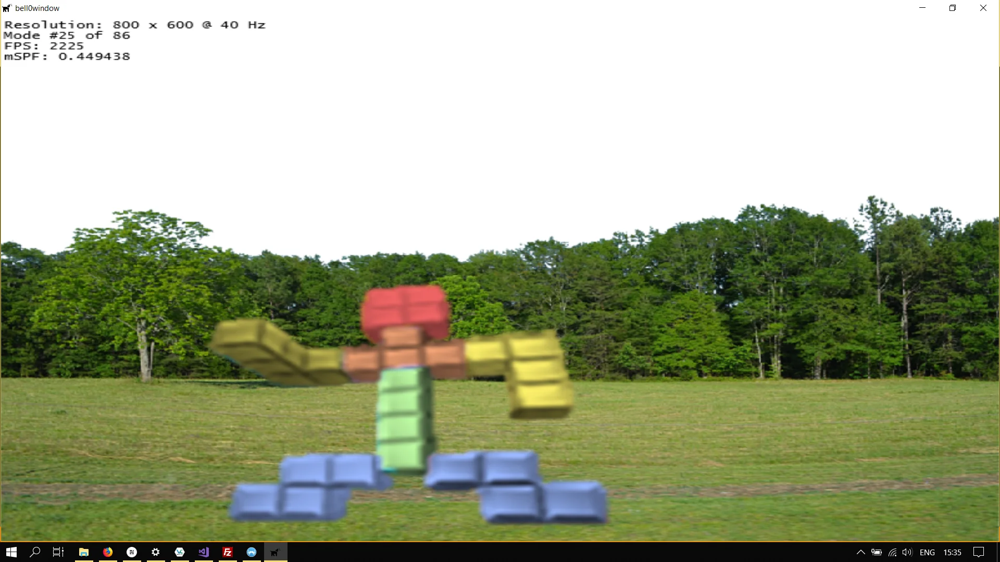
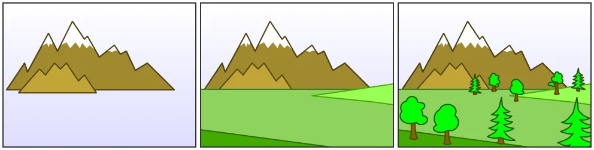

> Dear Mom,
>
>I won't be home this weekend because I'm wanted for treason and I have to clear my name. Also, I took the last **Sprite** from the fridge.
>
>Love, 
>Steve
>
> -- Mac Barnett

A sprite is basically what we called a bitmap image in the previous tutorial. A broader definition would classify sprites as 2D objects within the game world, that can be drawn using a single image on any given frame. Sprites can be used to represent game characters, to draw beautiful backgrounds and to create beautiful user interfaces.

Modern 2D games obviously have hundreds to thousands of sprites, meaning that the sprites constitute the majority of the size of the game. Keeping that in mind, it is important to use sprites as efficiently as possible. 

## Drawing Sprites
After the last tutorial, drawing sprites is straightforward. We simply create a class, the *Sprite* class, to encapsulate the tedious WIC functions, and then we can easily load images from the hard drive and draw them to the screen.

### The Sprite Class
```cpp
namespace graphics
{
	// forward declarations
	class Direct2D;

	class Sprite
	{
	private:
		Direct2D* d2d;										// pointer to the Direct2D class
		Microsoft::WRL::ComPtr<ID2D1Bitmap1> bitmap;		// a bitmap of the actual image
		float x, y;											// position of the bitmap

	public:
		// constructors and destructors
		Sprite(Direct2D* d2d, LPCWSTR imageFile, float x = 0.0f, float y = 0.0f);	// loads an image from the disk and saves it as a sprite
		~Sprite();

		// drawing
		void draw(D2D1_RECT_F* sourceRect, float opacity = 1.0f, D2D1_BITMAP_INTERPOLATION_MODE interPol = D2D1_BITMAP_INTERPOLATION_MODE_NEAREST_NEIGHBOR);		// draws the sprite at the given location, with the given opacity and interpolation mode
	};
}
```

### Sprite Creation
```cpp
Sprite::Sprite(Direct2D* d2d, LPCWSTR imageFile, float x, float y) : x(x), y(y)
{
	this->d2d = d2d;

	// create decoder
	Microsoft::WRL::ComPtr<IWICBitmapDecoder> bitmapDecoder;
	if (FAILED(d2d->WICFactory->CreateDecoderFromFilename(imageFile, NULL, GENERIC_READ, WICDecodeMetadataCacheOnLoad, bitmapDecoder.ReleaseAndGetAddressOf())))
		throw std::runtime_error("Failed to create decoder from filename!");

	// get the correct frame
	Microsoft::WRL::ComPtr<IWICBitmapFrameDecode> frame;
	if (FAILED(bitmapDecoder->GetFrame(0, frame.ReleaseAndGetAddressOf())))
		throw std::runtime_error("Failed to retrieve frame from bitmap!");

	// create the format converter
	Microsoft::WRL::ComPtr<IWICFormatConverter> image;
	if (FAILED(d2d->WICFactory->CreateFormatConverter(image.ReleaseAndGetAddressOf())))
		throw std::runtime_error("Failed to create the format converter!");

	// initialize the WIC image
	if (FAILED(image->Initialize(frame.Get(), GUID_WICPixelFormat32bppPBGRA, WICBitmapDitherTypeNone, NULL, 0, WICBitmapPaletteTypeCustom)))
		throw std::runtime_error("Failed to initialize the WIC image!");

	// create the bitmap
	if (FAILED(d2d->devCon->CreateBitmapFromWicBitmap(image.Get(), this->bitmap.ReleaseAndGetAddressOf())))
		throw std::runtime_error("Failed to create the bitmap image!");
}
```

### Drawing
```cpp
void Sprite::draw(D2D1_RECT_F* sourceRect, float opacity, D2D1_BITMAP_INTERPOLATION_MODE interPol)
{
	// get size
	D2D1_SIZE_U size = this->bitmap->GetPixelSize();

	// set suitable destination rectangle
	D2D1_RECT_F rect = { this->x, this->y, this->x + size.width, this->y + size.height };

	d2d->devCon->DrawBitmap(bitmap.Get(), rect, opacity, interPol, sourceRect);
}
```

### Example
```cpp
// definition
class DirectXGame : core::DirectXApp
{
private:
	graphics::Sprite* forestSprite;
	graphics::Sprite* tetronimoSprite;
    ...
}

// initialize graphics
util::Expected<void> DirectXGame::initGraphics()
{	
	// sprites
	forestSprite = new graphics::Sprite(d2d, L"O:/Downloads/forest.png", 0, 0);
	tetronimoSprite = new graphics::Sprite(d2d, L"O:/Downloads/rsz_tetronimo.png", 150, 300);

	// create render target dependent graphics
    ...
}

// drawing
util::Expected<int> DirectXGame::render(double /*farSeer*/)
{
	...
	d2d->devCon->BeginDraw();

	forestSprite->draw(NULL);
	tetronimoSprite->draw(NULL);

	// print FPS information
	d2d->printFPS(d2d->blackBrush.Get());

	if(FAILED(d2d->devCon->EndDraw()))
		return std::runtime_error("Failed to draw 2D graphics!");
	
    ...
}
```

As you can see, nothing new is happening here, but all the bad stuff is hidden away!




## Painter's Algorithm
This was too easy! Now in the previous example we intuitively draw the background image before drawing the tetronimo character, just like a painter paints a scene on canvas. This method is therefore known as the *Painter's Algorithm*, or *priority fill*.

The painter's algorithm simply sorts all sprites in a given scene from back to front and when it is time to draw the sprites, the presorted scene can be traversed and drawn in order. Despite this algorithm being one of the simplest solutions to the visibility problem in computer graphics and its obvious drawback of painting the invisible areas of distant objects, it works suitably well in a 2D environment. 



To facilitate the use of the painter's algorithm, two more member variables were added to the Sprite class, an unsigned int specifying the draw order of the sprite, and an enumeration to specify the layer the sprite is living in: A sprite can be in the background, or the same level as the characters and objects of the game, or used in the user interface. Here is the new definition of the Sprite class:

```cpp
// layers are used in the painter's algorithm
enum Layers { Background, Characters, UserInterface };

class Sprite
{
private:
	Direct2D* d2d;										// pointer to the Direct2D class
	Microsoft::WRL::ComPtr<ID2D1Bitmap1> bitmap;		// a bitmap of the actual image
	Layers layer;										// the layer the bitmap belongs to
	unsigned int drawOrder;								// the draw order of the bitmap; relative to the layer
	float x, y;											// position of the bitmap

public:
	// constructors and destructors
	Sprite(Direct2D* d2d, LPCWSTR imageFile, float x = 0.0f, float y = 0.0f, Layers layer = Layers::Characters, unsigned int drawOrder = 0);	// loads an image from the disk and saves it as a sprite
	~Sprite();

	// drawing
	void draw(D2D1_RECT_F* destRect, D2D1_RECT_F* sourceRect, float opacity = 1.0f, D2D1_BITMAP_INTERPOLATION_MODE interPol = D2D1_BITMAP_INTERPOLATION_MODE_NEAREST_NEIGHBOR);		// draws the sprite at the given location, with the given opacity and interpolation mode
};
```

Obviously, when drawing multiple sprites, the *background* sprites (in the correct order defined by their *draw order* member variables) are drawn first, followed by the *character* sprites before the *User-Interface* sprites are finally drawn.

To facilitate working with multiple sprites, a new class was created, the

## Sprite List Class
```cpp
// layers are used in the painter's algorithm
enum Layers { Background, Characters, UserInterface };

// specify what to draw
enum DrawCommands { All, onlyBackground, onlyCharacters, onlyUserInterface };

class Sprite
{
private:
	Direct2D* d2d;										// pointer to the Direct2D class
	Microsoft::WRL::ComPtr<ID2D1Bitmap1> bitmap;		// a bitmap of the actual image
	Layers layer;										// the layer the bitmap belongs to
	unsigned int drawOrder;								// the draw order of the bitmap; relative to the layer
	float x, y;											// position of the bitmap

public:
	// constructors and destructors
	Sprite(Direct2D* d2d, LPCWSTR imageFile, float x = 0.0f, float y = 0.0f, Layers layer = Layers::Characters, unsigned int drawOrder = 0);	// loads an image from the disk and saves it as a sprite
	~Sprite();

	// drawing
	void draw(D2D1_RECT_F* destRect, D2D1_RECT_F* sourceRect, float opacity = 1.0f, D2D1_BITMAP_INTERPOLATION_MODE interPol = D2D1_BITMAP_INTERPOLATION_MODE_NEAREST_NEIGHBOR);		// draws the sprite at the given location, with the given opacity and interpolation mode
		
	// friends
	friend class SpriteMap;
};

class SpriteMap
{
private:
	std::multimap<unsigned int, Sprite*> backgroundMap;		// holds the background sprites
	std::multimap<unsigned int, Sprite*> characterMap;		// holds the character sprites
	std::multimap<unsigned int, Sprite*> userInterfaceMap;	// holds the user interface sprites

public:
	// constructors
	SpriteMap();
	~SpriteMap();

	// populate the sprite map
	void addSprite(Sprite* sprite);							// adds an existing sprite to its correct map
	util::Expected<void> addSprite(Direct2D* d2d, LPCWSTR imageFile, float x = 0.0f, float y = 0.0f, Layers layer = Layers::Characters, unsigned int drawOrder = 0);	// create a new sprite and adds it to sprite map
		
	// draw the sprites
	void draw(D2D1_RECT_F* destRect, D2D1_RECT_F* sourceRect, DrawCommands drawCommand = DrawCommands::All, float opacity = 1.0f, D2D1_BITMAP_INTERPOLATION_MODE interPol = D2D1_BITMAP_INTERPOLATION_MODE_NEAREST_NEIGHBOR);	// draw sprites based on layers and draw orders
};
```

As you can see, the *SpriteList* class holds three different maps, one for each possible layer. Those maps are ordered by the draw orders of their sprites. All the sprites in the background layer will automatically be placed behind all the sprites in the character layer, and both the background and character layers will show up behind the UI layer. Within each individual layer, the sprites will still be drawn according to their draw order, which is now only relative to the other sprites in the same layer:

```cpp
// drawing
void Sprite::draw(D2D1_RECT_F* destRect, D2D1_RECT_F* sourceRect, float opacity, D2D1_BITMAP_INTERPOLATION_MODE interPol)
{
	if (!destRect)
	{
		// get size
		D2D1_SIZE_U size = this->bitmap->GetPixelSize();

		// set suitable destination rectangle
		D2D1_RECT_F rect = { this->x, this->y, this->x + size.width, this->y + size.height };

		d2d->devCon->DrawBitmap(bitmap.Get(), rect, opacity, interPol, sourceRect);
	}
	else
		d2d->devCon->DrawBitmap(bitmap.Get(), destRect, opacity, interPol, sourceRect);
}

void SpriteMap::draw(D2D1_RECT_F* destRect, D2D1_RECT_F* sourceRect, DrawCommands drawCommand, float opacity, D2D1_BITMAP_INTERPOLATION_MODE interPol)
{
	D2D1_RECT_F* rect;
	if (destRect)
		rect = destRect;
	else
		rect = NULL;

	switch (drawCommand)
	{
	case DrawCommands::All:
		// draw the background first
		for (auto sprite : backgroundMap)
			sprite.second->draw(rect, sourceRect, opacity, interPol);

		// draw the characters
		for (auto sprite : characterMap)
			sprite.second->draw(rect, sourceRect, opacity, interPol);

		// draw the user interface
		for (auto sprite : userInterfaceMap)
			sprite.second->draw(rect, sourceRect, opacity, interPol);

		break;

	case DrawCommands::onlyBackground:
		// draw the background first
		for (auto sprite : backgroundMap)
			sprite.second->draw(rect, sourceRect, opacity, interPol);
			break;

	case DrawCommands::onlyCharacters:
		// draw the background first
		for (auto sprite : characterMap)
			sprite.second->draw(rect, sourceRect, opacity, interPol);
		break;

	case DrawCommands::onlyUserInterface:
		// draw the background first
		for (auto sprite : userInterfaceMap)
			sprite.second->draw(rect, sourceRect, opacity, interPol);
		break;
	}
}
```

The draw command is a simple utility to provide the opportunity to only draw a specified layer.

Actually populating the sprite list, or maps, is easy as well. It is possible to add already existing sprites:

```cpp
// populating the sprite maps
void SpriteMap::addSprite(Sprite* sprite)
{
	Layers layer = sprite->layer;
	switch (layer)
	{
	case Layers::Background:
		backgroundMap.insert(std::make_pair<unsigned int, Sprite*>(std::move(sprite->drawOrder), std::move(sprite)));
		break;

	case Layers::Characters:
		characterMap.insert(std::make_pair<unsigned int, Sprite*>(std::move(sprite->drawOrder), std::move(sprite)));
		break;

	case Layers::UserInterface:
		userInterfaceMap.insert(std::make_pair<unsigned int, Sprite*>(std::move(sprite->drawOrder), std::move(sprite)));
		break;
	}
}
```

Or to create an entirely new sprite and directly add it to the correct list, or map:

```cpp
util::Expected<void> SpriteMap::addSprite(Direct2D* d2d, LPCWSTR imageFile, float x, float y, Layers layer, unsigned int drawOrder)
{
	try
	{
		Layers l = layer;

		switch (l)
		{
		case Layers::Background:
			backgroundMap.insert(std::make_pair<unsigned int, Sprite*>(std::move(drawOrder), new Sprite(d2d, imageFile, x, y, layer, drawOrder)));
			break;

		case Layers::Characters:
			characterMap.insert(std::make_pair<unsigned int, Sprite*>(std::move(drawOrder), new Sprite(d2d, imageFile, x, y, layer, drawOrder)));
			break;

		case Layers::UserInterface:
			userInterfaceMap.insert(std::make_pair<unsigned int, Sprite*>(std::move(drawOrder), new Sprite(d2d, imageFile, x, y, layer, drawOrder)));
			break;
		}
	}
	catch (std::runtime_error& e)
	{
		return e;
	}

    // return success
	return { };
}
```

### Example
Here is the same scene as above, with the only difference being that the *SpriteList* class is used:

```cpp
// the core game class, derived from DirectXApp
class DirectXGame : core::DirectXApp
{
private:
	graphics::SpriteMap spriteMap;
	D2D1_RECT_F entireScreen;
    ...
}

// initialize graphics
util::Expected<void> DirectXGame::initGraphics()
{	
	if (!spriteMap.addSprite(d2d, L"O:/Downloads/forest.png", 0, 0, graphics::Layers::Background).wasSuccessful())
		return std::runtime_error("Fatal error: Failed to create sprites!");

	if(!spriteMap.addSprite(d2d, L"O:/Downloads/rsz_tetronimo.png", 150, 300).wasSuccessful())
		return std::runtime_error("Fatal error: Failed to create sprites!");
        
	entireScreen = { 0.0f, 0.0f, (float)d3d->currentModeDescription.Width, (float)d3d->currentModeDescription.Height };

	// return success
	return {};
}

util::Expected<int> DirectXGame::render(double /*farSeer*/)
{
	// clear the back buffer and the depth/stencil buffer
	d3d->clearBuffers();

	d2d->devCon->BeginDraw();

	spriteMap.draw(&entireScreen, NULL, graphics::DrawCommands::onlyBackground);
	spriteMap.draw(NULL, NULL, graphics::DrawCommands::onlyCharacters);
	
	// print FPS information
	d2d->printFPS(d2d->blackBrush.Get());

	if(FAILED(d2d->devCon->EndDraw()))
		return std::runtime_error("Failed to draw 2D graphics!");

	// present the scene
	if (!d3d->present().wasSuccessful())
		return std::runtime_error("Failed to present the scene!");

	// return success
	return 0;
}
```

This is almost too easy! All we have to do is to create the sprites by specifying the location on the hard drive for the image to load in, and everything else is optional! If we'd like, we can add an initial position, or a destination rectangle specifying where to draw the Sprite to. 

You should play around with Sprites for a bit, to get the hang out of them.

---

In the next tutorial, we will learn how to animate those new favourite toys of ours.

You can download the source code from [here](https://filedn.eu/ltgnTcOBnsYpGSo6BiuFrPL/Game%20Programming/Flatland/Direct2D/sprites.7z).

## References
### Literature
(in alphabetic order)
 * Game Programming Algorithms, by Sanjay Madhav
 * Game Programming Patterns, by Robert Nystrom
 * Microsoft Developer Network ([MSDN](https://msdn.microsoft.com/en-us/library/windows/desktop/ee663274(v=vs.85)))
 * Tricks of the Windows Game Programming Gurus, by André LaMothe
 * Wikipedia

### Sprites
* [Annamae](https://annamae22.deviantart.com/)
* [Mr. Tetronimo](http://fantendo.wikia.com/wiki/Mr._Tetromino)
* Wikipedia