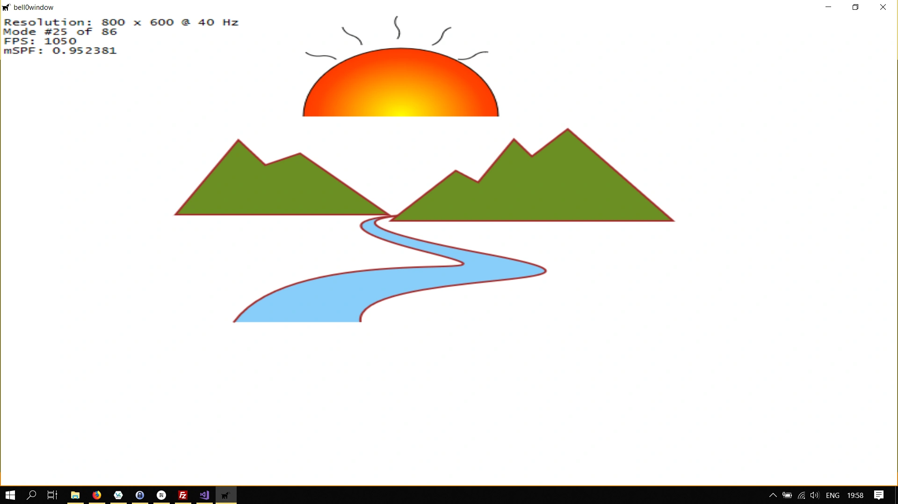

> Transformations are a part of life. We are constantly being changed by things changing around us.
>
> -- S. Kassem

Transformations are indispensable mathematical tools for computer graphics. Transforms basically are bijective linear maps (or bijective affine linear maps) from the standard two-dimensional space into itself, describing how points and objects can move from one place to another, or even shrink and grow.

Mathematics teaches us that we can describe linear maps with matrices. The actual transformation is nothing more than a matrix-vector multiplication. While we won't talk much about mathematics, please note that matrix multiplication is not commutative, thus changing the order of operations, whether you first translate and then rotate an object, or first rotate and then translate, does change the outcome.

Matrices are especially suitable for GPU parallelization, thus transforming geometries is often a lot faster than creating new geometries all the time. In this tutorial, we will see how each transformation that Direct2D has to offer works in the field.

## Mathematical Basics
Each transformation can be written as an affine linear map (in the standard Euclidean space): $\varphi_{A,v} := \mathbb{R}^2 \to \mathbb{R}^2$, $x \mapsto v + L(x)$, where $L$ is a linear map, and can thus be described by a matrix $A \in \mathbb{R}^{2 \times 2}$: $$\varphi_{A,v}(x) = v + A \cdot x.$$

The vector $v$ can be thought of as a translation vector, while the matrix $A$ is responsible for the linear transformations.

To work efficiently in the affine space, we write our two-dimensional vectors as follows: $$v = \begin{pmatrix}x\\y\\1\end{pmatrix}.$$The first two elements contain the x and y coordinates of the point. The 1 is placed in the third element to make the maths work out correctly. There will be a real explanation about what is actually happening here in a later, more advanced tutorial.

An affine transformation matrix $A \in \mathbb{R}^{3 \times 2}$ is always of the following form: $$A:=\begin{pmatrix}a&b&0\\c&d&0\\e&f&1\end{pmatrix}.$$Again, we will cover all the details in a later tutorial.

## Lost in Translation
A translation is, as the name indicates, a geometric transformation that moves every point of a figure or a space by the same distance in a given direction. Translations obviously do not change length or angles.


In affine space, a translation matrix $T \in \mathbb{R}^{3 \times 2}$ can be represented in the following form: $$T := \begin{pmatrix}1&0&t_x\\0&1&t_y\\0&0&1\end{pmatrix},$$where $t_x$ denotes the amount to translate into the x-direction, and $t_y$ the distance to move along the y-direction.

---

Direct2D provides a translation matrix, the [Matrix3x2F::Translation](https://msdn.microsoft.com/en-us/library/windows/desktop/dd372292(v=vs.85).aspx) matrix, the only input being the distance to translate along the x-axis and y-axis.

As an example, let us translate the entire scene from the previous tutorial:

```cpp
// definition
D2D_MATRIX_3X2_F translationMatrix;

// create translation matrix
translationMatrix = D2D1::Matrix3x2F::Translation(100, 50);

util::Expected<int> DirectXGame::render(double /*farSeer*/)
{
	// clear the back buffer and the depth/stencil buffer
	...
	
	// translate the entire scene
	d2d->devCon->SetTransform(translationMatrix);

	// render the scene
	d2d->devCon->BeginDraw();

	// draw the sun
	d2d->devCon->FillGeometry(sun.Get(), sunBrush.Get());						// fill the sun with radial gradient colours
	d2d->devCon->DrawGeometry(sun.Get(), d2d->blackBrush.Get());				// draw the sun flares
	
	// draw the river
	d2d->devCon->FillGeometry(river.Get(), d2d->blueBrush.Get());
	d2d->devCon->DrawGeometry(river.Get(), d2d->brownBrush.Get(), 2);

	// draw mountains
	d2d->devCon->FillGeometry(mountains.Get(), d2d->greenBrush.Get());
	d2d->devCon->DrawGeometry(mountains.Get(), d2d->brownBrush.Get(), 2);

	if(FAILED(d2d->devCon->EndDraw()))
		return std::runtime_error("Critical runtime error: Direct2D draw failed!");


	// print FPS information
	if (!d2d->printFPS(d2d->blackBrush).wasSuccessful())
		return std::runtime_error("Failed to print FPS information!");

	// update the constant buffers

	// set the vertex buffer

	// set primitive topology

	// draw

	// present the scene
	if (!d3d->present().wasSuccessful())
		return std::runtime_error("Failed to present the scene!");

	// return success
	return 0;
}
```


---

Now let us try to only translate the sun up a bit, we do that by adding an identity translation matrix:

```cpp
// create translation matrix
translationMatrix = D2D1::Matrix3x2F::Translation(0, -125);

util::Expected<int> DirectXGame::render(double /*farSeer*/)
{
	// clear the back buffer and the depth/stencil buffer
	...

	// render the scene
	d2d->devCon->BeginDraw();

	// translate the entire scene
	d2d->devCon->SetTransform(translationMatrix);

	// draw the sun
	...

	// no translation anymore
	d2d->devCon->SetTransform(D2D1::Matrix3x2F::Identity());
		
	// draw the river
	...

	// draw mountains
	...

	if(FAILED(d2d->devCon->EndDraw()))
		return std::runtime_error("Critical runtime error: Direct2D draw failed!");

	// print FPS information
	...

	// present the scene
	...

	// return success
	return 0;
}
```



## Scaling
A second type of affine maps in the plane is the so called *scaling* map, which, obviously, scales everything in a given direction, with respect to a line in another direction (not necessarily perpendicular), combined with a translation that is not purely in the direction of scaling. In a generalized sense, those maps include the cases that the scale factor is zero, which makes it a [projection](https://en.wikipedia.org/wiki/Projection_(linear_algebra)), or negative; the latter includes [reflections](https://en.wikipedia.org/wiki/Reflection_(mathematics)), and combined with a translation it includes [glide reflections](https://en.wikipedia.org/wiki/Glide_reflection).

Scaling around the centre point of a figure obviously *scales* that figure in both directions, if the *point of scaling* is not the centre of a figure, one of the other cases mentioned above occur.


For a scaling map with the fixed point being the centre of the object to scale, the corresponding matrix is always in the following form: $$S:=\begin{pmatrix}s_x&0&0\\0&s_y&0\\0&0&1\end{pmatrix},$$ where $s_x$ defines the scale factor in x-direction and $s_y$ the scaling factor for the y-axis.

---

Direct2D offers the [Matrix3x2F::Scale](https://msdn.microsoft.com/en-us/library/windows/desktop/dd372287(v=vs.85).aspx) method to easily create scaling matrices:

```cpp
static Matrix3x2F Scale(
   FLOAT         x,
   FLOAT         y,
   D2D1_POINT_2F centerPoint = D2D1::Point2F()
```

The x and y floats define the scale factor for the x-axis and y-axis respectively. The centerPoint is the point around which the scaling is performed.

Let us learn by example again:

```cpp
// definition
D2D_MATRIX_3X2_F scaleMatrix;

// creation
scaleMatrix = D2D1::Matrix3x2F::Scale(1.5, 1.5, D2D1::Point2F(400, 300));

util::Expected<int> DirectXGame::render(double /*farSeer*/)
{
	// clear the back buffer and the depth/stencil buffer
	...
    
	// scale the scene
	d2d->devCon->SetTransform(scaleMatrix);

	// render the scene
	...
}
```


## Rotations
A rotation is a circular movement of an object around a centre of rotation, which is fixed under the rotation map.


A rotation matrix around the origin has the following form: $$R:=\begin{pmatrix}a&-b&0\\b&a&0\\0&0&1\end{pmatrix},$$with the condition that $a^2+b^2=1$, or, equivalently: $$R:=\begin{pmatrix}\cos(\varTheta)&-\sin(\varTheta)&0\\\sin(\varTheta)&\cos(\varTheta)&0\\0&0&1\end{pmatrix},$$where $\varTheta$ is the rotation angle.


To rotate about an arbitrary point $(x,y)$, one would use the following matrix:
$$R:=\begin{pmatrix}\cos(\varTheta)&-\sin(\varTheta)&x(1-\varTheta)+y(\sin(\varTheta))\\\sin(\varTheta)&\cos(\varTheta)&x(-\sin(\varTheta)+y(1-\cos(\varTheta))\\0&0&1\end{pmatrix}.$$

---

To create rotation matrices in Direct2D, we can use the [Matrix3x2F::Rotation](https://msdn.microsoft.com/en-us/library/windows/desktop/dd372285(v=vs.85).aspx) method:

```cpp
static Matrix3x2F Rotation(
   FLOAT         angle,
   D2D1_POINT_2F centerPoint = D2D1::Point2F()
);
```

The angle defines the rotation angle in degrees. A positive angle creates a clockwise rotation, and a negative angle creates a counterclockwise rotation.
The centerPoint defines the point about which the rotation is performed.

Let us rotate the scene by 90 degrees around the centre of the screen:

```cpp
rotate90CW = D2D1::Matrix3x2F::Rotation(90, D2D1::Point2F(400, 300));

util::Expected<int> DirectXGame::render(double /*farSeer*/)
{
	// clear the back buffer and the depth/stencil buffer
	...

	// rotate the scene
	d2d->devCon->SetTransform(rotate90CW);

	// render the scene
	...
}
```


## Shearing
A shear mapping is an affine linear map that displaces each point in a fixed direction, by an amount proportional to its signed distance from a line that is parallel to that direction.

Applying a shear map to a set of points of the plane will change all angles between them, except for straight angles, and the length of any line segment that is not parallel to the direction of displacement. Therefore, it will usually distort the shape of a geometric figure, for example, turning squares into non-square parallelograms, and circles into ellipses. 

However, shearing does preserve the area of geometric figures and the alignment and relative distances of collinear points.


To create a shear matrix, Direct2D offers the [Matrix3x2F::Screw](https://msdn.microsoft.com/en-us/library/windows/desktop/dd372289(v=vs.85).aspx) method:

```cpp
static Matrix3x2F Skew(
   FLOAT         angleX,
   FLOAT         angleY,
   D2D1_POINT_2F centerPoint = D2D1::Point2F()
);
```

The angle parameters define the x-axis and y-axis skew or shear angles. Both angles are measured in degrees; the x-axis angle counterclockwise from the y-axis and the y-axis angle is clockwise from the x-axis. The centerPoint is the point about which the shearing is done.

Thus, setting angleX to 30 degrees would shear the object counterclockwise away from the y-axis, which will appear as a distortion of the object toward the positive direction of the x-axis.

Let us try this out and shear the entire scene:

```cpp
// definition
D2D_MATRIX_3X2_F skewMatrix;

// creation
skewMatrix = D2D1::Matrix3x2F::Skew(45, 0); // centre being the origin of the screen

util::Expected<int> DirectXGame::render(double /*farSeer*/)
{
	// clear the back buffer and the depth/stencil buffer
	...

	// render the scene
	d2d->devCon->BeginDraw();

	// skew the river
	d2d->devCon->SetTransform(skewMatrix);

	...
}

```


## Transforming Geometries
I created a few standard transformations in the Direct2D class to have easy access to the most useful transformation maps.

So far, we have set the transformations to apply to the entire render target, now we are keen to learn how to transform unit geometries. Those unit geometries are enough to create any cube, rectangle, parallelogram, circle, or ellipse that we want, by simply transforming them as desired.

The problem is that geometries are immutable, and thus there is no *SetTransform* method available for them. We actually have to create a new, transformed geometry using the *[ID2D1TransformedGeometry](https://msdn.microsoft.com/en-us/library/windows/desktop/dd372252(v=vs.85).aspx)* interface. 

To create an ID2D1TransformedGeometry, we call the [ID2D1Factory::CreateTransformedGeometry](https://msdn.microsoft.com/en-us/library/windows/desktop/dd742730(v=vs.85).aspx) method:

```cpp
virtual HRESULT CreateTransformedGeometry(
  [in]                 ID2D1Geometry            *sourceGeometry,
  [in, optional] const D2D1_MATRIX_3X2_F        *transform,
  [out]                ID2D1TransformedGeometry **transformedGeometry
) = 0;
```

### ID2D1Geometry *sourceGeometry
The source geometry to transform.

### const D2D1_MATRIX_3X2_F *transform
The transformation to apply to the source geometry.

### ID2D1TransformedGeometry **transformedGeometry
When this method returns, this parameter contains the address of the pointer to the new transformed geometry object.

Please note that, like other resources, a transformed geometry inherits the resource space and threading policy of the factory that created it. The new geometry is as immutable as the source geometry was. Also note that when stroking a transformed geometry with the *DrawGeometry method*, the stroke width is not affected by the transform applied to the geometry.

---

Let us learn by example once again. We will create a larger (scaled) version of the unit rectangle we created in a previous tutorial:

```cpp
// definition
Microsoft::WRL::ComPtr<ID2D1TransformedGeometry> transformedRectangle;

// initialize graphics
util::Expected<void> DirectXGame::initGraphics()
{
	// set transformation
	d2d->matrixScaling = D2D1::Matrix3x2F::Scale(100, 100);

    d2d->factory->CreateTransformedGeometry(d2d->unitRectangleGeometry.Get(), d2d->matrixScaling, transformedRectangle.GetAddressOf());

	// return success
	return {};
}

util::Expected<int> DirectXGame::render(double /*farSeer*/)
{
	// clear the back buffer and the depth/stencil buffer
	d3d->clearBuffers();

	d2d->devCon->BeginDraw();

	d2d->devCon->DrawGeometry(transformedRectangle.Get(), d2d->redBrush.Get(), 5);

	d2d->devCon->EndDraw();

	// print FPS information
    ...
}
```


Now to scale and translate the rectangle, we concatenate two transformation matrices. Let $R$ be a rectangle, $\tau$ a translation map, $s$ a scaling map and $M_\tau$, $M_s$ the corresponding matrices, then obviously $R_s := s(R)$ is a scaled rectangle and $R_{\tau \circ s} := \tau(R_s) = \tau(s(R))$ is the translated scaled rectangle. The corresponding transformation matrix for the affine map $\tau \circ s$ is $M_\tau \cdot M_s$.

Direct2D however, thinks differently about matrices than most mathematicians. Direct2D does not *read* mathematics from right to left, but from left to right, which means that the matrices are *transposed*. The correct formula for the concatenated transformation matrix in Direct2D is thus: $$(M_\tau \cdot M_s)^t = M_s^t \cdot M_\tau^t,$$where $M_s^t$ and $M_\tau^t$ are the scaling and transformation matrices created by Direct2D.

This sounds complicated, but it actually isn't, let's see an example. We will translate the scaled rectangle from above to the centre of the screen:

```cpp
// definitions
Microsoft::WRL::ComPtr<ID2D1TransformedGeometry> transformedRectangle;
D2D1::Matrix3x2F transformationMatrix;

// initialize graphics
util::Expected<void> DirectXGame::initGraphics()
{
	// set transformation
	d2d->matrixTranslation = D2D1::Matrix3x2F::Translation(350, 250);
	d2d->matrixScaling = D2D1::Matrix3x2F::Scale(100, 100);

	transformationMatrix = d2d->matrixScaling * d2d->matrixTranslation;

	d2d->factory->CreateTransformedGeometry(d2d->unitRectangleGeometry.Get(), transformationMatrix, transformedRectangle.GetAddressOf());

	// return success
	return {};
}

// render
util::Expected<int> DirectXGame::render(double /*farSeer*/)
{
	// clear the back buffer and the depth/stencil buffer
	d3d->clearBuffers();


	d2d->devCon->BeginDraw();

	d2d->devCon->DrawGeometry(transformedRectangle.Get(), d2d->redBrush.Get(), 5);

	d2d->devCon->EndDraw();

	// print FPS information
	if (!d2d->printFPS(d2d->blackBrush).wasSuccessful())
		return std::runtime_error("Failed to print FPS information!");

	// set the vertex buffer

	// set primitive topology

	// draw

	// present the scene
	if (!d3d->present().wasSuccessful())
		return std::runtime_error("Failed to present the scene!");

	// return success
	return 0;
}
```


## Brushes
Direct2D also allows brushes to be transformed, and since brushes are mutable, they offer a *SetTransform* method, and thus everything works exactly as for transforming the entire render target.

---

Now we know the basics of a vital mathematical concept applied to 2D geometries. Transformations are a thing of beauty, and they will surely be helpful in later tutorials and projects.


You can download the source code from [here](https://filedn.eu/ltgnTcOBnsYpGSo6BiuFrPL/Game%20Programming/Flatland/Direct2D/transformations.7z.

In the next tutorial, we will learn how to create use bitmaps.

## References
* Microsoft Developer Network ([MSDN](https://msdn.microsoft.com/en-us/library/windows/desktop/ee663274(v=vs.85)))
* Wikipedia