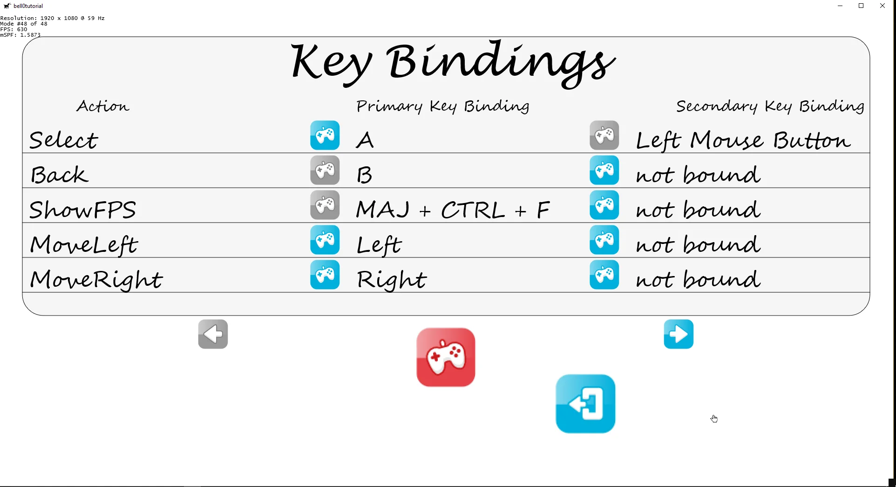
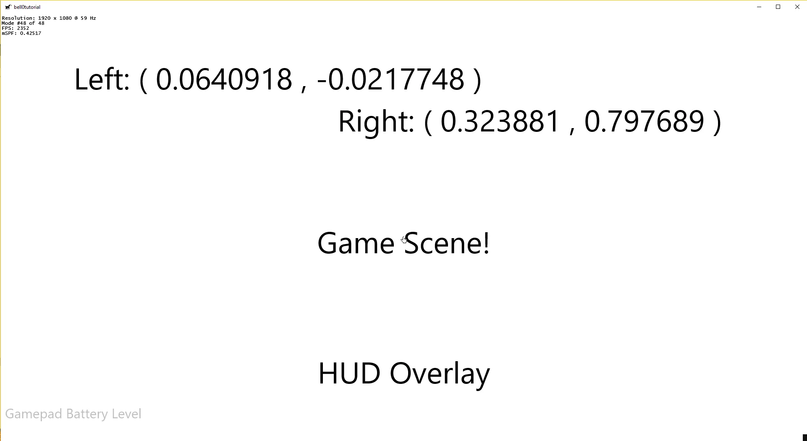
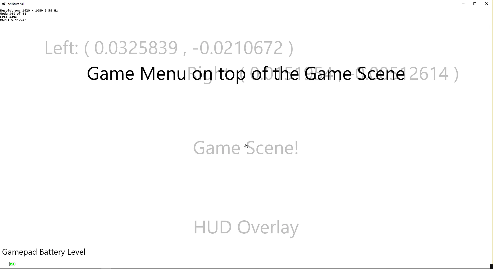

> Control thy passions lest they take vengeance upon thee.
>
> – Epictetus

Microsoft has not made any major changes to DirectInput since DirectX 8, and later introduced XInput in DirectX 9 as a new Input API. Let us compare the two APIs.

## DirectInput vs XInput
### XInput Limitations
- XInput only supports *next generation* controllers. This limits it basically to controllers for the Xbox 360 that also have Windows drivers. Legacy Windows controllers, joysticks and generalized haptic feedback devices are not supported.
  
- XInput supports a maximum of four controllers at a time. This is an Xbox limit, carried over to Windows. DirectInput itself has no such limitation.

- XInput does not support keyboards, mice, or mouse-type devices.

- XInput supports a maximum of 4 axes, 10 buttons, 2 triggers and 8-direction digital pad per controller, compared to DirectInput's support for 8 axes, 128 buttons, and full-range POV.

### Advantages of XInput
- When used with an Xbox 360 Controller, the left and right trigger buttons will act independently, instead of as a single button

In conclusion, one could say that XInput provides an easy and yet still powerful API to access X-Box like controllers, while DirectInput is a very powerful and versatile API for any imaginable controller out there, but its versatility comes with a huge cost: it is a lot more tedious to implement.

## Versions of XInput
XInput is a cross-platform API that works on the Xbox 360 as well as on versions of Windows, including Windows XP, Windows Vista, Windows 7, Windows 8 and Windows 10. On the Xbox 360, XInput ships as a static library that is compiled into the main game executable. On Windows, XInput is provided as a DLL that is installed into the system folders of the operating system.

There are currently three versions of the XInput DLL as of today. The choice depends on the desired functionality of XInput:

### XInput 1.4
XInput 1.4 ships as a system component in Windows 8 as *XINPUT1_4.DLL*. It is always available and does not require redistribution with an application. The Windows Software Development Kit (SDK) contains the header and import library for statically linking against *XINPUT1_4.DLL*. 

XInput 1.4 has these primary advantages over other versions of XInput:

- Usable for C++ / DirectX Windows Store apps.
- Support for headsets attached to an Xbox 360 common controller.
- Provides improved device capabilities reporting, such as wireless and battery status. 
   
### XInput 1.3
Some previous versions of XInput have been provided as redistributable DLLs in the DirectX SDK. The first redistributable version of XInput, XInput 1.1, shipped in the April 2006 release of the DirectX SDK. The last version to ship in the DirectX SDK was XInput 1.3, available in the June 2010 release of the DirectX SDK.

You can use XInput 1.3 for applications that support down-level versions of Windows and require functionality not provided by XInput 9.1.0 (that is, correct subtype reporting, audio support, explicit battery reporting support, and so on).

### XInput 9.1.0
Like XInput 1.4, XInput 9.1.0 ships today as a system component in Windows 8, Windows 7, and Windows Vista as XINPUT9_1_0.DLL. It is maintained primarily for backward compatibility with existing applications. It has a reduced function set so we recommend that you use XInput 1.4 on Windows 8. But it is convenient to use for applications that must run on down-level versions of Windows but don't need the additional functionality provided by XInput 1.4 or XInput 1.3.

---

So much for the theory, let us add XInput support to our games!

---

## XInput Library
To use XInput in a project, *xinput.h* has to be included, and the project must link against the *XInput.lib*:

```cpp
// XInput
#include <Xinput.h>
#pragma comment (lib, "xinput.lib")
```

### Getting the State of a Gamepad
Remember how much initialization we had to do for DirectInput in the previous tutorial? Well, how is how to get the state of a gamepad in XInput, right out of the box:

```cpp
// get port
int playerID = -1;
XINPUT_STATE state;
ZeroMemory(&state, sizeof(XINPUT_STATE));

for (DWORD i = 0; i < XUSER_MAX_COUNT && playerID == -1; i++)
{
	ZeroMemory(&state, sizeof(XINPUT_STATE));

    if (XInputGetState(i, &state) == ERROR_SUCCESS)
		playerID = i;
}

if (playerID != -1)
{
	// create gamepad
	...
}
```

We only need one function call to the *[XInputGetState](https://msdn.microsoft.com/en-us/library/windows/desktop/microsoft.directx_sdk.reference.xinputgetstate(v=vs.85).aspx)* method:

```cpp
DWORD XInputGetState(
  _In_  DWORD        dwUserIndex,
  _Out_ XINPUT_STATE *pState
```

#### DWORD dwUserIndex
This parameter specifies the player ID, i.e. player 1 to 4 (0 to 3 in C++). Those are indicated by the little dots on the bottom of the controller.

#### [XINPUT_STATE](https://msdn.microsoft.com/en-us/library/windows/desktop/microsoft.directx_sdk.reference.xinput_state(v=vs.85).aspx) *pState
This is a pointer to an XINPUT_STATE structure that receives the current state of the controller.

If the function succeeds, the return value is *ERROR_SUCCESS*. If the controller is not connected, the return value is *ERROR_DEVICE_NOT_CONNECTED*. 

---

So what information does the *XINPUT_STATE* structure hold for us:

```cpp
typedef struct _XINPUT_STATE {
  DWORD          dwPacketNumber;
  XINPUT_GAMEPAD Gamepad;
} XINPUT_STATE, *PXINPUT_STATE;
```

#### DWORD dwPacketNumber
This value indicatesa whether the state of the gamepad was changed. If the dwPacketNumber member is the same in sequentially returned *XINPUT_STATE* structures, the controller state has not changed.

#### [XINPUT_GAMEPAD](https://msdn.microsoft.com/en-us/library/windows/desktop/microsoft.directx_sdk.reference.xinput_gamepad(v=vs.85).aspx) Gamepad
This structure contains the current state of an Xbox 360-like Controller. Let us have a closer look at it:

```cpp
typedef struct _XINPUT_GAMEPAD {
  WORD  wButtons;
  BYTE  bLeftTrigger;
  BYTE  bRightTrigger;
  SHORT sThumbLX;
  SHORT sThumbLY;
  SHORT sThumbRX;
  SHORT sThumbRY;
} XINPUT_GAMEPAD, *PXINPUT_GAMEPAD;

```

Now, as you can see, this structure holds all the information we need to work with a gamepad.

#### WORD wButtons
This is a bitmask of the device's digital buttons. A set bit indicates that the corresponding button is pressed. Here is a list of all gamepad buttons:

| Gamepad Button                | Button Bitmask |
|:-----------------------------:|:--------------:|
| XINPUT_GAMEPAD_DPAD_UP        | 0x0001         |
| XINPUT_GAMEPAD_DPAD_DOWN      | 0x0002         |
| XINPUT_GAMEPAD_DPAD_LEFT      | 0x0004         |
| XINPUT_GAMEPAD_DPAD_RIGHT     | 0x0008         |
| XINPUT_GAMEPAD_START          | 0x0010         |
| XINPUT_GAMEPAD_BACK           | 0x0020         |
| XINPUT_GAMEPAD_LEFT_THUMB     | 0x0040         |
| XINPUT_GAMEPAD_RIGHT_THUMB    | 0x0080         |
| XINPUT_GAMEPAD_LEFT_SHOULDER  | 0x0100         |
| XINPUT_GAMEPAD_RIGHT_SHOULDER | 0x0200         |
| XINPUT_GAMEPAD_A              | 0x1000         |
| XINPUT_GAMEPAD_B              | 0x2000         |
| XINPUT_GAMEPAD_X              | 0x4000         |
| XINPUT_GAMEPAD_Y              | 0x8000         |

To test whether a button is currently pressed, all we have to do is a logical and:

```cpp
const bool Gamepad::isPressed(const WORD button) const
{
	return (currentState.Gamepad.wButtons & button) != 0;
}
```

Obviously, as with the keyboard and the joystick, we store the state of the gamepad during the previous and the current frame to be able to detect buttons that are still pressed or have just been released:

```cpp
const KeyState Gamepad::getButtonState(const WORD button) const
{
	if (wasPressed(button))
		if (isPressed(button))
			return KeyState::StillPressed;
		else
			return KeyState::JustReleased;
	else
		if (isPressed(button))
			return KeyState::JustPressed;
		else
			return KeyState::StillReleased;
}
```

I never really wanted to work with XInput, but this is definitely to easy to use to ignore any longer.

#### BYTE bLeftTrigger, bRightTrigger
Those members speciify how *hard* the left and right trigger analog buttons have been pressed. The values are between 0 and 255.

Here is an example of how to get the normalized values for the left trigger:

```cpp
const float Gamepad::getAnalogZL() const
{
	return (float)currentState.Gamepad.bLeftTrigger / 255.0f;
}
```

#### SHORT sThumbLX, sThumbLY, sThumbRX, sThumbRY
Those four members specify the x and y position of the left and right thumb stick. Each of the thumbstick axis members is a signed value between -32768 and 32767 describing the position of the thumbstick. A value of 0 is centred. Negative values signify down or to the left. Positive values signify up or to the right.

### Analogue Input
Recall what we talked about in the previous tutorial: As analogue devices have a wide range of values, it is quite common to have spurious input. Imagine a thumb stick being left alone, sitting in neutral position, theoretically now both values should be 0, but usually, they are just some small values close to zero, but not actually 0.

Because of this, if the raw input of an analogue device was just applied directly to the movement of a character, the character would never stay still. To eliminate this problem, one can define a *dead zone*, which is an area around the centre of the game controller input range that is ignored:

An easy approach to solve this problem would be to simply set the x and y-values to zero if they are close to zero, but that doesn't really work well for the following two reasons:

 - we would define the dead zone to be a rectangle, instead of a circle.
 - we make the available range of values smaller.

To illustrate the second problem, imagine setting a dead zone of 10%. Now, what if the user wants to move around at 50% velocity? Pushing the stick by half now means 40%, as 10% is the new zero. What we will have to do is to set 55%, the middle between 10% and 100% to be 50%.

The first issue can easily be solved by using a vector and its length. If the input from the joystick, as a vector, is smaller than the dead zone vector, then we do nothing.

Here is a quick and dirty vector structure to tackle the problem:

```cpp
struct Vector2F
{
	float x, y;
	float squareLength;
	float length;

	// constructor and destructor
	Vector2F() : x(0.0f), y(0.0f) {};
	Vector2F(float x, float y) : x(x), y(y) { squareLength = getSquareLength(); };
	~Vector2F() {};

	// get square length
	float getSquareLength();

	// get length
	float getLength();

	// normalize vector
	void normalize(float l = -1);

	// overload operators
	Vector2F& operator*=(const float);
};
```

Notice that we do not need the actual length of the vector to check whether it is in the dead zone or not, the square length is enough for that information, but the length is needed to normalize the vector:

```cpp
// if within deadzone, set to 0
	if (thumbStickLeft->getSquareLength() < deadzone*deadzone)
		thumbStickLeft->x = thumbStickLeft->y = 0;
```

To solve the second issue, one can simply compute the percentage between the dead zone and the maximum possible axis range and then normalize the input and multiply it by the just computed percentage. Let $l$ be the length of the vector in question, i.e. the current position of a thumb stick, $dz$ the dead zone and $m$ the maximal value, then we compute the percentage $p$ of the vector between the dead zone and the maximal value as follows: 

$$p := \frac{l - dz}{m - dz}.$$
To get the normalized position of the thumb stick $(nX, nY)$, we simply normalize the vector $(x,y)$ and multiply by the just calculated percentage $p$:

$$nX := \frac{x}{\sqrt{l}} \cdot p$$
$$nY := \frac{y}{\sqrt{l}} \cdot p$$

Here is an example of the above theoretical discussion:

```cpp
util::Expected<void> Gamepad::poll()
{
    // if within deadzone, set to 0
	if (thumbStickLeft->getSquareLength() < deadzone*deadzone)
		thumbStickLeft->x = thumbStickLeft->y = 0;
	else
	{
		// calculate the percentage between the deadzone and the maximal values
		float percentage = (thumbStickLeft->getLength() - deadzone) / (maxValue - deadzone);

		// normalize vector and multiply to get the correct final value
		thumbStickLeft->normalize(thumbStickLeft->length);
		*thumbStickLeft *= percentage;
}
```

And that's it already. XInput is almost too easy to be true!

### Battery Level
As a neat little addition, XInput also allows us to easily query for the battery level of the gamepad via the [XInputGetBatteryInformation](https://msdn.microsoft.com/en-us/library/windows/desktop/microsoft.directx_sdk.reference.xinputgetbatteryinformation(v=vs.85).aspx) method:

```cpp
DWORD XInputGetBatteryInformation(
  _In_  DWORD                      dwUserIndex,
  _In_  BYTE                       devType,
  _Out_ XINPUT_BATTERY_INFORMATION *pBatteryInformation
);
```

#### DWORD dwUserIndex [in]
As before, this is the player id.

#### BYTE devType
This member specifies which device associated with this user index should be queried. The type must either be *BATTERY_DEVTYPE_GAMEPAD* or *BATTERY_DEVTYPE_HEADSET*.

#### XINPUT_BATTERY_INFORMATION
If the function call succeeds, this is a pointer to an *[XINPUT_BATTERY_INFORMATION](https://msdn.microsoft.com/en-us/library/windows/desktop/microsoft.directx_sdk.reference.xinput_battery_information(v=vs.85).aspx)* structure:

```cpp
typedef struct _XINPUT_BATTERY_INFORMATION {
  BYTE BatteryType;
  BYTE BatteryLevel;
} XINPUT_BATTERY_INFORMATION, *PXINPUT_BATTERY_INFORMATION;
```

#### BYTE BatteryType
The type of the battery:

| Value                     | Description                                               |
|:-------------------------:|:---------------------------------------------------------:|
| BATTERY_TYPE_DISCONNECTED | The device is not connected.                              |
| BATTERY_TYPE_WIRED        | The device is a wired device and does not have a battery. |
| BATTERY_TYPE_ALKALINE     | The device has an alkaline battery.                       |
| BATTERY_TYPE_NIMH         | The device has a nickel metal hydride battery.            |
| BATTERY_TYPE_UNKNOWN      | The device has an unknown battery type.                   |

#### BYTE BatteryLevel
The battery level of the device. It can be one of the following four values:

- BATTERY_LEVEL_EMPTY
- BATTERY_LEVEL_LOW
- BATTERY_LEVEL_MEDIUM
- BATTERY_LEVEL_FULL 

---

## Adding the Gamepad to the existing framework
To make the new gamepad class play nicely within the actually existing keyboard / mouse and DirectInput / Joystick framework, we map add a value of $293$ to each gamepad button. Now querying for the gamepad can safely be done alongside querying the keygboard and joystick states:

```cpp
util::Expected<void> InputHandler::acquireInput()
{
	if(dxApp->activeKeyboard || dxApp->activeMouse)
		// get keyboard and mouse state
		getKeyboardAndMouseState();

	if (dxApp->activeGamepad)
		// poll each gamepad - we currently only support one player
		gamepad->poll();

	if (dxApp->activeJoystick)
	{	
		// handle errors
		HRESULT hr;

		// poll the joystick
		hr = joystick->poll();

		if (hr == E_FAIL)
			return std::runtime_error("Critical error: Unable to poll the joystick device!");
	}

	// update the key maps
	return update();
}

util::Expected<void> InputHandler::update()
{
	// clear out any active bindings from the last frame
	bool isActive = false;
	activeKeyMap.clear();

	std::unordered_multimap<GameCommands, GameCommand*>* keyMap = nullptr;

	// get keyMap
	if (dxApp->activeGamepad)
		// gamepad input
		keyMap = &keyMapGamepad;
	else if (dxApp->activeJoystick)
		// joystick input
		keyMap = &keyMapJoystick;
	else
		// keyboard input
		keyMap = &keyMapKeyboard;
		
	if (keyMap == nullptr)
		return std::runtime_error("Critical error: Unable to find input device!");

	// loop through the map of all possible actions and find the active key bindings
	for (auto x : *keyMap)
	{
		if (x.second->chord.empty())
			continue;

		// test chord
		isActive = true;
		for (auto y : x.second->chord)
		{
			if (y.keyCode >= 0 && y.keyCode < joystickBegin)
			{
				// this is a keyboard or mouse chord
				if (getKeyState(y.keyCode) != y.keyState)
				{
					isActive = false;
					break;
				}
			}
			else if (y.keyCode >= joystickBegin && y.keyCode < gamepadBegin && dxApp->activeJoystick)
			{
				// this is a joystick chord
				JoystickButtons jb = (JoystickButtons)(y.keyCode % joystickBegin);
				if (joystick->getButtonState(jb) != y.keyState)
				{
					isActive = false;
					break;
				}
			}
			else
			{
				if (y.keyCode == 18000)
				{
					// left trigger
					if (gamepad->getDigitalTriggerState(0) != y.keyState)
					{
						isActive = false;
						break;
					}
				}
				else if (y.keyCode == 18001)
				{
					// left trigger
					if (gamepad->getDigitalTriggerState(1) != y.keyState)
					{
						isActive = false;
						break;
					}
				}
				else
				{
					// this is a gamepad chord
					if (gamepad->getButtonState((WORD)(y.keyCode - gamepadBegin)) != y.keyState)
					{
						isActive = false;
						break;
					}
				}
			}
		}
			
		if (isActive)
			activeKeyMap.insert(std::pair<GameCommands, GameCommand&>(x.first, *x.second));
	}

	// if there is an active key map
	if (!activeKeyMap.empty())
	{
		// notify the currently active game states to handle the input
		if (!notify(this, false).wasSuccessful())
			return std::runtime_error("Critical error: game state was unable to handle user input!");
	}
	else
	{
		bool firstTime = true;
		if (firstTime)
		{
			// reset left mouse button
			kbm->currentState[1] = 0;
			kbm->previousState[1] = 0;
			firstTime = false;
		}

		if (listen)
		{
			// we are listening to specially requested user input
			newChordBindInfo.clear();

			// give the user the ability to "unbind" a key by pressing the "ESCAPE" key
			if (isPressed(VK_ESCAPE))
			{
				listen = false;			// stop listening ; produce normal input again
				notify(this, true);		// true: was listening to specially requested user input
				return {};				// all done
			}

			// now loop through all possible keys and check for changes
			for (unsigned int i = 0; i < gamepadBegin; i++)
			{
				if (i >= 0 && i < joystickBegin)
				{
					// this is a keyboard or mouse key

					// we don't care which one of the shift or ctrl keys was pressed
					if (i >= 160 && i <= 165)
						continue;

					// push the keys the user is holding down to the chord
					if (getKeyState(i) == KeyState::StillPressed)
					{
						newChordBindInfo.push_back(BindInfo(i, getKeyState(i)));
						continue;
					}

					// now add those keys that have been pressed
					if (kbm->currentState[i] != kbm->previousState[i])	// only listen to key state changes
						newChordBindInfo.push_back(BindInfo(i, getKeyState(i)));
				}
				else if(i >= joystickBegin && i < gamepadBegin && dxApp->activeJoystick)
				{
					// this is a joystick key
					JoystickButtons button = (JoystickButtons) (i % joystickBegin);

					if (button == JoystickButtons::EndButtons || button == JoystickButtons::EndPOV)
						continue;

					if (joystick->getButtonState(button) == KeyState::StillPressed)
					{
						newChordBindInfo.push_back(BindInfo(i, joystick->getButtonState(button)));
						continue;
					}
						
					// now add those keys that have been pressed
					if (joystick->wasPressed(button) != joystick->isPressed(button))
						newChordBindInfo.push_back(BindInfo(i, joystick->getButtonState(button)));
				}
				else if (dxApp->activeGamepad)
				{
					// check trigger buttons
					if (gamepad->getDigitalTriggerState(0) == KeyState::StillPressed)
						newChordBindInfo.push_back(BindInfo(18000, gamepad->getButtonState(KeyState::StillPressed)));
					if (gamepad->getDigitalTriggerState(1) == KeyState::StillPressed)
						newChordBindInfo.push_back(BindInfo(18001, gamepad->getButtonState(KeyState::StillPressed)));
						
					if (gamepad->getDigitalTriggerState(0) == KeyState::JustPressed)
						newChordBindInfo.push_back(BindInfo(18000, gamepad->getButtonState(KeyState::JustPressed)));
					if (gamepad->getDigitalTriggerState(1) == KeyState::JustPressed)
						newChordBindInfo.push_back(BindInfo(18001, gamepad->getButtonState(KeyState::JustPressed)));

					if (gamepad->getDigitalTriggerState(0) == KeyState::JustReleased)
						newChordBindInfo.push_back(BindInfo(18000, gamepad->getButtonState(KeyState::JustReleased)));
					if (gamepad->getDigitalTriggerState(1) == KeyState::JustReleased)
						newChordBindInfo.push_back(BindInfo(18001, gamepad->getButtonState(KeyState::JustReleased)));

					// this is a gamepad button
					for (WORD j = 1; j <= 16384; j = j << 1)
					{
						if (gamepad->getButtonState(j) == KeyState::StillPressed)
						{
							newChordBindInfo.push_back(BindInfo(j+gamepadBegin, gamepad->getButtonState(j)));
							continue;
						}

						// now add those keys that have been pressed
						if (gamepad->wasPressed(j) != gamepad->isPressed(j))
							newChordBindInfo.push_back(BindInfo(j+gamepadBegin, gamepad->getButtonState(j)));
					}
					break;
				}
			}

			// if there is a new chord, we have to make sure that we are not overwriting an already existing chord
			if (!newChordBindInfo.empty())
			{
				// check for new chord to not overwrite other commands
				bool newChord = true;
				for (auto x : *keyMap)
				{
					// no chord at all -> continue
					if (x.second->chord.empty())
						continue;

					// different sizes -> can't be the same chord -> continue
					if (x.second->chord.size() != newChordBindInfo.size())
						continue;
					else
					{
						// check all key bindings
						bool allTheSame = true;
						for (unsigned int i = 0; i < newChordBindInfo.size(); i++)
						{
							if (x.second->chord[i].keyCode != newChordBindInfo[i].keyCode)
							{
								// the keys are different
								allTheSame = false;
								break;
							}
							else
							{
								// the keys are the same; check for their states
								if (x.second->chord[i].keyState != newChordBindInfo[i].keyState)
								{
									// the states are different -> check for pressed <-> released mismatch
									if (x.second->chord[i].keyState == KeyState::JustPressed && newChordBindInfo[i].keyState == KeyState::JustReleased)
									{
										// do nothing
										continue;
									}
									allTheSame = false;
									break;
								}
							}
						}
						if (allTheSame)
							newChord = false;
					}
				}


				if (!newChord)
					// the just pressed chord is already bound to a command -> clear and restart
					newChordBindInfo.clear();
				else
				{
					// we have a new chord ; notify if at least one of the keys was released, else: continue
					// this is necessary to capture multipe key presses, such as "CTRL" + A
					bool sendNotification = false;
					for (auto x : newChordBindInfo)
					{
						if (x.keyCode >= 0 && x.keyCode < joystickBegin)
						{
							// this is a keyboard or mouse button
							if (getKeyState(x.keyCode) == KeyState::JustReleased)
							{
								sendNotification = true;
								listen = false;
								break;
							}
						}
						else if (x.keyCode >= joystickBegin && x.keyCode < gamepadBegin)
						{
							// this is a joystick button
							JoystickButtons button = (JoystickButtons)(x.keyCode % joystickBegin);
							if (joystick->getButtonState(button) == KeyState::JustReleased)
							{
								sendNotification = true;
								listen = false;
								break;
							}
						}
						else
						{
							if (x.keyCode == 18000)
							{
								if (gamepad->getDigitalTriggerState(0) == KeyState::JustReleased)
								{
									sendNotification = true;
									listen = false;
									break;
								}
							}

							if (x.keyCode == 18001)
							{
								if (gamepad->getDigitalTriggerState(1) == KeyState::JustReleased)
								{
									sendNotification = true;
									listen = false;
									break;
								}
							}
								
							if (gamepad->getButtonState((WORD)(x.keyCode - gamepadBegin)) == KeyState::JustReleased)
							{
								sendNotification = true;
								listen = false;
								break;
							}
						}
					}

					if (sendNotification)
					{
						for (auto& x : newChordBindInfo)
						{
							if (x.keyState == KeyState::JustReleased)
								x.keyState = KeyState::JustPressed;
						}
						notify(this, true);
					}
				}
			}
		}
	}

	return {};
}
```

### Force Feedback
X-Box like controllers come with two force feedback motors, a left and a right one. To set the force applied to those motors, we can use the [XInputSetState](https://msdn.microsoft.com/en-us/library/windows/desktop/microsoft.directx_sdk.reference.xinputsetstate(v=vs.85).aspx) method:

```cpp
DWORD XInputSetState(
  _In_    DWORD            dwUserIndex,
  _Inout_ XINPUT_VIBRATION *pVibration
);
```

#### DWORD dwUserIndex
Once again, this DWORD specifies the player id.

#### [XINPUT_VIBRATION](https://msdn.microsoft.com/en-us/library/windows/desktop/microsoft.directx_sdk.reference.xinput_vibration(v=vs.85).aspx) *pVibration
A pointer to a vibration structure:

```cpp
typedef struct _XINPUT_VIBRATION {
  WORD wLeftMotorSpeed;
  WORD wRightMotorSpeed;
} XINPUT_VIBRATION, *PXINPUT_VIBRATION;
```

The two WORDs of this structure simply specify how much force is applied to the left and the right force feedback motor, respectively. Valid values are in the range $0$ to $65535$. Zero signifies no motor use while $65535$ signifies $100$ percent force feedback power!

Here is an example of how to use this structure with normalized coordinates:

```cpp
void Gamepad::vibrate(float normalizedLeftSpeed, float normalizedRightSpeed)
{
	if (normalizedLeftSpeed > 1.0f)
		normalizedLeftSpeed = 1.0f;
	else if (normalizedLeftSpeed < 0.0f)
		normalizedLeftSpeed = 0.0f;

	if (normalizedRightSpeed > 1.0f)
		normalizedRightSpeed = 1.0f;
	else if (normalizedRightSpeed < 0.0f)
		normalizedRightSpeed = 0.0f;

	vibrate((unsigned int)(normalizedLeftSpeed*maxMotorSpeed), (unsigned int)(normalizedRightSpeed*maxMotorSpeed));
}
```

---

As a little demo, I added an icon for the gamepad battery level on the HUD. The main game scene now displays the position of the two thumbsticks. In addition, there are a few force feedback effects in place, when the game starts and during the main game scene, depending on the thumb stick positions.



.

.

You can download the source code from [here](https://filedn.eu/ltgnTcOBnsYpGSo6BiuFrPL/Game%20Programming/Flatland/Input/XInput.7z).

In the next tutorial, we will learn how to implement an event-queue.

---

## References
(in alphabetic order)
 * Game Programming Algorithms, by Sanjay Madhav
 * Game Programming Patterns, by Robert Nystrom
 * Microsoft Developer Network ([MSDN](https://msdn.microsoft.com/en-us/library/windows/desktop/ee663274(v=vs.85)))
 * Tricks of the Windows Game Programming Gurus, by André LaMothe
 * Wikipedia