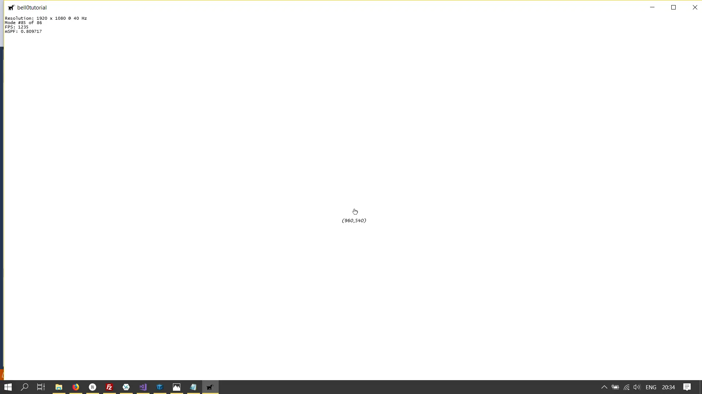
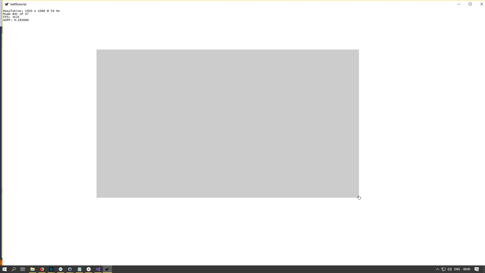

> The early bird gets the worm, but the second mouse gets the cheese.
>
> – Willie Nelson

There are two ways to communicate with the mouse: *absolute* mode and *relative* mode. In absolute mode, the mouse
returns its position relative to the screen coordinates based on where the mouse pointer is. Thus, in a screen
resolution of $800x600$, the mouse position would be an element of $\mathbb{Z}_{800} \times \mathbb{Z}\_{600}$.

In relative mode, the mouse driver sends the position of the mouse relative to its previous position at each clock tick.
*Naturally*, all mice are relative, it is up to the driver, or the input handler, to transform relative movement to
absolute positions.

## The Mouse Cursor

When the user moves the mouse, the system moves a bitmap on the screen called the mouse cursor. The mouse cursor
contains a single-pixel point called the hot spot, a point that the system tracks and recognizes as the position of the
cursor. When a mouse event occurs, the window that contains the hot spot typically receives the mouse message resulting
from the event. The window need not be active or have the keyboard focus to receive a mouse message.

To facilitate things a bit, we will start the game in full-screen mode from now on, which is the most natural mode for
games anyway.

We can use the [SetCursorPos](https://msdn.microsoft.com/en-us/library/windows/desktop/ms648394(v=vs.85).aspx) method

```cpp
BOOL WINAPI SetCursorPos(
  _In_ int X,
  _In_ int Y
);
```

to set the mouse position to be at the center of our game window when our application starts:

```cpp
// initialize the input handler
inputHandler = new GameInput();

// position mouse at the center of the screen
SetCursorPos((int)(d3d->getCurrentWidth() / 2), (int)(d3d->getCurrentHeight() / 2));
```

To retrieve the position of the cursor, the
*[GetCursorPos](https://msdn.microsoft.com/en-us/library/windows/desktop/ms648390(v=vs.85).aspx)* function can be used:

```cpp
BOOL WINAPI GetCursorPos(
  _Out_ LPPOINT lpPoint
);
```

The function returns the position of the mouse cursor (in absolute coordinates) in
a [Point](https://msdn.microsoft.com/en-us/library/windows/desktop/dd162805(v=vs.85).aspx) structure:

```cpp
typedef struct tagPOINT {
  LONG x;
  LONG y;
} POINT, *PPOINT;
```

As an example, let us print the position of the cursor to the screen. To do so, we need to create a text format:

```cpp
// game class header
POINT cursorPos;
Microsoft::WRL::ComPtr<IDWriteTextFormat3> textFormat;
Microsoft::WRL::ComPtr<IDWriteTextLayout4> textLayout;

util::Expected<void> DirectXGame::initGraphics()
{	
	// create text layout for mouse position
	this->d2d->createTextFormat(L"Lucida Handwriting", 12, textFormat);

	// log and return success
	util::ServiceLocator::getFileLogger()->print<util::SeverityType::info>("Game graphics were successfully initialized.");
	return {};
}
```

Now during the game loop, we simply query for the position of the mouse cursor and create a text format layout with the
x and y-coordinate of the mouse cursor:

```cpp
void DirectXGame::acquireInput()
{
	...

	// get cursor positio
	GetCursorPos(&cursorPos);

    // create text layout
	std::wostringstream mousePos;
	mousePos.precision(6);
	mousePos << "(" << cursorPos.x << "," << cursorPos.y << ")";
	d2d->createTextLayout(&mousePos, textFormat.Get(), 75, 50, textLayout);
}
```

Printing the text is effortless now:

```cpp
util::Expected<int> DirectXGame::render(const double /*farSeer*/)
{
	...
    
	d2d->beginDraw();

	// print mouse position
	d2d->printText(D2D1::Point2F((float)cursorPos.x-37.5f, (float)cursorPos.y), textLayout.Get());

	// print FPS information
	d2d->printFPS();

	if(!d2d->endDraw().wasSuccessful())
		return std::runtime_error("Failed to draw 2D graphics!");
	
    ...
    
	// present the scene
	if (!d3d->present().wasSuccessful())
		return std::runtime_error("Failed to present the scene!");

	// return success
	return 0;
}
```

## Sprite Cursor

The standard cursor doesn't look great, and thus we will replace it with our own using our animated sprite class.

First, we have to disable the standard cursor using the
*[ShowCursor](https://msdn.microsoft.com/en-us/library/windows/desktop/ms648396(v=vs.85).aspx)* function:

```cpp
int WINAPI ShowCursor(
  _In_ BOOL bShow
);
```

The only input to this function is a boolean specifying whether to show the cursor or not:

```cpp
// hide the standard cursor
ShowCursor(false);
```

To use a custom cursor, we simply draw the animated sprite at the cursor position:

```cpp
class DirectXGame : core::DirectXApp
{
private:
	POINT cursorPos;
	
    Microsoft::WRL::ComPtr<IDWriteTextFormat3> textFormat;
	Microsoft::WRL::ComPtr<IDWriteTextLayout4> textLayout;
	
    graphics::AnimationData* cursorAnimations;
	graphics::AnimatedSprite* cursor;
	
public:
	...
};

// initialize the game
util::Expected<void> DirectXGame::init(LPCWSTR windowTitle)
{
	...
    
    // position mouse at the center of the screen
	SetCursorPos(d3d->getCurrentWidth() / 2, d3d->getCurrentHeight() / 2);

	// hide the standard cursor
	ShowCursor(false);

    ...
}

// initialize graphics
util::Expected<void> DirectXGame::initGraphics()
{	
	// create text layout for mouse position
	d2d->createTextFormat(L"Lucida Handwriting", 12, textFormat);

	// set cursor animation data
	std::vector<graphics::AnimationCycleData> cursorAnimationsCycles;
	graphics::AnimationCycleData cycle;

	// cursor cycle
	cycle.name = L"Cursor Normal";
	cycle.startFrame = 0;
	cycle.numberOfFrames = 1;
	cycle.width = 15;
	cycle.height = 16;
	cycle.paddingWidth = 0;
	cycle.paddingHeight = 3;
	cycle.borderPaddingHeight = cycle.borderPaddingWidth = 1;
	cycle.rotationCenterX = cycle.rotationCenterY = 0.5f;
	cursorAnimationsCycles.push_back(cycle);

	cycle.name = L"Cursor Click";
	cycle.startFrame = 0;
	cycle.numberOfFrames = 1;
	cycle.width = 15;
	cycle.height = 16;
	cycle.paddingWidth = 0;
	cycle.paddingHeight = 0;
	cycle.borderPaddingHeight = cycle.borderPaddingWidth = 1;
	cycle.rotationCenterX = cycle.rotationCenterY = 0.5f;
	cursorAnimationsCycles.push_back(cycle);

	// create cursor animations
	try { cursorAnimations = new graphics::AnimationData(d2d, L"O:/Documents/GitLab/bell0tutorial/bell0tutorial/Art/cursor.png", cursorAnimationsCycles); }
	catch (std::runtime_error& e) { return e; }

	// create cursor sprite
	cursor = new graphics::AnimatedSprite(d2d, cursorAnimations, 0, 24, 0, 0);

	cursorAnimationsCycles.clear();
	std::vector<graphics::AnimationCycleData>(cursorAnimationsCycles).swap(cursorAnimationsCycles);

    ...
}

// input
void DirectXGame::acquireInput()
{
	inputHandler->acquireInput();

	// act on user input
	...

	// get cursor position and update text format
	GetCursorPos(&cursorPos);
	
    // create FPS information text layout
	std::wostringstream mousePos;
	mousePos.precision(6);
	mousePos << "(" << cursorPos.x << "," << cursorPos.y << ")";
	d2d->createTextLayout(&mousePos, textFormat.Get(), 75, 50, textLayout);

    // update sprite position
	cursor->setPosition((float)cursorPos.x, (float)cursorPos.y);
}

util::Expected<int> DirectXGame::render(const double /*farSeer*/)
{
	...
	d2d->beginDraw();

	// print mouse position
	d2d->printText(D2D1::Point2F((float)cursorPos.x-37.5f, (float)cursorPos.y), textLayout.Get());

	// draw cursor sprite
	cursor->draw();

	// print FPS information
	d2d->printFPS();

	if(!d2d->endDraw().wasSuccessful())
		return std::runtime_error("Failed to draw 2D graphics!");
    
    ...
}
```



## Mouse Buttons

To keep track of the state of the mouse buttons, we can use the same routine as for the keyboard. Windows can natively
track five mouse buttons and actually, our keyboard update routine includes those five buttons already.

To test this, let us print the mouse position only while the right mouse button is pressed. To do so, we simply add a
command to the enumeration of game commands, set the default map for that command to the right mouse button being held
down and act upon activation accordingly:

```cpp
void GameInput::setDefaultKeyMap()
{
    ...
    input::GameCommand(L"showMousePosition", VK_RBUTTON, input::KeyState::StillPressed);
}

void DirectXGame::acquireInput()
{
	// get cursor position and update text format
	GetCursorPos(&cursorPos);
	cursor->setPosition((float)cursorPos.x, (float)cursorPos.y);
	printMousePos = false;

	inputHandler->acquireInput();

	// act on user input
	for (auto x : inputHandler->activeKeyMap)
	{
		switch (x.first)
		{
		case input::GameCommands::Quit:
			PostMessage(appWindow->getMainWindowHandle(), WM_CLOSE, 0, 0);
			break;

		case input::GameCommands::showFPS:
			showFPS = !showFPS;
			break;

		case input::GameCommands::showMousePosition:
			// create FPS information text layout
			std::wostringstream mousePos;
			mousePos.precision(6);
			mousePos << "(" << cursorPos.x << "," << cursorPos.y << ")";
			d2d->createTextLayout(&mousePos, textFormat.Get(), 75, 50, textLayout);
			printMousePos = true;
			break;
		}
	}
}
```

---

Now let us animate our cursor. We add another game command to the enumeration called *leftMouseButtonDown* which changes
the mouse cursor animation for as long as the left mouse button is down and, to make things a bit more interesting, it
will allow us to define a rectangle (this might be useful for troop selection in an RTS). To do so, we add events to
look for the left mouse button to just be pressed and released respectively, to save the starting and end point of the
rectangle:

```cpp
// the core game class, derived from DirectXApp
class DirectXGame : core::DirectXApp
{
private:
	POINT cursorPos;
	Microsoft::WRL::ComPtr<IDWriteTextFormat3> textFormat;
	Microsoft::WRL::ComPtr<IDWriteTextLayout4> textLayout;
	graphics::AnimationData* cursorAnimations;
	graphics::AnimatedSprite* cursor;
	bool printMousePos = false;
	bool leftMouseButtonDown = false;
	D2D1_POINT_2F startPoint, endPoint;
	bool drawSelectionRectangle;
	
public:
	...
};


void GameInput::setDefaultKeyMap()
{
	keyMap.clear();
    ...
	
    keyMap[input::GameCommands::showMousePosition] = new input::GameCommand(L"showMousePosition", VK_RBUTTON, input::KeyState::StillPressed);
	keyMap[input::GameCommands::leftMouseButtonDown] = new input::GameCommand(L"leftMouseButtonDown", VK_LBUTTON, input::KeyState::StillPressed);
	keyMap[input::GameCommands::beginSelect] = new input::GameCommand(L"beginSelect", VK_LBUTTON, input::KeyState::JustPressed);
	keyMap[input::GameCommands::endSelect] = new input::GameCommand(L"endSelect", VK_LBUTTON, input::KeyState::JustReleased);
}

void DirectXGame::acquireInput()
{
	// get cursor position and update text format
	GetCursorPos(&cursorPos);
	cursor->setPosition((float)cursorPos.x, (float)cursorPos.y);
	printMousePos = false;
	leftMouseButtonDown = false;
	drawSelectionRectangle = false;

	inputHandler->acquireInput();

	std::wostringstream mousePos;
	// act on user input
	for (auto x : inputHandler->activeKeyMap)
	{
		switch (x.first)
		{
		case input::GameCommands::Quit:
			PostMessage(appWindow->getMainWindowHandle(), WM_CLOSE, 0, 0);
			break;

		case input::GameCommands::showFPS:
			showFPS = !showFPS;
			break;

		case input::GameCommands::showMousePosition:
			// create FPS information text layout
			mousePos.precision(6);
			mousePos << "(" << cursorPos.x << "," << cursorPos.y << ")";
			d2d->createTextLayout(&mousePos, textFormat.Get(), 75, 50, textLayout);
			printMousePos = true;
			break;

		case input::GameCommands::beginSelect:
			startPoint = { (float)cursorPos.x, (float)cursorPos.y };
			break;

		case input::GameCommands::leftMouseButtonDown:
			leftMouseButtonDown = true;
			endPoint = { (float)cursorPos.x, (float)cursorPos.y };
			drawSelectionRectangle = true;
			break;

		case input::GameCommands::endSelect:
			endPoint = { (float)cursorPos.x, (float)cursorPos.y };
			drawSelectionRectangle = true;
			break;
		}
	}

	// update the cursor
	if (leftMouseButtonDown)
		cursor->changeAnimation(1);
	else
		cursor->changeAnimation(0);
}

util::Expected<int> DirectXGame::render(const double /*farSeer*/)
{
    ...
	
    d2d->beginDraw();
	
    ...

	// fill selected rectangle
	if(drawSelectionRectangle)
		d2d->fillRectangle(startPoint, endPoint, 0.2f);

	// print FPS information
	d2d->printFPS();

	if(!d2d->endDraw().wasSuccessful())
		return std::runtime_error("Failed to draw 2D graphics!");
        
    ...
}
```



## Cleanup

I cleaned the source code and eliminated a few memory leaks. The following key bindings are active on default:

- *Shift + Control* + *F*: toggle FPS
- *Escape*: Quit

You can download the source
code [here](https://filedn.eu/ltgnTcOBnsYpGSo6BiuFrPL/Game%20Programming/Flatland/Input/mouse.7z).

In the next tutorial, we will learn how to load and save key maps from and to a file on the hard drive.

## References

(in alphabetic order)

* Microsoft Developer Network ([MSDN](https://msdn.microsoft.com/en-us/library/windows/desktop/ee663274(v=vs.85)))
* Tricks of the Windows Game Programming Gurus, by André LaMothe
* Wikipedia