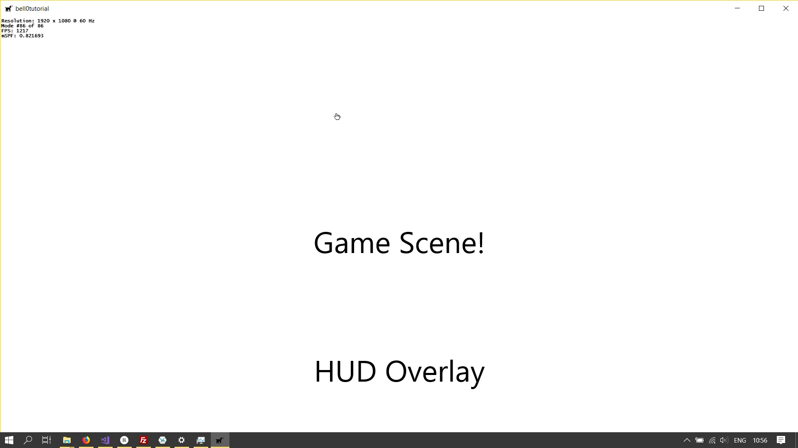
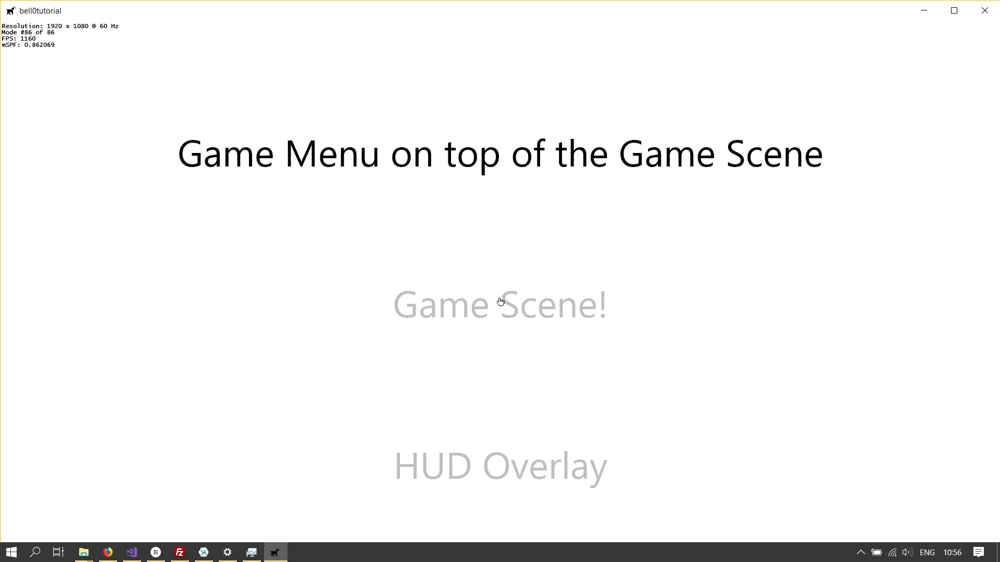

The current stack manager does not allow for Heads-Up-Display overlays yet, as each time a new state is pushed to the
stack, the previous state is paused. We therefor have to add the possibility to overlay states over each other.

## The Stack

### Overlaying States

To add a new overlay, we simply push the new state to the stack:

```cpp
util::Expected<void> DirectXApp::overlayGameState(GameState* const gameState)
{
	// push new game state
	gameStates.push_back(gameState);
	if (!(*gameStates.rbegin())->initialize().wasSuccessful())
		return std::runtime_error("Critical error: Unable to shut the game state down!");

	// return success
	return { };
}
```

### Pushing States

Now when pushing a new state to the stack, we have to pause all underlying states:

```cpp
util::Expected<void> DirectXApp::pushGameState(GameState* const gameState)
{
	// pause the current state
	for (std::deque<GameState*>::reverse_iterator it = gameStates.rbegin(); it != gameStates.rend(); it++)
		if (!(*it)->pause().wasSuccessful())
			return std::runtime_error("Critical error: Unable to resume the game state");

	// push and initialize the new game state
	gameStates.push_back(gameState);
	if (!(*gameStates.rbegin())->initialize().wasSuccessful())
		return std::runtime_error("Critical error: Unable to initialize the game state!");

	// return success
	return { };
}
```

### Popping States

When popping a state from the stack, we have to resume all underlying states:

```cpp
util::Expected<void> DirectXApp::popGameState()
{
	// shut the current state down
	if (!gameStates.empty()) 
	{
		if (!(*gameStates.rbegin())->shutdown().wasSuccessful())
			return std::runtime_error("Critical error: Unable to shut the game state down!");
		gameStates.pop_back();
	}

	// resume previous states
	for (std::deque<GameState*>::reverse_iterator it = gameStates.rbegin(); it != gameStates.rend(); it++)
		if (!(*it)->resume().wasSuccessful())
			return std::runtime_error("Critical error: Unable to resume the game state");

	// return success
	return { };
}
```

## A Barebone HUD

I created a blank HUD state that simply writes its name to the bottom of the screen. The main *playState* then
initializes its own HUD:

```cpp
util::Expected<void> PlayState::initialize()
{
    ...
    
    // initialize the game overlay
	dxApp->overlayGameState(&UI::HeadsUpDisplayState::createInstance(dxApp, L"HUD"));

	...
}
```

And that's it. Our Stack Manager now supports HUDs.





---

This concludes our first series of tutorials about state stacks. You can download the source code
from [here](https://filedn.eu/ltgnTcOBnsYpGSo6BiuFrPL/Game%20Programming/Flatland/Interface/overlay.7z).

## References

### Literature
(in alphabetic order)
* Game Programming Algorithms, by Sanjay Madhav
* Game Programming Patterns, by Robert Nystrom
* Microsoft Developer Network ([MSDN](https://msdn.microsoft.com/en-us/library/windows/desktop/ee663274(v=vs.85)))
* Tricks of the Windows Game Programming Gurus, by André LaMothe
* Wikipedia

### Art
* [GUI Buttons](https://opengameart.org/content/gui-buttons-vol1)
  by [looneybits](https://opengameart.org/users/looneybits)
* [Menu Buttons](https://opengameart.org/content/buttons-with-hover)
  by [Soundemperor](https://opengameart.org/users/soundemperor).