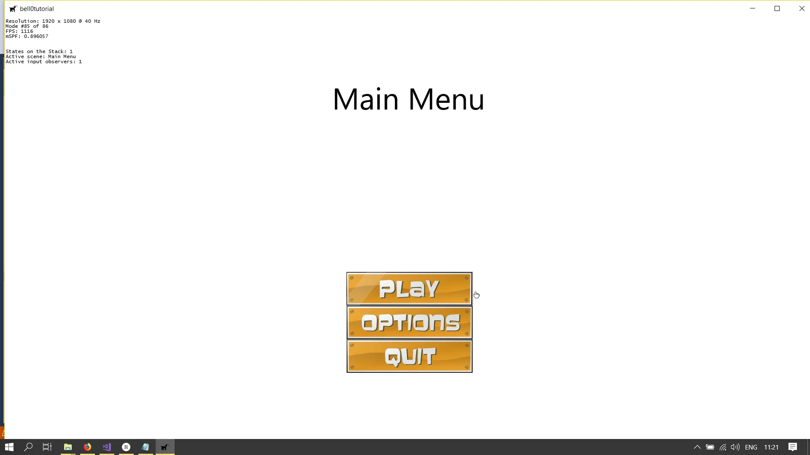

> “Most people have their buttons,” Eustace continued.
>
> – James Purdy, Eustace Chisholm and the Works

Every game, I suppose, requires a menu system with **buttons** to let the user navigate through the different scenes of
a game. On the computer or on a console, a button must at least have two states, unselected and selected, to make sure
the user knows exactly which button is currently selected. A third state, clicked, is optional. To implement this, we
use our animated sprite class.

The button class itself is fairly straightforward, it will have, among necessary internal variables, an animated sprite
and a [lambda function](https://en.wikipedia.org/wiki/Anonymous_function):

## Lambda Functions

Lambda functions were introduced by the C++-11 standard. They allow us to write *anonymous* functions that we can use
instead of complete *structs* or *classes*, thus allowing us to avoid the need to create complete class and function
definitions.

As an example, consider a function to compute the square of a number. In C++-11, this can be done with a lambda function
as follows:

```cpp
auto squareLambdaFunction = [](int n) {return n * n; };
int nineSquared = squareLambdaFunction(9);
```

After the auto keyword, to let C++ decide on the return type, and naming our function as we desire, the square brackets
indicate that what follows is intended to be a lambda function. Inside the parentheses, as *always*, we can define a
list of arguments to be received by the function, which can be omitted altogether if there are no arguments, meaning
that we do not need to write () if there is no input, unlike for regular functions. Finally, there is the regular body
of code inside the braces, just as for *normal* functions.

### Capture Semantics

Let us try a more difficult example. Assume that we have list of strings, and we now want to create another list with
the sizes of those strings using a lambda function to evaluate the size of each string and pushing it on the new list:

```cpp
std::wstring test1 = L"bell0bytes";
std::wstring test2 = L"Symplectic Topology is the best!";
std::wstring test3 = L"Deutscher Meister wird nur der BVB!";
std::vector<std::wstring> stringVector;
stringVector.push_back(test1);
stringVector.push_back(test2);
stringVector.push_back(test3);
```

The obvious *old* C++ way would be to populate the new vector as follows:

```cpp
std::vector<size_t> stringSizeVector;
for (auto s : stringVector)
	stringSizeVector.push_back(s.size());
```

Let us try to do that with lambda functions. Obviously, our lambda function will get a string as input, and it has to
return the size of the string:

```cpp
std::vector<size_t> stringSizeVector;
std::for_each(stringVector.begin(), stringVector.end(), [](std::wstring s) { stringSizeVector.push_back(s.size()); });
```

If we try this, the compiler complains: *error C3493: 'stringSizeVector' cannot be implicitly captured because no
default capture mode has been specified*.

Thus, there is one more detail to talk about: how do we pass *parent* objects by reference? Well, the square brackets
indicate how the variables are *captured*:

- []: no capture.
- [&]: capture all by reference.
- [=]: capture all by value.

Capturing variables by value will naturally prevent them from being modified within the function. Not capturing them
prevents them from even being accessed. Let us try the above code again. Using *capture by value* obviously won't work,
as we have to push something on the vector, and thus we have to use *capture by reference*:

```cpp
std::vector<size_t> stringSizeVector;
std::for_each(stringVector.begin(), stringVector.end(), [&](std::wstring s) { stringSizeVector.push_back(s.size()); });
```

In addition, one can specify lists of variables to capture. If a variable is preceded by a &, it is captured by
reference. Otherwise it is captured by value:

```cpp
int foo, bar, lol;
[&foo, bar, &lol](int i) {foo = i; lol += bar; };
```

Here, foo and lol are captured by reference, while bar is captured by value. No other variables from the parent scope
are accessible at all.

To access all members of an enclosing class, the *this* keyword can be used. Note that this technique also works when
passing a lambda function as an argument to a function in a different: the captured class will be the one the lambda
function was originally defined in.

As a last technique, one can also specify that all variables should be captured by value or by reference, minus a few
exceptions:

```cpp
int foo, bar, lol;
[&, bar](int i) {foo = i; lol += bar; };
```

### Generalized Lambda Functions

The C++-14 standard introduced the concept of generalized lambda functions, which means that we are now allowed to use
*auto* as the type for input parameters. We could now write our squaring function as follows:

```cpp
auto squareLambdaFunction = [](auto n) {return n * n; };
```

We can now use our lambda functions for integers as well as for floats and doubles, for example, without recurring to
templates!

This is quite the powerful technique when combined with *standard containers*. As an example, we will sort and print the
content of a vector using generic lambda functions:

```cpp
std::vector<int> vectorOfIntegers;
for (unsigned int i = 0; i < 100; i++)
	vectorOfIntegers.push_back(std::rand() % 1000);
std::sort(vectorOfIntegers.begin(), vectorOfIntegers.end(), [](auto n, auto m) {return n > m; });
std::for_each(vectorOfIntegers.begin(), vectorOfIntegers.end(), [](auto n) {std::cout << n; });
```

Okay, to be honest, there is an even easier way to do this, using a predefined function from C++-14, but I am sure you
can see why lambda functions can be a very useful and powerful tool to have in our arsenal:

```cpp
std::vector<int> vectorOfIntegers;
for (unsigned int i = 0; i < 100; i++)
	vectorOfIntegers.push_back(std::rand() % 1000);
std::sort(vectorOfIntegers.begin(), vectorOfIntegers.end(), std::greater<>());
std::for_each(vectorOfIntegers.begin(), vectorOfIntegers.end(), [](auto n) {std::cout << n; });
```

---

So much for lambda functions. They are easy to use and definitely handy. Now let us create menu buttons with them!

## The Button Class

As we have already said, on the computer, a button must at least have two states, unselected and selected, to make sure
the user knows exactly which button is currently selected. A third state, clicked, is optional. To implement this, we
obviously use our animated sprite class together with our new weapon, the lambda functions.

We use a lambda function returning a boolean to be able to notify the state manager when a state is added or removed
from the queue. Returning false signifies that the state stack was changed.

```cpp
// enumerate all possible button states
enum ButtonStates { Deselected, Selected, Clicked};

class Button
{
private:
	std::wstring name;							// the name of the button
	graphics::AnimatedSprite* sprite;			// the graphics of the button
	ButtonStates state;							// state of the button
	std::function<bool()> onClick;				// function to be replaced by a lambda function later on to define what happens when the button is clicked

public:
	// constructors and destructors
	Button(std::wstring, graphics::AnimatedSprite* const);
	Button(std::wstring, graphics::AnimatedSprite* const, std::function<bool()>);
	~Button();
		
	// button interaction
	void select();
	void deselect();
	bool click();
	void setOnClickFunction(std::function<bool()> onClickFunction);
		
	// draw button
	void draw();
	void drawCentered(const float scaleFactor = 1.0f, const float offsetX = 1.0f, const float offsetY = 1.0f);
		
	// update button
	void update(const double deltaTime);
};
```

### Constructors and Destructors

The constructors and destructor are straightforward:

```cpp
Button::Button(std::wstring name, graphics::AnimatedSprite* const sprite) : name(name), sprite(sprite), state(ButtonStates::Deselected)
{ }

Button::Button(std::wstring name, graphics::AnimatedSprite* const sprite, std::function<bool()> onClick) : name(name), sprite(sprite), onClick(onClick), state(ButtonStates::Deselected)
{ }

Button::~Button()
{
	onClick = []() { return true; };
	delete this->sprite;
}
```

### Draw

To draw the buttons, we can call the draw functions of the sprite class:

```cpp
void Button::draw()
{
	this->sprite->draw();
}

void Button::drawCentered(const float scaleFactor, const float offsetX, const float offsetY)
{
	sprite->drawCentered(scaleFactor, offsetX, offsetY);
}
```

### Update

Updating the button animation is once again as easy as calling the sprite update method:

```cpp
void Button::update(const double deltaTime)
{
	sprite->updateAnimation(deltaTime);
}
```

### Interaction

Interacting with the buttons is easy as well. For those examples we assume the sprite sheet to have the deselected
animations in the first row and the selected animation frames in a second row.

```cpp
void Button::select()
{
	state = ButtonStates::Selected;
	sprite->changeAnimation(1);
}

void Button::deselect()
{
	state = ButtonStates::Deselected;
	sprite->changeAnimation(0);
}

bool Button::click()
{
	state = ButtonStates::Clicked;
	return onClick();
}

void Button::setOnClickFunction(std::function<bool()> onClickFunction)
{
	onClick = onClickFunction;
}
```

Notice that when the button is clicked, we call the private onClick function, which was either initialized by the
constructor or set by the *setOnClickFunction* method.

## A Game Menu

As an example, let us add a few buttons to the main menu state. First, we have to define a double linked list to store
all the buttons:

```cpp
namespace UI
{
	class Button;

	class MainMenuState : public core::GameState
	{
	private:
        ...
		
        // the menu buttons
		std::deque<Button*> menuButtons;
		unsigned int currentlySelectedButton;

		...
	protected:
		...
        
	public:
		...
        
        util::Expected<void> initializeButtons();				// initialize the menu button graphics

		...
	};
}
```

We will now add three buttons to the menu: a play, an options and a quit button. I am sure you can figure out what each
button is supposed to do on your own. I downloaded the
following [sprites from OpenGameArt](https://opengameart.org/content/buttons-with-hover), created
by [soundemperor](https://opengameart.org/users/soundemperor).

As an example, here is the code for the *Play Button*:

```cpp
util::Expected<void> MainMenuState::initializeButtons()
{
	// set play button animation cycles
	std::vector<graphics::AnimationCycleData> animationCycles;
	graphics::AnimationCycleData cycle;
	graphics::AnimationData* animations;

	// cycle
	cycle.name = L"Play Button Deselected";
	cycle.startFrame = 0;
	cycle.numberOfFrames = 1;
	cycle.width = 300;
	cycle.height = 80;
	cycle.paddingWidth = 0;
	cycle.paddingHeight = 20;
	cycle.borderPaddingHeight = cycle.borderPaddingWidth = 0;
	cycle.rotationCenterX = cycle.rotationCenterY = 0.5f;
	animationCycles.push_back(cycle);

	cycle.name = L"Play Button Selected";
	cycle.startFrame = 0;
	cycle.numberOfFrames = 30;
	cycle.width = 300;
	cycle.height = 80;
	cycle.paddingWidth = 0;
	cycle.paddingHeight = 0;
	cycle.borderPaddingHeight = cycle.borderPaddingWidth = 0;
	cycle.rotationCenterX = cycle.rotationCenterY = 0.5f;
	animationCycles.push_back(cycle);

	// create play button animations
	try { animations = new graphics::AnimationData(d2d, L"O:/Documents/GitLab/bell0tutorial/bell0tutorial/Art/playButton.png", animationCycles); }
	catch (std::runtime_error& e) { return e; }

	// set lambda function
	auto onClick = [this]
	{
		this->isPaused = true;
		if (!dxApp->gameIsRunning)
			dxApp->changeGameState(&core::PlayState::createInstance(dxApp, L"Game"));
		else
			dxApp->popGameState(); 
		return false;
	};
    
    // add button to the list
	menuButtons.push_back(new Button(L"Play Button", new graphics::AnimatedSprite(d2d, animations, 0, 24), onClick));

	// clear animation data
	animationCycles.clear();
	std::vector<graphics::AnimationCycleData>(animationCycles).swap(animationCycles);

    ...

	// set active button
	menuButtons[0]->select();

    ...	
}
```

The only *new* part is the definition of the *onClick* function:

```cpp
auto onClick = [this]
{
	this->isPaused = true;
	dxApp->changeGameState(&core::PlayState::createInstance(dxApp, L"Game"));
	return false;
};
```

Recalling our brief introduction to lambda functions, we recognize that *[this]* signifies that we are capturing the
entire class and no *()* means that we have no input parameters to our function. The function itself simply create a new
game state, the play state, and puts it on the stack. The function returns false to notify the stack manager that the
state of the stack has changed. That's it! Easy!

## Navigation

We can navigate through our menu using either the keyboard or the mouse. To be able to bind multiple keys to a single
command, I changed the keyMap to an unordered multimap.

### Keyboard

Using the keyboard to navigate through the menu is straightforward, we simply increment or decrement the *pointer* to
the currently active button, and when a button is clicked, we call its *onClick* method:

```cpp
util::Expected<bool> MainMenuState::handleInput(std::unordered_map<input::GameCommands, input::GameCommand&>& activeKeyMap)
{
	// act on user input
	for (auto x : activeKeyMap)
	{
		switch (x.first)
		{
		case input::Select:
			// activate currently selected button
			return menuButtons[currentlySelectedButton]->click();;

		case input::MoveDown:
			// select next button in the list
			menuButtons[currentlySelectedButton]->deselect();
			if (currentlySelectedButton < menuButtons.size() - 1)
				currentlySelectedButton++;
			else
				currentlySelectedButton = 0;
			menuButtons[currentlySelectedButton]->select();
			return true;

		case input::MoveUp:
			// select next button in the list
			menuButtons[currentlySelectedButton]->deselect();
			if (currentlySelectedButton > 0)
				currentlySelectedButton--;
			else
				currentlySelectedButton = (unsigned int)menuButtons.size()-1;
			menuButtons[currentlySelectedButton]->select();
			return true;

		case input::GameCommands::ShowFPS:
			dxApp->showFPS = !dxApp->showFPS;
			break;
		}
	}

    return true;
}
```

### Mouse

Using the mouse is a bit more difficult, as we have to get the mouse position and do something once the mouse hovers
over the region of a button. To facilitate using the mouse, I added a rectangle to each button. Each time the button is
drawn, the rectangle is updated with the position of the button (which has to be computed anyway).

Now if the mouse is active, we can simply check if the mouse is hovering over a button and if that is the case, we
select that button:

```cpp
if (dxApp->activeMouse)
{
	// get mouse position
	long mouseX = dxApp->getMouseX();
	long mouseY = dxApp->getMouseY();

	// check if mouse position is inside button rectangle
	unsigned int i = 0;
	for (auto button : menuButtons)
	{
		D2D1_RECT_F rect = button->getRectangle();
		if (mouseX > rect.left && mouseX < rect.right)
			if (mouseY > rect.top && mouseY < rect.bottom)
			{
				if (currentlySelectedButton != i)
				{
					// deselect current button
					menuButtons[currentlySelectedButton]->deselect();

					// select button
					button->select();
					currentlySelectedButton = i;
				}
			}
		i++;
	}
}
```



---

You can download the source
code [here](https://filedn.eu/ltgnTcOBnsYpGSo6BiuFrPL/Game%20Programming/Flatland/Interface/menuButtons.7z).

In the next tutorial, we will add a menu to allow the player to choose their own key bindings.

---

## References

### Literature
* Game Programming Algorithms, by Sanjay Madhav
* Game Programming Patterns, by Robert Nystrom
* Microsoft Developer Network ([MSDN](https://msdn.microsoft.com/en-us/library/windows/desktop/ee663274(v=vs.85)))
* Tricks of the Windows Game Programming Gurus, by André LaMothe
* Wikipedia

### Art
* [GUI Buttons](https://opengameart.org/content/gui-buttons-vol1)
  by [looneybits](https://opengameart.org/users/looneybits)
* [Menu Buttons](https://opengameart.org/content/buttons-with-hover)
  by [Soundemperor](https://opengameart.org/users/soundemperor)