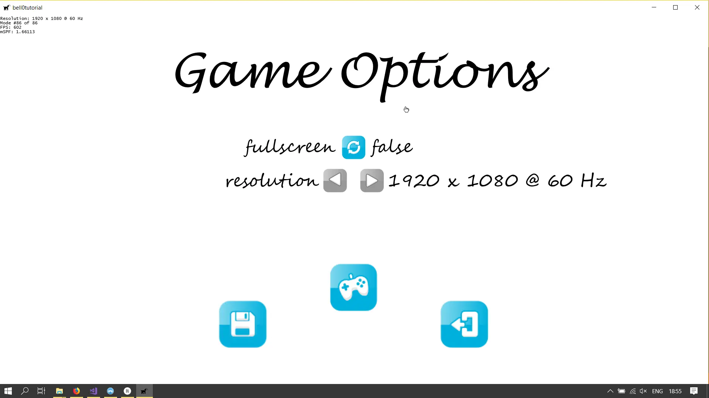
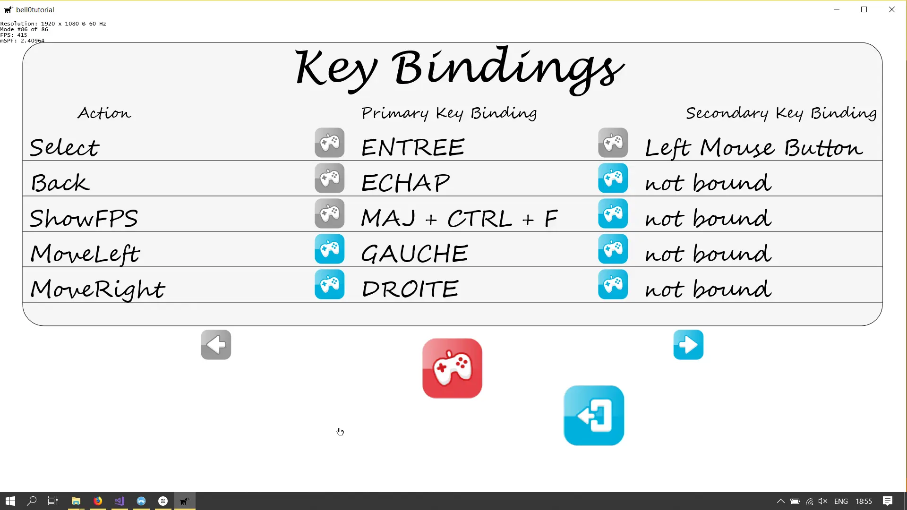
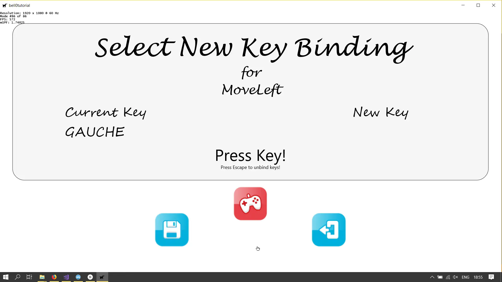

> I may be running out of options, but running out isn't an option.
>
> – Mark Lawrence, Prince of Thorns

To further showcase our new state system, let us create an options menu to allow the user to change the full-screen
state, to set the game resolution and to pick their own keybindings.

## Boost Preprocessor

Since getting the strings of enum variables is a bit tedious when done using a *switch*, I used the boost preprocessor
to create enums with an *automatic* *toString* function:

```cpp
#include <boost/preprocessor.hpp>
#include <boost/preprocessor/wstringize.hpp>

namespace input
{
	// use boost to define enums with strings

	// this first macro is used internally by the second one
#define ENUM_TO_STRING(r, data, elem)    \
    case elem : return BOOST_PP_WSTRINGIZE(elem);

	// this second macro first generates the enumeration and then generates a ToString function
	// that takes an object of that type and returns the enumerator name as a string
	// obviously this implementation requires that the enumerators map to unique values)
#define ENUM_WITH_STRING(name, enumerators)                \
    enum name {                                                               \
        BOOST_PP_SEQ_ENUM(enumerators)                                        \
    };                                                                        \
                                                                              \
    inline const wchar_t* getGameCommandAsString(name v)				      \
    {                                                                         \
        switch (v)                                                            \
        {                                                                     \
            BOOST_PP_SEQ_FOR_EACH(                                            \
                ENUM_TO_STRING,                                               \
                name,                                                         \
                enumerators                                                   \
            )                                                                 \
            default: return "[Unknown " BOOST_PP_WSTRINGIZE(name) "]";        \
        }                                                                     \
    }

	// define the game commands
	ENUM_WITH_STRING(GameCommands,	                    (Select)\
														(Back)\
														(ShowFPS)\
														(MoveLeft)\
														(MoveRight)\
														(MoveUp)\
														(MoveDown)\
														(Shift)\
														(Preview)\
														(nGameCommands))

	// define application events
	ENUM_WITH_STRING(Events,	                (StartApplication)\
												(PauseApplication)\
												(ResumeApplication)\
												(QuitApplication)\
												(SwitchFullscreen)\
												(WindowChanged)\
												(ChangeResolution)\
                                                (nApplicationEvents))
}
```

This might look weird, and it obviously is a bit more work than just defining an enum, but the ease of use easily beats
the added implementation time.

The first macro *ENUM_TO_STRING* is internally used by the second one. The second macro *ENUM_WITH_STRING* first
generates the enumeration, then generates a *toString* function called *getGameCommandAsString* that takes a
*GameCommand* as input and returns the enumerator name as a string, using the first macro to *stringify* enumeration
elements into wide chars. Note that this implementation obviously requires the enumerators to map to unique values.

Defining the actual enumerations is easy enough, as you can see, but the real power comes from the ease of use:

First notice that I like to add a *count* at the end of each enum, for example *nGameCommands* to be able to easily loop
through the enum:

```cpp
// create action text layouts
	for (unsigned int i = input::GameCommands::Select; i < input::GameCommands::nGameCommands; i++)
		if (!addTextToActionTextLayoutList((input::GameCommands)i).wasSuccessful())
			return std::runtime_error("Critical error: Unable to create header action text layouts!");
```

And retrieving the string values of an enum is now as easy as it gets:

```cpp
util::Expected<void> KeyMapMenuState::addTextToActionTextLayoutList(input::GameCommands gameCommand)
{
	std::wstring text = input::getGameCommandAsString(gameCommand);
				
	Microsoft::WRL::ComPtr<IDWriteTextLayout4> textLayout;
	util::Expected<void> result = d2d->createTextLayoutFromWString(&text, textFormat.Get(), (float)dxApp->getCurrentWidth(), 100, textLayout);
	if (!result.isValid())
		return result;
	actionTextLayouts.push_back(textLayout);

	// return success
	return { };
}
```

Just have fun with the new enums! Thanks, Boost!

## Updated Buttons

First, please note that the game buttons have been updated. The most important updates are that the buttons can now hold
four animation cycles, one for each state, deselected, selected, clicked and locked, and that a button is now only
clickable if it is not locked:

```cpp
util::Expected<bool> AnimatedButton::click()
{
	if (state == ButtonStates::Locked)
		return true;

	if (nAnimationCycles > 2)
		sprite->changeAnimation(2);
	state = ButtonStates::Clicked;
	return onClick();
}
```

## Options Menu State

To show the options menu, we will create a new state, the options menu state, where the user can set the full-screen
state of the game as well as specify its resolution:



I won't show the details for each little function in those states, but I will briefly elaborate on the lambda functions
of each button as well as the functions that provide the main functionality.

### Creating the main navigation Buttons

#### The Back Button

```cpp
auto onClickBack = [this]() -> util::Expected<bool>
{
	this->isPaused = true;
	if (!dxApp->changeGameState(&UI::MainMenuState::createInstance(dxApp, L"Main Menu")).wasSuccessful())
		return std::runtime_error("Critical error: Unable to change game state to main menu!");
	return false;
};
```

This is an easy button to implement. We simply change the game state to the main menu, meaning that we delete all other
states. Note that a return value of *false* notifies the observer stack of the input handler that the stack of states
was changed.

#### The Save Button

```cpp
auto onClickSave = [this]
{
	// write options to lua file
	dxApp->saveConfiguration(supportedModes[currentModeIndex].Width, supportedModes[currentModeIndex].Height, currentModeIndex, fullscreen);

	// activate desired screen resolution and fullscreen mode
	if (currentModeIndex != dxApp->getCurrentModeIndex())
		dxApp->changeResolution(currentModeIndex);

	if (fullscreen != wasInFullscreen)
	{
		wasInFullscreen = !wasInFullscreen;
		dxApp->toggleFullscreen();
	}

    return true;
};
```

When the user clicks on the save button, we write the current options to the LUA file on the hard drive and, if so
desired, change the resolution and/or toggle the full-screen state. Please note that in the above screenshot, the
resolution buttons are greyed out because the application does not have resizable graphics yet.

#### The Gamepad Button

```cpp
auto onClickGamepad = [this]() -> util::Expected<bool>
{
	// open key map menu
	if (!dxApp->pushGameState(&UI::KeyMapMenuState::createInstance(dxApp, L"Key Map Menu")).wasSuccessful())
		std::runtime_error("Critical error: Unable to push key map menu to the state stack!");
	return false;
};
```

When the user clicks on the gamepad button, we push another state to the stack, the key map menu state, allowing the
user to change the key bindings. Please note that pushing a state to the stack does not delete the previous states; they
are simply paused and will be resumed later on.

### Toggle Fullscreen

```cpp
		auto onClick = [this]
		{
			this->fullscreen = !this->fullscreen;
			return true;
		};
```

There is nothing here, the main work is done when the *save* button is clicked.

### Browse Supported Resolutions

To browse through all supported resolutions, we simply implement a *left* and *right* button, choosing the next or
previous resolution:

```cpp
auto onClickScreenResolutionLeftArrow = [this]
{
	if(this->currentModeIndex > 0)
		currentModeIndex--;
	return true;
};

auto onClickScreenResolutionRightArrow = [this]
{
	if (this->currentModeIndex < this->nSupportedModes-1)
		currentModeIndex++;
	return true;
};
```

To grey out the buttons once we are at one of the ends of the list, we update their state during the game update as
follows:

```cpp
util::Expected<void> OptionsMenuState::update(const double deltaTime)
{
    ... 
    
	if (currentModeIndex == 0)
	{
		menuButtons[1]->lock();
		if (currentlySelectedButton == 1)
			currentlySelectedButton = -1;
	}
	if (currentModeIndex == nSupportedModes - 1)
	{
		menuButtons[2]->lock();
		if (currentlySelectedButton == 2)
			currentlySelectedButton = -1;
	}

	// lock resolution buttons for now as we do not have resizable graphics yet
	menuButtons[1]->lock();
	menuButtons[2]->lock();

	// return success
	return {};
}
```

## Key Bindings Menu

This menu gives an overview of the currently active key maps. Clicking on the gamepad symbol next to a key binding
allows the user to select their own mappings:



### The Main Navigation Buttons

As you can see, the *save* button is gone. The new key bindings are saved when chosen during the next state. The
*gamepad* button remains red, as it was clicked before the main menu state went into pause mode. The only button that is
left is the

#### Back Button

```cpp
auto onClickBack = [this]() -> util::Expected<bool>
{
	this->isPaused = true;
	if(!dxApp->popGameState().wasSuccessful())
		return std::runtime_error("Critical error: Unable to pop the key map menu!");
	return false;
};
```

This is easy. We simply pop the current state, the key binding menu, and resume the previous state, the main game
options menu.

### Pagination

We only show five game commands at once. To navigate through the game commands, we draw two pagination buttons with the
following lambda functions:

```cpp
auto onClickLeft = [this]
{
	if (currentPage > 0)
		this->currentPage--;
	return true;
};

auto onClickRight = [this]
{
	unsigned int n = 0;
	for (unsigned int i = 0; i < currentPage + 1; i++)
		n += keyBindingsPerPage;
	if (n < actionTextLayouts.size())
		currentPage++;
	return true;
};
```

### The New Gamepad Buttons

When a small gamepad button next to a key binding is clicked, we enter a new state, the *NewKeyBindingMenuState* where
the user can select a new chord for the specified action:

```cpp
auto onClickGamepad = [this]
{
	return this->changeKeyBinding();
};

util::Expected<bool> KeyMapMenuState::changeKeyBinding()
{
	UI::NewKeyBindingState* bindNewKey = &UI::NewKeyBindingState::createInstance(dxApp, L"New Key Binding");

	this->isPaused = true;
		
	// get currently selected button modulo 9
	// 0-8: primary key binding
	// 9-17: secondary key binding
	bool primary = currentlySelectedButton > 8 ? false : true;
	unsigned int gameCommand = currentlySelectedButton % 9;

	std::wstring text = input::getGameCommandAsString((input::GameCommands)gameCommand);
		
	// get game commands associated with the selected game action
	std::vector<input::GameCommand*> commands;
	dxApp->getCommandsMappedToGameAction((input::GameCommands)gameCommand, commands);
		
	// get command (primary or secondary)
	if (primary)
	{
		// primary key binding
		if (!commands.empty())
		{
			// the command already exists -> change the associated chord
			bindNewKey->setCommandToChange(commands[0]);
			bindNewKey->setOldKeyBindingString(keyBindings1Texts[gameCommand]);
			bindNewKey->setGameCommand((input::GameCommands)gameCommand);
			dxApp->pushGameState(bindNewKey);
		}
		else
		{
			// the command does not exist -> create a new one
			input::GameCommand* gc = new input::GameCommand(text);
			dxApp->addNewCommand((input::GameCommands)gameCommand, *gc);
			bindNewKey->setCommandToChange(gc);
			bindNewKey->setOldKeyBindingString(L"not bound");
			bindNewKey->setGameCommand((input::GameCommands)gameCommand);
			dxApp->pushGameState(bindNewKey);
		}
	}
	else
	{
		// secondary key binding
		if (commands.size() > 1)
		{
			// the command does exist -> change it
			bindNewKey->setCommandToChange(commands[1]);
			bindNewKey->setOldKeyBindingString(keyBindings1Texts[gameCommand]);
			bindNewKey->setGameCommand((input::GameCommands)gameCommand);
			dxApp->pushGameState(bindNewKey);
		}
		else
		{
			// the command does not exist -> create it
			input::GameCommand* gc = new input::GameCommand(text);
			dxApp->addNewCommand((input::GameCommands)gameCommand, *gc);
			bindNewKey->setCommandToChange(gc);
			bindNewKey->setOldKeyBindingString(L"not bound");
			bindNewKey->setGameCommand((input::GameCommands)gameCommand);
			dxApp->pushGameState(bindNewKey);
		}
	}
	return true;
}
```

What is happening here is that we chose the appropriate game command, based on which gamepad button was clicked. We then
enter the new state with the appropriate game command from the key map to change.

## New Key Bindings Menu

In this menu, the user can choose their own key bindings for the game commands:



### The Back Button

The back button is, as always, easy to implement:

```cpp
auto onClickBack = [this]() -> util::Expected<bool>
{
	this->isPaused = true;
	if (!dxApp->popGameState().wasSuccessful())
		return std::runtime_error("Critical error: Unable to pop new key bindings state");
	return false;
};
```

We simply pop the current state from the stack and resume the previous state, the key bindings menu. Note that any new
chords the user may have selected are discarded.

### The Save Button

```cpp
auto onClickSave = [this]() -> util::Expected<bool>
{
	// store the new key binding
	dxApp->saveKeyBindings();
	if (!dxApp->popGameState().wasSuccessful())
		return std::runtime_error("Critical error: Unable to pop new key binding state!");
	return false;	// notify stack change
};
```

This button is as easy as the *back button*. We simply save the key bindings using boost serialization as described
in [a previous tutorial on marshalling game commands](https://bell0bytes.eu/storing-the-keymap/) and then pop the state
and resume the key bindings menu.

## Listening for User Input

Once the *NewKeyBindingState* starts, we tell the input handler to start listening for user input.

```cpp
util::Expected<bool> NewKeyBindingState::onNotify(input::InputHandler* const ih, const bool listening)
{
	if (!listening)
	{
		// get active key map
		if (!isPaused)
			return handleInput(ih->activeKeyMap);
	}
	else
	{
		// got new chord
		ih->disableListening();
		setNewChord(ih->newChordBindInfo);
	}

	// return success
	return true;
}
```

The input handler then captures any user input that was not already mapped to a (different) game command and notifies us
to save the new chord:

```cpp
void InputHandler::update()
{
	// clear out any active bindings from the last frame
	bool isActive = false;
	activeKeyMap.clear();
		
	// loop through the map of all possible actions and find the active key bindings
	for (auto x : keyMap)
	{
		if (x.second->chord.empty())
			continue;

		// test chord
		isActive = true;
		for (auto y : x.second->chord)
		{
			if (getKeyState(y.keyCode) != y.keyState)
			{
				isActive = false;
				break;
			}
		}
		if (isActive)
			activeKeyMap.insert(std::pair<GameCommands, GameCommand&>(x.first, *x.second));
	}

	// if there is an active key map
	if (!activeKeyMap.empty())
	{
		// notify the currently active game states to handle the input
		notify(this, false);	// false: normal game input; was not listening to specially requested user input
	}
	else
	{
        if (listen)
		{
			// we are listening to specially requested user input
			newChordBindInfo.clear();

			// give the user the ability to "unbind" a key by pressing the "ESCAPE" key
			if (isPressed(VK_ESCAPE))
			{
				listen = false;			// stop listening ; produce normal input again
				notify(this, true);		// true: was listening to specially requested user input
				return;					// all done
			}

			// now loop through all possible keys and check for changes
			for (unsigned int i = 0; i < 256; i++)
			{
				// we don't care which one of the shift or ctrl keys was pressed
				if (i >= 160 && i <= 165)
					continue;

				// push the keys the user is holding down to the chord
				if (getKeyState(i) == KeyState::StillPressed)
				{
					newChordBindInfo.push_back(BindInfo(i, getKeyState(i)));
					continue;
				}
					
				// now add those keys that have been pressed
				if (kbm->currentState[i] != kbm->previousState[i]	// only listen to key state changes
					&& getKeyState(1) != KeyState::JustReleased)	// ignore when the left mouse button is released (as the menu is accessed via left mouse button click)	
					newChordBindInfo.push_back(BindInfo(i, getKeyState(i)));
			}

			// if there is a new chord, we have to make sure that we are not overwriting an already existing chord
			if (!newChordBindInfo.empty())
			{
				// check for new chord to not overwrite other commands
				bool newChord = true;
				for (auto x : keyMap)
				{
					// no chord at all -> continue
                    if (x.second->chord.empty())
						continue;

					// different sizes -> can't be the same chord -> continue
					if (x.second->chord.size() != newChordBindInfo.size())
						continue;
					else
					{
						// check all key bindings
						bool allTheSame = true;
						for (unsigned int i = 0; i < newChordBindInfo.size(); i++)
						{
							if (x.second->chord[i].keyCode != newChordBindInfo[i].keyCode)
							{
								// the keys are different
								allTheSame = false;
								break;
							}
							else
							{
								// the keys are the same; check for their states
								if (x.second->chord[i].keyState != newChordBindInfo[i].keyState)
								{
									// the states are different -> check for pressed <-> released mismatch
									if (x.second->chord[i].keyState == KeyState::JustPressed && newChordBindInfo[i].keyState == KeyState::JustReleased)
									{
										// do nothing
										continue;
									}
									allTheSame = false;
									break;
								}
							}
						}
						if (allTheSame)
							newChord = false;
					}
				}

					
				if (!newChord)
					// the just pressed chord is already bound to a command -> clear and restart
					newChordBindInfo.clear();
				else
				{
					// we have a new chord ; notify if at least one of the keys was released, else: continue
					// this is necessary to capture multipe key presses, such as "CTRL" + A
					bool sendNotification = false;
					for (auto x : newChordBindInfo)
						if (getKeyState(x.keyCode) == KeyState::JustReleased)
						{
							sendNotification = true;
							listen = false;
							break;
						}
					if (sendNotification)
					{
						for (auto& x : newChordBindInfo)
						{
							if (x.keyState == KeyState::JustReleased)
								x.keyState = KeyState::JustPressed;
						}
						notify(this, true);
					}
				}
			}
		}
	}
}
```

Associating the new chord with the game command is done as follows:

```cpp
util::Expected<void> NewKeyBindingState::setNewChord(std::vector<input::BindInfo>& bi)
{
	// disable listening
	this->keySelected = true;

	// store new chord
	newChord = bi;

	// show new chord
	std::wostringstream text;
	if (newChord.empty())
		text << "New Key" << std::endl << L"not bound";
	else
	{
		text << "New Key" << std::endl;
		for (unsigned int i = 0; i < bi.size(); i++)
		{
			if (i != bi.size() - 1)
				text << dxApp->getKeyName(bi[i].getKeyCode()).get() << L" + ";
			else
				text << dxApp->getKeyName(bi[i].getKeyCode()).get();
		}
	}

    ...
	
    // change game command
	commandToChange->setChord(newChord);
	return true;
}
```

---

And that's it, we now have a fully functional game menu.

You can download the source code
from [here](https://filedn.eu/ltgnTcOBnsYpGSo6BiuFrPL/Game%20Programming/Flatland/Interface/menuButtons.7z).

---

In the next tutorial, although I previously said that we won't elaborate on HUDs yet, we will at least modify our state
stack to allow HUDs, as the HUD is drawn over the game state without pausing the game.

## References

### Literature

(in alphabetic order)

* Game Programming Algorithms, by Sanjay Madhav
* Game Programming Patterns, by Robert Nystrom
* Microsoft Developer Network ([MSDN](https://msdn.microsoft.com/en-us/library/windows/desktop/ee663274(v=vs.85)))
* Tricks of the Windows Game Programming Gurus, by André LaMothe
* Wikipedia

### Art

* [Menu Buttons](https://opengameart.org/content/buttons-with-hover)
  by [Soundemperor](https://opengameart.org/users/soundemperor).