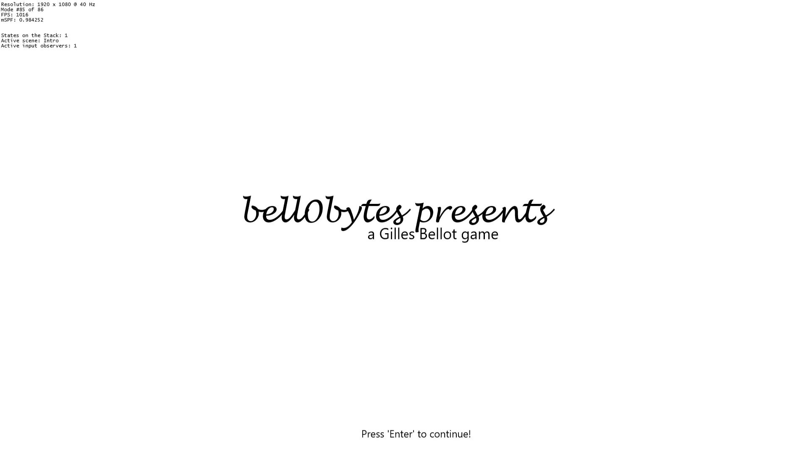
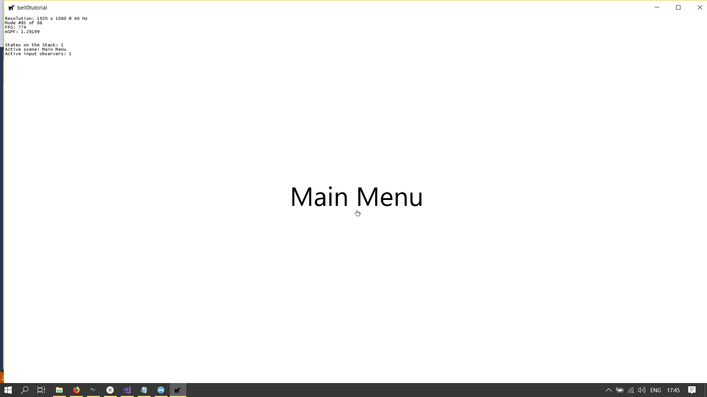
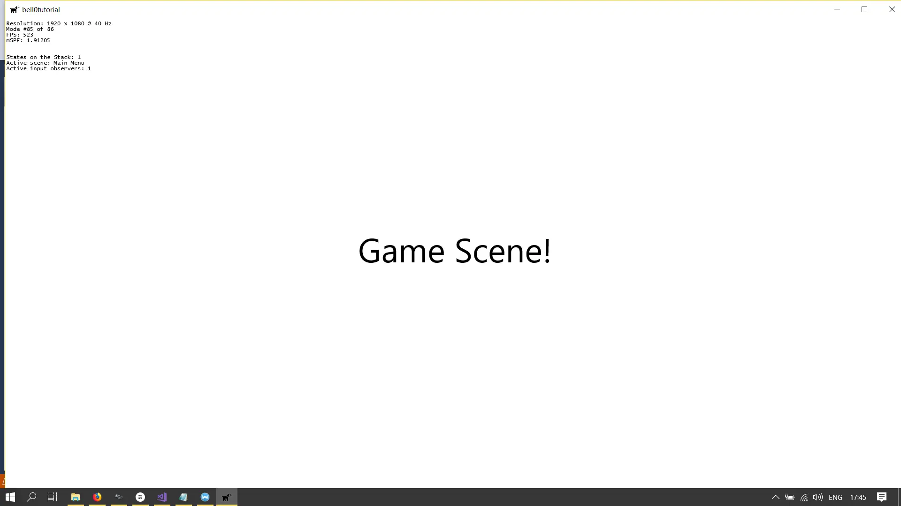
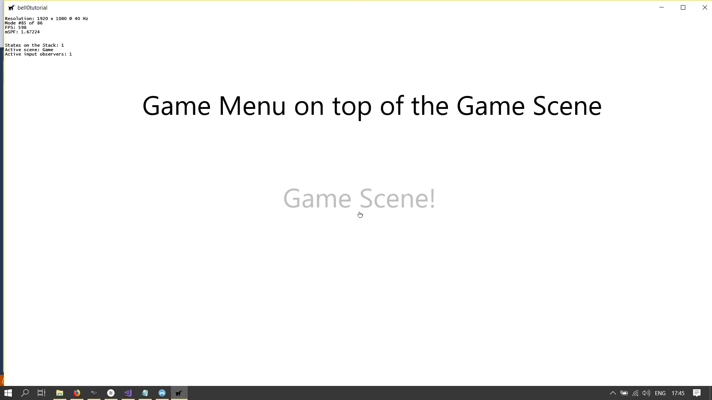

> Be sure not to discuss your hero's state of mind. Make it clear from his actions.
>
> – Anton Chekhov

A typical game has two major interface components: a menu system and a heads-up display (HUD).

The menu system defines how the player gets in and out of the game, including selecting options, viewing the credits or
high scores, and so on. Some games, like RPGs, also have in-game menus to manage inventories or to show character
sheets.

The HUD simply shows additional information to the player, for example a compass or his current score.

In this first series of tutorials, we will talk about menus only.

## Scenes

To implement menus, we will use a so-called *Scene Manager*, that is, we will consider our game to be a collection of
different scenes, or states. The intro sequence, for example, would be the first scene to show, followed by the main
menu and from there on the user can branch off into an options menu, view the credits or start the actual game.

Our main goal is to create a scene manager with no limit to the number of elements and distinct elements it can show,
and to provide an easy way to add new scenes. One way to ensure a working scene flow (allowing the user to go back and
forth between scenes) is to use a stack of scene.

The top scene on the stack will be the currently active scene, and going to a new scene means simply pushing that scene
on the stack, while going back means popping the top scene off the stack. Another thing to consider is that sometimes
multiple scenes must be visible, for example when we ask the user whether he really wants to save the changes he made to
the key bindings. In that case, we must always draw the scenes on the stack from the bottom to the top. One
particularity to keep in mind is that once the game starts, we will probably have to clear the entire stack and only
push the game scene on top, which makes the scene stack into a non-standard stack.

## Game Scenes

A scene is thus almost like a separate program within our game. Each game scene or state must be able to handle its own
initialization, such as the desired graphical components, it must handle its own events, update the game world and draw
the next frame to the screen.

We will define a purely virtual base class for game states like this:

```cpp
namespace graphics
{
	class Direct2D;
}

namespace core
{
	class DirectXApp;

	class GameState : public util::Observer
	{
	private:
		std::wstring name;						// the name of the scene
				
	protected:
		DirectXApp* const dxApp;				// pointer to the main application class
		graphics::Direct2D* const d2d;			// pointer to the Direct2D object of the DirectXApp

		bool isPaused;							// true iff the scene is paused

		// protected constructor -> singleton
		GameState(DirectXApp* const app, std::wstring& name);

	public:
		virtual ~GameState();

		// delete copy and assignment operators
		GameState(GameState const &) = delete;
		GameState& operator = (GameState const &) = delete;
		
		// initialization
		virtual void initialize() = 0;
		virtual void shutdown() = 0;

		// pause and resume
		virtual void pause() = 0;
		virtual void resume() = 0;

		// user input
		virtual bool handleInput(std::unordered_map<input::GameCommands, input::GameCommand&>& activeKeyMap) = 0;	// returns false if the observer stack of the input handler was changed
		virtual void update(const double deltaTime) = 0;

		// render the scene
		virtual void render(const double farSeer) = 0;

		// get name
		std::wstring& getStateName() { return name; };
	};
}

```

Note that this class is designed to be a singleton, which ensures that each game state class has only one single
instance, and also provides a global point of access to each state. Also notice that the game states observe the input
handler and get active whenever the user presses a key that is mapped to a game event.

The actual stack of game scenes will be hold by the main application class in a *deque*:

```cpp
std::deque<GameState*> gameStates;		// the different states of the application

// manage the game states
void changeGameState(GameState* const gameState);
void pushGameState(GameState* const gameState);
void popGameState();
```

```cpp
void DirectXApp::changeGameState(GameState* const gameState)
{
	// delete previous states
	while (!gameStates.empty())
	{
		(*gameStates.rbegin())->shutdown();
		gameStates.pop_back();
	}

	// push and initialize the new game state (if it is not on the stack already)
	gameStates.push_back(gameState);
	(*gameStates.rbegin())->initialize();
}

void DirectXApp::pushGameState(GameState* const gameState)
{
	// pause the current state
	if (!gameStates.empty())
		(*gameStates.rbegin())->pause();

	// push and initialize the new game state
	gameStates.push_back(gameState);
	(*gameStates.rbegin())->initialize();
}

void DirectXApp::popGameState()
{
	// shut the current state down
	if (!gameStates.empty()) 
	{
		(*gameStates.rbegin())->shutdown();
		gameStates.pop_back();
	}

	// resume previous state
	if (!gameStates.empty()) {
		(*gameStates.rbegin())->resume();
	}
}
```

Now, there is one thing that we still have to consider: How does the main application class know when to change from one
state to another? Well, it does not. Only the currently active state knows when it is time to change to another state.
We thus have to add another function to the GameState class:

```cpp
// change to another scene
void changeState(GameState* const gameState);

void GameState::changeState(GameState* const gameState)
{
	dxApp->changeGameState(gameState);
}
```

---

And that's it already. To illustrate how the new system works, I created a few game states, an intro state, a main menu,
the actual game state and a game menu. To navigate through the states, use the *Enter* and *Escape* key.

Here is the sample code for the game state:

```cpp
// INCLUDES /////////////////////////////////////////////////////////////////////////////

// bell0bytes
#include "app.h"
#include "playState.h"
#include "gameCommands.h"
#include "gameMenuState.h"

// CLASS METHODS ////////////////////////////////////////////////////////////////////////
namespace core
{
	/////////////////////////////////////////////////////////////////////////////////////////
	///////////////////////////// Constructor and Destructor ////////////////////////////////
	/////////////////////////////////////////////////////////////////////////////////////////
	PlayState::PlayState(DirectXApp* const app, std::wstring name) : GameState(app, name) { }

	PlayState::~PlayState() { }

	PlayState& PlayState::createInstance(DirectXApp* const app, std::wstring stateName)
	{
		static PlayState instance(app, stateName);
		return instance;
	}

	/////////////////////////////////////////////////////////////////////////////////////////
	/////////////////////////////// Initialization //////////////////////////////////////////
	/////////////////////////////////////////////////////////////////////////////////////////
	void PlayState::initialize()
	{
		// add as an observer to the input handler
		dxApp->addInputHandlerObserver(this);

		// allow only keyboard input
		dxApp->activeKeyboard = true;
		dxApp->activeMouse = false;

		// show fps
		dxApp->showFPS = true;

		// notify the main application class that the game is running
		dxApp->gameIsRunning = true;

		// create text formats
		d2d->createTextFormat(L"Segoe UI", 72.0f, playStateFormat);

		// create text layouts
		std::wstring playText = L"Game Scene!";
		d2d->createTextLayoutFromWString(&playText, playStateFormat.Get(), (float)dxApp->getCurrentWidth(), 100, playStateLayout);

		resume();
	}

	/////////////////////////////////////////////////////////////////////////////////////////
	///////////////////////////// Pause and Resume //////////////////////////////////////////
	/////////////////////////////////////////////////////////////////////////////////////////
	void PlayState::pause()
	{
		isPaused = true;
	}

	void PlayState::resume()
	{
		// allow only keyboard input
		dxApp->activeKeyboard = true;
		dxApp->activeMouse = false;

		isPaused = false;
	}

	/////////////////////////////////////////////////////////////////////////////////////////
	/////////////////////////////// User Input //////////////////////////////////////////////
	/////////////////////////////////////////////////////////////////////////////////////////
	util::Expected<bool> PlayState::onNotify(std::unordered_map<input::GameCommands, input::GameCommand&>& activeKeyMap)
	{
		if(!isPaused)
			return handleInput(activeKeyMap);

		// return success
		return true;
	}

	bool PlayState::handleInput(std::unordered_map<input::GameCommands, input::GameCommand&>& activeKeyMap)
	{
		// act on user input
		for (auto x : activeKeyMap)
		{
			switch (x.first)
			{
			case input::GameCommands::Quit:
				dxApp->pushGameState(&UI::GameMenuState::createInstance(dxApp, L"Game Menu"));
				this->pause();
				return false;

			case input::GameCommands::ShowFPS:
				dxApp->showFPS = !dxApp->showFPS;
				break;
			}
		}

		return true;
	}

	/////////////////////////////////////////////////////////////////////////////////////////
	//////////////////////////////////// Update /////////////////////////////////////////////
	/////////////////////////////////////////////////////////////////////////////////////////
	void PlayState::update(const double /*deltaTime*/)
	{

	}

	/////////////////////////////////////////////////////////////////////////////////////////
	/////////////////////////////////// Render //////////////////////////////////////////////
	/////////////////////////////////////////////////////////////////////////////////////////
	void PlayState::render(const double /*farSeer*/)
	{
		if (!isPaused)
			d2d->printCenteredText(playStateLayout.Get());
		else
			d2d->printCenteredText(playStateLayout.Get(), 0, 0, 0.25f);

		// print FPS information
		d2d->printFPS();
	}

	/////////////////////////////////////////////////////////////////////////////////////////
	/////////////////////////////// Shutdown ////////////////////////////////////////////////
	/////////////////////////////////////////////////////////////////////////////////////////
	void PlayState::shutdown()
	{
		// remove from the observer list of the input handler
		dxApp->removeInputHandlerObserver(this);

		dxApp->gameIsRunning = false;
	}
}
```










---

The source code can be downloaded
from [here](https://filedn.eu/ltgnTcOBnsYpGSo6BiuFrPL/Game%20Programming/Flatland/Interface/gameStates.7z).

---

In the next tutorial, we will learn how to create menus with actual buttons to press.

## References

(in alphabetic order)

* Game Programming Algorithms, by Sanjay Madhav
* Game Programming Patterns, by Robert Nystrom
* Microsoft Developer Network ([MSDN](https://msdn.microsoft.com/en-us/library/windows/desktop/ee663274(v=vs.85)))
* Tricks of the Windows Game Programming Gurus, by André LaMothe
* Wikipedia