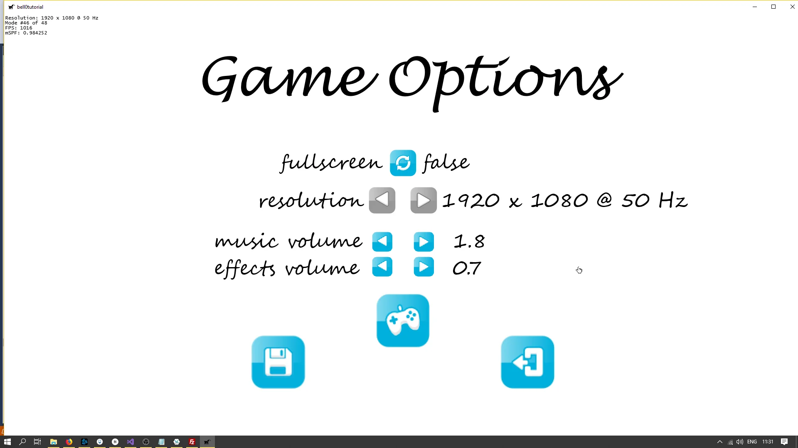

> And those who were seen dancing were thought to be insane by those who could not hear the music.
>
> – Friedrich Nietzsche

A submix voice is used primarily for performance improvements and effects processing. SourceVoices can be bundles together into the same submix voice, to, for example, easily change the volume of all music files.

To create a submix voice, we can use the *[CreateSubmixVoice](https://docs.microsoft.com/en-us/windows/desktop/api/xaudio2/nf-xaudio2-ixaudio2-createsubmixvoice)* method:

```cpp
HRESULT CreateSubmixVoice(
  IXAudio2SubmixVoice                      **ppSubmixVoice,
  UINT32                                   InputChannels,
  UINT32                                   InputSampleRate,
  UINT32 Flags                             X2DEFAULT,
  UINT32 ProcessingStage                   X2DEFAULT,
  const XAUDIO2_VOICE_SENDS *pSendList     X2DEFAULT,
  const XAUDIO2_EFFECT_CHAIN *pEffectChain X2DEFAULT
```

The first parameter returns the address of the newly created submix voice. The second parameter specifies the number of input channels, and the third parameter defines the input sample rate. The other parameters have no use for us at the moment.

```cpp
// submix voices
IXAudio2SubmixVoice* soundsSubmix;	// collection of all sound effects
IXAudio2SubmixVoice* musicSubmix;	// collection of all music files
        
// create the submix voices
engine->dev->CreateSubmixVoice(&soundsSubmix, 1, 44100, 0, 0, 0, 0);
engine->dev->CreateSubmixVoice(&musicSubmix, 1, 44100, 0, 0, 0, 0);
```

After having created the submix voices, we have to create an *[XAUDIO2_SEND_DESCRIPTOR structure](https://docs.microsoft.com/en-us/windows/desktop/api/xaudio2/ns-xaudio2-xaudio2_send_descriptor)*, which defines a destination voice that is the target of a send from another voice and specifies whether a filter should be used, as follows:

```cpp
XAUDIO2_SEND_DESCRIPTOR sendSounds;
sendSounds = { 0, soundsSubmix };

XAUDIO2_SEND_DESCRIPTOR sendMusic;
sendMusic = { 0, musicSubmix };
```

The first flag, set to 0, means that we do not want to use a filter. The second member of the structure simply specifies the submix voice the voices should be sent to.

With the XAUDIO2_SEND_DESCRIPTOR structure defined, we have to create an *[XAUDIO2_VOICE_SENDS](https://docs.microsoft.com/en-us/windows/desktop/api/xaudio2/ns-xaudio2-xaudio2_voice_sends)* structure, which defines a set of voices to receive data from a single output voice, as follows:

```cpp
XAUDIO2_VOICE_SENDS soundsSendList;
XAUDIO2_VOICE_SENDS musicSendList;

soundsSendList = { 1, &sendSounds };
musicSendList = { 1, &sendMusic };
```

The first member being set to 1 means that we want to voices to be sent to one submix voice. The second parameter specifies the send descriptor to use.

Combining those steps together, we get something as follows:

```cpp
AudioComponent::AudioComponent()
{
	try { engine = new AudioEngine(); }
	catch (std::runtime_error& e) { throw e; }

	// create the submix voices
	engine->dev->CreateSubmixVoice(&soundsSubmix, 1, 44100, 0, 0, 0, 0);
	engine->dev->CreateSubmixVoice(&musicSubmix, 1, 44100, 0, 0, 0, 0);

	sendSounds = { 0, soundsSubmix };
	soundsSendList = { 1, &sendSounds };
	sendMusic = { 0, musicSubmix };
	musicSendList = { 1, &sendMusic };
}
```

Now when loading a file from the hard drive, we simply chose which submix voice to send it to based on whether we are loading a sound effect or a music file.

```cpp
enum AudioTypes { Music, Sound };

util::Expected<void> AudioComponent::loadFile(const std::wstring fileName, SoundEvent& soundEvent, const AudioTypes& soundType)
{
	// handle errors
	util::Expected<void> result;
	HRESULT hr = S_OK;

	// load file into wave
	result = engine->loadFile(fileName, soundEvent.audioData, &soundEvent.waveFormat, soundEvent.waveLength);
	if (!result.isValid())
		return result;

	// create source voice
	if(soundType == AudioTypes::Sound)
		hr = engine->dev->CreateSourceVoice(&soundEvent.sourceVoice, soundEvent.waveFormat, 0, XAUDIO2_DEFAULT_FREQ_RATIO, nullptr, &soundsSendList, NULL);
	else if(soundType == AudioTypes::Music)
		hr = engine->dev->CreateSourceVoice(&soundEvent.sourceVoice, soundEvent.waveFormat, 0, XAUDIO2_DEFAULT_FREQ_RATIO, nullptr, &musicSendList, NULL);
	if (FAILED(hr))
		return std::runtime_error("Critical error: Unable to create source voice!");

	ZeroMemory(&soundEvent.audioBuffer, sizeof(XAUDIO2_BUFFER));
	soundEvent.audioBuffer.AudioBytes = (UINT32)soundEvent.audioData.size();
	soundEvent.audioBuffer.pAudioData = (BYTE* const)&soundEvent.audioData[0];
	soundEvent.audioBuffer.pContext = nullptr;

	// return success
	return { };
}
```

Changing the volume of all music files is now as easy as this:

```cpp
musicSubmix->SetVolume(0.0f);
```

As an example, we will allow the player to change the volume of the music and sound effects in the options menu:

```cpp
// volume
float soundEffectsVolume = 1.0f;
float musicVolume = 1.0f;

AudioComponent::AudioComponent(const core::DirectXApp& dxApp) : dxApp(dxApp)
{
	try { engine = new AudioEngine(); }
	catch (std::runtime_error& e) { throw e; }

	// create the submix voices
	HRESULT hr = S_OK;
		
	hr = engine->dev->CreateSubmixVoice(&soundsSubmix, 1, 44100, 0, 0, 0, 0);
	if (FAILED(hr))
		throw std::runtime_error("Critical error: Unable to create voice submix!");
	hr = engine->dev->CreateSubmixVoice(&musicSubmix, 1, 44100, 0, 0, 0, 0);
	if (FAILED(hr))
		throw std::runtime_error("Critical error: Unable to create voice submix!");
		
	sendSounds = { 0, soundsSubmix };
	soundsSendList = { 1, &sendSounds };
	sendMusic = { 0, musicSubmix };
	musicSendList = { 1, &sendMusic };

	// set volume level
	loadVolume();
	soundsSubmix->SetVolume(soundEffectsVolume);
	musicSubmix->SetVolume(musicVolume);
}

void AudioComponent::setVolume(const AudioTypes& audioType, const float volume)
{
	if (audioType == AudioTypes::Music)
	{
		musicVolume = volume;
		musicSubmix->SetVolume(volume);
	}
	else if (audioType == AudioTypes::Sound)
	{
		soundEffectsVolume = volume;
		soundsSubmix->SetVolume(volume);
	}
}

const float AudioComponent::getVolume(const AudioTypes& audioType) const
{
	if (audioType == AudioTypes::Music)
		return musicVolume;
	else if (audioType == AudioTypes::Sound)
		return soundEffectsVolume;
	return 1.0f;
}

// load volume from preference file
util::Expected<void> AudioComponent::loadVolume()
{
	if (dxApp.getFileSystemComponent().hasValidConfigurationFile())
	{
		// configuration file exists, try to read from it
		std::wstring pathToPrefFile = dxApp.getFileSystemComponent().getPathToConfigurationFiles() + L"\\bell0prefs.lua";

		try
		{
			sol::state lua;
			lua.script_file(util::StringConverter::ws2s(pathToPrefFile));

			// read from the configuration file, default to 1920 x 1080
			musicVolume = lua["config"]["musicVolume"].get_or(1.0f);
			soundEffectsVolume = lua["config"]["soundEffectsVolume"].get_or(1.0f);
#ifndef NDEBUG
			std::stringstream res;
			res << "The client resolution was read from the Lua configuration file: " << clientWidth << " x " << clientHeight << ".";
			util::ServiceLocator::getFileLogger()->print<util::SeverityType::info>(res.str());
#endif
		}
		catch (std::exception)
		{
			util::ServiceLocator::getFileLogger()->print<util::SeverityType::warning>("Unable to read configuration file. Starting with default volume: 1.0f");
		}
	}

	// return success
	return { };
}
```

---

This was short and easy. You can download the source code from [here](https://filedn.eu/ltgnTcOBnsYpGSo6BiuFrPL/Game%20Programming/Flatland/Music/submixVoices.7z).



In the next tutorial, we will learn how to stream music from the hard drive, i.e. how to play audio without having to completely load the entire file into memory first.

---

## References
### Literature
(in alphabetic order)
 * Game Programming Algorithms, by Sanjay Madhav
 * Game Programming Patterns, by Robert Nystrom
 * Microsoft Developer Network ([MSDN](https://msdn.microsoft.com/en-us/library/windows/desktop/ee663274(v=vs.85)))
 * Tricks of the Windows Game Programming Gurus, by André LaMothe
 * Wikipedia
### Audio
* [button](https://freesound.org/people/fins/sounds/146718/) by [fins](https://freesound.org/people/fins/)
* [Big Dog Barking](https://freesound.org/people/mich3d/sounds/24965/) by [mich3d](https://freesound.org/people/mich3d/)
* [Button Click](https://freesound.org/people/fins/sounds/146718/) by [fins](https://freesound.org/people/fins/)
* [Cat Meow](https://freesound.org/people/NoiseCollector/sounds/4914/) by [Noise Collector](https://freesound.org/people/NoiseCollector/)
* [Nodens (Field Song)](https://freesound.org/people/axtoncrolley/sounds/172707/) by [axtoncrolley](https://freesound.org/people/axtoncrolley/)
### Art 
 * [Cat and Dog](https://opengameart.org/content/cat-dog-free-sprites) by [pzUH](https://opengameart.org/users/pzuh)
 * [GUI Buttons](https://opengameart.org/content/gui-buttons-vol1) by [looneybits](https://opengameart.org/users/looneybits) 
 * [Menu Buttons](https://opengameart.org/content/buttons-with-hover) by [Soundemperor](https://opengameart.org/users/soundemperor).
 * [Music](https://www.deviantart.com/ironflower86/art/Music-22830510) by [ironflower86](https://www.deviantart.com/ironflower86)
 * [TexturePacker](https://www.codeandweb.com/texturepacker)
 * Wikipedia