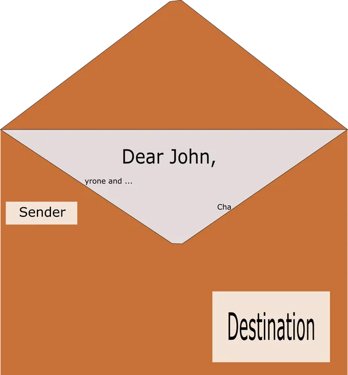

> Decouple when a message or event is sent from when it is processed.
>
> – R. Nystrom

A game is usually made of many different entities that interact with each other, as well as different components that must be able to communicate with each other.

In this tutorial, we will learn how to use an event queue to unify all interactions between game characters, such as the player and NPCs, and application components, such as user input and audio. An event queue stores messages in a first-in, first-out order (fifo). The technical term for adding a message to the queue is *enqueue*. Messages are *dequeued* from the queue and dispatched to whatever entity was the designated receiver, so a message queue, or event queue, decouples the sender and receiver of a message both locally and in time. But enough for the theory, let us see some code.

## A Thread-Safe Queue
To implement an event queue, we will need a queue (sic!). Later on, we will learn about using more than one kernel, thus our queue should be thread-safe, apart from that, the implementation is straightforward:

```cpp
#pragma once
// INCLUDES /////////////////////////////////////////////////////////////////////////////

// c++ includes
#include <queue>
#include <mutex>
#include <condition_variable>

// CLASSES //////////////////////////////////////////////////////////////////////////////
namespace util
{
	template<class T>
	class ThreadSafeQueue
	{
	public:
		// constructor and destructor
		ThreadSafeQueue() : queue(), mutex(), condition() {};
		~ThreadSafeQueue() {};

		// add a message to the queue
		void enqueue(T& t)
		{
			// lock the mutex
			std::lock_guard<std::mutex> lock(mutex);

			// push the element to the queue
			queue.push(t);

			// unlock the thread
			condition.notify_one();
		}

		// get the front message from the queue
		const T dequeue()
		{
            // lock the mutex
			std::unique_lock<std::mutex> lock(mutex);

			if (!queue.empty())
			{
                // remove the front message
				T message = queue.front();
				queue.pop();
				return message;
			}
			else
                // return an empty message
				return T();
		}

		// do nothing if the queue is empty
		const bool isEmpty() const
		{
			return queue.empty();
		}
		
	private:
		std::queue<T> queue;				// the actual queue
		mutable std::mutex mutex;			// the mutex (basically telling which thread is allowed to access the queue)
		std::condition_variable condition;	// block the calling thread until notified to resume
	};
}
```

## Postal System
The basic idea behind the event queue is to imitate the centuries old system of sending messages via letters. Just like in *reality*, the content of each message can vary, but the way messages are send and received is always the same: the sender puts the message in a box (our event queue) and the postal service (our main application class) delivers it to the desired destination, specified by the address on the envelope.

The idea of a postal service can easily be applied to a game or an application. If an entity or a game component wants to interact with another, it can simply send a message. The receiver can then act upon that message accordingly.

### Envelope
The first thing to do is to design the envelope:

.

As you can see, the envelope always specifies the sender and the destination of a message, such that both the receiver and the sender of a message always know where a message is going to and where it came from.

Inside the envelope we find the actual message. But there is one thing missing from this picture: to properly handle messages, we also want to know what type of message was sent or received. In the above case, maybe, if the receiver had known that the message contained rather unpleasant news, potentially he would have had a drink first before reading the actual message.

To summarize, an envelope contains **the address of the sender and receiver** of the message, **the type** of the message inside the envelope and **the actual message**. 

For a more game related example, imagine a dog guarding its garden from noisy cats. It might be a bit unrealistic, but the dog sends a message to the cat that it is on pursuit. The message type would be *pursue* and the data could be empty, or contain the velocity of the dog. Anyway, upon reading the message, and verifying that it was indeed sent by the dog, the cat flees away from the dog! In the unlucky case that the dog catches the cat, the dog sends a message with the type *damage* (ouch) to the cat, and the data might contain the amount of damage dealt, say, two, for example. The cat, upon reading the dreadful news, would lose two of its seven lives.

So far, so good, let us translate the theory into a practical example. Behold the *Depesche* (German for *Dispatch*, from the French word for *to hurry*) class:

```cpp
enum DepescheTypes { ActiveKeyMap, Gamepad, Damage };

class DepescheSender;
class DepescheDestination;

struct Depesche
{
	DepescheSender* const sender;				// the sender of the message
	DepescheDestination* const destination;		// the destined receiver of the message
	const DepescheTypes type;					// the type of the message
	void* const message;						// the actual message

	Depesche();
	Depesche(DepescheSender&, DepescheDestination&, const DepescheTypes, void* const);
	~Depesche();
};

class DepescheSender
{ };

class DepescheDestination
{
private:

public:
	virtual util::Expected<void> onMessage(const Depesche&) = 0;	// handle events
};
```

As you can see, we have an enum specifying the different message types, and the structure of the *Depesche* mirrors the real-life example we described above. Notice that the sender of a message doesn't have to do anything special, besides putting its message in an envelope and bringing it to the post office. The receiver, however, needs to act upon the messages he receives by invoking the *onMessage* method. We will see some examples soon.

### Post Office
The core DirectXApp class will take the function of the post office. It will receive and store messages in the thread-safe queue and dispatch messages to the desired receivers:

```cpp
class DirectXApp : public util::Observer
{
private:
	// the main message queue
	util::ThreadSafeQueue<Depesche> eventQueue;	// thread-safe message queue
		
    // dispatch the messages in the event queue
	util::Expected<void> dispatchMessages();

protected:

public:
	// event queue
	void addMessage(Depesche&);		// add a message to the queue
};

util::Expected<void> DirectXApp::dispatchMessages()
{
	// error handling
	util::Expected<void> result;

	while (!eventQueue.isEmpty())
	{
		// get the front message
		Depesche depesche = eventQueue.dequeue();

		// check whether the receiver actually exists
		DepescheDestination* destination = depesche.destination;
		if (destination)
			// the destination is valid
			result = destination->onMessage(depesche);

		if (!result.isValid())
			return result;
	}

	return { };
}

void DirectXApp::addMessage(Depesche& depesche)
{
	eventQueue.enqueue(depesche);
}
```

The *addMessage* method simply takes a *Depesche* and puts it on the queue. The *dispatchMessages* method simply pulls all the messages from the queue and dispatches them to the correct destination.

#### Reading Messages
To read the messages it got, a class inherits from the *DepescheDestination* class and implements the *onMessage* method:

```cpp
class DepescheDestination
{
private:

public:
	virtual util::Expected<void> onMessage(const Depesche&) = 0;	// handle events
};
}
```

The message queue will invoke the *onMessage* method of each entity or game component that is destined to receive a message.

## User Input
As a first example of the new event-queue system, we will change the *InputHandler* class to send a message each time a key map becomes active or whenever the state of the gamepad changes:

```cpp
// the main input handler class
// sends notifications to the various game states on user input
class InputHandler : public core::DepescheSender, public core::DepescheDestination
{
private:
    ...
}

// if there is an active key map
if (!activeKeyMap.empty())
{
	// put a message on the event queue for each state on the state queue
	std::deque<core::GameState*> states;
	dxApp.getActiveStates(states);
	for (std::deque<core::GameState*>::reverse_iterator it = states.rbegin(); it != states.rend(); it++)
	{
        if (!(*it)->isPaused)
        {
            core::DepescheDestination* destination = *it;
            core::Depesche depesche(*this, *destination, core::DepescheTypes::UserInterface, false);
            dxApp.addMessage(depesche);
        }
    }
}
```

Adding a message to the queue is rather straightforward. In this example, we simply set the *InputHandler* class as the sender and a game state as the destination of the message. The type of the message is *UserInput*, meaning that a defined key map was activated. The actual *message* is set to false, to indicate that the *InputHandler* was not listening for a redefined key mapping (ignore this if you have not read the previous tutorials).

Another message is sent when the state of the gamepad changes, namely a *Gamepad* message:

```cpp
if (gamepad->previousState.dwPacketNumber != gamepad->currentState.dwPacketNumber)
{
	// put a message on the event queue for each state on the state queue
	std::deque<core::GameState*> states;
	dxApp.getActiveStates(states);
	for (std::deque<core::GameState*>::reverse_iterator it = states.rbegin(); it != states.rend(); it++)
	{
		if (!(*it)->isPaused)
		{
			core::DepescheDestination* destination = *it;
			core::Depesche depesche(*this, *destination, core::DepescheTypes::Gamepad, false);
			dxApp.addMessage(depesche);
		}
	}
}
```

The *InputHandler* class can also receive messages, for example, when a game component decides that it is time to vibrate the gamepad:

```cpp
util::Expected<void> InputHandler::onMessage(const core::Depesche& depesche)
{
	if (depesche.type == core::DepescheTypes::Gamepad)
	{
		float vibrationSpeed = *(float *)depesche.message;
		gamepad->vibrate(vibrationSpeed, vibrationSpeed);
	}

	return { };
}
```

As a last example for user input, let us see how the *PlayState* handles messages:

```cpp
class GameState : public core::DepescheDestination, public core::DepescheSender
{
    ...				
	
    // handle events
	virtual util::Expected<void> onMessage(const Depesche&) = 0;
};

util::Expected<void> PlayState::onMessage(const core::Depesche& depesche)
{
	if (depesche.type == core::DepescheTypes::ActiveKeyMap)
	{
		input::InputHandler* ih = (input::InputHandler*)depesche.sender;

		if (!isPaused)
			if (!ih->isListening())
				return handleInput(ih->activeKeyMap);
	}
	
    if (depesche.type == core::DepescheTypes::Gamepad)
	{
		input::InputHandler* ih = (input::InputHandler*)depesche.sender;

		dog->moveX = ih->getLX();
		dog->moveY = ih->getLY();
	}

	// return success
	return { };
}
```

If a gamepad message is received, the game simply stores the position of the left thumb stick to later move the game entity in the desired direction. If a key map was activated, we let the user interface, in this case, the HUD, handle it.

## Of Cats and Dogs
Another, probably even more important, usage of the event queue is to allow game entities to interact with each other. To showcase that situation, I created a little demo of a dog (Cosmo) chasing cats away from his garden.

Here is how a game entity is defined:

```cpp
enum WalkDirection {Left, Right};

class Entity
{
protected:
	std::vector<graphics::AnimatedSprite*> sprites;		// the sprites of the entity
	float x, y;											// current position of the entity
	float health;										// the health of the entity
	unsigned int walkDirection = 0;						// the direction the entity is walking in
	bool dead = false;									// true iff the entity is dead
	bool idle = true;									// true iff the entity is idle
	bool running = false;								// true iff the entity is running
	const float velocity;								// the velocity of the entity
	WalkDirection direction;							// the direction the entity is moving to

public:
    // constructors and destructor
	Entity(graphics::AnimatedSprite* const sprite, const float x, const float y, const float health, const float velocity);
	Entity(std::vector<graphics::AnimatedSprite*>& sprites, const float x, const float y, const float health, const float velocity);
	virtual ~Entity(); 

    // add an animation to the game entity
	void addAnimation(graphics::AnimatedSprite* const animation);
		
	// update the game entity
	virtual util::Expected<void> update(core::DirectXApp& dxApp, const double deltaTime) = 0;

	friend class PlayState;
};
```

Now the NPCs (the cats) will have their own class derived from the above entity class:

```cpp
class NPC : public Entity, public core::DepescheDestination, public core::DepescheSender
{
private:
	bool badHealth = false;			// true iff the cat has not many lives left
	bool vibrate = false;			// true iff the dog is close
	float vibrationSpeed = 0.0f;	// vibrate gamepad if cats are attacked by the dog

public:
// constructors and destructor
	NPC(graphics::AnimatedSprite* const sprite, const float x, const float y, const float health, const float velocity);
	NPC(std::vector<graphics::AnimatedSprite*>& sprites, const float x, const float y, const float health, const float velocity);

	// update the NPCs
	util::Expected<void> update(core::DirectXApp& dxApp, const double deltaTime) override;

	// interaction with other entities
	util::Expected<void> onMessage(const core::Depesche&) override;
};

```

As you can see, the cats can both send and receive message. We have already seen that the input handler handles messages about vibrating the gamepad, well, the cats actually send those messages whenever the dog is too close:

```cpp
// vibrate
if (vibrate)
{
	if (health >= 3)
	{
		vibrationSpeed = 0.5f;
		core::Depesche depesche(*this, dxApp.getInputComponent().getInputHandler(), core::DepescheTypes::Gamepad, &vibrationSpeed);
		dxApp.addMessage(depesche);
	}
	else if (health >= 2)
	{
		vibrationSpeed = 0.75f;
		core::Depesche depesche(*this, dxApp.getInputComponent().getInputHandler(), core::DepescheTypes::Gamepad, &vibrationSpeed);
		dxApp.addMessage(depesche);
	}
	else if (health > 0)
	{
		vibrationSpeed = 1.0f;
		core::Depesche depesche(*this, dxApp.getInputComponent().getInputHandler(), core::DepescheTypes::Gamepad, &vibrationSpeed);
		dxApp.addMessage(depesche);
	}
}
else
{
	vibrationSpeed = 0.0f;
	core::Depesche depesche(*this, dxApp.getInputComponent().getInputHandler(), core::DepescheTypes::Gamepad, &vibrationSpeed);
	dxApp.addMessage(depesche);
}
```

Depending on its health, the cat sends a message to the input handler, asking for the gamepad to be vibrated with different speeds.

The dog, or the player, has its own class as well:

```cpp
class Player : public Entity, public core::DepescheSender
{
public:
	// variables to move the game entity
	float moveX, moveY;
	bool chaseCats = true;

	// constructors
	Player(graphics::AnimatedSprite* const sprite, const float x, const float y, const float health, const float velocity);
	Player(std::vector<graphics::AnimatedSprite*>& sprites, const float x, const float y, const float health, const float velocity);

	// update the game entity
	util::Expected<void> update(core::DirectXApp& dxApp, const double deltaTime) override;

	// getters for the position of the game entity
	const float getX() const { return x; };
	const float getY() const { return y; };

	// stop moving after all cats are defeated
	void stop();
};
```

The dog does not receive messages: its position is updated when the *PlayState* receives a *gamepad* message. It can send messages, however. How does the cat know about the dog's position? Well, the dog is not a perfect poacher and simply sends a message to each cat, barking its position:

```cpp
util::Expected<void> PlayState::update(const double deltaTime)
{
    ...
	// update the player entity
	dog->update(dxApp, deltaTime);
	
    ...	
	
    // update the NPCs
	for (auto cat : cats)
	{
		// notify the NPCs about the dogs position
		core::Depesche depesche(*dog, *cat, core::DepescheTypes::Damage, nullptr);
		dxApp.addMessage(depesche);
			
        cat->update(dxApp, deltaTime);
		...
    }

	// send message to the HUD about the state of the game
	...
}
```

Once the dog has updated its position, it sends a message to each cat, warning the cat to flee or to take damage! The cats simply lose one of their seven lives each time the dog gets too close.

Here is a demo to showcase the usage of the event queue for user input and interactions between game entities, as described above:

<video width="800" height="450" controls>
  <source src="https://filedn.eu/ltgnTcOBnsYpGSo6BiuFrPL/Videos/bell0bytes/Game%20Programming%20Tutorials/DirectX%2011/Event-Queue%20Demo.mp4" type="video/mp4">
Your browser does not support HTML5 videos.
</video> 

---

You can download the source code from [here](https://filedn.eu/ltgnTcOBnsYpGSo6BiuFrPL/Game%20Programming/Flatland/Programming%20Patterns/eventQueue.7z).

---

During the upcoming tutorials we will learn how to add music to our application, using XAudio2, FMOD or WWise.

---

# References
## Literature
(in alphabetic order)
 * Game Programming Algorithms, by Sanjay Madhav
 * Game Programming Patterns, by Robert Nystrom
 * Microsoft Developer Network ([MSDN](https://msdn.microsoft.com/en-us/library/windows/desktop/ee663274(v=vs.85)))
 * Tricks of the Windows Game Programming Gurus, by André LaMothe
 * Wikipedia
## Art
 * [Cat and Dog](https://opengameart.org/content/cat-dog-free-sprites) by [pzUH](https://opengameart.org/users/pzuh)
 * [GUI Buttons](https://opengameart.org/content/gui-buttons-vol1) by [looneybits](https://opengameart.org/users/looneybits) 
 * [Menu Buttons](https://opengameart.org/content/buttons-with-hover) by [Soundemperor](https://opengameart.org/users/soundemperor).
 * [TexturePacker](https://www.codeandweb.com/texturepacker)