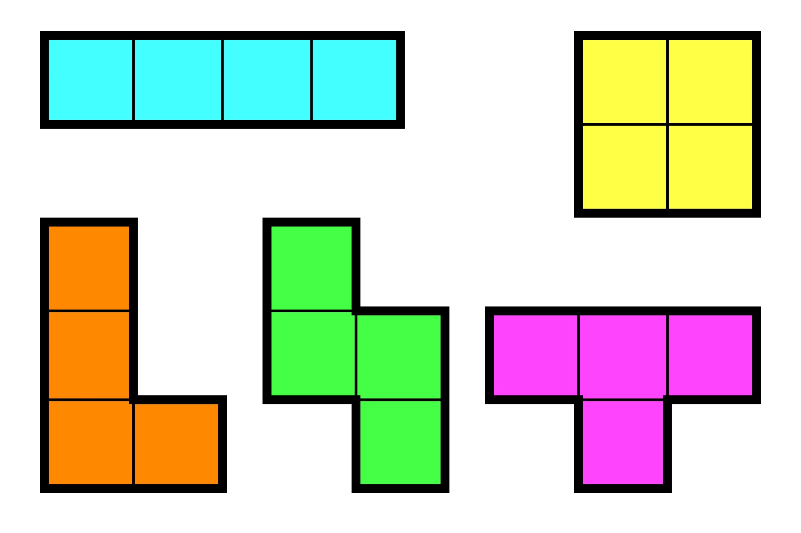
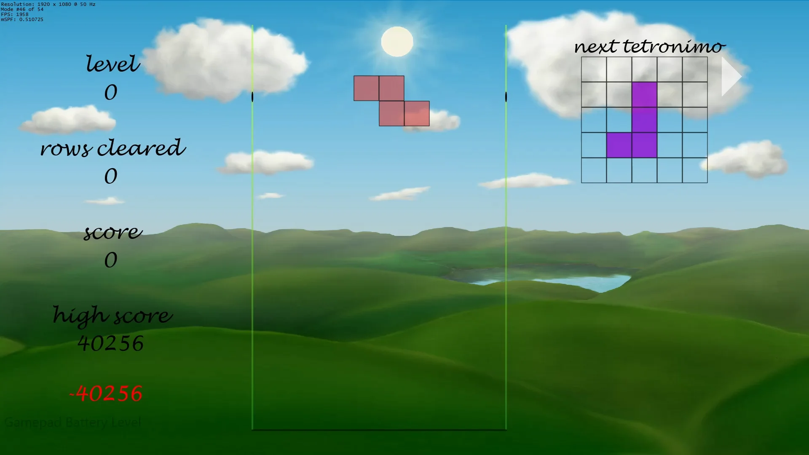
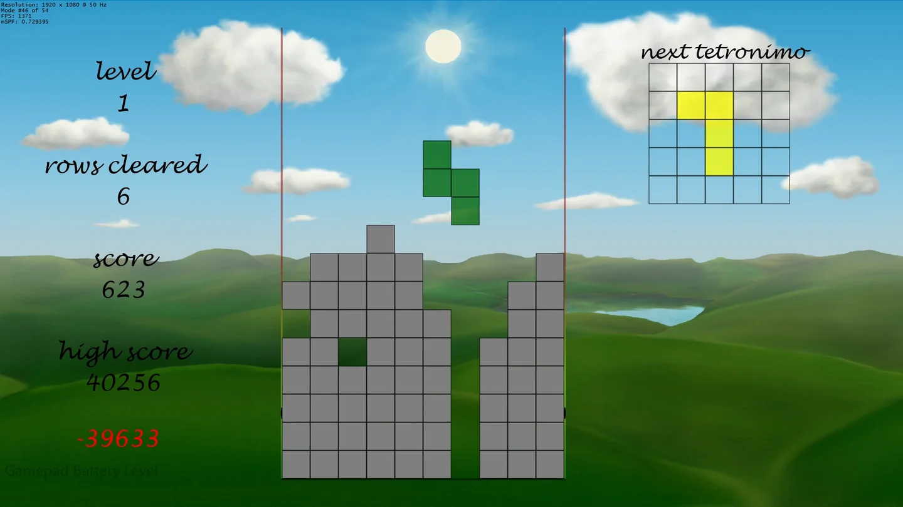
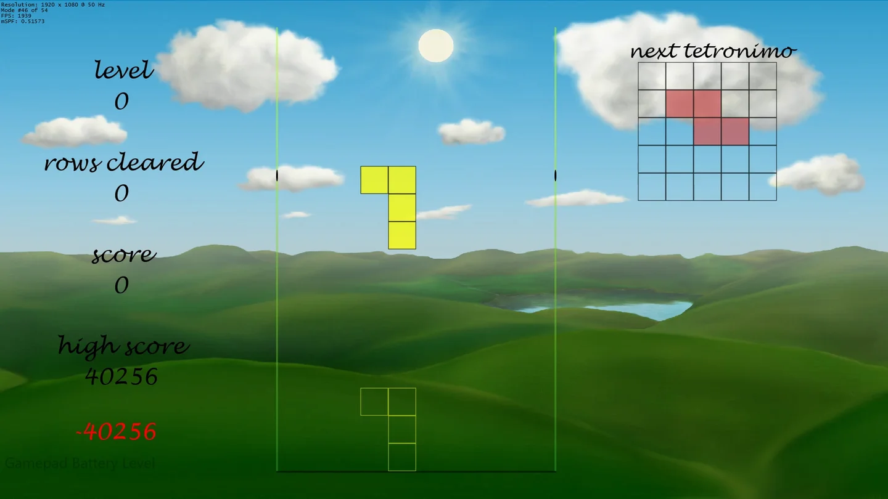

Stécker vum Himmel (*Items from the Sky*) is a Tetris clone. Tetris is the perfect game to begin our journey on the path
to becoming a game developer, as Tetris contains all the elements found in every game (game loop, input processing,
updating of the game world, …), minus all the fancy graphic stuff — and Tetris is straightforward to implement nowadays.

This is just a quick and dirty tutorial on the basics of Tetris based
on [this great tutorial by Javier López](http://javilop.com/gamedev/tetris-tutorial-in-c-platform-independent-focused-in-game-logic-for-beginners/).

## Tetronimo

There are five basic tetronimos, two of them have mirror shapes, thus there are seven different types of pieces in a
standard Tetris game: the square, the I-shape, the L-shape, the mirrored L-shape, the N-shape, the mirrored N-shape and
the T-shape. The following picture shows the five basic Tetronimos (without the mirrored shapes):



To define those, simple $5 \times 5$ matrices are sufficient. Here is the square shape in matrix form, for example:

$$
\begin{pmatrix} 0&0&0&0&0 \\ 0&0&0&0&0 \\ 0&0&2&1&0 \\ 0&0&1&1&0 \\ 0&0&0&0&0 \end{pmatrix},
$$
where an entry of $0$ means *no block*, $1$ means *a normal block* and $2$ stands for the *pivot centre* or the *centre
of rotation* of the Tetronimo. To store this information in C++, we simply use a two-dimensional array:

```cpp
// array of all possible tetronimos
// there are seven different tetronimos
// and four different rotations
// each tetronimo is stored in a 5x5 matrix
static inline const char allTetronimos[7][4][5][5] =
{
	// O
	{
		{
			{ 0, 0, 0, 0, 0 },
            { 0, 0, 0, 0, 0 },
            { 0, 0, 2, 1, 0 },
            { 0, 0, 1, 1, 0 },
            { 0, 0, 0, 0, 0 }
		},
        ...
    }
    ...
}
```

To be able to rotate the pieces, we could use some linear algebra and use rotation matrices, but in this case, that
would clearly be overkill. It is way easier to simply store each possible rotation of each piece in different matrices —
that is, each piece will have four matrices associated to it. This is also the reason we are using $5 \times 5$
matrices.

Here is the C++-code for the L-shape:

```cpp
// array of all possible tetronimos
// there are seven different tetronimos
// and four different rotations
// each tetronimo is stored in a 5x5 matrix
static inline const char allTetronimos[7][4][5][5] =
{
	...
        
    // L
    {
		{
			{ 0, 0, 0, 0, 0 },
            { 0, 0, 1, 0, 0 },
            { 0, 0, 2, 0, 0 },
            { 0, 0, 1, 1, 0 },
            { 0, 0, 0, 0, 0 }
		},

		{
			{ 0, 0, 0, 0, 0 },
            { 0, 0, 0, 0, 0 },
            { 0, 1, 2, 1, 0 },
            { 0, 1, 0, 0, 0 },
            { 0, 0, 0, 0, 0 }
		},

		{
            { 0, 0, 0, 0, 0 },
            { 0, 1, 1, 0, 0 },
            { 0, 0, 2, 0, 0 },
            { 0, 0, 1, 0, 0 },
            { 0, 0, 0, 0, 0 }
		},

		{
			{ 0, 0, 0, 0, 0 },
            { 0, 0, 0, 1, 0 },
            { 0, 1, 2, 1, 0 },
            { 0, 0, 0, 0, 0 },
            { 0, 0, 0, 0, 0 }
		}
	},
            
    ...
}
```

That was rather easy, wasn't it? There is another important question to consider, however: The correct position of each
piece at the top of the screen, once it enters the game. The piece should start at the centre of the screen. As each
piece is different, each piece needs different offset variables, which we will also store in an array:

```cpp
// array of correct starting position for all tetronimos
// as above, there are seven different tetronimos
// and four different rotations
// the offsets are stored in a 2x1 matrix for the x-offset and y-offset
static inline const int tetronimoStartingPosition[7][4][2] =
{
	{
		// O
		{2, -2}, {2, -2}, {2, -2}, {2, -2}
	},
	{
		// I
		{2, -2}, {2, -1}, {3, -2}, {2,0}
	},
	{
		// L
		{2, -1}, {3,-2}, {3,-1}, {3,-1}
	},
	{
		// J
		{3, -1}, {3,-1}, {2,-1}, {3,-2}
	},
	{
		// Z
		{3,-1},{2,-1},{3,-2},{3,-1}
	},
	{
		// S
		{3,-1},{2,-1},{3,-2},{3,-1}
	},
	{
		// T
		{3,-2},{3,-1},{3,-1},{2,-1}
	}
};
```

I suggest you take a piece of paper and draw each Tetronimo to really understand what just happened. ^^

---

To easily use the newly defined Tetronimos in our game, we combine all of the above information into the Tetronimo
class.

## The Tetronimo Class

```cpp
namespace game
{

	enum TetronimoType { O, I, L, J, Z, S, T, End };

	class Tetronimo
	{
	private:
		// array of all possible tetronimos
		// there are seven different tetronimos
		// and four different rotations
		// each tetronimo is stored in a 5x5 matrix
		static inline const char allTetronimos[7][4][5][5] = ...

		// array of correct starting position for all tetronimos
		// as above, there are seven different tetronimos
		// and four different rotations
		// the offsets are stored in a 2x1 matrix for the x-offset and y-offset
		static inline const int tetronimoStartingPosition[7][4][2] = ...
	
    public:
		// get tetronimo information
		static const unsigned int getBlockType(const TetronimoType piece, const unsigned int rotation, const unsigned int x, const unsigned int y); // returns the block type (0: no black; 1: normal block, 2: pivot block)
		static const int getStartingX(const TetronimoType piece, const unsigned int rotation);
		static const int getStartingY(const TetronimoType piece, const unsigned int rotation);
	};

	struct TetronimoPiece
	{	
	public:
		TetronimoType type;			// the type of the tetronimo
		unsigned int rotation;		// the rotation of the tetronimo
		int x;						// position
		int y;

		double positionTime = 0.0f;	// the time the tetronimo was in the current position

		TetronimoPiece(const TetronimoType type, const unsigned int rotation, const bool currentPiece);
		TetronimoPiece() {};
		~TetronimoPiece() {};
	};
}
```

The *TetronimoPiece* structure simply holds the basic information about each Tetronimo, i.e. its shape, its current
rotation, its current position as well as for long it has been in its current position. The latter information is used
to make the Tetronimos fall down over time.

The three public methods in the *Tetronimo* class are the ones we actually will need later in the game; basically they
are just *getters*.

### getBlockType

Taking the type of a Tetronimo, its rotation and its position as input, this method simply returns the block type of the
given tetronimo at the current position. The return value is the 0, if there is no block, 1 if it is a normal block and
2 if the requested block is the actual pivot center of the Tetronimo:

```cpp
const unsigned int Tetronimo::getBlockType(const TetronimoType type, const unsigned int rotation, const unsigned int x, const unsigned int y)
{
	return allTetronimos[type][rotation][x][y];
}
```

### getStartingX

Based on the type of the Tetronimo and its rotation, this method returns the horizontal offset that must be applied for
the Tetronimo to enter the game in the middle of the screen:

```cpp
const int Tetronimo::getStartingX(const TetronimoType type, const unsigned int rotation)
{
	return tetronimoStartingPosition[type][rotation][0];
}
```

### getStartingY

Based on the type of the Tetronimo and its rotation, this method returns the vertical offset that must be applied to the
Tetrimo to make sure that only one row of the Tetronimo is visible once it enters the game:

```cpp
const int Tetronimo::getStartingY(const TetronimoType type, const unsigned int rotation)
{
	return tetronimoStartingPosition[type][rotation][1];
}
```

As you can see, creating the Tetronimos really wasn't that difficult. Now we need to create a playing field for them.



## The Game Board

To create the game board we will need, as you can surely guess, yet another array. The array will be filled with 0s or
1s, depending on whether the particular spot on the game board is filled with a Tetronimo or not:

```cpp
// constant definitions to specify the tetris bucket
static const unsigned int N = 10;		// the number of buckets per row
static const unsigned int M = 16;		// the number of buckets per column

// enum to define whether a position is free or already filled
enum PositionStatus { PositionFree, PositionFilled };	
PositionStatus board[N][M];				// the array to define the game board
```

### Filling the Board

Storing the Tetronimos on the game board (once they can no longer move) is very straightforward, for each block of the
Tetronimo, the array of the game board is set to "PositionFilled":

```cpp
void GameBoard::storeTetronimo(const TetronimoPiece& tetronimo)
{
	// store each block of the tetronimo into the tetris bucket
	for (int i1 = tetronimo.x, i2 = 0; i1 < tetronimo.x + (int)blocksPerTetronimo; i1++, i2++)
		for (int j1 = tetronimo.y, j2 = 0; j1 < tetronimo.y + (int)blocksPerTetronimo; j1++, j2++)
			if (Tetronimo::getBlockType(tetronimo.type, tetronimo.rotation, j2, i2) != 0)
			{
				board[i1][j1] = PositionStatus::PositionFilled;
				if ((15-j1) > highestRowWithTetronimo)
					highestRowWithTetronimo = (15-j1);
			}
}
```

Obviously, once a Tetronimo is "stored" in the upper row, the game is over:

```cpp
const bool GameBoard::isGameOver() const
{
	// if there are any blocks in the top row, the game is over
	for (unsigned int i = 0; i < N; i++)
		if (board[i][0] == PositionStatus::PositionFilled)
			return true;

	return false;
}
```

### Clearing Lines

In order for the player to survive as long as possible, they have to *clear lines*. To delete a single line, or row, we
simply shift all the blocks above that line down by one:

```cpp
void GameBoard::deleteRow(const unsigned int y)
{
    ...
	
    // move all rows down by one
	for (unsigned int j = y; j > 0; j--)
		for (unsigned int i = 0; i < N; i++)
			board[i][j] = board[i][j - 1];
}
```

Good players can clear multiple rows at a time (up to four rows). We thus have to check for possibly completed lines,
and delete them, at each update. To check whether a line is complete, we simply loop through its array:

```cpp
void GameBoard::deleteAllPossibleRows()
{
	unsigned int nRows = 0;
	...
    for (unsigned int j = 0; j < M; j++)
	{
		unsigned int i = 0;
		while (i < N)
		{
			if (board[i][j] != PositionStatus::PositionFilled)
				break;
			i++;
		}
		if (i == N)
		{
			tetrisRowsToClear[nRows] = j;
			deleteRow(j);
			nRows++;
		}
	}
	
	if (nRows > 0)
	{
		// send depesche to play sound
		if (nRows == 4)
		{
            // Tetris!
		}
		else if (nRows <= 3)
		{
               // noob!
        }

		// update score
		...

		// find highest filled row
        ...
	}
}
```

The function monitors how many lines are to be deleted and depending on whether the player managed to clear four lines
at the same time or not, different animations and sounds are tasked to be played. The method also updates the current
score and searched for the highest row that is occupied by a Tetronimo block (this information is used to animate the
game bucket).

### Initialization

Initializing the game board is effortless, we simply chose random Tetronimos to appear:

```cpp
void GameBoard::initializeGame()
{
	// initialize the random number generator
	srand((unsigned int)time(NULL));

	// initialize score structure
	...

	// initialize highscore table
	...

	// create the first pieces
	currentPiece = new TetronimoPiece(getRandomTetronimo(), getRandomRotation(), true);
	...
	nextPiece = new TetronimoPiece(getRandomTetronimo(), getRandomRotation(), false);
}
```

### Collision Detection

The player can translate and rotate a Tetronimo piece. Before actually moving or rotation a piece, it is important to
check for collisions with pieces already stores on the board, or, for example, when trying to rotate against the borders
of the bucket:

```cpp
const bool GameBoard::isPossibleMovement(const TetronimoType type, const unsigned int rotation, const int x, const int y)
{
	// check for possible collisions with other tetronimos
	for (int i1 = x, i2 = 0; i1 < x + (int)blocksPerTetronimo; i1++, i2++)
	{
		for (int j1 = y, j2 = 0; j1 < y  + (int)blocksPerTetronimo; j1++, j2++)
		{
			// check if the piece is still inside the bucket
			if (i1 < 0 || i1 >= N || j1 >= M)
			{
				if (Tetronimo::getBlockType(type, rotation, j2, i2) != 0)
					return false;
			}

			// check for collisions
			if (j1 >= 0)
				if ((Tetronimo::getBlockType(type, rotation, j2, i2) != 0) && (!isFree(i1, j1)))
				return false;
		}
	}

	return true;
}
```

Basically this method simply compares all the blocks of a Tetronimo pieces against the blocks already stores in the game
board to see whether a desired movement, rotation or translation, is possible or not.

Imagine the player wanting to rotate a Tetronimo. We would simply call this function with the desired rotation and if
the function return false, we discard the player's wish to rotate the piece!

---

Creating new Tetronimos once in a while is equally easy:

```cpp
void GameBoard::createNewTetronimo()
{
	// set the previously "next" piece as the current piece
	currentPiece->type = nextPiece->type;
	currentPiece->rotation = nextPiece->rotation;
	currentPiece->x = Tetronimo::getStartingX(currentPiece->type, currentPiece->rotation);
	currentPiece->y = Tetronimo::getStartingY(currentPiece->type, currentPiece->rotation);
	currentPiece->positionTime = 0.0f;
    ...

	// randomly create the new next piece
	nextPiece->type = getRandomTetronimo();
	nextPiece->rotation = getRandomRotation();
	nextPiece->positionTime = 0.0f;
}
```

### Movement

The following three straightforward methods allow the player to translate a Tetronimo piece:

```cpp
void GameBoard::moveLeft()
{
	if(isPossibleMovement(currentPiece->type, currentPiece->rotation, currentPiece->x - 1, currentPiece->y))
		currentPiece->x--;
}

void GameBoard::moveRight()
{
	if(isPossibleMovement(currentPiece->type, currentPiece->rotation, currentPiece->x + 1, currentPiece->y))
		currentPiece->x++;
}

void GameBoard::moveDown()
{
	if (isPossibleMovement(currentPiece->type, currentPiece->rotation, currentPiece->x, currentPiece->y + 1))
	{
		currentPiece->y++;
		...
	}
}
```

---

And here are the methods to rotate a Tetronimo:

```cpp
void GameBoard::rotateLeft()
{
	if (currentPiece->rotation > 0)
	{
		if (isPossibleMovement(currentPiece->type, currentPiece->rotation - 1, currentPiece->x, currentPiece->y))
			currentPiece->rotation--;
	}
	else
		if (isPossibleMovement(currentPiece->type, 3, currentPiece->x, currentPiece->y))
			currentPiece->rotation = 3;
}

void GameBoard::rotateRight()
{
	if (currentPiece->rotation < 3)
	{
		if (isPossibleMovement(currentPiece->type, currentPiece->rotation + 1, currentPiece->x, currentPiece->y))
			currentPiece->rotation++;
	}
	else
		if (isPossibleMovement(currentPiece->type, 0, currentPiece->x, currentPiece->y))
			currentPiece->rotation = 0;
}
```

---

Notice how the *isPossibleMovement* function is used to check whether the desired action is possible or not.

The player can also decide to let the piece fall down immediately:

```cpp
void GameBoard::fallDown(const bool preview)
{
	...
    
    // let the current piece fall down
	unsigned int dropped = 0;
	while (isPossibleMovement(currentPiece->type, currentPiece->rotation, currentPiece->x, currentPiece->y + 1))
	{
		dropped++;
		currentPiece->y++;
	}

    ...

	// store the tetronimo in the bucket
	storeTetronimo(*currentPiece);

	// delete all possible rows
	deleteAllPossibleRows();

	// check for game over
	if (isGameOver())
        ...

	// create new piece
	...
	createNewTetronimo();
}
```

### Game Logic

Most of the work needs to be done while updating the game:

```cpp
void GameBoard::update(const double deltaTime)
{
	// update animation status
    ...

	// show preview if so desired
    ...

	// check for new level
	if (currentScore->rows > 4 * ((2 * currentScore->level) + 1))
	{
		currentScore->level++;
		levelChanged = true;

		// send depesche to play sound
		...
	}

	if (levelChanged)
	{
		if(fallTime > 0.025f)
			fallTime -= 0.025f;
		levelChanged = false;
	}

	// check whether the current piece should move down
	currentPiece->positionTime += deltaTime;
	if (currentPiece->positionTime > fallTime )
	{
		if (isPossibleMovement(currentPiece->type, currentPiece->rotation, currentPiece->x, currentPiece->y+1))
		{
			// move down
			currentPiece->y += 1;
			currentPiece->positionTime = 0.0f;
		}
		else
		{
			// tetronimo can't move anymore

            // store the tetronimo in the bucket
			storeTetronimo(*currentPiece);

			// delete all possible rows
			deleteAllPossibleRows();

			// check for game over
			if (isGameOver())
			{
                // play sound
				...

				// add score to the highscore table
				...

				// save last level
                ...
			}

			// create new piece
			...
		}
	}

	// update points running around the bucket
	...

	// check whether to use white brush
	...

    // update debug text
	...
}
```

### Drawing

Now all that is left to do is to actually draw the game board. There are two methods, the first is responsible to draw a
Tetronimo piece by simply running through its defining matrix:

```cpp
void GameBoard::drawPiece(const TetronimoPiece& piece, const float opacity, const bool next, const bool preview) const
{
	// get colour
	...
        
	unsigned int x = 0;
	unsigned int y = 0;
	if (!next)
	{
		// get position in pixels
		x = getPixelX(piece.x);
		y = getPixelY(piece.y);
	}
	else
	{
		// set pixel position
		x = hudWidth + bucketWidth + 180;
		y = heightOffset + 75;
	}

    // loop through the matrix defining the tetronimo
	for (unsigned int i = 0; i < blocksPerTetronimo; i++)
		for (unsigned int j = 0; j < blocksPerTetronimo; j++)
			if (!next)
			{
				if (Tetronimo::getBlockType(piece.type, piece.rotation, j, i) != 0)
				{
                    dxApp.getGraphicsComponent().get2DComponent().fillRectangle((float)(x + i * blockSize), (float)(y + j * blockSize), (float)((x + i * blockSize) + blockSize - 1), (float)((y + j * blockSize) + blockSize - 1), opacity - 0.25f, brush.Get());
					dxApp.getGraphicsComponent().get2DComponent().drawRectangle((float)(x + i * blockSize), (float)(y + j * blockSize), (float)((x + i * blockSize) + blockSize - 1), (float)((y + j * blockSize) + blockSize - 1));
				}
			}
			else
			{
				if (Tetronimo::getBlockType(piece.type, piece.rotation, j, i) != 0)
					dxApp.getGraphicsComponent().get2DComponent().fillRectangle((float)(x + i * blockSize), (float)(y + j * blockSize), (float)((x + i * blockSize) + blockSize - 1), (float)((y + j * blockSize) + blockSize - 1), opacity - 0.25f, brush.Get());
                 dxApp.getGraphicsComponent().get2DComponent().drawRectangle((float)(x + i * blockSize), (float)(y + j * blockSize), (float)((x + i * blockSize) + blockSize - 1), (float)((y + j * blockSize) + blockSize - 1));
			}
}
```

The second method is used to draw the entire board:

```cpp
void GameBoard::drawBoard(float opacity) const
{
	// get tetris bucket brush depending on bucket fill percentage
    ...
	
    // render the tetris bucket
	...
	
    // render points running around the bucket
	...

	// draw the pieces that are already in the bucket
	opacity = 1.0f - 0.25f * clearAnimation;
	unsigned int widthOffset = hudWidth;
	for (unsigned int i = 0; i < N; i++)
		for (unsigned int j = 0; j < M; j++)
			if (!isFree(i, j))
			{
				dxApp.getGraphicsComponent().get2DComponent().fillRectangle((float)(widthOffset + i * blockSize), (float)(heightOffset + j * blockSize), (float)((widthOffset + i * blockSize) + blockSize - 1), (float)((heightOffset + j * blockSize) + blockSize - 1), opacity-0.25f, brushGray.Get());
				dxApp.getGraphicsComponent().get2DComponent().drawRectangle((float)(widthOffset + i * blockSize), (float)(heightOffset + j * blockSize), (float)((widthOffset + i * blockSize) + blockSize - 1), (float)((heightOffset + j * blockSize) + blockSize - 1));
			}
}
```

To bring those two methods together, a third draw methods calls them in the correct order:

```cpp
void GameBoard::draw() const
{
	...

    if (gameOver || gamePaused)
		opacity = 0.3f;

	// draw the bucket
	drawBoard(opacity);

	// draw the current piece
	drawPiece(*currentPiece, opacity);

	...

	// draw the next piece
	dxApp.getGraphicsComponent().getWriteComponent().printText(575, 10, nextPieceLayout.Get(), opacity, brush.Get());
	drawPiece(*nextPiece, opacity, true);
	
	...
}
```



## Gameplay Features

### Game Score and Levels

To make the game a bit more interesting, the player can accumulate points while playing the game. Each time he reaches a
certain number of points or clears a certain number of lines, the game level increases, that is, the game will become
faster, i.e. the Tetronimos will fall down more quickly. To reflect the increase in game difficulty, the player will be
awarded with more points at higher levels:

```cpp
void GameBoard::updateScore(const unsigned int nRows)
{
	unsigned int base = 0;
	switch (nRows)
	{
	case 1:
		base = 40;
		break;
	case 2:
		base = 100;
		break;
	case 3: base = 300;
		break;
	case 4: base = 1200;
		break;
	default:
		base = 0;
		break;
	}

	currentScore->score += base * (currentScore->level + 1);
}
```

### Oracle

One new feature is to allow the player to see where the current Tetronimo would land if left alone.

To do so, we not only keep track of the *current* and the *next* piece, but of a third piece called the *previewPiece*,
which basically is just a copy of the current piece in play:

```cpp
void GameBoard::initializeGame()
{
    ...

	// create the first pieces
	currentPiece = new TetronimoPiece(getRandomTetronimo(), getRandomRotation(), true);
	...
	previewPiece = new TetronimoPiece;
	*previewPiece = *currentPiece;
	nextPiece = new TetronimoPiece(getRandomTetronimo(), getRandomRotation(), false);
}
```

```cpp
void GameBoard::createNewTetronimo()
{
	// set the previously "next" piece as the current piece
	...

	// update the preview piece
	*previewPiece = *currentPiece;

	// randomly create the new next piece
    ...
}
```

---

During the game update, we will simply update the position of the *preview piece* based on the current Tetronimo and
then tell the game to let it fall down to get a preview of where it would land:

```cpp
void GameBoard::update(const double deltaTime)
{
    ...
	
    // show preview if so desired
	if (previewMode)
	{
		*previewPiece = *currentPiece;
		fallDown(true);
	}

    ...
}
```

```cpp
void GameBoard::fallDown(const bool preview)
{
	if (!preview)
    ...
    else
	{
		// determine were the current piece would land if left alone
		while (isPossibleMovement(previewPiece->type, previewPiece->rotation, previewPiece->x, previewPiece->y + 1))
			previewPiece->y++;
	}
}
```

When drawing the *preview* piece, we only draw the outlines of the Tetronimo:



### Switch / Shift

In many modern Tetris games, the player can switch the current piece with the next piece, but not twice in a row. The
game must does keep track whether the piece was already switched or not, which can easily be done with a boolean.

Performing the shift itself is conceptually easy, the game only needs to swap the two pieces - making sure there are no
collisions. The collision detection was already implemented in the "isPossibleMovement" method:

```cpp
void GameBoard::switchTetronimo()
{
	// try to switch the next piece in
	if (isPossibleMovement(nextPiece->type, nextPiece->rotation, currentPiece->x, currentPiece->y))
	{
		currentPiece->type = nextPiece->type;
		currentPiece->rotation = nextPiece->rotation;

		wasSwitched = true;
	}
}
```

### Highscore

The game now also keeps track of the highest scores achieved, this is done via marshalling (as seen in previous
tutorials).

---

While there are many other features, such as some graphical tweaks (changing background images, moving dots around the
bucket, the bucket colours changing with the fill of the bucket) and music (the music speeds up as the levels increase),
as well as an intro, menus and credits, I don't want to elaborate on all of them, you can simply read the source code to
learn how they work. All of these features simply build upon the previous tutorials. Katy wrote about some of these
features on her [blog](https://katyscode.wordpress.com/).

---

Here is a gameplay video of an alpha version of the game:

<video width="800" height="450" controls>
  <source src="https://filedn.eu/ltgnTcOBnsYpGSo6BiuFrPL/Videos/bell0bytes/Game%20Programming%20Tutorials/DirectX%2011/St%C3%A9cker%20vum%20Himmel%20-%20New%20Highscore.mp4" type="video/mp4">
Your browser does not support HTML5 videos.
</video> 

---

You can download the source
code [here](https://filedn.eu/ltgnTcOBnsYpGSo6BiuFrPL/Game%20Programming/Flatland/Tetris/svhBasics.7z).

---

## References

### Literature

(in alphabetic order)

* Game Programming Algorithms, by Sanjay Madhav
* Game Programming Patterns, by Robert Nystrom
* [Javier López](http://javilop.com/gamedev/tetris-tutorial-in-c-platform-independent-focused-in-game-logic-for-beginners/)
* [Katy](https://katyscode.wordpress.com/)
* Microsoft Developer Network ([MSDN](https://msdn.microsoft.com/en-us/library/windows/desktop/ee663274(v=vs.85)))
* Tricks of the Windows Game Programming Gurus, by André LaMothe
* Wikipedia

### Audio

* [Big Dog Barking](https://freesound.org/people/mich3d/sounds/24965/) by [mich3d](https://freesound.org/people/mich3d/)
* [button](https://freesound.org/people/fins/sounds/146718/) by [fins](https://freesound.org/people/fins/)
* [Button Click](https://freesound.org/people/fins/sounds/146718/) by [fins](https://freesound.org/people/fins/)
* [C64 SID Game jingles](https://freesound.org/people/jivatma07/sounds/173859/?page=2#comment)
  by [jivatma07](https://freesound.org/people/jivatma07/)
* [Cat Meow](https://freesound.org/people/NoiseCollector/sounds/4914/)
  by [Noise Collector](https://freesound.org/people/NoiseCollector/)
* [Cheer](https://freesound.org/people/acclivity/sounds/22952/) by [Acclivity](https://freesound.org/people/acclivity/)
* [level completed](https://freesound.org/people/fins/sounds/133284/) by [fins](https://freesound.org/people/fins/)
* [Night](https://freesound.org/people/edtijo/sounds/210737/) by [edtijo](https://freesound.org/people/edtijo/)
* [Nodens (Field Song)](https://freesound.org/people/axtoncrolley/sounds/172707/)
  by [axtoncrolley](https://freesound.org/people/axtoncrolley/)
* [success 1 and 2](https://freesound.org/people/fins/sounds/171671/) by [fins](https://freesound.org/people/fins/)
* [success sound](https://freesound.org/people/grunz/sounds/109662/) by [grunz](https://freesound.org/people/grunz/)

### Art

* [Cat and Dog](https://opengameart.org/content/cat-dog-free-sprites) by [pzUH](https://opengameart.org/users/pzuh)
* [GUI Buttons](https://opengameart.org/content/gui-buttons-vol1)
  by [looneybits](https://opengameart.org/users/looneybits)
* [Menu Buttons](https://opengameart.org/content/buttons-with-hover)
  by [Soundemperor](https://opengameart.org/users/soundemperor).
* [Music](https://www.deviantart.com/ironflower86/art/Music-22830510)
  by [ironflower86](https://www.deviantart.com/ironflower86)
* [Nature Background](https://opengameart.org/content/large-nature-background)
  by [Julien](https://opengameart.org/users/julien)
* [Oil Paintings](https://opengameart.org/content/oil-painting-landscapes) by [JAP](https://opengameart.org/users/jap)
* [The Music In It: Adele Kenny's Poetry Blog](https://adelekenny.blogspot.com/2011_08_01_archive.html)
* [TexturePacker](https://www.codeandweb.com/texturepacker)
* Wikipedia