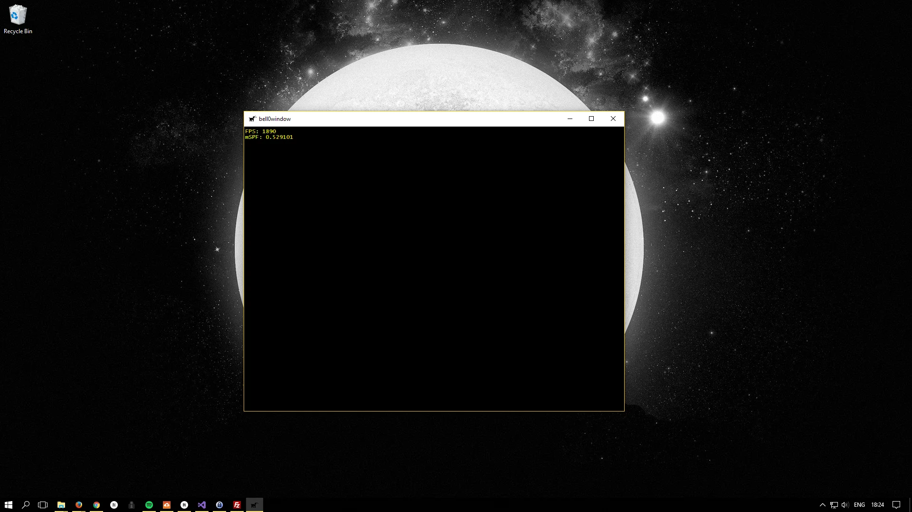

> Words can be like X-rays if you use them properly -- they’ll go through anything. You read and you’re pierced.
>
> – Aldous Huxley

Most games need some way to render high-quality text to the screen. DirectWrite provides just that and when used in
combination with Direct2D, DirectWrite is hardware accelerated, thus fast and robust.

To use DirectWrite in our project, we first initialize Direct2D, tell Direct3D and Direct2D to play together nicely, and
we then set up DirectWrite to output text to our back buffer. Obviously, having access to Direct2D will be useful later
as well, as we will need high-performance 2D and text rendering for menus, the user-interface and Heads-up Displays.

Setting up Direct2D and DirectWrite to work together with Direct3D basically takes seven little steps, and most of these
tasks are similar to the initialization of Direct3D:

1. Create the Direct2D and the DirectWrite factories.
2. Create the Direct2D device and its context.
3. Set up Direct2D to render to the same buffer as Direct3D.
4. Resize the Direct2D render targets when the game window is resized.
5. Set up brushes and text formats.
6. Set up text layouts.
7. Print!

## Creating the Factories

The first thing to do is to create factories for Direct2D and DirectWrite.

To creat the DirectWrite factory, we call upon the
*[DWriteCreateFactory](https://msdn.microsoft.com/en-us/library/windows/desktop/dd368040(v=vs.85).aspx)* function:

```cpp
HRESULT DWriteCreateFactory(
  _In_  DWRITE_FACTORY_TYPE factoryType,
  _In_  REFIID              iid,
  _Out_ IUnknown            **factory
);
```

### [DWRITE_FACTORY_TYPE](https://msdn.microsoft.com/en-us/library/windows/desktop/dd368057(v=vs.85).aspx) factoryType

The first parameter specifies whether the factory object will be shared or isolated. We will use
*DWRITE_FACTORY_TYPE_SHARED* to indicate that we intend to use the DirectWrite factory as a shared factory, which allows
the reuse of cached font data and generally leads to better performance.

### REFIID iid

Directly from the MSDN: A GUID value that identifies the DirectWrite factory interface, such as __uuidof(
IDWriteFactory).

### IUnknwon **factory

After the function returns, this parameter contains the address to a pointer to the newly created factory.

---

And here is the actual (isolated) C++-code to create the DirectWrite factory:

```cpp
Microsoft::WRL::ComPtr<IDWriteFactory2> writeFactory;	// pointer to the DirectWrite factory

// create the DirectWrite factory
if(FAILED(DWriteCreateFactory(DWRITE_FACTORY_TYPE_SHARED, __uuidof(IDWriteFactory), &writeFactory)))
	return std::runtime_error("Critical error: Unable to create the DirectWrite factory!");
```

---

Creating a Direct2D factory, is the job of
the [D2D1CreateFactory](https://msdn.microsoft.com/en-us/library/windows/desktop/dd368034(v=vs.85).aspx) function:

```cpp
HRESULT WINAPI D2D1CreateFactory(
  _In_           D2D1_FACTORY_TYPE    factoryType,
  _In_           REFIID               riid,
  _In_opt_ const D2D1_FACTORY_OPTIONS *pFactoryOptions,
  _Out_          void                 **ppIFactory
);
```

### [D2D1_FACTORY_TYPE](https://msdn.microsoft.com/en-us/library/windows/desktop/dd368104(v=vs.85).aspx) factoryType

The first parameter is the threading model of the factory and the resources it creates. We will set this to
D2D1_FACTORY_TYPE_MULTI_THREADED, enabling safe access to the Direct2D factory from multiple threads, which will be very
useful later on.

### REFIID riid

The second parameter is a reference to the IID of ID2D1Factory that is obtained by using __uuidof(ID2D1Factory).

### [D2D1_FACTORY_OPTIONS](https://msdn.microsoft.com/en-us/library/windows/desktop/dd368090%28v=vs.85%29.aspx) *pFactoryOptions

The third parameter specifies
the [level of detail](https://msdn.microsoft.com/en-us/library/windows/desktop/dd368090(v=vs.85).aspx) provided to the
debugging layer. In release mode, we set this to *D2D1_DEBUG_LEVEL_NONE*, telling Direct2D to not produce any debugging
output. In debug mode, however, it is useful to set this to *D2D1_DEBUG_LEVEL_INFORMATION*, telling Direct2D to send
error messages, warnings, and additional diagnostic information.

### void **ppIFactory

Once the function returns, the fourth parameter contains the address to a pointer to the newly creasted factory.

---

And here is the C++ code to create the Direct2D factory:

```cpp
Microsoft::WRL::ComPtr<ID2D1Factory2> factory;			// pointer to the Direct2D factory

// create the Direct2D factory
D2D1_FACTORY_OPTIONS options;
#ifndef NDEBUG
	options.debugLevel = D2D1_DEBUG_LEVEL_INFORMATION;
#else
	options.debugLevel = D2D1_DEBUG_LEVEL_NONE;
#endif

if(FAILED(D2D1CreateFactory(D2D1_FACTORY_TYPE_MULTI_THREADED, __uuidof(ID2D1Factory2), &options, &factory)))
	return std::runtime_error("Critical error: Unable to create Direct2D Factory!");
```

## The device and its context

After having created the factory, we can use it to create a Direct2D device and then use the device to create a Direct2D
device context. To create these Direct2D objects, we must first obtain the DXGI device associated to the Direct3D device
of the application.

Retrieving the DXGI device is as easy as follows:

```cpp
// get the dxgi device
Microsoft::WRL::ComPtr<IDXGIDevice> dxgiDevice;
if(FAILED(dxApp->d3d->dev.Get()->QueryInterface(__uuidof(IDXGIDevice), &dxgiDevice)))
	return std::runtime_error("Critical error: Unable to get the DXGI device!");
```

The [QueryInterface](https://msdn.microsoft.com/en-us/library/windows/desktop/ms682521(v=vs.85).aspx) function takes as
first parameter an identifier of the interface being requested and returns a pointer to that interface via its second
parameter.

To create the actual Direct2D device, a simple call to the
*[D2D1CreateDevice](https://msdn.microsoft.com/en-us/library/windows/desktop/hh404272(v=vs.85).aspx)* function is
sufficient:

```cpp
Microsoft::WRL::ComPtr<ID2D1Device1> dev;				// pointer to the Direct2D device

// create the Direct2D device
if (FAILED(factory->CreateDevice(dxgiDevice.Get(), &dev)))
	return std::runtime_error("Critical error: Unable to create the Direct2D device!");
```

The first parameter of the *D2D1CreateDevice* function is a pointer to the DXGI device the desired Direct2D should be
associated with. The function also has an optional second parameter, which we will not set, telling DirectX that we wish
for the Direct2D device to inherit its threading mode from the DXGI device. After the function returns, the actual
Direct2D device will be stored in the third parameter.

Creating the device context is just as easy:

```cpp
Microsoft::WRL::ComPtr<ID2D1DeviceContext1> devCon;		// pointer to the device context

// create the device context
if (FAILED(dev->CreateDeviceContext(D2D1_DEVICE_CONTEXT_OPTIONS_ENABLE_MULTITHREADED_OPTIMIZATIONS, &devCon)))
	return std::runtime_error("Critical error: Unable to create the Direct2D device context!");
```

The first parameter of the
*[CreateDeviceContext](https://msdn.microsoft.com/en-us/library/windows/desktop/hh404545(v=vs.85).aspx)* function
specifies
special [options for the device context](https://msdn.microsoft.com/en-us/library/windows/desktop/hh446998(v=vs.85).aspx).
The

*D2D1_DEVICE_CONTEXT_OPTIONS_ENABLE_MULTITHREADED_OPTIMIZATIONS*

flag tells Direct2D to distribute all of its rendering work across multiple threads. Once the function returns, the
actual device context is stored in the second parameter.

## Selecting a render target

Now that the Direct2D device and its context are created, it is time to tell Direct3D how to behave around with Direct2D
around as well and to allow the latter to render into the same back buffer surfaces.

As always, to create a rendering surface, or a bitmap, for Direct2D, a structure description must be filled out, this
time a [D2D1_BITMAP_PROPERTIES1](https://msdn.microsoft.com/en-us/library/windows/desktop/hh404275(v=vs.85).aspx)
structure:

```cpp
struct D2D1_BITMAP_PROPERTIES1 {
  D2D1_PIXEL_FORMAT   pixelFormat;
  FLOAT               dpiX;
  FLOAT               dpiY;
  D2D1_BITMAP_OPTIONS bitmapOptions;
  ID2D1ColorContext   *colorContext;
};
```

### [D2D1_PIXEL_FORMAT](https://msdn.microsoft.com/en-us/library/windows/desktop/dd368138(v=vs.85).aspx) pixelFormat

The first parameter defines the bitmap's [pixel format](https://msdn.microsoft.com/en-us/library/bb173059(vs.85).aspx)
and [alpha mode](https://msdn.microsoft.com/en-us/library/windows/desktop/dd368058(v=vs.85).aspx). We set the pixel
format to *DXGI_FORMAT_B8G8R8A8_UNORM*, as that is the format we used for our Direct3D back buffer, and we set the alpha
mode to *D2D1_ALPHA_MODE_IGNORE*. We will talk more about the alpha mode in later tutorials.

### FLOAT dpiX and FLOAT dpiY

The horizontal and vertical [dots per inch](https://en.wikipedia.org/wiki/Dots_per_inch), or dpi, of the bitmap.

### [D2D1_BITMAP_OPTIONS](https://msdn.microsoft.com/en-us/library/windows/desktop/hh446984(v=vs.85).aspx) bitmapOptions

These options specify how a bitmap can be used. We will use *D2D1_BITMAP_OPTIONS_TARGET*, which specifies that the
bitmap can be used as a device context target and *2D1_BITMAP_OPTIONS_CANNOT_DRAW*, which specifies that the bitmap
cannot be used as an input.

### [ID2D1ColorContext](https://msdn.microsoft.com/en-us/library/windows/desktop/hh404388(v=vs.85).aspx) *colorContext

This represents a colour context that can be used with an ID2D1Bitmap1 object. We won't use this, so we can set this to
be a *nullptr*.

---

To actually create a bitmap with the desired structure, the dxgi version of the backbuffer is necessary. To create the
render bitmap, we use the
*[ID2D1DeviceContext::CreateBitmapFromDxgiSurface](https://msdn.microsoft.com/en-us/library/windows/desktop/hh404482(v=vs.85).aspx)*
method:

```cpp
HRESULT CreateBitmapFromDxgiSurface(
  [in]                 IDXGISurface            *surface,
  [in, optional] const D2D1_BITMAP_PROPERTIES1 *bitmapProperties,
  [out]                ID2D1Bitmap1            **bitmap
);
```

### IDXGISurface *surface

The first parameter is the DXGI surface from which the bitmap can be created, it must have been created from the same
Direct3D device that the Direct2D device context is associated with. As seen in the last tutorial, the GetBuffer method
can be used to retrieve the back buffer.

### [D2D1_BITMAP_PROPERTIES1](https://msdn.microsoft.com/en-us/library/windows/desktop/hh847944(v=vs.85).aspx) *bitmapProperties

The second parameter is a pointer to the desired bitmap properties.

### ID2D1Bitmap1 **bitmap

Once the function returns, the third parameter will contain the address of a pointer to a newly created bitmap object.

---

To set the render target, we use the
*[ID2D1DeviceContext::SetTarget](https://msdn.microsoft.com/en-us/library/windows/desktop/hh404533(v=vs.85).aspx)*
method, it has only one parameter, the bitmap we want to set as the render target.

---

And finally, behold the code to set the render target of Direct2D to the same back buffer as Direct3D:

```cpp
util::Expected<void> Direct2D::createBitmapRenderTarget()
{
	// specify the desired bitmap properties
	D2D1_BITMAP_PROPERTIES1 bp;
	bp.pixelFormat.format = DXGI_FORMAT_B8G8R8A8_UNORM;
	bp.pixelFormat.alphaMode = D2D1_ALPHA_MODE_IGNORE;
	bp.dpiX = 96.0f;
	bp.dpiY = 96.0f;
	bp.bitmapOptions = D2D1_BITMAP_OPTIONS_TARGET | D2D1_BITMAP_OPTIONS_CANNOT_DRAW;
	bp.colorContext = nullptr;

	// Direct2D needs the DXGI version of the back buffer
	Microsoft::WRL::ComPtr<IDXGISurface> dxgiBuffer;
	if (FAILED(dxApp->d3d->swapChain->GetBuffer(0, __uuidof(IDXGISurface), &dxgiBuffer)))
		return std::runtime_error("Critical error: Unable to retrieve the back buffer!");
		
	// create the bitmap
	Microsoft::WRL::ComPtr<ID2D1Bitmap1> targetBitmap;
	if(FAILED(devCon->CreateBitmapFromDxgiSurface(dxgiBuffer.Get(), &bp, &targetBitmap)))
		return std::runtime_error("Critical error: Unable to create the Direct2D bitmap from the DXGI surface!");

	// set the newly created bitmap as render target
	devCon->SetTarget(targetBitmap.Get());

	// return success
	return { };
}
```

## Resizing

When the back buffer is resized, the Direct2D bitmap surface must be re-created:

```cpp
util::Expected<void> Direct3D::onResize()
{
	// release and reset all resources
	if(dxApp->d2d)
		dxApp->d2d->devCon->SetTarget(nullptr);

	devCon->ClearState();
	renderTargetView = nullptr;
	depthStencilView = nullptr;

	// resize the swap chain
	...

	// (re)-create the render target view
	...

	// create the depth and stencil buffer
	...

	// activate the depth and stencil buffer
	...

	// set the viewport to the entire backbuffer
	...

	// (re)-create the Direct2D target bitmap associated with the swap chain back buffer and set it as the current target
	if(dxApp->d2d)
		if(!dxApp->d2d->createBitmapRenderTarget().wasSuccessful())
			return std::runtime_error("Direct3D was unable to resize the Direct2D bitmap render target!");

	// log and return success
	if (dxApp->hasStarted)
		util::ServiceLocator::getFileLogger()->print<util::SeverityType::info>("The Direct3D and Direct2D resources were resized successfully.");
	return {};
}
```

## Formatting the text

To output text into the back buffer, a brush must be created and a text layout must be defined first.

There are four more steps to take:

1. Create a coloured brush.
2. Create a text format.
3. Define the text alignment.
4. Define the paragraph alignment.

None of those are difficult, so let's cover them quickly.

---

The
*[ID2D1RenderTarget::CreateSolidColorBrush](https://msdn.microsoft.com/en-us/library/windows/desktop/dd371871(v=vs.85).aspx)*
method creates brushes for us:

```cpp
HRESULT CreateSolidColorBrush(
  [ref] const D2D1_COLOR_F         &color,
  [out]       ID2D1SolidColorBrush **solidColorBrush
);
```

<p></p>

It takes two parameters. The first parameter specifies the colour to create in red, green, blue, and alpha format. The
second parameter contains the address of a pointer to the newly created brush. This parameter is passed uninitialized.

---

To format the text, we can use
the [IDWriteFactory::CreateTextFormat](https://msdn.microsoft.com/en-us/library/windows/desktop/dd368203(v=vs.85).aspx)
method:

```cpp
virtual HRESULT CreateTextFormat(
  [in]  const WCHAR                 * fontFamilyName,
              IDWriteFontCollection * fontCollection,
              DWRITE_FONT_WEIGHT     fontWeight,
              DWRITE_FONT_STYLE      fontStyle,
              DWRITE_FONT_STRETCH    fontStretch,
              FLOAT                  fontSize,
  [in]  const WCHAR                 * localeName,
  [out]       IDWriteTextFormat     ** textFormat
) = 0;
```

### const WCHAR *fontFamilyName

This is an array of characters that contains the name of the font family to use, for example, for console output we
would choose an easily readible font, such as L"Lucida Console".

### [IDWriteFontCollection](https://msdn.microsoft.com/en-us/library/windows/desktop/dd368214(v=vs.85).aspx) *fontCollection

This parameter is a pointer to a font collection object. We set this to nullptr, to indicate that we want to use the
system font collection.

### [DWRITE_FONT_WEIGHT](https://msdn.microsoft.com/en-us/library/windows/desktop/dd368082(v=vs.85).aspx) fontWeight

This value specifies the density, or the font weight, of a typeface, in terms of the lightness or heaviness of the
strokes. We will use *DWRITE_FONT_WEIGHT_LIGHT*.

### [DWRITE_FONT_STYLE](https://msdn.microsoft.com/en-us/library/windows/desktop/dd368080(v=vs.85).aspx) fontStyle

Directly from the MSDN: This parameter represents the style of a font face as normal, italic, or oblique. We will use
*DWRITE_FONT_STYLE_NORMAL*.

### [DWRITE_FONT_STRETCH](https://msdn.microsoft.com/en-us/library/windows/desktop/dd368078(v=vs.85).aspx) fontStretch

This parameter represents the amount of stretching compared to a font's normal aspect ratio. Lower values indicate
narrower widths; higher values indicate wider widths. We will use *DWRITE_FONT_STRETCH_NORMAL*.

### FLOAT fontSize

This parameter specifies the logical size of the font
in [device-independent pixel](https://en.wikipedia.org/wiki/Device_independent_pixel), or DIP.

### const WCHAR *localeName

This parameter is an array of characters that contains the locale name we want to use. Since we are trying to
communicate using British English, we will set this to L"en-GB".

### IDWriteTextFormat **textFormat

Once the function returns, this parameter contains the address of a pointer to the newly created text format object.

---

The
*[IDWriteTextFormat::SetTextAlignment](https://msdn.microsoft.com/en-us/library/windows/desktop/dd316709(v=vs.85).aspx)*
method defined the alignment of the text layout. It has one parameter, namely
the [desired alignment](https://msdn.microsoft.com/en-us/library/windows/desktop/dd368131(v=vs.85).aspx) to use. We will
use *DWRITE_TEXT_ALIGNMENT_LEADING*.

---

The [IDWriteTextFormat::SetParagraphAlignment](https://msdn.microsoft.com/en-us/library/windows/desktop/dd316702(v=vs.85).aspx)
method sets the paragraph alignment. It has one parameter, namely the
desired [paragraph alignment options](https://msdn.microsoft.com/en-us/library/windows/desktop/dd368112(v=vs.85).aspx).
We will use *DWRITE_PARAGRAPH_ALIGNMENT_NEAR*.

---

And here is the actual C++-code to set up the text format:

```cpp
util::Expected<void> Direct2D::initializeTextFormats()
{
	// create standard brushes
	if(FAILED(devCon->CreateSolidColorBrush(D2D1::ColorF(D2D1::ColorF::Yellow), &yellowBrush)))
		return std::runtime_error("Critical error: Unable to create the yellow brush!");
	if (FAILED(devCon->CreateSolidColorBrush(D2D1::ColorF(D2D1::ColorF::Black), &blackBrush)))
		return std::runtime_error("Critical error: Unable to create the black brush!");
	if (FAILED(devCon->CreateSolidColorBrush(D2D1::ColorF(D2D1::ColorF::White), &whiteBrush)))
		return std::runtime_error("Critical error: Unable to create the white brush!");
	
	// set up text formats

	// FPS text
	if(FAILED(writeFactory.Get()->CreateTextFormat(L"Lucida Console", nullptr, DWRITE_FONT_WEIGHT_LIGHT, DWRITE_FONT_STYLE_NORMAL, DWRITE_FONT_STRETCH_NORMAL, 12.0f, L"en-GB", &textFormatFPS)))
		return std::runtime_error("Critical error: Unable to create text format for FPS information!");
	if(FAILED(textFormatFPS->SetTextAlignment(DWRITE_TEXT_ALIGNMENT_LEADING)))
		return std::runtime_error("Critical error: Unable to set text alignment!");
	if(FAILED(textFormatFPS->SetParagraphAlignment(DWRITE_PARAGRAPH_ALIGNMENT_NEAR)))
		return std::runtime_error("Critical error: Unable to set paragraph alignment!");

	// return success
	return { };
}
```

## Text Layouts

Before actually rendering text to a bitmap, a text layout must be created. This is done using the
*[IWriteFactory::CreateTextLayout](https://msdn.microsoft.com/en-us/library/windows/desktop/dd368205(v=vs.85).aspx)*
function:

```cpp
virtual HRESULT CreateTextLayout(
  [in]  const WCHAR             * string,
              UINT32             stringLength,
              IDWriteTextFormat * textFormat,
              FLOAT              maxWidth,
              FLOAT              maxHeight,
  [out]       IDWriteTextLayout ** textLayout
) = 0;
```

This function is rather easy to use, it takes a string of the text to render, the desired text format together with the
dimension of the desired output buffer, and produces an object that represents the fully analyzed and formatted text.

Here is an example of how to use this function:

```cpp
util::Expected<void> DirectXApp::calculateFrameStatistics()
{
	static int nFrames;				    // number of frames seen
	static double elapsedTime;		    // time since last call
	nFrames++;

	// compute average statistics over one second
	if ((timer->getTotalTime() - elapsedTime) >= 1.0)
	{
		// set fps and mspf
		fps = nFrames;
		mspf = 1000.0 / (double)fps;

		if (showFPS)
		{
			// create FPS information text layout
			std::wostringstream outFPS;
			outFPS.precision(6);
			outFPS << "FPS: " << DirectXApp::fps << std::endl;
			outFPS << "mSPF: " << DirectXApp::mspf << std::endl;

			if (FAILED(d2d->writeFactory->CreateTextLayout(outFPS.str().c_str(), (UINT32)outFPS.str().size(), d2d->textFormatFPS.Get(), (float)appWindow->clientWidth, (float)appWindow->clientHeight, &d2d->textLayoutFPS)))
				return std::runtime_error("Critical error: Failed to create the text layout for FPS information!");
		}

		// reset
		nFrames = 0;
		elapsedTime += 1.0;
	}

	// return success
	return { };
}
```

## Rendering the text

Finally rendering the fully formatted text layout is the job of the
*[ID2D1RenderTarget::DrawTextLayout](https://msdn.microsoft.com/en-us/library/windows/desktop/dd371913(v=vs.85).aspx)*
method:

```cpp
virtual void DrawTextLayout(
       D2D1_POINT_2F          origin,
  [in] IDWriteTextLayout      *textLayout,
  [in] ID2D1Brush             *defaultForegroundBrush,
       D2D1_DRAW_TEXT_OPTIONS options = D2D1_DRAW_TEXT_OPTIONS_NONE
) = 0;
```

### [D2D1_POINT_2F](https://msdn.microsoft.com/en-us/library/windows/desktop/dd368140(v=vs.85).aspx) origin

The first parameter specifies at which position the first letter of the text should be drawn.

### IDWriteTextLayout *textLayout

The second parameter specifies the formatted text to be drawn.

### ID2D1Brush *defaultForegroundBrush

The third parameter specifies the desired brush to use to render the text.

### [D2D1_DRAW_TEXT_OPTIONS](https://msdn.microsoft.com/en-us/library/windows/desktop/dd368095(v=vs.85).aspx) options

The fourth parameter specifies whether text snapping is suppressed or clipping to the layout rectangle is enabled. We
will leave this at *D2D1_DRAW_TEXT_OPTIONS_NONE* for now.

---

And finally, here is the code to draw the FPS information to the screen:

```cpp
util::Expected<void> Direct2D::printFPS()
{
	if (dxApp->showFPS && textLayoutFPS)
	{
		devCon->BeginDraw();

		devCon->DrawTextLayout(D2D1::Point2F(2.0f, 5.0f), textLayoutFPS.Get(), yellowBrush.Get());
		if (FAILED(devCon->EndDraw()))
			return std::runtime_error("Critical error: Unable to draw FPS information!");
	}

	// return success
	return {};
}
```

## Putting It All Together

To manage Direct2D, a new class, called *Direct2D* was created:

```cpp
class Direct2D
{
private:
	core::DirectXApp* dxApp;								// pointer to the main application class

	Microsoft::WRL::ComPtr<IDWriteFactory2> writeFactory;	// pointer to the DirectWrite factory
	Microsoft::WRL::ComPtr<ID2D1Factory2> factory;			// pointer to the Direct2D factory
	Microsoft::WRL::ComPtr<ID2D1Device1> dev;				// pointer to the Direct2D device
	Microsoft::WRL::ComPtr<ID2D1DeviceContext1> devCon;		// pointer to the device context
		
	util::Expected<void> createDevice();					// creates the device and its context
	util::Expected<void> createBitmapRenderTarget();		// creates the bitmap render target, set to be the same as the backbuffer already in use for Direct3D
	util::Expected<void> initializeTextFormats();			// initializes the different formats, for now, only a format to print FPS information will be created

public:
	// constructors
	Direct2D(core::DirectXApp* dxApp);
	~Direct2D();

	// brushes
	Microsoft::WRL::ComPtr<ID2D1SolidColorBrush> yellowBrush;
	Microsoft::WRL::ComPtr<ID2D1SolidColorBrush> whiteBrush;
	Microsoft::WRL::ComPtr<ID2D1SolidColorBrush> blackBrush;

	// text formats
	Microsoft::WRL::ComPtr<IDWriteTextFormat> textFormatFPS;

	// text layouts
	Microsoft::WRL::ComPtr<IDWriteTextLayout> textLayoutFPS;

	util::Expected<void> printFPS();						// prints fps information to the screen

	friend class core::DirectXApp;
	friend class Direct3D;
};
```

And here is its implementation according to what we learned in this tutorial:

```cpp
/////////////////////////////////////////////////////////////////////////////////////////
////////////////////////////// Constructor //////////////////////////////////////////////
/////////////////////////////////////////////////////////////////////////////////////////
Direct2D::Direct2D(core::DirectXApp* dxApp) : dxApp(dxApp)
{
	// create the device and its context
	if (!createDevice().wasSuccessful())
		throw std::runtime_error("Crital error: Failed to initialize Direct2D!");

	// create the bitmap target to render to
	if (!createBitmapRenderTarget().wasSuccessful())
		throw std::runtime_error("Critical error: Failed to create the bitmap render target for Direct2D!");

	// initialize the text formats
	if (!initializeTextFormats().wasSuccessful())
		throw std::runtime_error("Critical error: Failed to create text formats!");

	// log success
	util::ServiceLocator::getFileLogger()->print<util::SeverityType::info>("Direct2D was successfully initialized.");
}

/////////////////////////////////////////////////////////////////////////////////////////
////////////////////////////// Initialization ///////////////////////////////////////////
/////////////////////////////////////////////////////////////////////////////////////////
util::Expected<void> Direct2D::createDevice()
{
	// create the DirectWrite factory
	if(FAILED(DWriteCreateFactory(DWRITE_FACTORY_TYPE_SHARED, __uuidof(IDWriteFactory), &writeFactory)))
		return std::runtime_error("Critical error: Unable to create the DirectWrite factory!");

	// create the Direct2D factory
	D2D1_FACTORY_OPTIONS options;
#ifndef NDEBUG
	options.debugLevel = D2D1_DEBUG_LEVEL_INFORMATION;
#else
	options.debugLevel = D2D1_DEBUG_LEVEL_NONE;
#endif
	if(FAILED(D2D1CreateFactory(D2D1_FACTORY_TYPE_MULTI_THREADED, __uuidof(ID2D1Factory2), &options, &factory)))
		return std::runtime_error("Critical error: Unable to create Direct2D Factory!");
				
	// get the dxgi device
	Microsoft::WRL::ComPtr<IDXGIDevice> dxgiDevice;
	if(FAILED(dxApp->d3d->dev.Get()->QueryInterface(__uuidof(IDXGIDevice), &dxgiDevice)))
		return std::runtime_error("Critical error: Unable to get the DXGI device!");

	// create the Direct2D device
	if (FAILED(factory->CreateDevice(dxgiDevice.Get(), &dev)))
		return std::runtime_error("Critical error: Unable to create the Direct2D device!");

	// create its context
	if (FAILED(dev->CreateDeviceContext(D2D1_DEVICE_CONTEXT_OPTIONS_ENABLE_MULTITHREADED_OPTIMIZATIONS, &devCon)))
		return std::runtime_error("Critical error: Unable to create the Direct2D device context!");

	// return success
	return {};
}

util::Expected<void> Direct2D::createBitmapRenderTarget()
{
	// specify the desired bitmap properties
	D2D1_BITMAP_PROPERTIES1 bp;
	bp.pixelFormat.format = DXGI_FORMAT_B8G8R8A8_UNORM;
	bp.pixelFormat.alphaMode = D2D1_ALPHA_MODE_IGNORE;
	bp.dpiX = 96.0f;
	bp.dpiY = 96.0f;
	bp.bitmapOptions = D2D1_BITMAP_OPTIONS_TARGET | D2D1_BITMAP_OPTIONS_CANNOT_DRAW;
	bp.colorContext = nullptr;

	// Direct2D needs the DXGI version of the back buffer
	Microsoft::WRL::ComPtr<IDXGISurface> dxgiBuffer;
	if (FAILED(dxApp->d3d->swapChain->GetBuffer(0, __uuidof(IDXGISurface), &dxgiBuffer)))
		return std::runtime_error("Critical error: Unable to retrieve the back buffer!");
		
	// create the bitmap
	Microsoft::WRL::ComPtr<ID2D1Bitmap1> targetBitmap;
	if(FAILED(devCon->CreateBitmapFromDxgiSurface(dxgiBuffer.Get(), &bp, &targetBitmap)))
		return std::runtime_error("Critical error: Unable to create the Direct2D bitmap from the DXGI surface!");

	// set the newly created bitmap as render target
	devCon->SetTarget(targetBitmap.Get());

	// return success
	return { };
}

util::Expected<void> Direct2D::initializeTextFormats()
{
	// create standard brushes
	if(FAILED(devCon->CreateSolidColorBrush(D2D1::ColorF(D2D1::ColorF::Yellow), &yellowBrush)))
		return std::runtime_error("Critical error: Unable to create the yellow brush!");
	if (FAILED(devCon->CreateSolidColorBrush(D2D1::ColorF(D2D1::ColorF::Black), &blackBrush)))
		return std::runtime_error("Critical error: Unable to create the black brush!");
	if (FAILED(devCon->CreateSolidColorBrush(D2D1::ColorF(D2D1::ColorF::White), &whiteBrush)))
		return std::runtime_error("Critical error: Unable to create the white brush!");
	
	// set up text formats

	// FPS text
	if(FAILED(writeFactory.Get()->CreateTextFormat(L"Lucida Console", nullptr, DWRITE_FONT_WEIGHT_LIGHT, DWRITE_FONT_STYLE_NORMAL, DWRITE_FONT_STRETCH_NORMAL, 12.0f, L"en-GB", &textFormatFPS)))
		return std::runtime_error("Critical error: Unable to create text format for FPS information!");
	if(FAILED(textFormatFPS->SetTextAlignment(DWRITE_TEXT_ALIGNMENT_LEADING)))
		return std::runtime_error("Critical error: Unable to set text alignment!");
	if(FAILED(textFormatFPS->SetParagraphAlignment(DWRITE_PARAGRAPH_ALIGNMENT_NEAR)))
		return std::runtime_error("Critical error: Unable to set paragraph alignment!");

	// return success
	return { };
}

/////////////////////////////////////////////////////////////////////////////////////////
/////////////////////////////////// Printing Functions //////////////////////////////////
/////////////////////////////////////////////////////////////////////////////////////////
util::Expected<void> Direct2D::printFPS()
{
	if (dxApp->showFPS && textLayoutFPS)
	{
		devCon->BeginDraw();

		devCon->DrawTextLayout(D2D1::Point2F(2.0f, 5.0f), textLayoutFPS.Get(), yellowBrush.Get());
		if (FAILED(devCon->EndDraw()))
			return std::runtime_error("Critical error: Unable to draw FPS information!");
	}

	// return success
	return {};
}

/////////////////////////////////////////////////////////////////////////////////////////
/////////////////////////////////// Shut Down ///////////////////////////////////////////
/////////////////////////////////////////////////////////////////////////////////////////
Direct2D::~Direct2D()
{
	util::ServiceLocator::getFileLogger()->print<util::SeverityType::info>("Direct2D was shut down successfully.");
}
```

The *DirectXApp* class was changed to create text containing information about the frames per second:

```cpp
util::Expected<void> DirectXApp::calculateFrameStatistics()
{
	static int nFrames;				    // number of frames seen
	static double elapsedTime;		    // time since last call
	nFrames++;

	// compute average statistics over one second
	if ((timer->getTotalTime() - elapsedTime) >= 1.0)
	{
		// set fps and mspf
		fps = nFrames;
		mspf = 1000.0 / (double)fps;

		if (showFPS)
		{
			// create FPS information text layout
			std::wostringstream outFPS;
			outFPS.precision(6);
			outFPS << "FPS: " << DirectXApp::fps << std::endl;
			outFPS << "mSPF: " << DirectXApp::mspf << std::endl;

			if (FAILED(d2d->writeFactory->CreateTextLayout(outFPS.str().c_str(), (UINT32)outFPS.str().size(), d2d->textFormatFPS.Get(), (float)appWindow->clientWidth, (float)appWindow->clientHeight, &d2d->textLayoutFPS)))
				return std::runtime_error("Critical error: Failed to create the text layout for FPS information!");
		}

		// reset
		nFrames = 0;
		elapsedTime += 1.0;
	}

	// return success
	return { };
}
```

The output of the FPS information can be toggled via the *F1* key:

```cpp
void DirectXApp::onKeyDown(WPARAM wParam, LPARAM /*lParam*/)
{
	switch (wParam)
	{
	case VK_F1:
		showFPS = !showFPS;
		break;

	case VK_ESCAPE:
		PostMessage(appWindow->mainWindow, WM_CLOSE, 0, 0);
		break;

	default: break;
	}
}
```

The drawing takes place in the render function of the derived game class:

```cpp
util::Expected<int> DirectXGame::render(double /*farSeer*/)
{
	// clear the back buffer and the depth/stencil buffer
	d3d->clearBuffers();

	// render

	// print FPS information
	if (!d2d->printFPS().wasSuccessful())
		return std::runtime_error("Failed to print FPS information!");

	// present the scene
	if (!d3d->present().wasSuccessful())
		return std::runtime_error("Failed to present the scene!");

	// return success
	return 0;
}
```

---

I also cleaned up a bit and eliminated some warning messages.
There are a few *Sol* messages that we can't do much about, so we simply ignore them:

```cpp
// Lua and Sol
#pragma warning( push )
#pragma warning( disable : 4127)	// disable constant if expr warning
#pragma warning( disable : 4702)	// disable unreachable code warning
#include <sol.hpp>
#pragma warning( pop ) 
#pragma comment(lib, "liblua53.a")
```

Since at the time I wrote this, Visual Studio 15.3 wasn't out yet, thus there was no support for C++17 and *if
constexpr*, I also finally suppressed the warning from the logger, it was really starting to annoy me:

```cpp
template<typename LogPolicy>
template<SeverityType severity>
void Logger<LogPolicy>::print(std::stringstream stream)
{
	std::stringstream logStream;
#pragma warning (push)
#pragma warning (disable: 4127)		// disable constant if expr warning
	// all severity types but the config type allow custom formatting
	if(!(severity == SeverityType::config))	// todo: eliminate this warning with if constexpr once version 15.3 of Visual Studio with C++-17 features is available
#pragma warning (pop)
{
...
```

---

The source code is available
from [here](https://filedn.eu/ltgnTcOBnsYpGSo6BiuFrPL/Game%20Programming/Fundamentals/DirectX/directWrite.7z).

Here is a screenshot of the game window with FPS information drawn by DirectWrite.



And here is the log file:

```
0: 6/8/2017 18:26:56	INFO:    mainThread:	The file logger was created successfully.
1: 6/8/2017 18:26:56	INFO:    mainThread:	The high-precision timer was created successfully.
2: 6/8/2017 18:26:56	INFO:    mainThread:	The client resolution was read from the Lua configuration file: 800 x 600.
3: 6/8/2017 18:26:56	INFO:    mainThread:	The main window was successfully created.
4: 6/8/2017 18:26:56	INFO:    mainThread:	Direct3D was initialized successfully.
5: 6/8/2017 18:26:56	INFO:    mainThread:	Direct2D was successfully initialized.
6: 6/8/2017 18:26:56	INFO:    mainThread:	The DirectX application initialization was successful.
7: 6/8/2017 18:26:56	INFO:    mainThread:	Game initialization was successful.
8: 6/8/2017 18:26:56	INFO:    mainThread:	Entering the game loop...
9: 6/8/2017 18:26:59	INFO:    mainThread:	The main window was flagged for destruction.
10: 6/8/2017 18:26:59	INFO:    mainThread:	Leaving the game loop...
11: 6/8/2017 18:26:59	INFO:    mainThread:	The game was shut down successfully.
12: 6/8/2017 18:26:59	INFO:    mainThread:	Direct2D was shut down successfully.
13: 6/8/2017 18:26:59	INFO:    mainThread:	Direct3D was shut down successfully.
14: 6/8/2017 18:26:59	INFO:    mainThread:	Main window class destruction was successful.
15: 6/8/2017 18:26:59	INFO:    mainThread:	The timer was successfully destroyed.
16: 6/8/2017 18:26:59	INFO:    mainThread:	The DirectX application was shutdown successfully.
17: 6/8/2017 18:26:59	INFO:    mainThread:	The file logger was destroyed.
```

---

I don't know about you, but I am starting to feel quite excited — none of this COM or DirectX stuff is alien or too
difficult any more. In the next tutorial, we will finally draw triangles on the screen!

## References

* Tricks of the Windows Game Programming Gurus, by André LaMothe
* Microsoft Developer Network ([MSDN](https://msdn.microsoft.com/en-us/library/windows/desktop/ee663274(v=vs.85)))

#gamedev #directx #directwrite