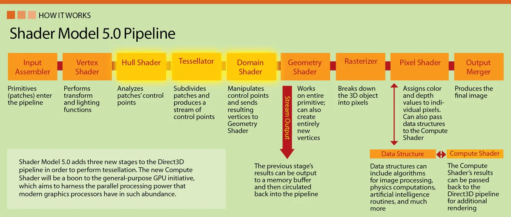
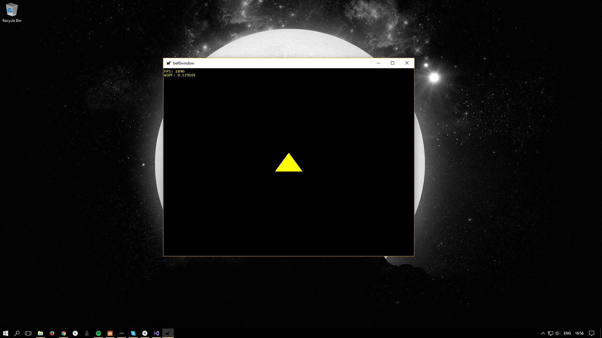

> Hell... it's about time.
>
> -- Tychus Findlay

In this tutorial, we will finally learn how to render triangles. We won't go into every detail yet, but I thought it was about time that we saw our hard work pay off.

Rendering a triangle is a six steps process:

1. Create three vertices to define a triangle.
2. Store these vertices in video memory.
3. Tell the GPU how to read these vertices.
4. Tell the GPU how to translate those vertices into a flat image.
5. Tell the GPU where on the back buffer we want the image to appear.
6. Render the triangle.

None of these steps are very difficult, but a substantial amount of theory is required to really understand what is happening. Don't worry, though, we won't delve too deeply into the theoretical stuff just yet. In this tutorial, we simply want to see something rendered on the screen.

## Creating a Triangle
Obviously, to define a triangle, three points, or vectors $v_1, v_2, v_3 \in \mathbb{R}^3$are needed. Those points are often called the vertices of a triangle. In DirectX, a vertex is a simple C++-structure containing all the data needed to create whatever 3D image we might want to create. 

Here is a trivial example for a vertex structure, holding only information about the position of the vertex:

```cpp
// struct to represent vertices
struct VERTEX
{
	float x, y, z;
};
```

For example, to create a single triangle, we could do something like:

```cpp
void Game::initGraphics()
{
...
    // create the triangle
    graphics::VERTEX triangleVertices[] = { { 0.0f, 0.1f, 0.3f }, { 0.11f, -0.1f, 0.3f }, { -0.11f, -0.1f, 0.3f } };
...
}
```

## GPU Memory
Obviously the newly created C++-structure is stored in system memory. To not suffer from an extreme slowdown, it is at the utmost importance, however, that the data be stored in video memory once needed by the GPU.

In order to get access to the video memory, Direct3D provides a specific COM object to maintain buffers both in system and video memory. This COM object is called a *[vertex buffer](https://msdn.microsoft.com/en-us/library/windows/desktop/ff476898(v=vs.85).aspx#Vertex_Buffer)*, the COM interface is *[ID3D11Buffer](https://msdn.microsoft.com/en-us/library/windows/desktop/ff476351(v=vs.85).aspx)*. When rendering calls for specific data, Direct3D will automatically copy it over to the GPU and take care of all the details for us. If the video card becomes low on memory, Direct3D will delete buffers that haven't been used in a while, or are considered low priority, in order to make room for newer resources. Once again, thank you, Microsoft!

To create the vertex buffer, a description structure, the *[D3D11_BUFFER_DESC](https://msdn.microsoft.com/en-us/library/windows/desktop/ff476092(v=vs.85).aspx)* structure, must be filled out:

```cpp
typedef struct D3D11_BUFFER_DESC {
  UINT        ByteWidth;
  D3D11_USAGE Usage;
  UINT        BindFlags;
  UINT        CPUAccessFlags;
  UINT        MiscFlags;
  UINT        StructureByteStride;
} D3D11_BUFFER_DESC;
```

### UINT ByteWidth
The size of the buffer in bytes.

### [D3D11_USAGE](https://msdn.microsoft.com/en-us/library/windows/desktop/ff476259(v=vs.85).aspx) Usage
This parameter identifies how the buffer is expected to be read from and written to. The most common value is typically D3D11_USAGE_DEFAULT, which tells Direct3D that the GPU, and only the GPU, will read from and write to the buffer.

### UINT [BindFlags](https://msdn.microsoft.com/en-us/library/windows/desktop/ff476085(v=vs.85).aspx)
This member identifies how the buffer will be bound to the [graphics pipeline](https://en.wikipedia.org/wiki/Graphics_pipeline) (there will be a chapter about the theory behind the graphics or rendering pipeline later on). Obviously, to create a vertex buffer, we use the *D3D11_BIND_VERTEX_BUFFER* flag.

### UINT [CPUAccessFlags](https://msdn.microsoft.com/en-us/library/windows/desktop/ff476106(v=vs.85).aspx)
This parameter specifies how the CPU may access the buffer data. We will use zero, as we don't want the CPU to access the buffer at all.

### UINT [MiscFlags](https://msdn.microsoft.com/en-us/library/windows/desktop/ff476203(v=vs.85).aspx)
We don't need those flags for now, so we set this member to zero. 

### UINT StructureByteStride
This parameter defines the size of each element in the buffer structure (in bytes) when the buffer represents a [structured buffer](https://msdn.microsoft.com/en-us/library/windows/desktop/ff476335(v=vs.85).aspx#Structured_Buffer). Since we are not interested in using structured buffers at the moment, we can simply set this to zero as well.

---

Now that the vertex buffer is well-defined, it can be given data to be initialized with using the *[D3D11_SUBRESOURCE_DATA](https://msdn.microsoft.com/en-us/library/windows/desktop/ff476220(v=vs.85).aspx)* structure:

```cpp
typedef struct D3D11_SUBRESOURCE_DATA {
  const void *pSysMem;
  UINT       SysMemPitch;
  UINT       SysMemSlicePitch;
} D3D11_SUBRESOURCE_DATA;
```

### const void *pSysMem
This parameter is a pointer to the system memory which contains the data to be copied to the GPU.

### UINT SysMemPitch
This member defines the distance (in bytes) from the beginning of one line of a texture to the next line. We do not need this for a vertex buffer, so we can simply set this to zero.

### UINT SysMemSlicePitch
This member defines the distance (in bytes) from the beginning of one depth level to the next. We do not need this for a vertex buffer, so we can safely set it to zero.

---

Now to finally obtain the COM interface, the ID3D11Buffer, a simple call to the *[ID3D11Device::CreateBuffer](https://msdn.microsoft.com/en-us/library/windows/desktop/ff476501(v=vs.85).aspx)* method is sufficient:

```cpp
HRESULT CreateBuffer(
  [in]            const D3D11_BUFFER_DESC      *pDesc,
  [in, optional]  const D3D11_SUBRESOURCE_DATA *pInitialData,
  [out, optional]       ID3D11Buffer           **ppBuffer
);
```

The first parameter is a pointer to a struct describing the desired buffer.

The second parameter is a pointer to a struct describing the data to initialize the buffer with.

The third parameter is the address of a pointer to the *ID3D11Buffer* interface for the buffer object that was just created.

*CreateBuffer* returns *E_OUTOFMEMORY* if there is insufficient memory to create the buffer.

---

Here is an example of the above theory in action:

```cpp
// the core game class, derived from DirectXApp
class DirectXGame : core::DirectXApp
{
private:
	Microsoft::WRL::ComPtr<ID3D11Buffer> vertexBuffer;

public:
	// constructor and destructor
	DirectXGame(HINSTANCE hInstance);
	~DirectXGame();

	// override virtual functions
	util::Expected<void> init() override;								// game initialization
	void shutdown(util::Expected<void>* expected = NULL) override;		// cleans up and shuts the game down (handles errors)
	util::Expected<int> update(double dt);								// update the game world
	util::Expected<int> render(double farSeer);							// render the scene

	// create graphics
	util::Expected<void> initGraphics();								// initializes graphics

	// run the game
	util::Expected<int> run() override;
};

// initialize graphics
util::Expected<void> DirectXGame::initGraphics()
{
	// create the triangle
	graphics::VERTEX triangleVertices[] = { { 0.0f, 0.5f, 0.0f },{ 0.45f, -0.5f, 0.0f },{ -0.45f, -0.5f, 0.0f } };

	// set up buffer description
	D3D11_BUFFER_DESC bd;
	bd.ByteWidth = sizeof(graphics::VERTEX) * ARRAYSIZE(triangleVertices);
	bd.Usage = D3D11_USAGE_DEFAULT;
	bd.BindFlags = D3D11_BIND_VERTEX_BUFFER;
	bd.CPUAccessFlags = 0;
	bd.MiscFlags = 0;
	bd.StructureByteStride = 0;

	// define subresource data
	D3D11_SUBRESOURCE_DATA srd = { triangleVertices, 0,0 };

	// create the vertex buffer
	if (FAILED(d3d->dev->CreateBuffer(&bd, &srd, &vertexBuffer)))
		return "Critical Error: Unable to create vertex buffer!";

	// return success
	return {};
}
```

## Shaders
To actually render vertices, or pixels to the screen, DirectX uses [shaders](https://en.wikipedia.org/wiki/Shader). The process of rendering is controlled by the (graphics) rendering pipeline. It is a series of steps which take vertices as input and result in a fully rendered image. The pipeline must be programmed by the above-mentioned shaders. A shader is actually a small program that controls one step of the pipeline. Here is an image of a shader 5.0 pipeline:



As we can see, there are several different types of shaders, and each one is run many times during rendering. The vertex shader, for example, is run once for each vertex rendered, while a pixel shader is a program that is run for each pixel drawn. We won't get into any details yet, but we obviously do have to write a simple vertex and pixel shader. This will take four relatively easy steps:

1. Create seperate vertex and pixel shader files.
2. Load the two shaders from a .cso file into the program.
3. Encapsulate both shaders into shader objects.
4. Set both shaders to be the active shaders.

## Creating shaders
Shaders are written in [High Level Shader Language](https://en.wikipedia.org/wiki/High-Level_Shading_Language), or HLSL, for short. Visual Studio is capable of creating HLSL programs. Fortunately for us, the pixel and vertex shaders that Visual Studio creates automatically (*right-click -> new file -> HLSL -> vertex/pixel shader*) are good enough for the purpose of this tutorial; only minimal changes are needed. Later tutorials will cover more details about HLSL.

Here is the vertex shader:
```cpp
float4 main(float3 pos : POSITION) : SV_POSITION
{
	// transform the position into homogeneous coordinates (projective geometry)
	float4 homoPos = {pos.x, pos.y, pos.z, 1.0f};

	// return position
	return homoPos;
}
```

As input, the vertex shader takes the position of a vertex, defined by three floats, just as defined by our *VERTEX* structure. For now, the shader does nothing but to return the input position in [homogeneous coordinates](https://en.wikipedia.org/wiki/Homogeneous_coordinates) (defined by the *SV_POSITION* [semantic](https://msdn.microsoft.com/en-us/library/windows/desktop/bb509647(v=vs.85).aspx)). There will be more theoretical tutorials later on, including one tutorial about projective geometry and homogeneous coordinates, but for now, we will focus on getting that triangle on the screen.

Thus, without further ado, here is the pixel shader:
```cpp
float4 main() : SV_TARGET
{
	return float4(1.0f, 1.0f, 0.0f, 1.0f);
}
```

The *SV_TARGET* [semantic](https://msdn.microsoft.com/en-us/library/windows/desktop/bb509647(v=vs.85).aspx) indicates that the return value of the pixel shader should match the render target format. For now, we simply set the colour of each pixel to yellow.

## Loading Shader Files
When compiling the project, the HLSL files automatically compile as well and are *transformed* into *Compiled Shader Objects* (CSO), which the running program must load in to be able to use.

To achieve this, a little helper function is needed:

```cpp
struct ShaderBuffer
{
	BYTE* buffer;
	int size;
};

util::Expected<ShaderBuffer> Direct3D::loadShader(std::wstring filename)
{
	// load precompiled shaders from .cso objects
	ShaderBuffer sb;
	byte* fileData = nullptr;

	// open the file
	std::ifstream csoFile(filename, std::ios::in | std::ios::binary | std::ios::ate);

	if (csoFile.is_open())
	{
		// get shader size
		sb.size = (unsigned int)csoFile.tellg();

		// collect shader data
		fileData = new byte[sb.size];
		csoFile.seekg(0, std::ios::beg);
		csoFile.read(reinterpret_cast<char*>(fileData), sb.size);
		csoFile.close();
		sb.buffer = fileData;
	}
	else
		return "Critical error: Unable to open the compiled shader object!";

	// return the shader buffer
	return sb;
}
```

This function simply dumps all the data from the .cso file into an array; this is sophisticated enough for now.

To load and initialize shaders, the Direct3D class is given a new function, called initPipeline:

```cpp
util::Expected<void> Direct3D::initPipeline()
{
	// load Compiled Shader Object files

	// debug mode
#ifndef NDEBUG
	util::Expected<ShaderBuffer> vertexShaderBuffer = loadShader(L"../x64/Debug/vertexShader.cso");
	util::Expected<ShaderBuffer> pixelShaderBuffer = loadShader(L"../x64/Debug/pixelShader.cso");
#else
	util::Expected<ShaderBuffer> vertexShaderBuffer = loadShader(L"../x64/Release/vertexShader.cso");
	util::Expected<ShaderBuffer> pixelShaderBuffer = loadShader(L"../x64/Release/pixelShader.cso");
#endif

	if (!vertexShaderBuffer.wasSuccessful() || !pixelShaderBuffer.wasSuccessful())
		return "Critical error: Unable to read Compiled Shader Object files!";

	// log and return return success
	util::ServiceLocator::getFileLogger()->print<util::SeverityType::info>("The rendering pipeline was successfully initialized.");
	return { };
	}
```

## COM Interfaces
A special COM object exists for every shader type. The Direct3D interfaces to the vertex and pixel shaders are *[ID3D11VertexShader](https://msdn.microsoft.com/en-us/library/windows/desktop/ff476641%28v=vs.85%29.aspx)* and *[ID3D11PixelShader](https://msdn.microsoft.com/en-us/library/windows/desktop/ff476576%28v=vs.85%29.aspx)*.

Encapsulating both shaders into their respective shader objects is quite easy.

To get an interface to the vertex shader, a simple call to the [ID3D11Device::CreateVertexShader](https://msdn.microsoft.com/en-us/library/windows/desktop/ff476524(v=vs.85).aspx) method is sufficient:

```cpp
HRESULT CreateVertexShader(
  [in]            const void               *pShaderBytecode,
  [in]                  SIZE_T             BytecodeLength,
  [in, optional]        ID3D11ClassLinkage *pClassLinkage,
  [out, optional]       ID3D11VertexShader **ppVertexShader
);
```

### const void *pShaderBytecode
The first parameter is a pointer to the compiled shader.

### SIZE_T BytecodeLength
The second parameter is the size of the compiled vertex shader.

### [ID3D11ClassLinkage](https://msdn.microsoft.com/en-us/library/windows/desktop/ff476358(v=vs.85).aspx) *pClassLinkage
The third parameter is a pointer to a class linkage interface, this is rather advanced and we will set it to NULL.

### ID3D11VertexShader **ppVertexShader
The fourth parameter holds the address of a pointer to the returned *ID3D11VertexShader* interface.

To create the pixel shader, the *ID3D11Device::CreatePixelShader* method, which is isomorphic to the *ID3D11Device::CreateVertexShader* method, can be used.

And here is the code to create the actual objects and to get the pointers to the interfaces:

```cpp
void Direct3D::initPipeline()
{
	// initialize the GPU pipeline
	HRESULT hr = S_OK;

	// load Compiled Shader Object files
	ShaderBuffer vertexShaderBuffer = loadShader("../x64/Debug/bell0vertexShader.cso");
	ShaderBuffer pixelShaderBuffer = loadShader("../x64/Debug/bell0pixelShader.cso");

	// create the shaders
	if (FAILED(dev->CreateVertexShader(vertexShaderBuffer.get().buffer, vertexShaderBuffer.get().size, nullptr, &vertexShader)))
		return "Critical error: Unable to create the vertex shader!";
	if(FAILED(dev->CreatePixelShader(pixelShaderBuffer.get().buffer, pixelShaderBuffer.get().size, nullptr, &pixelShader)))
		return "Critical error: Unable to create the pixel shader!";
}
```

## Activating the Shaders
To set the newly created shaders as the active shaders to use, a simple call to the *[ID3D11DeviceContext::VSSetShader](https://msdn.microsoft.com/en-us/library/windows/desktop/ff476493(v=vs.85).aspx)* and *[ID3D11DeviceContext::PSSetShader](https://msdn.microsoft.com/en-us/library/windows/desktop/ff476472(v=vs.85).aspx)* methods is sufficient. Both methods are isomorphical, here is the VSSetShader function:

```cpp
void VSSetShader(
  [in, optional] ID3D11VertexShader         *pVertexShader,
  [in, optional] ID3D11ClassInstance *const *ppClassInstances,
                 UINT                       NumClassInstances
);
```

The first parameter is the address of the shader object to be set as active. The other two parameters are advanced and are not needed at the moment.

Here is the final code to activate the vertex and pixel shaders:

```cpp
util::Expected<void> Direct3D::initPipeline()
{
	// load Compiled Shader Object files
#ifndef NDEBUG
	util::Expected<ShaderBuffer> vertexShaderBuffer = loadShader(L"../x64/Debug/vertexShader.cso");
	util::Expected<ShaderBuffer> pixelShaderBuffer = loadShader(L"../x64/Debug/pixelShader.cso");
#else
	util::Expected<ShaderBuffer> vertexShaderBuffer = loadShader(L"../x64/Release/vertexShader.cso");
	util::Expected<ShaderBuffer> pixelShaderBuffer = loadShader(L"../x64/Release/pixelShader.cso");
#endif

    if (!vertexShaderBuffer.wasSuccessful() || !pixelShaderBuffer.wasSuccessful())
		return "Critical error: Unable to read Compiled Shader Object files!";

	// create the shaders
	if (FAILED(dev->CreateVertexShader(vertexShaderBuffer.get().buffer, vertexShaderBuffer.get().size, nullptr, &vertexShader)))
		return "Critical error: Unable to create the vertex shader!";
	if(FAILED(dev->CreatePixelShader(pixelShaderBuffer.get().buffer, pixelShaderBuffer.get().size, nullptr, &pixelShader)))
		return "Critical error: Unable to create the pixel shader!";

	// set the shader objects as the active shaders
	devCon->VSSetShader(vertexShader.Get(), NULL, 0);
	devCon->PSSetShader(pixelShader.Get(), NULL, 0);

	// log and return return success
	util::ServiceLocator::getFileLogger()->print<util::SeverityType::info>("The rendering pipeline was successfully initialized.");
	return { };
}
```

That is all about shaders that we need to know for now, but we will speak a lot more about shaders in upcoming tutorials.

## Input Layouts
To tell the GPU how to handle the vertices that we defined in the *VERTEX* structure, Direct3D uses a technique called *input layouts*. An input layout is an interface to a COM object (what a surprise!) that holds a definition of how to feed vertex data that is laid out in memory into the input-assembler stage of the graphics rendering pipeline (yes, we will talk about all of that, in detail, in a later tutorial).

Anyway, an input layout is defined by a *[D3D11_INPUT_ELEMENT_DESC](https://msdn.microsoft.com/en-us/library/windows/desktop/ff476180(v=vs.85).aspx)*. Basically, by filling out an input layout description, the GPU is being taught how to read a custom vertex structure. It is possible to select what information gets stored with each vertex to improve the rendering speed by helping the GPU to organize the data appropriately and efficiently.

By now we are experts at filling out those descriptions, so here is the definition:

```cpp
typedef struct D3D11_INPUT_ELEMENT_DESC {
  LPCSTR                     SemanticName;
  UINT                       SemanticIndex;
  DXGI_FORMAT                Format;
  UINT                       InputSlot;
  UINT                       AlignedByteOffset;
  D3D11_INPUT_CLASSIFICATION InputSlotClass;
  UINT                       InstanceDataStepRate;
} D3D11_INPUT_ELEMENT_DESC;
```

### LPCSTR SemanticName
As seen above, a [semantic](https://msdn.microsoft.com/en-us/library/windows/desktop/bb509647(v=vs.85).aspx)) is a string which tells the GPU what a certain value is used for. There are numerous semantics possible, but for now, we only need to know that *POSITION* represents a three-dimensional position using float values, which is what we want. Semantics are used to map elements in the vertex structure to elements in the vertex shader input signature, which we will discuss soon.

### UINT SemanticIndex
The semantic index for the element. A semantic index modifies a semantic with an integer index number. A semantic index is only needed when there are multiple elements with the same semantic. A semantic name without an index defaults to index 0, for example, *POSITION* without an index is equivalent to POSITION0. We won't use this, as we only have one input element, but we must keep this in mind for later.

### [DXGI_FORMAT]((https://msdn.microsoft.com/en-us/library/windows/desktop/bb173059%28v=vs.85%29.aspx)) Format
We have come across this one before: a *DXGI_FORMAT* specifies the data format of the vertices. We will use *DXGI_FORMAT_R32G32B32_FLOAT*, that is, 32 bit for each x,y and z value.

### UINT InputSlot
An integer value that identifies the input-assembler, or input slot, that this vertex element will come from. Direct3D supports sixteen input slots (0-15) through which we can feed vertex data to the GPU. For now, as we only have one input data, we will also only use one input slot.

### UINT AlignedByteOffset
The optional offset (in bytes) between each element in the structure. We can use D3D11_APPEND_ALIGNED_ELEMENT for convenience to define the current element directly after the previous one, including any packing if necessary. We will come back to this, later, when we add colour to our vertices.

### [D3D11_INPUT_CLASSIFICATION](https://msdn.microsoft.com/en-us/library/windows/desktop/ff476179(v=vs.85).aspx) InputSlotClass
This member identifies the input data class for a single input slot. We will use *D3D11_INPUT_PER_VERTEX_DATA*.

### UINT InstanceDataStepRate
We set this to zero, it is used with the other option in *D3D11_INPUT_CLASSIFICATION*.

---

Now to create the desired input layout, or more specifically, to obtain a pointer to an *[ID3D11InputLayout](https://msdn.microsoft.com/en-us/library/windows/desktop/ff476575(v=vs.85).aspx)* interface which represents an input layout, it is sufficient to call the [ID3D11Device::CreateInputLayout](https://msdn.microsoft.com/en-us/library/windows/desktop/ff476512(v=vs.85).aspx) method:

```cpp
HRESULT CreateInputLayout(
  [in]            const D3D11_INPUT_ELEMENT_DESC *pInputElementDescs,
  [in]                  UINT                     NumElements,
  [in]            const void                     *pShaderBytecodeWithInputSignature,
  [in]                  SIZE_T                   BytecodeLength,
  [out, optional]       ID3D11InputLayout        **ppInputLayout
);
```

The first parameter holds the address of the input element description array and the second parameter is the number of elements in the specified input element description array.

The third and fourth parameters are the data and length of the vertex shader files. When *CreateInputLayout* is called, Direct3D will check the input layout against the vertex shader to make sure they match up correctly.

The final parameter holds the address of the returned input layout interface.

---

Just like with shader objects and render targets, once created, the input layout object must be activated using the *[ID3D11DeviceContext::IASetInputLayout](https://msdn.microsoft.com/en-us/library/windows/desktop/ff476454(v=vs.85).aspx)* method, which only takes one parameter, the input layout to set.

Here is the code to define and create the input layout:

```cpp
util::Expected<void> Direct3D::initPipeline()
{
	// load Compiled Shader Object files
    ...
    
	// create the shaders
	...

	// set the shader objects as the active shaders
	...
	
    // specify the input layout
	D3D11_INPUT_ELEMENT_DESC ied[] = { { "POSITION", 0, DXGI_FORMAT_R32G32B32_FLOAT, 0, 0, D3D11_INPUT_PER_VERTEX_DATA, 0 } };

	// create the input layout
	Microsoft::WRL::ComPtr<ID3D11InputLayout> inputLayout;
	if (FAILED(dev->CreateInputLayout(ied, ARRAYSIZE(ied), vertexShaderBuffer.get().buffer, vertexShaderBuffer.get().size, &inputLayout)))
		return "Critical error: Unable to create the input layout!";

	// set active input layout
	devCon->IASetInputLayout(inputLayout.Get());

	// delete shader buffer pointers
    ...

	// log and return return success
    ...
}
```

## Drawing Primitives
OK, that was a lot of work and a lot of information to process, but we have created the triangle, loaded the triangle to the GPU memory, written, compilted, read and activated the shaders and created the input layout. Now it is time to actually draw the triangle!

We are three steps away from drawing the triangle:

1. Set which vertex buffer we intend to use.
2. Set the primitive type.
3. Draw the triangle!

### Setting the Vertex Buffer
Setting the vertex buffer is done by calling the *[ID3D11DeviceContext::IASetVertexBuffers](https://msdn.microsoft.com/en-us/library/windows/desktop/ff476456(v=vs.85).aspx)* method, which binds an array of vertex buffers to the input-assembler stage. This will tell the GPU which vertices to read from when rendering. It has a couple of easy parameters, so let us look at the protoype:

```cpp
void IASetVertexBuffers(
  [in]                 UINT                StartSlot,
  [in]                 UINT                NumBuffers,
  [in, optional]       ID3D11Buffer *const *ppVertexBuffers,
  [in, optional] const UINT                *pStrides,
  [in, optional] const UINT                *pOffsets
);
```

#### UINT StartSlot
The first parameter defines the first input slot for binding. This is advanced and not needed at the moment, and thus we set it to 0 for now. 

#### UINT NumBuffers
The second parameter is the number of vertex buffers in the array. We only have one buffer, so we set this to 1.

#### ID3D11Buffer *const *ppVertexBuffer
The third parameter is a pointer to a constant array of vertex buffers. The vertex buffers must have been created with the *D3D11_BIND_VERTEX_BUFFER* flag. As we only have one vertex buffer, we can simply use *vertexbuffer.GetAddressOf()*.

#### const UINT *pStrides,
The fourth parameter is a constant array of stride values; one stride value for each buffer in the vertex-buffer array. Each stride is the size (in bytes) of the elements that are to be used from that vertex buffer. To fill this parameter, we create a UINT, fill it with the size of our vertex structure and put the address of that variable into this parameter.

#### const UINT *pOffsets
The fifth parameter is a constant array of offset values; one offset value for each buffer in the vertex-buffer array. Each offset is the number of bytes between the first element of a vertex buffer and the first element that will be used. This will usually be 0. 

### [Primitive Topology](https://msdn.microsoft.com/en-us/library/windows/desktop/ff476189%28v=vs.85%29.aspx)
Direct3D has no idea about the mathematical conventions we use, and thus we have to tell Direct3D what exactly we mean when we define vectors in $\mathbb{R}^3$. The pipeline must know how to interpret the vertex data that is bound to the input-assembler stage. The primitive topology determines how the vertex data is rendered on screen. We will cover this later in a more theoretical tutorial, for now, to set the desired topology, we use the [ID3D11DeviceContext::IASetPrimitiveTopology](https://msdn.microsoft.com/en-us/library/windows/desktop/ff476455(v=vs.85).aspx) method, which takes one parameter, namely the desired topology, which in this case is a *D3D11_PRIMITIVE_TOPOLOGY_TRIANGLELIST*, which means that each three vectors are considered to construct a separate triangle.

### Draw
Now that Direct3D knows what kind of primitives to render, and what vertex buffer to read from, the contents of that buffer can finally be rendered to the screen by the *[ID3D11DeviceContext::Draw](https://msdn.microsoft.com/en-us/library/windows/desktop/ff476407(v=vs.85).aspx)* method. The *Draw* function has two parameters, the first parameter is the number of vertices that should be drawn, and the second parameter defines the first vertex in the vertex buffer to be drawn.

Here is the code to draw a triangle:

```cpp
void DirectXGame::render()
{
	// set render targets
   ...

	// clear the back buffer and depth / stencil buffer
	...

	// write debugging information
	if(showFPS)
		d2d->printFPS();

	// render scene

	// set the vertex buffer
	unsigned int stride = sizeof(VERTEX);
	unsigned int offset = 0;
	d3d->devCon->IASetVertexBuffers(0, 1, 
                 vertexBuffer.GetAddressOf(), &stride, &offset);

	// set primitive topology
	d3d->devCon->Draw(3, 0);
    
    // present the scene
	if (!d3d->present().wasSuccessful())
		return std::runtime_error("Failed to present the scene!");
}
```
<p></p>

---

# Putting It All Together
Note that the above function to initialize the rendering pipeline must be called each time the game must resize its graphics.

There was also a slight oversight when we created the *present* function a few tutorials ago. Since we are using the *flip* mode, the render targets are reset after each call to present, thus we have to rebind them each time as well:

```cpp
util::Expected<int> Direct3D::present()
{
	HRESULT hr = swapChain->Present(0, DXGI_PRESENT_DO_NOT_WAIT);
	if (FAILED(hr) && hr != DXGI_ERROR_WAS_STILL_DRAWING)
	{	
		util::ServiceLocator::getFileLogger()->print<util::SeverityType::error>("The presentation of the scene failed!");
		return std::runtime_error("Direct3D failed to present the scene!");
	}

	// rebind the depth and stencil buffer - necessary since the flip model releases the view targets after a call to present
	devCon->OMSetRenderTargets(1, renderTargetView.GetAddressOf(), depthStencilView.Get());

	// return success
	return 0;
}
```



You can download the source code from [here](https://filedn.eu/ltgnTcOBnsYpGSo6BiuFrPL/Game%20Programming/Fundamentals/DirectX/ofShadersAndTriangles.7z).

And here is the log file:

```
0: 27/8/2017 16:59:58	INFO:    mainThread:	The file logger was created successfully.
1: 27/8/2017 16:59:58	INFO:    mainThread:	The high-precision timer was created successfully.
2: 27/8/2017 16:59:58	INFO:    mainThread:	The client resolution was read from the Lua configuration file: 800 x 600.
3: 27/8/2017 16:59:58	INFO:    mainThread:	The main window was successfully created.
4: 27/8/2017 16:59:59	INFO:    mainThread:	The rendering pipeline was successfully initialized.
5: 27/8/2017 16:59:59	INFO:    mainThread:	Direct3D was initialized successfully.
6: 27/8/2017 16:59:59	INFO:    mainThread:	Direct2D was successfully initialized.
7: 27/8/2017 16:59:59	INFO:    mainThread:	The DirectX application initialization was successful.
8: 27/8/2017 16:59:59	INFO:    mainThread:	Game initialization was successful.
9: 27/8/2017 16:59:59	INFO:    mainThread:	Entering the game loop...
10: 27/8/2017 17:0:6	WARNING: mainThread:	The window was resized. The game graphics must be updated!
11: 27/8/2017 17:0:6	INFO:    mainThread:	The rendering pipeline was successfully initialized.
12: 27/8/2017 17:0:6	INFO:    mainThread:	The Direct3D and Direct2D resources were resized successfully.
13: 27/8/2017 17:0:8	INFO:    mainThread:	The main window was flagged for destruction.
14: 27/8/2017 17:0:8	INFO:    mainThread:	Leaving the game loop...
15: 27/8/2017 17:0:8	INFO:    mainThread:	The game was shut down successfully.
16: 27/8/2017 17:0:8	INFO:    mainThread:	Direct2D was shut down successfully.
17: 27/8/2017 17:0:8	INFO:    mainThread:	Direct3D was shut down successfully.
18: 27/8/2017 17:0:8	INFO:    mainThread:	Main window class destruction was successful.
19: 27/8/2017 17:0:8	INFO:    mainThread:	The timer was successfully destroyed.
20: 27/8/2017 17:0:8	INFO:    mainThread:	The DirectX application was shutdown successfully.
21: 27/8/2017 17:0:8	INFO:    mainThread:	The file logger was destroyed.
```

---

That's it! I admit it was a bit more difficult than just printing „Hello World“, but it was still rather straightforward. I don't know about you, but I definitely need a beer now. Cheers! In the next tutorial, we will learn how to add colour to the scene.

## References
### Literature
* Tricks of the Windows Game Programming Gurus, by André LaMothe
* Microsoft Developer Network ([MSDN](https://msdn.microsoft.com/en-us/library/windows/desktop/ee663274(v=vs.85)))
### Figures
* [TraxNet](https://traxnet.wordpress.com/)