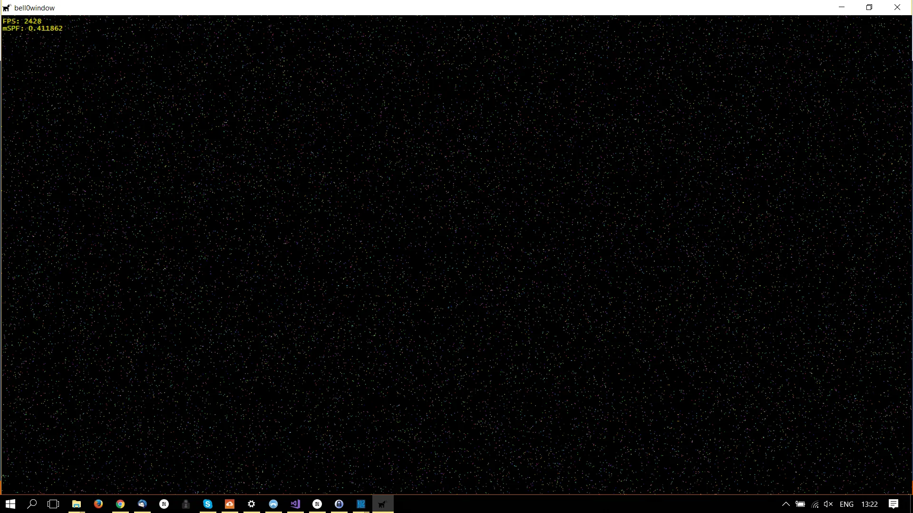

> Not just beautiful, though - the stars are like the trees in the forest, alive and breathing. And they're watching me.
>
> – Haruki Murakami, Kafka on the Shore

It is time to add some more colours to our game. In this tutorial, we will learn how to add a colour to each vertex and how to change the shaders to work with colours as well. To illustrate the new concepts, a colourful star field will be rendered.

## Input Element Description
So far, the vertex structure only specified the position of the vertices. To add a colour to each vertex, three more floats must be added to represent the red, green, and blue amount of the desired vertex colour:

```cpp
// structure to hold vertex data
struct VERTEX
{
	float x, y, z;						// position
	float r, g, b;						// colour
}
```

Having updated the vertex structure, DirectX must obviously be told how to handle those changes by appropriately modifying the *D3D11_INPUT_ELEMENT_DESC*:

```cpp
// specify the input layout
D3D11_INPUT_ELEMENT_DESC ied[] = {	{ "POSITION", 0, DXGI_FORMAT_R32G32B32_FLOAT, 0, 0, D3D11_INPUT_PER_VERTEX_DATA, 0 },
									{ "COLOR", 0, DXGI_FORMAT_R32G32B32_FLOAT, 0, 12, D3D11_INPUT_PER_VERTEX_DATA, 0 } };
```

There is one important little detail here that has to be addressed: The crux is the fifth member, the *AlignedByteOffset*, the offset (in bytes) between each element in the input description. DirectX needs to know how many bytes into the structure, from the beginning, a specific element begins. The *COLOR* element does not start at the beginning, but $12 = 3\cdot4$ (a float takes 4 bytes) bytes after the beginning.

We could use the *D3D11_APPEND_ALIGNED_ELEMENT* flag for convenience to define the current element directly after the previous one, including any packing if necessary. But for now, calculating three times four isn't too difficult yet.

## High Level Shading Language
Now that the vertices have a position and a colour attributed to them, the shaders Visual Studio created no longer do the job. The problem is that the vertex shader is completely oblivious to the colour data and only outputs the position of the vertex. So we have to make three changes:

1. Tell the vertex shader about the position and the colour of each vertex.
2. Output both the position and the colour.
3. Tell the pixel shader to return the desired colour of the pixel.

None of this is really difficult, only step 2 needs some explanation.

### Colour Input
To tell the vertex shader about the colour of a vertex, a minor change is sufficient:

```cpp
float4 main(float3 pos : POSITION, float3 col : COLOR) : SV_POSITION
{
 ...
}
```

Adding a simple parameter with the COLOR semantic is enough to let the vertex shader know the colour of each vertex.

### Multiple Values Output
We still have to deal with the fact that the vertex shader outputs only the position of each vertex, but not its colour. To render each pixel with the appropriate colour, however, the vertex shader must pass the colour data to the pixel shader.

To return multiple values, a structure can be used. Thankfully, structures in HLSL work just the same as in C:

```cpp
struct VertexOut
{
	float4 position : SV_POSITION;
	float4 colour : COLOR;
};

VertexOut main(float3 pos : POSITION, float3 col : COLOR)
{
	// create a VertexOut structure
	VertexOut vertexOutput;

	// transform the position into homogeneous coordinates (projective geometry)
	vertexOutput.position = { pos.x, pos.y, pos.z, 1.0f };

	// set the colour (set full alpha)
	vertexOutput.colour = { col.x, col.y, col.z, 1.0f };

	// return position
	return vertexOutput;
}
```

The new vertex shader still does not do very much, but it does pass the position and colour of each vertex to the pixel shader. If you have been paying close attention, you should have noticed that the semantic of the function has been removed, but in return, to replace it, each member of the *VertexOut* struct has a semantic attached to itself.

### Pixel Shader
Changing the pixel shader is straight forward:

```cpp
float4 main(float4 pos : SV_POSITION, float4 col : COLOR) : SV_TARGET
{
	return col;
}
```

The new pixel shader simply outputs the colour of each pixel. It is important to note that when passing variables between shaders, to have to always be in the correct order, that is, in our example, the output of the vertex shader must be in the same order as the input of the pixel shaders, i.e. first the position, than the colour. 

## A Colourful Starfield

> The nitrogen in our DNA, the calcium in our teeth, the iron in our blood, the carbon in our apple pies were made in the interiors of collapsing stars. We are made of starstuff.
>
> – Carl Sagan, Cosmos

Let us create an array of vertices to generate a beautiful coloured star field. The code to do just that is straightforward: 

```cpp
class DirectXGame : core::DirectXApp
{
private:
	Microsoft::WRL::ComPtr<ID3D11Buffer> vertexBuffer;
	std::vector<graphics::VERTEX> starField;

public:
    ...
}

// initialize graphics
util::Expected<void> DirectXGame::initGraphics()
{
	// create the starfield
	for (unsigned int i = 0; i < 10000; i++)
		starField.push_back({ graphics::randomPosition(), graphics::randomPosition(), graphics::randomPosition(), graphics::randomColour(), graphics::randomColour(), graphics::randomColour() });

	// set up buffer description
	D3D11_BUFFER_DESC bd;
	bd.ByteWidth = sizeof(graphics::VERTEX) * (unsigned int)starField.size();
	bd.Usage = D3D11_USAGE_DYNAMIC;
	bd.BindFlags = D3D11_BIND_VERTEX_BUFFER;
	bd.CPUAccessFlags = D3D11_CPU_ACCESS_WRITE;
	bd.MiscFlags = 0;
	bd.StructureByteStride = 0;

	// define subresource data
	D3D11_SUBRESOURCE_DATA srd = { starField.data(), 0,0 };

	// create the vertex buffer
	if (FAILED(d3d->dev->CreateBuffer(&bd, &srd, &vertexBuffer)))
		return "Critical Error: Unable to create vertex buffer!";

	// return success
	return {};
}

// render scene
util::Expected<int> DirectXGame::render(double /*farSeer*/)
{
	// clear the back buffer and the depth/stencil buffer
	d3d->clearBuffers();
	
	// render

	// print FPS information
	if (!d2d->printFPS().wasSuccessful())
		return std::runtime_error("Failed to print FPS information!");

	// set the vertex buffer
	unsigned int stride = sizeof(graphics::VERTEX);
	unsigned int offset = 0;
	d3d->devCon->IASetVertexBuffers(0, 1, vertexBuffer.GetAddressOf(), &stride, &offset);

	// set primitive topology
	d3d->devCon->IASetPrimitiveTopology(D3D11_PRIMITIVE_TOPOLOGY_POINTLIST);

	// draw 3 vertices, starting from vertex 0
	d3d->devCon->Draw((unsigned int)starField.size(), 0);

	// present the scene
	if (!d3d->present().wasSuccessful())
		return std::runtime_error("Failed to present the scene!");

	// return success
	return 0;
}
```

I wrote little helper functions to create a *random* float between 0.0f and 1.0f for the colour and a *random* float between -1.0f and 1.0f for the position. And yes, I know that those numbers aren't truly random, but this will do for now.

```cpp
namespace graphics
{
	// function to create a "random" float between 0.0f and 1.0f
	static inline float randomColour()
	{
		return static_cast <float> (rand()) / (static_cast <float> (RAND_MAX));
	}

	// function to create a "random" float between -1.0f and 1.0f
	static inline float randomPosition()
	{
		return  static_cast <float> (rand()) / (static_cast <float> (RAND_MAX)) * 2 - 1;
	}
}
```

The astute reader may have noticed that two flags of the buffer description have been changed: *Usage* and *CPUAccessFlags*. To witness the birth and death of stars and galaxies, the data inside the vertex buffer must be changed from time to time.

## Dynamic Buffers
To tell Direct3D that the data inside a buffer will eventually be changed, the vertex buffer must be created with the *Usage* flag set to *D3D11_USAGE_DYNAMIC*. This flag makes the buffer accessible by both the GPU (read only) and the CPU (write only). To reflect that change, we also set the *CPUAccessFlag* to *D3D11_CPU_ACCESS_WRITE*, which tells DirectX that the buffer is to be mappable such that the CPU can change its contents.

To actually update the data, a *[D3D11_MAPPED_SUBRESOURCE](https://msdn.microsoft.com/en-us/library/windows/desktop/ff476182(v=vs.85).aspx)* structure can be used:

```cpp
typedef struct D3D11_MAPPED_SUBRESOURCE {
  void *pData;
  UINT RowPitch;
  UINT DepthPitch;
} D3D11_MAPPED_SUBRESOURCE;
```

Mapping a resource to a subresource is done by using the *[ID3D11DeviceContext::Map](https://msdn.microsoft.com/en-us/library/windows/desktop/ff476457(v=vs.85).aspx)* method:

```cpp
HRESULT Map(
  [in]            ID3D11Resource           *pResource,
  [in]            UINT                     Subresource,
  [in]            D3D11_MAP                MapType,
  [in]            UINT                     MapFlags,
  [out, optional] D3D11_MAPPED_SUBRESOURCE *pMappedResource
);
```

### ID3D11Resource *pResource
The first parameter is a pointer to the resource to map to the subresource, in this case, our vertex buffer.

### UINT Subresource
The second parameter is the index of the subresource contained in the resource, for now, as our buffer does not have any subresources, we will set this to zero.

### [D3D11_MAP](https://msdn.microsoft.com/en-us/library/windows/desktop/ff476181(v=vs.85).aspx) MapType
The third parameter specifies the CPU's read and write permissions for the resource. In this tutorial, we will set this to *D3D11_MAP_WRITE_DISCARD*, which means that the resource will be mapped for writing and all the previous contents of the resource will be undefined, i.e. the hardware will discard the entire buffer and return a pointer to a newly allocated buffer.

### UINT [MapFlags](https://msdn.microsoft.com/en-us/library/windows/desktop/ff476183(v=vs.85).aspx)
The fourth parameter is a flag that specifies what the CPU does when the GPU is busy. This flag is optional, and we will set it to zero for now.

### D3D11_MAPPED_SUBRESOURCE *pMappedResource
When the function returns, the fifth parameter contains the pointer to the newly mapped *D3D11_MAPPED_SUBRESOURCE* structure for the mapped subresource. From this moment on, any changes to the subresource will be reflected in the vertex buffer.

---

To unmap a subresource, a call to *[ID3D11DeviceContext::Unmap](https://msdn.microsoft.com/en-us/library/windows/desktop/ff476485(v=vs.85).aspx)*, which invalidates the pointer to a resource and re-enables the GPU's access to that resource, is sufficient. 

---

And here is the entire code to update the starfield over time:
```cpp
util::Expected<int> DirectXGame::update(double /*dt*/)
{	
	// update vertex buffer
	if (FAILED(d3d->devCon->Map(vertexBuffer.Get(), 0, D3D11_MAP_WRITE_DISCARD, 0, &mappedStarField)))
		return "Critical error: Unable to map subresource!";

	// randomly change the starfield
	graphics::VERTEX* v = reinterpret_cast<graphics::VERTEX*>(mappedStarField.pData);

	for (unsigned int i = 0; i < starField.size(); i++)
		v[i] = { graphics::randomPosition(), graphics::randomPosition(), graphics::randomPosition(), graphics::randomColour(), graphics::randomColour(), graphics::randomColour() };

	d3d->devCon->Unmap(vertexBuffer.Get(), 0);

	// return success
	return 0;
}
```



Although this tutorial was again rather short, we learned two important lessons: how to add colour information to our vertices and how to dynamically change the data inside a vertex buffer.

---

You can download the source code from [here](https://filedn.eu/ltgnTcOBnsYpGSo6BiuFrPL/Game%20Programming/Fundamentals/DirectX/starfield.7z).

---

In the next tutorial, we will learn how to use DirectX to create fullscreen games. For now, though, my young Padawan, just sit back, enjoy the star field and relax.

---

# References

## Literature
 * Tricks of the Windows Game Programming Gurus, by André LaMothe
 * Microsoft Developer Network ([MSDN](https://msdn.microsoft.com/en-us/library/windows/desktop/ee663274(v=vs.85)))