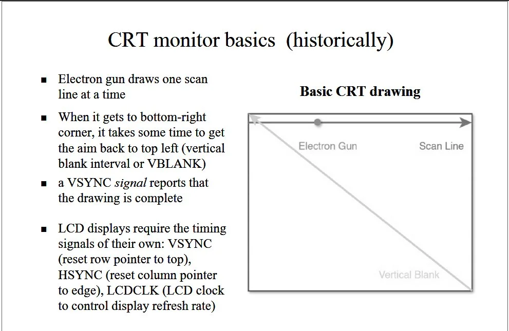
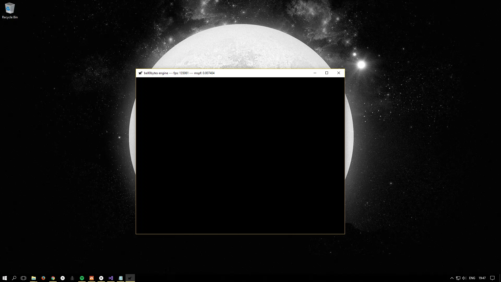

The GPU contains in its memory a pointer to a buffer of pixels encoding the image currently being displayed on the
screen. When asked to render a scene, the GPU updates this buffer and sends the new information to the monitor to
display. The monitor then redraws the screen from top to bottom, replacing the old image with the new one.

However, there is a slight problem with this in that the monitor does not refresh as fast as needed for real-time
rendering. To understand this, we must understand how computer monitors work. As an example, we will have a brief look
at [Liquid Crystal Displays](https://en.wikipedia.org/wiki/Liquid-crystal_display), or LCDs.

## The Theory

### Liquid Crystal Displays

[Liquid crystals](https://en.wikipedia.org/wiki/Liquid_crystal) are organic molecules that flow like a liquid while
retaining their lattice structures like solid crystals. They were first discovered in 1880 by the Austrian botanist and
chemist [Friedrich Reinitzer](https://en.wikipedia.org/wiki/Friedrich_Reinitzer) and first applied to small displays in
the 1960s. Using electric fields, the alignment of the molecules can be controlled, and thus the optical properties can
be changed.

An LCD consists of liquid crystal sealed in between two parallel glass plates with electrodes attached to them. In the
widely used active matrix displays, there is a switch at each pixel position on one of the electrodes; by turning those
switches on and off, it is possible to create an arbitrary voltage pattern across the entire screen, allowing arbitrary
bit patterns. Those switches are often
called [thin film transistors](https://en.wikipedia.org/wiki/Thin-film_transistor), and the monitors using this
technology are widely known as TFT displays.

A light source, originally [cold cathodes](https://en.wikipedia.org/wiki/Cold_cathode), but in modern screens
usually [light-emitting diodes](https://en.wikipedia.org/wiki/Light-emitting_diode) (LEDs save power and allow for even
thinner displays —
see [here](https://www.scotlightdirect.co.uk/blog/2018/11/everything-you-need-to-know-about-led-lighting/) to learn more
about LEDs), illuminate the screen from the back, and the alignment of the crystals determines the visual output at the
front.

Obviously, this setup only provides monochromatic images, the idea behind coloured images is the same, but the
technological details are a lot more complicated.

---

If this brief introduction piqued your interest, and you want to learn more about LEDs from professionals, check
out [this great article](https://www.scotlightdirect.co.uk/blog/2018/11/everything-you-need-to-know-about-led-lighting/)
from [Scotlight Direct](https://www.scotlightdirect.co.uk/blog/). Established in 1996, Scotlight has over thirty years
of experience in the commercial and retail lighting industry. I am sure they can teach us a thing or two, for example,
about how LEDs are contributing to a *greener planet*.

### Video Random Access Memory and Color Palettes

The image on the display is taken from a pixel buffer, a special memory inside the GPU, called video random access
memory, or VRAM for short. For example, in a $1920 \times 1080$ resolution, the VRAM would contain an array of $1920
\cdot 1080$ values, one value for each pixel to represent. Those values might simply be a $3$-byte RGB value,
representing the red, green, and blue component of each pixel, thus requiring $6,2208$MB of VRAM. In the olden days,
this was a lot of space, and thus a little trick was used: the desired colour of each pixel was stored in an 8-bit
number, used as an index to retrieve the actual colour in a hardware table, the colour palette. This reduced the VRAM
requirement by $\frac{2}{3}$, but only allowed $256$ colours to be active on the screen at once. Famous Blizzard games,
such as Diablo II and Starcraft used this technique successfully, but nowadays, VRAM isn't as limited any more.

The above-mentioned example used the $24$-bit, or true colour mode, which uses exactly one byte per colour, providing
access to $256^3 = 16777216$ different colours. Unfortunately, this makes for ugly addressing and many video cards
actually do not support $24$-bit colours, they use $32$-bit colours instead.

In $32$-bit colour mode, the data for each pixel is stored in a format using eight bits for alpha, or the transparency
information, and eight bits for each colour. So basically, this format is a variant of the true colour format in which
the additional eight bits are allocated to hold transparency or other information. In the previous tutorial, Direct3D
was created to support the BGRA-colour mode (blue, green, red, alpha).

### Memory Bandwith and Accelerated Graphics Ports

Another problem was the limited bandwidth from the CPU to the VRAM, for example, copying $6$MB for at least $60$ frames
per second, a total data rate of $360$MB per second is necessary. This is way above what any older computer could
handle. Thankfully, with the invention of the Pentium II, and
the [Accelerated Graphics Port](https://en.wikipedia.org/wiki/Accelerated_Graphics_Port), or AGP, this issue was solved
as well. Already the very first such port could transfer data at $252$MB per second, and nowadays, the numbers are even
more impressive, with AGP3 allowing transfers at $2133$MB per second.

Okay, so, we have enough VRAM and the bandwidth between the CPU and the VRAM is very fast, what then is the difficulty?

### Refresh Rates

Most displays are refreshed between 60 and 100 times per second. In the International System of Units (SI), the refresh
rate, or the frequency of those refreshes, is denoted by Hertz, or Hz, named after the German
physicist [Heinrich Hertz](https://en.wikipedia.org/wiki/Heinrich_Hertz).

To refresh the screen, in oldschool [CRT](https://de.wikipedia.org/wiki/Kathodenstrahlr%C3%B6hrenbildschirm) monitors,
an electron gun, firing streams of electrons, is moved horizontally across the screen. The gun starts *drawing* in the
top-left corner of the screen and shifts to the right horizontally to draw the first so-called *scanline*. It then
repositions itself at the left edge of the next scanline to start drawing again. This process is repeated until all
scanlines have been drawn.

Once the drawing is complete, the electron gun is positioned at the bottom-right edge of the screen. The time it takes
for the electrical gun to move back to its original position in the top-left corner of the screen is called
the [vertical blank interval](https://en.wikipedia.org/wiki/Vertical_blanking_interval), or VBLANK, for short.

While LCDs work somewhat differently, the basic idea of the VBLANK is still very helpful.



Now suppose that the electron gun is halfway done with its job of redrawing the screen, when our application requests
for a new output to be drawn immediately: The new images would only be drawn in the bottom half of the screen, while the
top half would still show the old images. This effect of the screen showing parts of two different frames at the same
time is called [screen tearing](https://en.wikipedia.org/wiki/Screen_tearing).


One solution might be to only update the game data during the VBLANK, but obviously, modern games take longer to compute
updates to the game world than it takes for an electron gun to diagonally race accross the screen once. A possible
solution is the so-called *double buffering* technique, which DirectX implements using a *swap chain*.

## The Swap Chain

To avoid screen tearing, most computer animation is achieved by drawing each frame of animation in an *offscreen* buffer
area, called the backbuffer, and then quickly copying the offscreen image to the visible surface. This is called
*blitting*. As long as the copying is done quickly enough, no screen tearing is visible. This process of drawing an
image in the backbuffer and then copying it to the actual display surface is the above-mentioned technique of *double
buffering*.

However, *blitting* could still cause screen tearing because the image transfer could theoretically still take longer
than the VBLANK. To help with that problem, DirectX, or more precisely, DXGI, also implements a feature called
*swapping*, or *page flipping*, that does just what the name says, it swaps the backbuffer and the display surface:
DirectX uses a pointer for each buffer and simply switches their values.

Obviously, to fully prevent screen tearing, the *swap* must happen during the VBLANK, and the faster the buffer
flipping, the more time we have to update our game world.

In this tutorial, we will implement two back buffers (as VRAM isn't as restricted nowadays).

This setup is the so called *swap chain*, as it is a chain of buffers, swapping positions each time a new frame is
rendered.

### Creating the Swap Chain

In DirectX, the swap chain is represented by a new COM interface,
the [IDXGISwapChain](https://msdn.microsoft.com/en-us/library/windows/desktop/bb174569%28v=vs.85%29.aspx).

To actually create the swap chain, three steps must be completed:

1. The swap chain must be customized by filling out a swap chain description structure.
2. A pointer to a DXGI Factory must be obtained; an object true to its name, as it is capable of creating other DXGI
   objects.
3. The DXGI Factory must be used to actually create the swap chain.

#### [Swap Chain Description](https://msdn.microsoft.com/en-us/library/windows/desktop/bb173075(v=vs.85).aspx)

To tell DirectX what type of swap chain to create, a swap chain description must be filled out:

```cpp
typedef struct DXGI_SWAP_CHAIN_DESC {
  DXGI_MODE_DESC   BufferDesc;
  DXGI_SAMPLE_DESC SampleDesc;
  DXGI_USAGE       BufferUsage;
  UINT             BufferCount;
  HWND             OutputWindow;
  BOOL             Windowed;
  DXGI_SWAP_EFFECT SwapEffect;
  UINT             Flags;
} DXGI_SWAP_CHAIN_DESC;
```

##### [DXGI_MODE_DESC BufferDesc](https://msdn.microsoft.com/en-us/library/windows/desktop/bb173064(v=vs.85).aspx)

This structure describes the display mode of the backbuffer:

```cpp
typedef struct DXGI_MODE_DESC {
  UINT                     Width;
  UINT                     Height;
  DXGI_RATIONAL            RefreshRate;
  DXGI_FORMAT              Format;
  DXGI_MODE_SCANLINE_ORDER ScanlineOrdering;
  DXGI_MODE_SCALING        Scaling;
} DXGI_MODE_DESC;
```

###### UINT Width and UINT Height

Those unsigned integer values indicate the width and height of the swap-chain buffers in pixels. If set to zero, the
swap chain automatically sizes itself to the current resolution of the active window.

###### [DXGI_RATIONAL](https://msdn.microsoft.com/en-us/library/windows/desktop/bb173069(v=vs.85).aspx) RefreshRate

This rational number describes the refresh rate in Hertz. For example, if we want to run with constant 60 fps, we set
this to $\frac{60}{1}$. There is a problem with this, however, if the refresh rate does not fit with the actual display
mode: DirectX then first has to create a new buffer, with the correct resolution, or a close match, which wastes
resources and time. Setting this value to $\frac{0}{1}$ tells DirectX to not check whether the refresh rates fit the
refresh rate of the current display.

###### [DXGI_FORMAT](https://msdn.microsoft.com/en-us/library/windows/desktop/bb173059(v=vs.85).aspx) Format

This member describes the display format to use. See the above explanation of the colour palette for more details. There
are plenty of options to select from. In this tutorial, we will use *DXGI_FORMAT_B8G8R8A8_UNORM*, which means that we
reserve 8 bits for blue, 8 bits for green, 8 bits for red, and 8 bits for transparency, in that order, and each colour
will be stored in an unsigned normalized integer, which is optimized for GPU reading.

###### [DXGI_MODE_SCANLINE_ORDER](https://msdn.microsoft.com/en-us/library/windows/desktop/bb173067(v=vs.85).aspx) ScanlineOrdering

This member describes the scanline drawing mode, i.e. the method the raster uses to create images on a surface. We will
use *DXGI_MODE_SCANLINE_ORDER_UNSPECIFIED* which just means that
the [scan line](https://en.wikipedia.org/wiki/Scan_line) order will be unspecified.

###### [DXGI_MODE_SCALING](https://msdn.microsoft.com/en-us/library/windows/desktop/bb173066(v=vs.85).aspx) Scaling

Those flags indicate how images are to be stretched to fit the backbuffer resolution. We will use
*DXGI_MODE_SCALING_UNSPECIFIED*, which means that our rendered images will just appear in the top-left corner of the
window. Also, since in later tutorials, we will cover going into fullscreen mode and want to make sure that we do not
initiate a mode change when transitioning toto full screen, we are advised to use *DXGI_MODE_SCALING_UNSPECIFIED*
anyway.

---

##### [DXGI_SAMPLE_DESC](https://msdn.microsoft.com/en-us/library/windows/desktop/bb173072(v=vs.85).aspx) SampleDesc

This member describes the [multi-sampling](https://en.wikipedia.org/wiki/Multisample_anti-aliasing) parameters for the
swap chain:

```cpp
typedef struct DXGI_SAMPLE_DESC {
  UINT Count;
  UINT Quality;
} DXGI_SAMPLE_DESC;
```

*Count* is the number of multisamples per pixel and *Quality* is the image quality level, the exact specifications
depend on the GPU. We will talk more about this in a later tutorial, for now, we will disable multisampling by using the
default sampler mode, with no anti-aliasing, with a *count* of $1$ and a *quality* level of $0$.

##### [DXGI_USAGE](https://msdn.microsoft.com/en-us/library/windows/desktop/bb173078(v=vs.85).aspx) BufferUsage

This member describes the surface usage and CPU access options for the back buffer. The back buffer can be used for
shader input or render-target output. We will obviously use *DXGI_USAGE_RENDER_TARGET_OUTPUT* for now, which tells
DirectX to use the back buffer as an output render target.

##### UINT BufferCount

This member sets the number of buffers in the swap chain, including the front buffer. For now, we will create a front
buffer and two back buffers, and thus we set this to three.

##### HWND OutputWindow

An HWND handle to the output window, we will set this to the handle of the main window.

##### BOOL Windowed

This member is a boolean value that specifies whether the output is in windowed mode. Microsoft recommends that swap
chains be created as windowed swap chain and switched to fullscreen afterwards, if so desired. For now, we will stay in
windowed mode; fullscreen applications will be considered in a later tutorial.

##### [DXGI_SWAP_EFFECT](https://msdn.microsoft.com/en-us/library/windows/desktop/bb173077(v=vs.85).aspx) SwapEffect

Those flags describe options for handling the contents of the presentation buffer after presenting a surface, i.e. it
tells DXGI what to do with the buffers once they have been shown and are no longer of use. We will use
*DXGI_SWAP_EFFECT_FLIP_DISCARD*, to specify the flip presentation model and to specify that DXGI discard the contents of
the back buffer after it was presented to the scene. Please note that in windowed mode, DXGI will still *blit* instead
of *flip*.

##### UINT [Flags](https://msdn.microsoft.com/en-us/library/windows/desktop/bb173076(v=vs.85).aspx)

These flags describe further options for the behaviour of the swap chain. For now, we will use
*DXGI_SWAP_CHAIN_FLAG_ALLOW_MODE_SWITCH*, which allows an application to switch between display modes. We will talk more
about that in a later tutorial.

---

Wow, that was a lot of information to cover, but thankfully we do not need to be concerned about all the details just
yet. Here is the actual code to set up the swap chain description:

```cpp
DXGI_SWAP_CHAIN_DESC scd;
scd.BufferDesc.Width = 0;													// width of the back buffer
scd.BufferDesc.Height = 0;													// height
scd.BufferDesc.RefreshRate.Numerator = 0;									// refresh rate: 0 -> do not care
scd.BufferDesc.RefreshRate.Denominator = 1;					
scd.BufferDesc.Format = desiredColourFormat;								// the color palette to use								
scd.BufferDesc.ScanlineOrdering = DXGI_MODE_SCANLINE_ORDER_UNSPECIFIED;		// unspecified scan line ordering
scd.BufferDesc.Scaling = DXGI_MODE_SCALING_UNSPECIFIED;						// unspecified scaling
scd.SampleDesc.Count = 1;													// disable msaa
scd.SampleDesc.Quality = 0;
scd.BufferUsage = DXGI_USAGE_RENDER_TARGET_OUTPUT;							// use back buffer as render target
scd.BufferCount = 3;														// the number of buffers in the swap chain (including the front buffer)
scd.OutputWindow = dxApp->appWindow->getMainWindowHandle();					// set the main window as output target
scd.Windowed = true;														// windowed, not fullscreen$
scd.SwapEffect = DXGI_SWAP_EFFECT_FLIP_DISCARD;								// flip mode and discared buffer after presentation
scd.Flags = DXGI_SWAP_CHAIN_FLAG_ALLOW_MODE_SWITCH;							// allow mode switching
```

## [DXGI Factory](https://msdn.microsoft.com/en-us/library/windows/desktop/bb174535(v=vs.85).aspx)

Since in the last tutorial we created the Direct3D device without a swap chain, we need to retrieve the factory that was
used to create the device to actually create a swap chain now. From the Direct3D device,
an [IDXGIDevice](https://msdn.microsoft.com/en-us/library/windows/desktop/bb174527(v=vs.85).aspx) can be requested using
the *As* function. To finally retrieve the factory that created the Direct3D device, we use
*[GetAdapter](https://msdn.microsoft.com/en-us/library/windows/desktop/bb174531(v=vs.85).aspx)* followed by a call to
*[GetParent](https://msdn.microsoft.com/en-us/library/windows/desktop/bb174542(v=vs.85).aspx)*.

```cpp
// get the DXGI factory
Microsoft::WRL::ComPtr<IDXGIDevice> dxgiDevice;
Microsoft::WRL::ComPtr<IDXGIAdapter> dxgiAdapter;
Microsoft::WRL::ComPtr<IDXGIFactory> dxgiFactory;

// first, retrieve the underlying DXGI device from the Direct3D device
HRESULT hr = dev.As(&dxgiDevice);
if (FAILED(hr))
	return std::runtime_error("The Direct3D device was unable to retrieve the underlying DXGI device!");

// now identify the physical GPU this device is running on
hr = dxgiDevice->GetAdapter(dxgiAdapter.GetAddressOf());
if (FAILED(hr))
	return std::runtime_error("The DXGI Device was unable to get the GPU adapter!");

// finally retrieve the factory
hr = dxgiAdapter->GetParent(__uuidof(IDXGIFactory), &dxgiFactory);
if (FAILED(hr))
	return std::runtime_error("The DXGI Adapter was unable to get the factory!");
```

### Creating the Swap Chain

To finally create the swap chain, we use
the [CreateSwapChain](https://msdn.microsoft.com/en-us/library/windows/desktop/bb174537(v=vs.85).aspx) function:

```cpp
HRESULT CreateSwapChain(
  [in]  IUnknown             *pDevice,
  [in]  DXGI_SWAP_CHAIN_DESC *pDesc,
  [out] IDXGISwapChain       **ppSwapChain
);
```

#### IUnknown *pDevice

This is a pointer to the Direct3D device for the swap chain.

#### DXGI_SWAP_CHAIN_DESC *pDesc

A pointer to a *DXGI_SWAP_CHAIN_DESC* structure containing the desired description for the swap chain.

#### [IDXGISwapChain](https://msdn.microsoft.com/en-us/library/windows/desktop/bb174569(v=vs.85).aspx) **ppSwapChain

A pointer to a variable that receives a pointer to the IDXGISwapChain interface for the swap chain that
*CreateSwapChain* creates.

Here is the function in action:

```cpp
hr = dxgiFactory->CreateSwapChain(dev.Get(), &scd, swapChain.GetAddressOf());
if (FAILED(hr))
	return std::runtime_error("The creation of the swap chain failed!");
```

## Swapping!

With the swap chain created, it can be used to draw, or present, the actual game scene to the screen. This is done using
the *[Present](https://msdn.microsoft.com/en-us/library/windows/desktop/bb174576(v=vs.85).aspx)* function:

```cpp
HRESULT Present(
   UINT SyncInterval,
   UINT Flags
);
```

The SyncInterval integer specifies how to synchronize presentation of a frame with the VBLANK. In *flip* mode, the
possible values are $n=0$, to tell DirectX to cancel the remaining time on the previously presented frame and discard
this frame if a newer frame is queued, or $n=1$ to $n=4$, to ask DirectX to synchronize the presentation after the
$n$-th vertical blank. We will use $0$ for now, accepting that some screen tearing might occur.

The *[Flags](https://msdn.microsoft.com/en-us/library/windows/desktop/bb509554%28v=vs.85%29.aspx)* specify various
options to present the scene, we will *DXGI_PRESENT_DO_NOT_WAIT*, which tells DXGI to not sleep or wait for v-sync.
Please note that present returns with the *DXGI_ERROR_WAS_STILL_DRAWING* if the calling thread is blocked.

### Resizing

There is one more thing to worry about. When the size of the window changes, the back buffers must be resized as well.
This is done using the
*[ResizeBuffers]((https://msdn.microsoft.com/en-us/library/windows/desktop/bb174577%28v=vs.85%29.aspx))* function:

```cpp
HRESULT ResizeBuffers(
   UINT        BufferCount,
   UINT        Width,
   UINT        Height,
   DXGI_FORMAT NewFormat,
   UINT        SwapChainFlags
);
```

#### UINT BufferCount

This specifies the number of buffers in the swap chain, including the front buffer. We can set this to $0$ to indicate
that we do not want to change the number of buffers.

#### UINT Width and UINT Height

Obviously those members specify the width and height of the buffers. If this is set to zero, DXGI will use the width and
height of the client area of the target window.

#### DXGI_FORMAT NewFormat

This specifies the new format to use. Set this value to DXGI_FORMAT_UNKNOWN to preserve the existing format of the back
buffer.

#### UINT [SwapChainFlags](https://msdn.microsoft.com/en-us/library/windows/desktop/bb173076(v=vs.85).aspx)

We don't want to change the flags, and thus we set this to $0$.

Here is an example of how to call the *onResize* function:

```cpp
util::Expected<void> Direct3D::onResize()
{
	// resize the swap chain
	if(FAILED(swapChain->ResizeBuffers(0, 0, 0, desiredColourFormat, 0)))
		return std::runtime_error("Direct3D was unable to resize the swap chain!");

	// return success
	return {};
}
```

## Putting It All Together

Here is the new header for the Direct3D class:

```cpp
class Direct3D
{
private:
	// members
	core::DirectXApp* dxApp;								// pointer to the main application class

	// Direct3D
	Microsoft::WRL::ComPtr<ID3D11Device> dev;				// the actual Direct3D device
	Microsoft::WRL::ComPtr<ID3D11DeviceContext> devCon;		// its context
	Microsoft::WRL::ComPtr<IDXGISwapChain> swapChain;		// the swap chain

	// colour format
	DXGI_FORMAT desiredColourFormat;						// the desired colour format

	// functions to create resources
	util::Expected<void> createResources();					// create device resources, such as the swap chain
	util::Expected<void> onResize();						// resize the resources

public:
	// constructor
	Direct3D(core::DirectXApp* dxApp);
	~Direct3D();

	// present the scene
	util::Expected<void> present();							// present the chain, but flipping the buffers

	friend class core::DirectXApp;
};
```

And here is its implementation:

```cpp
/////////////////////////////////////////////////////////////////////////////////////////
////////////////////////////// Constructor //////////////////////////////////////////////
////////////////////////////////////////////////////////////////////////////////////////
Direct3D::Direct3D(core::DirectXApp* dxApp) : dxApp(dxApp), desiredColourFormat(DXGI_FORMAT_B8G8R8A8_UNORM)
{
	HRESULT hr;

	// define device creation flags,  D3D11_CREATE_DEVICE_BGRA_SUPPORT needed to get Direct2D interoperability with Direct3D resources
	unsigned int createDeviceFlags = D3D11_CREATE_DEVICE_BGRA_SUPPORT;

	// if in debug mode, create device with debug layer
#ifndef NDEBUG
	createDeviceFlags |= D3D11_CREATE_DEVICE_DEBUG;
#endif

	// create the device
	D3D_FEATURE_LEVEL featureLevel;
	hr = D3D11CreateDevice(NULL, D3D_DRIVER_TYPE_HARDWARE, 0, createDeviceFlags, NULL, 0, D3D11_SDK_VERSION, &dev, &featureLevel, &devCon);

	if (FAILED(hr))
	{
		util::ServiceLocator::getFileLogger()->print<util::SeverityType::error>("The creation of the Direct3D device and its context failed!");
		throw std::runtime_error("Unable to create the Direct3D device and its context!");
	}
	else if (featureLevel < D3D_FEATURE_LEVEL_11_0)
	{
		util::ServiceLocator::getFileLogger()->print<util::SeverityType::error>("Critical error: DirectX 11 is not supported by your GPU!");
		throw std::runtime_error("Unable to create the Direct3D device and its context!");
	}

	// now that the device and its context are available, create further resouces
	if (!createResources().wasSuccessful())
	{
		util::ServiceLocator::getFileLogger()->print<util::SeverityType::error>("Critical error: Creation of Direct3D resources failed!");
		throw std::runtime_error("Creation of Direct3D resources failed!");
	}

	//  log success
	util::ServiceLocator::getFileLogger()->print<util::SeverityType::info>("Direct3D was initialized successfully.");
}

Direct3D::~Direct3D()
{
	util::ServiceLocator::getFileLogger()->print<util::SeverityType::info>("Direct3D was shut down successfully.");
}

/////////////////////////////////////////////////////////////////////////////////////////
////////////////////////////// Resource Creation ////////////////////////////////////////
/////////////////////////////////////////////////////////////////////////////////////////
util::Expected<void> Direct3D::createResources()
{
	// create the swap chain

	// fill in the swap chain description
	DXGI_SWAP_CHAIN_DESC scd;
	scd.BufferDesc.Width = 0;												// width of the back buffer
	scd.BufferDesc.Height = 0;													// height
	scd.BufferDesc.RefreshRate.Numerator = 0;									// refresh rate: 0 -> do not care
	scd.BufferDesc.RefreshRate.Denominator = 1;					
	scd.BufferDesc.Format = desiredColourFormat;								// the color palette to use								
	scd.BufferDesc.ScanlineOrdering = DXGI_MODE_SCANLINE_ORDER_UNSPECIFIED;		// unspecified scan line ordering
	scd.BufferDesc.Scaling = DXGI_MODE_SCALING_UNSPECIFIED;						// unspecified scaling
	scd.SampleDesc.Count = 1;													// disable msaa
	scd.SampleDesc.Quality = 0;
	scd.BufferUsage = DXGI_USAGE_RENDER_TARGET_OUTPUT;							// use back buffer as render target
	scd.BufferCount = 3;														// the number of buffers in the swap chain (including the front buffer)
	scd.OutputWindow = dxApp->appWindow->getMainWindowHandle();					// set the main window as output target
	scd.Windowed = true;														// windowed, not fullscreen$
	scd.SwapEffect = DXGI_SWAP_EFFECT_FLIP_DISCARD;								// flip mode and discared buffer after presentation
	scd.Flags = DXGI_SWAP_CHAIN_FLAG_ALLOW_MODE_SWITCH;							// allow mode switching

	// get the DXGI factory
	Microsoft::WRL::ComPtr<IDXGIDevice> dxgiDevice;
	Microsoft::WRL::ComPtr<IDXGIAdapter> dxgiAdapter;
	Microsoft::WRL::ComPtr<IDXGIFactory> dxgiFactory;

	// first, retrieve the underlying DXGI device from the Direct3D device
	HRESULT hr = dev.As(&dxgiDevice);
	if (FAILED(hr))
		return std::runtime_error("The Direct3D device was unable to retrieve the underlying DXGI device!");

	// now identify the physical GPU this device is running on
	hr = dxgiDevice->GetAdapter(dxgiAdapter.GetAddressOf());
	if (FAILED(hr))
		return std::runtime_error("The DXGI Device was unable to get the GPU adapter!");

	// finally retrieve the factory
	hr = dxgiAdapter->GetParent(__uuidof(IDXGIFactory), &dxgiFactory);
	if (FAILED(hr))
		return std::runtime_error("The DXGI Adapter was unable to get the factory!");

	// create the actual swap chain
	hr = dxgiFactory->CreateSwapChain(dev.Get(), &scd, swapChain.GetAddressOf());
	if (FAILED(hr))
		return std::runtime_error("The creation of the swap chain failed!");

	// the remaining steps need to be done each time the window is resized
	if (!onResize().wasSuccessful())
		return std::runtime_error("Direct3D was unable to resize its resources!");

	// return success
	return {};
}

util::Expected<void> Direct3D::onResize()
{
	// resize the swap chain
	if(FAILED(swapChain->ResizeBuffers(0, 0, 0, desiredColourFormat, 0)))
		return std::runtime_error("Direct3D was unable to resize the swap chain!");

	// return success
	return {};
}

/////////////////////////////////////////////////////////////////////////////////////////
////////////////////////////// Scene Presentation////////////////////////////////////////
/////////////////////////////////////////////////////////////////////////////////////////
util::Expected<int> Direct3D::present()
{
	HRESULT hr = swapChain->Present(0, DXGI_PRESENT_DO_NOT_WAIT);
	if (FAILED(hr) && hr != DXGI_ERROR_WAS_STILL_DRAWING)
	{	
		util::ServiceLocator::getFileLogger()->print<util::SeverityType::error>("The presentation of the scene failed!");
		return std::runtime_error("Direct3D failed to present the scene!");
	}

	// return success
	return 0;
}
```

The DirectXApp class was changed as well, the *update* and *render* functions are now purely abstract and must be
implemented by the derived DirectXGame class:

```cpp
/////////////////////////////////////////////////////////////////////////////////////////
///////////////////////////////// Update ////////////////////////////////////////////////
/////////////////////////////////////////////////////////////////////////////////////////
void DirectXGame::update(double dt)
{

}

/////////////////////////////////////////////////////////////////////////////////////////
///////////////////////////////// Render ////////////////////////////////////////////////
/////////////////////////////////////////////////////////////////////////////////////////
util::Expected<int> DirectXGame::render(double farSeer)
{
	// present the scene
	if (!d3d->present().wasSuccessful())
		return std::runtime_error("Failed to present the scene!");

	// return success
	return 0;
}
```

An additional change occurred to the Window class, the *onResize* function is now only called after the application has
started completely.

Furthermore, a small error in the *Expected* class was fixed.

When running this program, we see a black screen, i.e. the empty contents of the swap chain buffers. We will soon learn
how to fill those buffers with something meaningful.



And here is the log file:

```
0: 25/7/2017 17:35:43	INFO:    mainThread:	The file logger was created successfully.
1: 25/7/2017 17:35:43	INFO:    mainThread:	The high-precision timer was created successfully.
2: 25/7/2017 17:35:43	INFO:    mainThread:	The client resolution was read from the Lua configuration file: 800 x 600.
3: 25/7/2017 17:35:44	INFO:    mainThread:	The main window was successfully created.
4: 25/7/2017 17:35:45	INFO:    mainThread:	Direct3D was initialized successfully.
5: 25/7/2017 17:35:45	INFO:    mainThread:	The DirectX application initialization was successful.
6: 25/7/2017 17:35:45	INFO:    mainThread:	Game initialization was successful.
7: 25/7/2017 17:35:45	INFO:    mainThread:	Entering the game loop...
8: 25/7/2017 17:35:53	INFO:    mainThread:	The main window was flagged for destruction.
9: 25/7/2017 17:35:53	INFO:    mainThread:	Leaving the game loop...
10: 25/7/2017 17:35:53	INFO:    mainThread:	The game was shut down successfully.
11: 25/7/2017 17:35:53	INFO:    mainThread:	Direct3D was shut down successfully.
12: 25/7/2017 17:35:53	INFO:    mainThread:	Main window class destruction was successful.
13: 25/7/2017 17:35:53	INFO:    mainThread:	The timer was successfully destroyed.
14: 25/7/2017 17:35:53	INFO:    mainThread:	The DirectX application was shutdown successfully.
15: 25/7/2017 17:35:53	INFO:    mainThread:	The file logger was destroyed.
```

---

You can download the source code
from [here](https://filedn.eu/ltgnTcOBnsYpGSo6BiuFrPL/Game%20Programming/Fundamentals/DirectX/swapChain.7z).

In the next tutorial, we will learn about view ports and render targets, that is, we will learn how to tell Direct3D
where exactly and how it is allowed to draw.

## References

### Literature

* [Scotlight Direct](https://www.scotlightdirect.co.uk/blog/)
* Tricks of the Windows Game Programming Gurus, by André LaMothe
* Microsoft Developer Network ([MSDN](https://msdn.microsoft.com/en-us/library/windows/desktop/ee663274(v=vs.85)))

### Images

* Microsoft
* Paavo Huhtala
* University of Maine
* University of Mary Washington
* Wikipedia