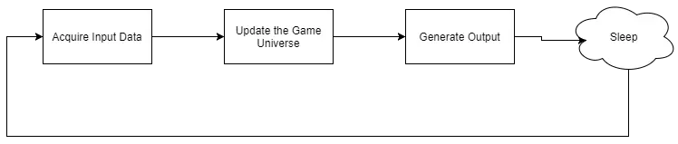
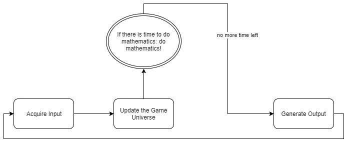

The game loop is the heart of every game. It is well known that a healthy heart is the key to longevity. As briefly mentioned in the last tutorial, it is preferable to have the heart beat with a fixed frequency, else numerical instability might occur while doing mathematical computations, endangering not only the heart, but the health of the entire body.

We will now discuss four ways to implement a game loop.

## Unlimited FPS
The game loop implemented in the last tutorial seemed almost natural: updating the game objects based on the time $\Delta_t$ elapsed between two frames seems ideal. It is featured in many books and online tutorials, so what could possibly go wrong? 

Meet the bad guy, my ancient nemesis: numerical analysis! And numerical analysis is so evil, it will turn this beautiful game loop into a non-deterministic hell! 

Actually, this game loop has problems both on slow and on fast machines. Think back to the poor student running around campus, trying to avoid the professors.

As the game slows down, the game world will be updated in bigger steps, resulting in rougher animations, and a lower reaction time both for the player and the AI-controlled professors. The difference between $60$fps and $30$fps is $3$ pixels per frame, as the student moves $2$ pixels per frame on $60$fps and $5$ pixels per frame on $30$fps. Those $3$ pixels could make the difference between life and death: Close your eyes, imagine yourself being said student and notice the big tree in front you, only $3$ pixels away, as suddenly, you realize, you are being played by someone using an old computer, only able to run the game on $30$fps, and he is just about to press the forward button on the keyboard… Ouch! The survival of the student depends on the heartbeat, or the framerate, of the game.

Okay, so this is bad on slow computers, but what about fast computers? Surely, animations are smooth now and the reaction time is ideal. Well, the simple fact that the memory space of computers is limited, leads to the explosion of *rounding errors*. Let us use [PARI/GP](https://pari.math.u-bordeaux.fr/), a computer algebra system designed for fast computations in number theory, to show what catastrophic damage rounding errors can lead to, even when using floating-point arithmetic with very high precision. The effects seen here will be even worse in C++.

Now assume that the poor student is walking around the campus at the average speed of an average human being: 

$$
3 \text{ km/h } = \frac{3 \cdot 1000}{60 \cdot 60} = \frac{5}{6} \approx 0,83333333333333333333333333333333333333 \text{ m/s }.
$$

At first, the student is in a part of the campus that the game can run in $60$fps. Watch what happens when the student walks forward in a straight line for ten seconds:

```bash
? speed=(3*1000)/(60^2)*1.0
= 0.83333333333333333333333333333333333333
? distance1=0
= 0
? ticks1=0
= 0
? spf1=1/60*1.0
= 0.016666666666666666666666666666666666667
? while(ticks1<10, distance1+=speed*spf1; ticks1+=spf1)
? distance1
= 8.3472222222222222222222222222222222170
```

Now clearly 

$$
8,3472222222222222222222222222222222170 \neq 10 \cdot 0,83333333333333333333333333333333333333,
$$
so, what happened? We broke one of the most important rules of numerical analysis: While doing so many additions, the roundoff errors from the non-exact representations of *speed* and *spf* exploded on us.

But still, let us continue with the game. After moving around, the student is now at a more quiet place of the campus that the game can handle with $120$fps. Once again, the student moves forward for ten seconds:

```bash
? speed=(3*1000)/(60^2)*1.0
= 0.83333333333333333333333333333333333333
? distance2=0
= 0
? ticks2=0
= 0
? spf2=1/120*1.0
= 0.0083333333333333333333333333333333333334
? while(ticks2<10, distance2+=speed*spf2; ticks2+=spf2)
? distance2
= 8.3402777777777777777777777777777777720
```

Okay, now, not only is 

$$
8,3402777777777777777777777777777777720 \neq 10 \cdot 0,83333333333333333333333333333333333333,
$$
but also

$$
8,3472222222222222222222222222222222170 \neq 8,3402777777777777777777777777777777720
$$
and

```bash
? distance1
= 8.3472222222222222222222222222222222170
? distance 2
= 8.3402777777777777777777777777777777720
? distance1-distance2
= 0.0069444444444444444444444444444444450035
```

So the difference between $60$fps and $120$fps is $0,0069444444444444444444444444444444450035 \text{ m / s, }$ that is about $0,025$ km/h. Thus, a player playing the game on a faster PC ($120$fps) and a player playing on a normal PC ($60$fps) will experience differences in their gameplay, which is simply not acceptable.

Numerical analysis has truly turned this promising game loop into a nightmare: the game is no longer deterministic and just imagine what those roundoff errors could do to the physics engine, or simply ask the U.S. Military about the [Patriot System](https://sdqweb.ipd.kit.edu/publications/pdfs/saglam2016a.pdf).

**Conclusion**: The effects of numerical instability can be as subtle as the game feeling slightly different depending on the frame rate or as extreme as objects moving through walls and jumping to outer space. It is utterly unrealistic to expect mathematical stability with a fluid framerate. Thus, even though this game loop is featured in many prominent books about game programming and various famous online tutorials, there can be only one final verdict: Guilty. Game over!

## Constant FPS
A first solution would be simply to take a nap if things are going too quickly. To run the game with constant $x$ frames per second, simply sleep for $\frac{1000}{x} - \Delta_t$ milliseconds.



Here is an example for a game loop with constant $60$fps per second, that is, the game has roughly about $17$ms to do all of its work per frame. 

```cpp
// set constant frame rate of 60 frames per second
const int constantFPS = 60;
const double constantMSPF = 1000 / (double)constantFPS;

for(;;)
    timer->tick();
    if (!isPaused)
	{
    	// sleep if things are going too quickly
		Sleep(constantMSPF - timer->getDeltaTime());
	
        // acquire input
		
		// now update the game logic based on the input and the elapsed time since the last frame
		update();

		// generate output
	}
}
```

What happens if it takes longer than $17$ms to update the game universe? Well, then the game sleeps for a negative amount of time! Okay, we could check for that, but really, the game will run slower. If in some parts of the world the computations are more difficult, the game will slow down there considerably and the game will end up with a different heartbeat depending on where the player is. Obviously, when that happens, the graphic quality could be reduced, but who would want that? This is simply not acceptable.

If the hardware is powerful enough and if the algorithms are carefully designed, everything goes well: For example, if it takes $10$ms in total to get the input data, to update the game world and to render the scene, the game sleeps for about $17-10=7$ milliseconds and then continues with the next frame. Obviously, this is wasting precious time though, why run a game with a fixed framerate if it could run much faster, after all, the higher the framerate, the smoother the animations. This game loop deliberately keeps state-of-the-art gaming computers down; it is an enemy of science and progress! On a side note though, on laptops or phones this could be useful to not constantly keep the hardware on the edge to save some battery power.

**Conclusion**: This is a not-so-good idea for a game loop. It is easily implemented, and writing a physics engine based on a fixed framerate is easy. On mobile devices, it could save battery power. It is problematic on slow machines, though, and it hinders scientific progress.

## Mathematical Freedom
Thinking about the problems of both game loops above, it becomes clear that we want the best of both worlds. We want $\Delta_t$ to be constant, for numerical stability, as well as unlimited frames per second for rendering. Obviously, those two goals are mutually exclusive — unless the design of the game loop is changed. The idea is this: updating the game world, computing the physical simulation, is done with a newly defined constant $\delta_t$, independently of the generation of the output:



```cpp
const int constantFPS = 120;
const double dt = 1000/constantFPS;
double accumulatedTime = 0.0;

for(;;)
{
    timer->tick();
	if (!isPaused)
	{
        // acquire input

        // get time elapsed since the last frame
		accumulatedTime += timer->getDeltaTime();
				
		// now update the game logic based on the input and the elapsed time since the last frame
		while (accumulatedTime >= dt)
		{
			update(dt);
			accumulatedTime -= dt;
		}
				
        // generate output
   }
}
```

At the beginning of each frame, the accumulated time $t_a$ is updated by the time elapsed since the last frame: $t_a = t_a + \Delta_t$. The game is then updated, with a constant $\delta_t$ (equivalent to $120$fps in this example), as often as the accumulated time $t_a$ permits. The key idea to grasp is as follows: generating the output *produces* time which the update of the game universe, the simulation of the physical reality, consumes in small, discrete, $\delta_t$-sized steps. Note that if $t_a$ is not an integer multiple of $\delta_t$, that is, if $\nexists \alpha \in \mathbb{Z} \, : \, t_a = \alpha \cdot \delta_t$, there might sometimes be some unused time left over in $t_a$ after the game universe is updated. This leftover time is not thrown away, but *accumulated*.

In the above example, $\delta_t = \frac{1000}{120} = \frac{25}{3}$ mspf, and if the game runs with $60$fps, the game world is updated twice per frame. If however the game runs with $240$fps, only half of an update step is done — no, that is obviously nonsense — only one update step is done every two frames: $t_a = \frac{1000}{240} = \frac{25}{6} < \frac{25}{3} = \delta_t$, but obviously $2 \cdot t_a = \delta_t$.

On slow computers, this might lead to very long update loops. For large $\Delta_t$, thus large $t_a$, and small $\delta_t$, the while loop will run for a long time. A safeguard would be another constant variable limiting how often the while loop is executed. Anyway, on slower machines the framerate will obviously drop, but the game itself will still be updated at the desired speed.

On faster computers, this game loop no longer suffers from the numerical instability of the Unlimited FPS game loop, but it still wastes CPU cycles, just as the Constant FPS game loop did.

**Conclusion**: While this game loop is a significant improvement over the two others, there is still the problem of having to manually define a value for $\delta_t$ that works on slow and fast machines. Furthermore, there is another big issue hiding in the shadows of an uncertain future! 

## Far Seers
Accumulating the leftover time in the previous game loop is not only wasting precious CPU cycles, no, the fading away of time created a nightmarish ghost, hiding in the shadows of an uncertain future, ready to jump on an unprepared programmer at any moment; and when it does, the game world will be rendered at a point between two updates.

Continuing the above example, imagine the game running at $110$fps. Since in this case $\Delta_t$ is not an integral multiple of $\delta_t$, the game universe will most often be updated once, but sometimes twice per frame, if enough leftover time is accumulated. 

It seems obvious that in most cases $\Delta_t$ will not be an integral multiple of $\delta_t$, that means there will almost always be some time left over that can not be simulated. This means that sometimes the game world will be rendered with some updates left to yet be computed, which leads to stuttering.

For example, think about the student moving across the campus. He just found a t-shirt of his favourite hero, Flash, granting him the power of lightning fast speed. What happens when the student zooms horizontally over the campus, from the left edge of the campus to the right edge, at the moment the game renders between two updates. The student should be seen moving towards the middle of the campus. Yet at the first update, the student is at the left edge, then the game world is rendered, with the student still seen at the left edge of the campus, leading to very rugged movements.

Thankfully, all the information needed to solve this problem is already available. After updating the game, the time left over is stored in $t_a$, which indicates how far ahead the next rendered frame is. By passing this information in a normalized variable $t_r = \frac{t_a}{\delta_t} \in [0,1)$ ($t_r = 0$ at the previous frame and $t_r \approx 1$ arbitrarily close to the next frame; just think about linearly progressing on a line, or think about barycentric coordinates, if you are so inclined — anyway, at the time $t_r=0$ you are at the left edge of the line, and as $t_r$ increases, you simply move forward, and the closer you get to the right edge of the line, the closer $t_r$ approaches $1$), to the output generating function (i.e., the renderer), it can remedy the situation by updating the position of the student with an educated guess (without needing to know the actual value of $dt$). The rendering function needs to look into the future:

Assume that the renderer knows the position and the velocity of each object in the game. Further assume that the student, with his Flash t-shirt, is moving to the right by $800$ pixels per frame, but still standing at the left edge, $x=0$, at the last update, and that the time left over in the accumulator is $t_a = \frac{25}{6} < \delta_t$, then $t_r = \frac{t_a}{\delta_t} = \frac{1}{2}$, which tells the rendering function to draw the student half a frame ahead of his position after the last, trailing, update, that is, at position $x=\frac{800}{2} = 400$.

Obviously, far seeing is always perilous, for example, when the next game update is done, it is discovered that the student actually hit a tree, standing firm at position $x=400$. The position of the student was rendered was based on a guess, and the far seer guessed wrong. The mistake will quickly be discovered and remedied though: The game is updated $120$ frames per second, thus when this happens, the student will only be seen hugging the tree from the inside for the tiniest fraction of a second, surely unnoticeable by human eyesight — and still definitely better than the stuttering occurring without peeking into the future at all.

The analysis of this new game loop in the case of a slow computer is the same as for the previous game loop.

On fast computers, things will run as fast as they possibly can, and with the rendering function peeking into the future, no more stuttering will occur.

**Conclusion**: While this game loop design might make coding the rendering function a bit more difficult, it is clearly the superior of the four designs shown in this tutorial, thus, from now on, this will be the game loop design used.

## Putting It All Together
Here is the new game loop implemented in C++, with $dt:=4.16 \approx \frac{25}{6}$, equivalent to $240$fps and *maxSkipFrames* set to $10$, meaning that as long as the game runs with at least $24$fps, we update the game world normally, else we break out of the update loop after ten iterations to not stall the entire system.

I changed a few of the members of the *DirectXApp* class to be *private*, basically making them constants. Clearly, no other parts of the game need to alter those. Most of the variables needed and used by the derived *DirectXGame* class are still *protected*:

```cpp
class DirectXApp
{
private:
	// folder paths
	std::wstring pathToMyDocuments;			// path to the My Documents folder
	std::wstring pathToLogFiles;			// path to the folder containing log files
	std::wstring pathToConfigurationFiles;	// path to the folder containing the configuration files

	bool validConfigurationFile;			// true iff there was a valid configuration file at startup
	bool activeFileLogger;					// true iff the logging service was successfully registered

	// timer
	Timer* timer;							// high-precision timer
	int fps;								// frames per second
	double mspf;							// milliseconds per frame
	double dt;								// constant game update rate
	double maxSkipFrames;					// constant maximum of frames to skip in the update loop (important to not stall the system on slower computers)
												
	void calculateFrameStatistics();		// computes frame statistics

	// helper functions
	bool getPathToMyDocuments();			// stores the path to the My Documents folder in the appropriate member variable
	void createLoggingService();			// creates the file logger and registers it as a service
	bool checkConfigurationFile();			// checks for valid configuration file

protected:
	// application window
	HINSTANCE appInstance;					// handle to an instance of the application
	Window* appWindow;						// the application window (i.e. game window)

	// game state
	bool isPaused;							// true iff the game is paused 
		
	// constructor and destructor
	DirectXApp(HINSTANCE hInstance);
	~DirectXApp();

	// initialization and shutdown
	virtual util::Expected<void> init();								// initializes the DirectX application
	virtual void shutdown(util::Expected<void>* expected = NULL);		// clean up and shutdown the DirectX application

	// game loop
	virtual util::Expected<int> run();		// enters the main event loop
	void update(double deltaTime);			// update the game world

	// resize functions
	virtual void onResize();				// resize game graphics

	// generating output
	virtual void render(double farseer);	// renders the game world

	// getters
	bool fileLoggerIsActive() { return activeFileLogger; }				// returns true iff the file logger is active

public:
	friend class Window;
};
```

And here is the shiny new game loop!

```cpp
util::Expected<int> DirectXApp::run()
{
	// reset (start) the timer
	timer->reset();

	double accumulatedTime = 0.0;		// stores the time accumulated by the rendered
	int nLoops = 0;						// the number of completed loops while updating the game

	// enter main event loop
    bool continueRunning = true;
	MSG msg = { 0 };
	while(continueRunning)
	{
		// peek for messages
		while(PeekMessage(&msg, NULL, 0, 0, PM_REMOVE))
		{
			TranslateMessage(&msg);
			DispatchMessage(&msg);
            
            if (msg.message == WM_QUIT)
				continueRunning = false;
		}

		// let the timer tick
		timer->tick();

		if (!isPaused)
		{
			// compute fps
			calculateFrameStatistics();

			// acquire input

			// accumulate the elapsed time since the last frame
			accumulatedTime += timer->getDeltaTime();
				
			// now update the game logic with fixed dt as often as possible
			nLoops = 0;
			while (accumulatedTime >= dt && nLoops < maxSkipFrames)
			{
				update(dt);
				accumulatedTime -= dt;
				nLoops++;
			}
				
			// peek into the future and generate the output
			render(accumulatedTime / dt);
		}
	}
	return (int)msg.wParam;
}
```

The sourcode is available [here](https://filedn.eu/ltgnTcOBnsYpGSo6BiuFrPL/Game%20Programming/Fundamentals/Mathematics/gameLoop.7z).

---

Wow, we finally got to use some of our mathematical knowledge to explain game related stuff! Okay, to be honest, we elaborated on physics and the simulation of time and reality, but still, it was fun. There are still many open questions though, such as what happens when VSYNC fails, or how to implement a multithreaded game loop, but those questions are for a later time.

In the next tutorial, we will learn how to acquire keyboard and mouse input from Windows.

## References
(in alphabetic order)
 * Game Programming Algorithms and Techniques, by Sanjay Madhav
 * Game Programming Patterns, by Robert Nystrom
 * Introduction to 3D Game Programming with DirectX 11, by Frank D. Luna
 * Microsoft Developer Network ([MSDN](https://msdn.microsoft.com/en-us/library/windows/desktop/ee663274(v=vs.85)))
 * Tricks of the Windows Game Programming Gurus, by André LaMothe