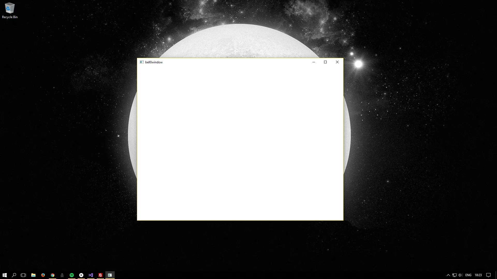

> We choose to go to the moon in this decade and do the other things, not because they are easy, but because they are hard.
>
> -- John F. Kennedy

To be able to read in configuration files and to run scripts later on, we will learn how to use Lua. This tutorial is just an introduction, but when writing code to drive gameplay, it is becoming more and more common to use a scripting language.

## [Lua](https://www.lua.org/)
Lua is Portuguese for *moon*. Lua is also a powerful, yet lightweight, embeddable scripting language, created in 1993 by a team of computer scientists at the [Pontifical Catholic University of Rio de Janeiro](http://www.lua.inf.puc-rio.br/) and it so happens to be the most popular general-purpose scripting language used in games today. 

It is dynamically typed, runs by interpreting bytecode with a register-based virtual machine and has automatic memory management with incremental garbage collection, making it ideal for configuration and scripting.

A famous game using Lua is World of Warcraft by Blizzard. What makes Lua so interesting for games is that Lua is the fastest language in the realm of interpreted scripting languages. Furthermore, adding Lua to an application does not bloat it; the reference C implementation is only about $150$KB in memory.

Okay, so Lua is a fast scripting language engine with small footprint that can be embedded easily into our game. So let us do just that.

### Installation
To start, just download the *x64* binaries from the [Lua website](http://luabinaries.sourceforge.net/download.html) and unpack the contents into a meaningful directory, for example *P:\Lua\x64*.

From now on, we will configure our game as a $64$-bit application. Open the *Properties* window of the project and go to the *VC++ Directories* tab. Make sure to edit the properties for the *x64* platform and for all configurations. The *Include Directories*, *Reference Directories* and *Library Directories* must be edited. First, add *P:\Lua\x64\include* to the *Include Directories*, then, add *P:\Lua\x64* to the two other directories.

Once done, make sure to always compile the project for the $x64$ platform.

Including the Lua library to our project is now as easy as this:

```cpp
// Lua
#include <lua.hpp>
#pragma comment(lib, "liblua53.a")
```

To avoid the .dll hell, simply copy the `lua53.dll` into the working directory of your project. To check if Lua is working, try this minimal example:

```cpp
#include <windows.h>
#include <lua.hpp>
#pragma comment(lib, "liblua53.a")

int WINAPI WinMain(HINSTANCE hInstance, HINSTANCE hPrevInstance, LPSTR lpCmdLine, int nShowCmd)
{
	lua_State *state = luaL_newstate();
	lua_close(state);
	return 0;
}
```

For more information about Lua, check the [documentation](https://www.lua.org/docs.html). As said in the introduction, we will learn more about Lua in later tutorials.

## [Sol](https://sol2.readthedocs.io/en/latest/)
Sol is Portuguese for *sun*. Sol is also the go-to framework for high-performance binding between Lua and C++, with an easy-to-use API.

### Installation
To get Sol, simply [download the header file](https://github.com/ThePhD/sol2/releases) and copy it into the Lua include folder.

---

In later tutorials, we will learn how to fully harness the power of Lua and Sol, but for now, we will be contempt with simply reading the game settings, in this case, the desired screen resolution, from a configuration file on the disk.

### Reading a Configuration File
As a first demonstration of the power of the moon and the sun, we will create a window with the desired resolution read in from the configuration file `bell0prefs.lua` in the *MyDocuments/bell0bytes/bell0tutorials/Settings* folder.

### Cleaning Up
To hide as much of the dirty work from the actual game as possible, the creation of the logger service was moved to the *DirectXApp* class. 

In addition, since now, also configuration files have to be read from the disk, the *DirectXApp* stores the path to the *My Documents* folder, as well as to the *Log* and *Settings* folders of this tutorial. And obviously the logger constructor won't duplicate that code.

```cpp
class DirectXApp
{
protected:
...
	// logger state
	bool activeLogger;						// true iff the logging service was successfully registered

	// folder paths
	std::wstring pathToMyDocuments;		    // path to the My Documents folder
	std::wstring pathToLogFiles;			// path to the folder containing log files
	std::wstring pathToConfigurationFiles;	// path to the folder containing the configuration files
	bool validConfigurationFile;			// true iff there was a valid configuration file at startup

...
	// helper functions
	bool getPathToMyDocuments();			// stores the path to the My Documents folder in the appropriate member variable
	void createLoggingService();			// creates the file logger and registers it as a service
	bool checkConfigurationFile();			// checks for valid configuration file

public:
	friend class Window;
};
```

I won't bother you with the details of all the changes, but please do not be alarmed when noticing that the source code for this tutorial has changed quite a bit from the last tutorial. All of the initialization is now handled by the *DirectXApp* class:


```cpp
util::Expected<void> DirectXApp::init()
{
	// get path to My Documents folder
	if (!getPathToMyDocuments()) 
	{
		// show error message on a message box
		MessageBox(NULL, L"Unable to retrieve the path to the My Documents folder!", L"Critical Error!", MB_ICONEXCLAMATION | MB_OK);
		return std::runtime_error("Unable to retrieve the path to the My Documents folder!");
	}
		
	// create the logger
	try { createLoggingService(); }
	catch(std::runtime_error) 
	{
		// show error message on a message box
		MessageBox(NULL, L"Unable to start the logging service!", L"Critical Error!", MB_ICONEXCLAMATION | MB_OK);
		return std::runtime_error("Unable to start the logging service!");
	}

	// check for valid configuration file
	if (!checkConfigurationFile())
		util::ServiceLocator::getFileLogger()->print<util::SeverityType::warning>("Non-existent or invalid configuration file. Starting with default settings.");

	// create the application window
	try { appWindow = new Window(this); }
	catch (std::runtime_error)
	{
		return std::runtime_error("DirectXApp was unable to create the main window!");
	}
		
	// log and return success
	util::ServiceLocator::getFileLogger()->print<util::SeverityType::info>("The DirectX application initialization was successful.");
	return {};
}
```

The *checkConfigurationFile* function checks for a valid configuration file: If the file is not found or if it is empty, the file is created with default settings (resolution: $800 x 600$). If an error is encountered, the *validConfigurationFile* flag is set to false, telling other game components, so far, there is only the *Window* class, to start with default settings without even trying to read from the configuration file.

### Utility
One thing that is a bit of a hassle is that Sol, or Lua, expect a *std::string* as input for the name of a file to open, thus a *StringConverter* class is needed:

```cpp
class StringConverter
{
public:
	static std::wstring s2ws(const std::string& str);
	static std::string ws2s(const std::wstring& ws);
};
```

```cpp
std::wstring StringConverter::s2ws(const std::string& str)
{
	using convert_typeX = std::codecvt_utf8<wchar_t>;
	std::wstring_convert<convert_typeX, wchar_t> converterX;

	return converterX.from_bytes(str);
}

std::string StringConverter::ws2s(const std::wstring& wstr)
{
	using convert_typeX = std::codecvt_utf8<wchar_t>;
	std::wstring_convert<convert_typeX, wchar_t> converterX;

	return converterX.to_bytes(wstr);
}
```

For details on how these functions work, please look [here](http://en.cppreference.com/w/cpp/locale/wstring_convert). We will see how to make use of them in just a moment.

### The Power of the Sun
Now with all of that out of the way, it is finally time to create a window with a given size instead of *CW_USEDEFAULT*. For that purpose, the *Window* class now has two member variables to store the desired screen resolution and a new private function to load those variables from a file:

```cpp
class Window
{
private:
    ...
	int clientWidth;						// desired client resolution
	int clientHeight;		
    ...
	void readDesiredResolution();			// gets desired screen resolution from config file			

public:
	...
};
```

And here is how to read the configuration file:

```cpp
void Window::readDesiredResolution()
{
    std::wstring pathToPrefFile = dxApp->pathToConfigurationFiles + L"\\bell0prefs.lua";
	try
	{
	    sol::state lua;
	    lua.script_file(util::StringConverter::ws2s(pathToPrefFile));

		// read from the configuration file, default to 200 x 200
		clientWidth = lua["config"]["resolution"]["width"].get_or(200);
		clientHeight = lua["config"]["resolution"]["height"].get_or(200);
...
	}
...
}
```

It was promised that Lua and Sol are lightweight and easy to use, and behold, those promises were true.

#### sol::state lua
The most important Sol class is probably the *sol::state_view*. This structure takes a pointer to an already existing *lua_State* and enables simple access to the Lua interface. 

*sol::state* derives from *sol::state_view*, inheriting all of the functionality, but it has the additional purpose of creating a fresh pointer to a *lua_State* and managing its lifetime by itself. Thank you, Sun - you truly are the enabler of life on Earth!

#### lua.script_file(const std::string &)
This function simply opens the file specified by the *std::string*. This is where the new *StringConverter* class comes into play; we can now easily convert between *std::string* and *std::wstring*. (Since Windows 10 uses Unicode natively, it is wise to keep using wide strings in our project.)

The *lua.script_file* function throws errors, thus in the actual code it is in a *try*-block. In this case, if the opening of the configuration file fails, the application starts with its default settings.

---

Now the true power lies in how easy it truly is to read in the variables. 

Here is the file Lua is supposed to read from:

```lua
config =
{ 
	resolution = { width = 800, height = 600 }
}
```

The *sol::state* behaves exactly like a table. The syntax to get nested variables from the configuration file, is the same as for accessing multidimensional arrays: 

```cpp
// read from the configuration file, default to 200 x 200
clientWidth = lua["config"]["resolution"]["width"].get_or(200);
clientHeight = lua["config"]["resolution"]["height"].get_or(200);
```

The *get_or* function either returns the value read from the configuration file (i.e., the value stored under *config*, then *resolution*, then *width*, which is 800), or the specified value if something went wrong.

Actually, the table is the only complex data type supported by Lua, but it can be used in various ways, as an array, a multidimensional array (as seen above), or even as a dictionary:

```lua
dict = { Me="Méindeg", De="Dënschdeg", Mw="Mëttwoch", Do="Donneschdeg", Fr="Freideg", Sa="Samschdeg", So="Sonndeg" } 

dict[Me];    // returns Méindeg
```

---

Now this is all pretty easy, yet powerful, thus quite exciting! But before we can create a window with the desired resolution, there is one last thing to consider:

## Window Size versus Client Size
When working with windows, it is important to know the exact dimensions of the area that can be tampered with. It is clear that if, for example, a request is made for a $800 x 600$ window to be created, the actual working area won't be $800 x 600$. The window size is $800 x 600$, yes, but the actual client size, the client area being the portion of the window without its borders, won't be. Luckily, the window size need not be computed by hand, the [AdjustWindowRect function](https://msdn.microsoft.com/de-de/library/windows/desktop/ms632665(v=vs.85).aspx) does this for us:

```cpp
BOOL WINAPI AdjustWindowRectEx(
  _Inout_ LPRECT lpRect,
  _In_    DWORD  dwStyle,
  _In_    BOOL   bMenu,
  _In_    DWORD  dwExStyle
);
```

The first parameter is a long pointer to a [rectangle structure](https://msdn.microsoft.com/de-de/library/windows/desktop/dd162897(v=vs.85).aspx) that contains the coordinates of the top-left and bottom-right corners of the desired client area. When the function returns, the structure contains the coordinates of the top-left and bottom-right corners of the window to accommodate the desired client area.

The second parameter defines the style of the window whose required size is to be calculated.

The third parameter indicates whether the window has a menu or not. 

The last parameter defines the extended window style of the window whose required size is to be calculated.

The return value of the function is a bool.

Here is an example to compute the window size of an overlapped window, with no menu, and with the desired client area read from the Lua configuration file:

``` cpp
// read desired screen resolution from a Lua configuration file
readDesiredResolution();

// get window size
RECT rect = { 0, 0, clientWidth, clientHeight };
AdjustWindowRectEx(&rect, WS_OVERLAPPEDWINDOW, false, WS_EX_OVERLAPPEDWINDOW);
		
// create the window
mainWindow = CreateWindowEx(WS_EX_OVERLAPPEDWINDOW, wc.lpszClassName, L"bell0window", WS_OVERLAPPEDWINDOW, CW_USEDEFAULT, CW_USEDEFAULT, rect.right - rect.left, rect.bottom - rect.top, NULL, NULL, dxApp->appInstance, NULL);
if (!mainWindow)
	return std::invalid_argument("The window could not be created; most probably due to invalid arguments!");
```

The desired with and height are stored in the clientWidth and clientHeight member variables, and the *AdjustWindowRect* function then calculates the required window size. This information, the width being $rect.right - rect.left$, and the height being $rect.bottom - rect.top$, is then passed to the *CreateWindowEx* function to create a window with the desired client size.

## Putting It All Together
As already mentioned, all the initialization is now done by the *DirectXApp* class, thus the new WinMain is only concerned about actually doing game related stuff:

```cpp
int WINAPI WinMain(HINSTANCE hInstance, HINSTANCE hPrevInstance, LPSTR lpCmdLine, int nShowCmd)
{
    // create and initialize the game
    DirectXGame game(hInstance);
    util::Expected<void> gameInitialization = game.init();

    // if the initialization was successful, run the game, else, try to clean up and exit the application
    if (gameInitialization.wasSuccessful())
    {
	    // initialization was successful -> run the game
	    util::Expected<int> returnValue = game.run();

	    // clean up after the game has ended
	    game.shutdown(&(util::Expected<void>)returnValue);

	    // gracefully return
	    return returnValue.get();
    }
    else
    {
	    // a critical error occured during initialization, try to clean up and to print information about the error
	    game.shutdown(&gameInitialization);
		
	    // humbly return with an error
	    return -1;
    }
}
```

Please have a look at the [source code](https://filedn.eu/ltgnTcOBnsYpGSo6BiuFrPL/Game%20Programming/Fundamentals/Scripting/moonAndSun.7z) to notice the change from the last tutorial.

Behold, a wild $800$ x $600$ window appeared:



And here is the log file:

```
0: 9/7/2017 0:11:20	INFO:    mainThread:	The file logger was created successfully.
1: 9/7/2017 0:11:20	INFO:    mainThread:	The client resolution was read from the Lua configuration file: 800 x 600.
2: 9/7/2017 0:11:20	INFO:    mainThread:	The main window was successfully created.
3: 9/7/2017 0:11:20	INFO:    mainThread:	The DirectX application initialization was successful.
4: 9/7/2017 0:11:20	INFO:    mainThread:	Game initialization was successful.
5: 9/7/2017 0:11:21	INFO:    mainThread:	The main window was flagged for destruction.
6: 9/7/2017 0:11:21	INFO:    mainThread:	The game was shut down successfully.
7: 9/7/2017 0:11:21	INFO:    mainThread:	Main window class destruction was successful.
8: 9/7/2017 0:11:21	INFO:    mainThread:	The DirectX application was shutdown successfully.
9: 9/7/2017 0:11:21	INFO:    mainThread:	The file logger was destroyed.
```

## Exercise
Play around with the configuration file to create windows of different sizes. Can you feel the power of being able to change the configuration of your application without having to recompile everything?!

## References
* [Lua](https://www.lua.org/)
* [Microsoft Developer Network](https://msdn.microsoft.com/en-us/library/windows/desktop/ee663274(v=vs.85))
* [Sol](https://sol2.readthedocs.io/en/latest/index.html)
* Tricks of the Windows Game Programming Gurus, by André LaMothe