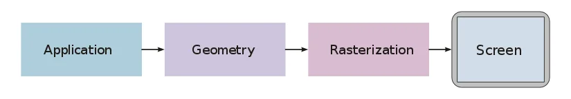
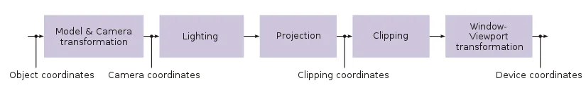
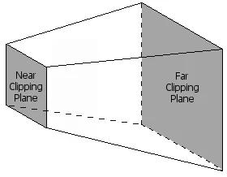
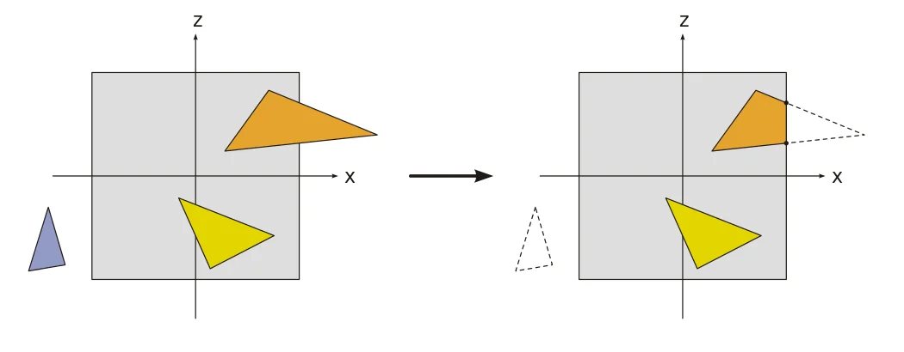
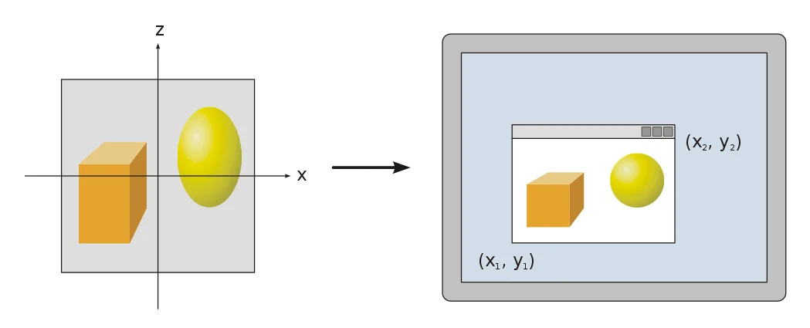
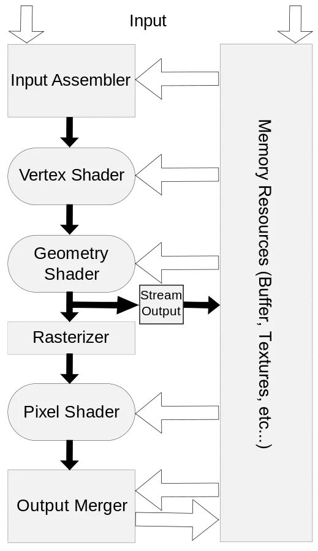

> You can have it in any color you want, as long as it is black.
>
> – H. Ford

As seen in a [previous tutorial about drawing triangles](https://bell0bytes.eu/of-shaders-and-triangles/), to actually
render pixels to the screen, DirectX uses objects called *shaders*. The entire rendering process is controlled by the
graphics rendering pipeline, basically a series of steps which take vertices as input and result in a fully rendered
image. Such a pipeline is programmed by the above-mentioned shaders, and thus a shader is actually a small program that
controls one step of the pipeline.

Once a 3D model has been created, the graphics pipeline is the process of turning that 3D model into the image seen on
the computer monitor. Because the steps required for this operation depend on the software and hardware used and the
desired display characteristics, there is no universal graphics pipeline suitable for all possible cases, however,
Direct3D (and OpenGL and Vulkan and other APIs) does unify similar steps and controls the graphics pipeline of the GPU.

Roughly speaking, a graphics pipeline consists of three main parts:


## The Application Step

The typical tasks tackled in the application step are, for example, collision detection, character animation and
acceleration techniques such as spatial subdivision schemes to reduce the amount of main memory required at a given
time, as, for example, the worlds of modern computer games are far too big to actually fit into the memory at once. We
will cover those techniques in later tutorials.

The application step is executed by software on the CPU; on multicore systems, the software can be parallelized. After
the necessary steps (collision detection, animation, …) are done, the new scene with all its primitives, usually
triangles, lines and points, is then passed on to the next step in the pipeline, the geometry step.

## The Geometry Step

The geometry step is responsible for the majority of vertex operations. It can be divided in five major parts; the
actual details depend on the particular implementation of the pipeline:



A vertex is a *point* in the game world. Many vertices can be used to define geometrical objects, such as triangles. A
triangle is the most common geometric primitive used in computer graphics. It is defined by three vertices and a normal
vector specifying the front face of the triangle. We will talk about this in further details in later tutorials. Just
notice that triangles are preferred over rectangles because triangles always exist in a single plane.

### Model Transformations

The world coordinate system is the coordinate system in which the game world is described mathematically (big thanks to
René). To facilitate mathematical operations, the world coordinate system is always an orthonormal system.

In this stage, the coordinates of each object are computed based on its position in the game world. There will be an
extended tutorial about this subject later on.

### Camera Transformations

In addition to the objects, each *scene* of the game world also defines a virtual camera (the player's viewpoint, for
example) that indicates the position and direction of view from which the scene is to be rendered. To simplify later
projection and clipping, the scene is transformed so that the camera is at the origin, looking along what is usually
called the *z-axis*. The resulting coordinate system is called the Camera Coordinate System, and the transformation is
called Camera Transformation or View Transformation.

### Projection

The 3D projection step transforms the view volume into a cube with the corner point coordinates (-1, -1, -1) and (1, 1,
1). This step is called projection, even though it transforms a volume into another volume (since the resulting
z-coordinates are only used in z-buffering in the later rastering step).

To limit the number of displayed objects, two additional clipping planes are used, transforming the visual volume into a
truncated pyramid called the *View Frustum* (once again, we will cover all of this in a later tutorial).



### Lighting

Scenes often contain different light sources to create a more realistic lighting simulation. Based on those light
sources and material properties of the triangles on the scene, a *light* value is computed for each vertex.

### Clipping

Only the vertices which are within the visual volume (frustum, see above) need to actually be drawn to the monitor, all
other primitives are discarded. This process is called *frustum culling*.



### Viewport

To output the image to any rendering target (viewport), a final transformation, the *Window-Viewport* transformation,
must be applied. This transformation is a composition of a shift and scaling map.



Most of the geometry computation steps are performed in the vertex shader. Since version 10, DirectX requires a custom
vertex shader, while older versions still have a standard shader.

### Rasterisation

In the rasterisation stage of the pipeline, the continuous primitives are transformed into discrete *fragments*,
basically speaking, the pixels visible on the screen. The Pixel Shader, the shader controlling the rasterization step,
is run once for each pixel in the scene, performing, for example, the following duties:

- In the case of overlapping triangles, a z-buffer is used to compute which pixels are visible, and which are not.
- The colour of a fragment, depending on the illumination, texture, and other material properties of the visible
  primitive, is computed, most often through an interpolation using the properties of the vertices of the triangle.
- If a fragment is visible, it can be mixed with already existing colour values in the image if transparency or
  multi-sampling is used.

## DirectX

We will now give an overview over the pipeline as used in DirectX 11:



## Input Assembler

The first stage of the DirectX rendering pipeline is the input assember. This is a very simple stage, it simply collects
all the data from the video memory and prepares it to be used by the pipeline. This is done automatically, and we have
used the input assembler in previous tutorials already, when we used the following functions to define the topology of
our objects.

The following four methods can be used to control the input assembler stage, note that the names all begin with *IA*,
which obviously stands for *Input Assembler*:

### IASetVertexBuffers

This tells the input assembler which vertex buffers to read data from.

### IASetIndexBuffer

This tells the input assembler about the structure of the indices in the vertex buffers.

### IASetInputLayout

This method describes the layout of the vertex data. Here is an example of a previous tutorial:

```cpp

...

// specify the input layout
D3D11_INPUT_ELEMENT_DESC ied[] = {	{ "POSITION", 0, DXGI_FORMAT_R32G32B32_FLOAT, 0, 0, D3D11_INPUT_PER_VERTEX_DATA, 0 },
									{ "COLOR", 0, DXGI_FORMAT_R32G32B32_FLOAT, 0, 12, D3D11_INPUT_PER_VERTEX_DATA, 0 } };

// create the input layout
Microsoft::WRL::ComPtr<ID3D11InputLayout> inputLayout;
if (FAILED(dev->CreateInputLayout(ied, ARRAYSIZE(ied), vertexShaderBuffer.get().buffer, vertexShaderBuffer.get().size, &inputLayout)))
    return "Critical error: Unable to create the input layout!";

// set active input layout
devCon->IASetInputLayout(inputLayout.Get());

...
```

### IASetPrimitiveTopology

This method defines the topology, or what type of primitive, to use.

Here is an example from a previous tutorial, the method to actually render the scene makes use of this method:

```cpp
util::Expected<int> DirectXGame::render(double /*farSeer*/)
{
	// clear the back buffer and the depth/stencil buffer
	d3d->clearBuffers();
	
	// render

	// print FPS information
	if (!d2d->printFPS().wasSuccessful())
		return std::runtime_error("Failed to print FPS information!");

	// set the vertex buffer

	// set primitive topology
	d3d->devCon->IASetPrimitiveTopology(D3D11_PRIMITIVE_TOPOLOGY_POINTLIST);

	// draw vertices

	// present the scene
	if (!d3d->present().wasSuccessful())
		return std::runtime_error("Failed to present the scene!");

	// return success
	return 0;
}
```

---

Although not much can be done at the input assembler stage, this stage is nonetheless the primary bottleneck in graphics
processing: the fewer vertices that pass through this stage, the faster the graphics engine!

---

## Vertex Processing

As noticed above, this is where most of the work is done. In DirectX 11, there are six stages which modify the values of
vertices: the *Vertex Shader* stage, the *Hull Shader* stage, the *Tesselator* stage, the *Domain Shade* stage, the
*Geometry Shader* stage and the *Stream Output* stage. All but one of those stages are optional, namely the vertex
shader, as noted above.

### Vertex Shader

As explained above, the vertex shader modifies the properties of each vertex in the scene, for example, to convert 3D
coordinates to screen coordinates. The vertex shader is thus a function that is executed once per vertex. The parameters
of the function are the information sent from the vertex buffer: in our previous tutorials, those information consisted
of the location and the colour of each vertex.

The vertex shader can be used to modify those values, for example, a special effect to darken all the colours in the
scene could be applied by halving the values of each colour. We will talk more about this in the next tutorial.

### Hull, Tesselator and Domain Shader

Once the vertex shader returns, the vertices run through these three optional and advanced stages of the pipeline. The
purpose of those stages is to take single triangles and to break them into many smaller primitives really quickly, but
we will talk about this in later tutorials.

### Geometry Shader

The geometry shader stage is optional as well, and instead of working with vertices, it operates on primitives, i.e.
triangles or rectangles.

The input and output of the geometry shader are the vertices that constitute a primitive. We will cover the geometry
shader in a later tutorial.

### Stream Output

This automatic stage is basically the opposite of the inputer assembler stage, it takes vertices from the pipeline and
stores them back into video memory.

## Pixel Processing

Once all the vertices of a primitive have been modified as desired, the GPU renders the pixels. To achieve this, it runs
all the vertices through the rasterizer stage, which, see above, determines what pixels to render and in which colour.

### Rasterizer Stage

The rasterizer stage is not programmable and done entirely by the hardware. In previous tutorials we have already used
the *RSSetViewports* function to set the desired viewport for clipping:

```cpp
// set the viewport to the entire backbuffer
D3D11_VIEWPORT vp;
vp.TopLeftX = 0;
vp.TopLeftY = 0;
vp.Width = (float)dsd.Width;
vp.Height = (float)dsd.Height;
vp.MinDepth = 0.0f;
vp.MaxDepth = 1.0f;
devCon->RSSetViewports(1, &vp);
```

### Pixel Shader

The pixel shader is similar to the vertex shader, but it is run once for each pixel on the screen.

---

That's it already. In the next tutorial, we will give a brief overview over the semantics of the High-Level Shader
Language.

## References

### Literature

* Tricks of the Windows Game Programming Gurus, by André LaMothe
* Wikipedia

### Photos

* Wikipedia