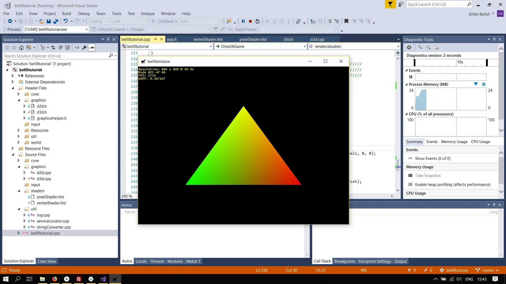
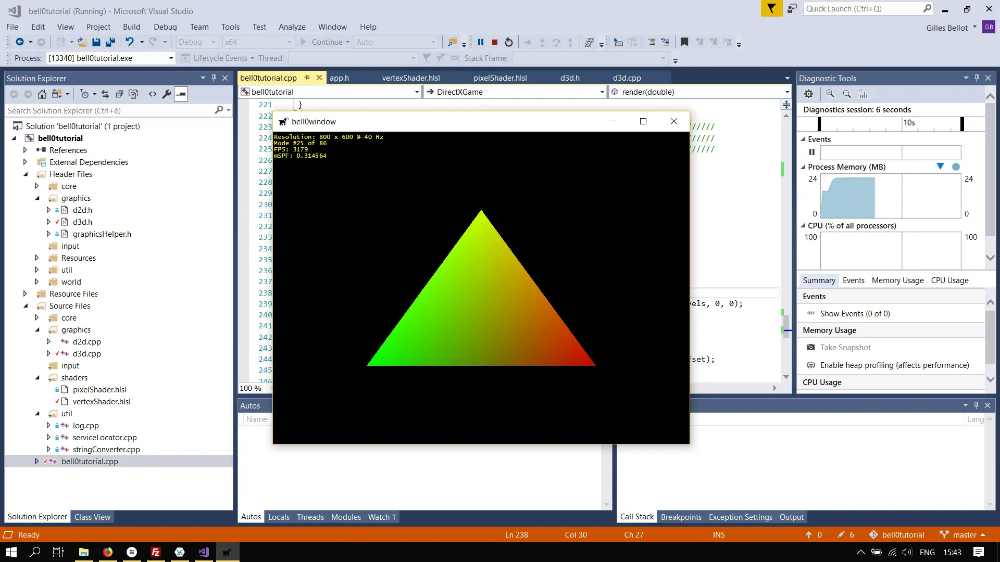
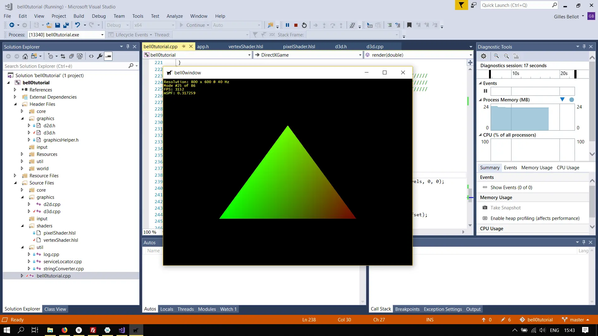
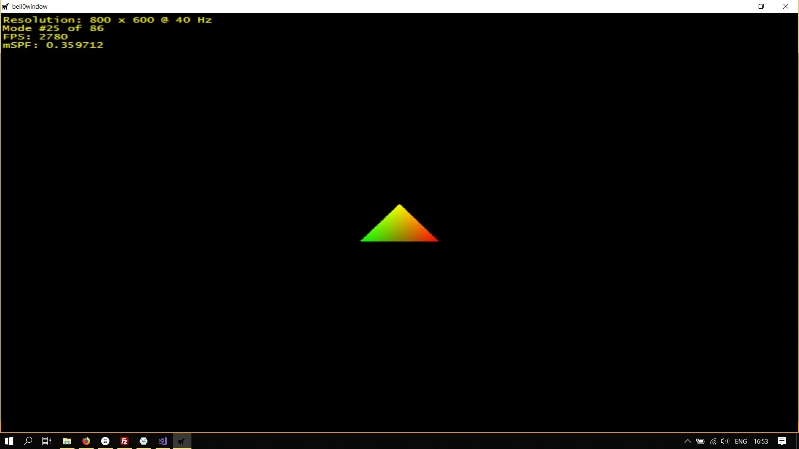
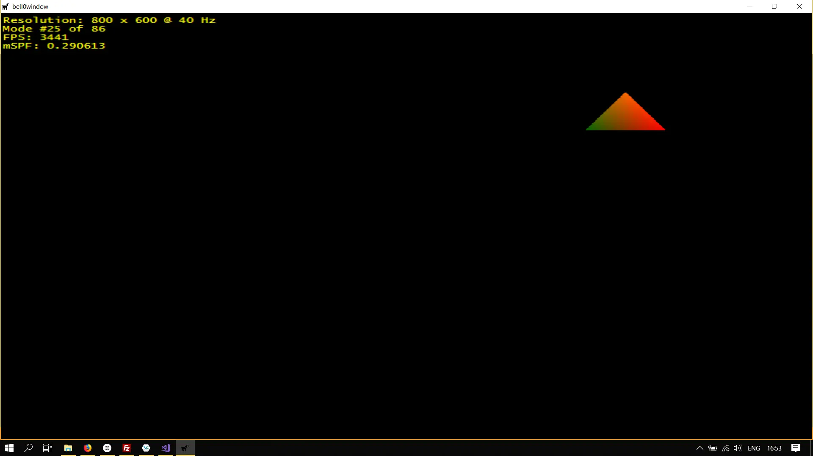

> If we have data, let’s look at data. If all we have are opinions, let’s go with mine.
>
> – J. Barksdale

So far our shaders are very simple functions with constant variables that can not be changed at runtime. In the previous
tutorial, [Among Colourful Stars](https://bell0bytes.eu/among-colourful-stars/), we used dynamic buffers to update the
starfield. In this tutorial we will have a detailed look at constant buffers, used to pass data between the CPU and the
GPU.

## Constant Buffers

To set up a constant buffer, the following four steps must be completed:

1. The desired variables have to be added to the shader.
2. A C++-structure matching the shader variables has to be defined.
3. A constant buffer object has to be created.
4. The constant buffer must be set as *active*.

In a first example we will change the vertex colours over time.

### Add Variables to Shaders

Adding variables to a shader is straightforward. They are basically like *structs*, but they are called *cbuffer*.

```c
cbuffer ConstantColourBuffer
{
	float red;
	float green;
	float blue;
};

struct VertexOut
{
	float4 position : SV_POSITION;
	float4 colour : COLOR;
};

VertexOut main(float3 pos : POSITION, float3 col : COLOR)
{
	// create a VertexOut structure
	VertexOut vertexOutput;

	// transform the position into homogeneous coordinates (projective geometry)
	float4 outputPos = { pos.x, pos.y, pos.z, 1.0f };
	vertexOutput.position = outputPos;

	// set the colour (set full alpha)
	float4 outputCol = { col.r, col.g, col.b, 1.0f };
	outputCol.r *= red;
	outputCol.g *= green;
	outputCol.b *= blue;
	vertexOutput.colour = outputCol;

	// return position
	return vertexOutput;
}
```

Note that the variables can be used without having to refer to the name of the constant buffer.

### Matching C++-structure

This is even simpler than the first step, we simply create a *struct* with the exact same data:

```cpp
struct ColourLevels
{
	float r, g, b;
};
```

Note that the names of the variables are arbitrary, but the order and size of the variables must fit those of the
constant buffer of the shader.

### Creating Constant Buffer Objects

Now comes the difficult part: The creation of the actual constant buffer, but thankfully it is similar to the creation
of a vertex buffer. First, a
*[D3D11_BUFFER_DESC](https://msdn.microsoft.com/en-us/library/windows/desktop/ff476092(v=vs.85).aspx)* structure must be
filled out and created with the
*[CreateBuffer](https://msdn.microsoft.com/en-us/library/windows/desktop/ff476501(v=vs.85).aspx)* method:

```cpp
util::Expected<void> Direct3D::initPipeline()
{
	// load Compiled Shader Object files
    ...
	
    // create the shaders
	...

	// set the shader objects as the active shaders
	...

	// specify the input layout
	...
	
    // create the input layout
	...
		
    // set active input layout
    ...
	
    // define and set the constant buffers
	
	// constant colour buffer
	D3D11_BUFFER_DESC bd = { 0 };
    bd.ByteWidth = 16;
	bd.Usage = D3D11_USAGE_DEFAULT;
	bd.BindFlags = D3D11_BIND_CONSTANT_BUFFER;

	if (FAILED(dev->CreateBuffer(&bd, nullptr, &constantColourBuffer)))
		return "Critical error: Unable to create the constant colour buffer!";
	devCon->VSSetConstantBuffers(0, 1, constantColourBuffer.GetAddressOf());

	// delete shader buffer pointers
	...
	
    // log and return return success
    ...
    
    return { };
}	
```

The following flags are important for constant buffers:

#### UINT ByteWidth

This unsigned int specifies the size of the buffer in bytes. Unfortunately this is a bit tricky, as constant buffers
must always be a multiple of 16 bytes. It is often easier to set this size manually to the appropriate size instead of
using the *sizeof()* operator.

In our example, the *ColourLevels* structure is 12 bytes big (3 floats), thus 16 bytes will be enough. The shader will
ignore the last 4 bytes.

#### [D3D11_USAGE](https://msdn.microsoft.com/en-us/library/windows/desktop/ff476259(v=vs.85).aspx) Usage

This variable identifies how the buffer is expected to be read from and written to. We will set this to
*D3D11_USAGE_DEFAULT* and then use special functions to let the CPU access the buffer as well, as normally the *DEFAULT*
type implies that only the GPU can access the buffer.

#### UINT [BindFlags](https://msdn.microsoft.com/en-us/library/windows/desktop/ff476085(v=vs.85).aspx)

Those flags define how the buffer will be bound to the pipeline. Obviously, we will use the *D3D11_BIND_CONSTANT_BUFFER*
flag this time.

---

After the buffer is created, it must be activated. This is rather straightforward again as there are only two functions
to use, either *VSSetConstantBuffers()* or *PSSetConstantBuffers()* depending on what shader the constant buffers are
being used for (VS: Vertex Shader ; PS: Pixel Shader).

We used the Vertex Shader version:

```cpp
void VSSetConstantBuffers(
  [in]           UINT                StartSlot,
  [in]           UINT                NumBuffers,
  [in, optional] ID3D11Buffer *const *ppConstantBuffers
);
```

#### UINT StartSlot

This is advanced, and we do not need this at the moment, and thus we can safely set this to 0.

#### UINT NumBuffers

This flag defines the number of buffers to activate.

#### ID3D11Buffer *const *ppConstantBuffers

This is an array of constant pointers to constant buffer objects. We simply passed the name of our constant buffer.

---

Easy! We now have a constant buffer set up to manipulate the colour data of each vertex!

### Updating Constant Buffers

To efficiently update the data of constant buffers every frame, DirectX offers us the
*[UpdateSubresource](https://msdn.microsoft.com/en-us/library/windows/desktop/ff476486(v=vs.85).aspx)* method, which
copies data from memory to a subresource created in non-mappable memory.

```cpp
void UpdateSubresource(
  [in]                 ID3D11Resource *pDstResource,
  [in]                 UINT           DstSubresource,
  [in, optional] const D3D11_BOX      *pDstBox,
  [in]           const void           *pSrcData,
  [in]                 UINT           SrcRowPitch,
  [in]                 UINT           SrcDepthPitch
);
```

Thankfully, we only need two of those parameters:

#### [ID3D11Resource](https://msdn.microsoft.com/en-us/library/windows/desktop/ff476584(v=vs.85).aspx) *pDstResource

This pointer to an ID3D11Resource defines the buffer to be updated.

#### const void *pSrcData

This pointer defines where the new data is coming from.

---

Here is an example:

```cpp
util::Expected<int> DirectXGame::render(double /*farSeer*/)
{
	// clear the back buffer and the depth/stencil buffer
	d3d->clearBuffers();
	
	// render

	// print FPS information
	if (!d2d->printFPS().wasSuccessful())
		return std::runtime_error("Failed to print FPS information!");

	// set the new values for the constant buffer
	colourLevels.r -= 0.00001f;
	d3d->devCon->UpdateSubresource(d3d->constantColourBuffer.Get(), 0, 0, &colourLevels, 0, 0);

	// set the vertex buffer
	unsigned int stride = sizeof(graphics::VERTEX);
	unsigned int offset = 0;
	d3d->devCon->IASetVertexBuffers(0, 1, vertexBuffer.GetAddressOf(), &stride, &offset);

	// set primitive topology
	d3d->devCon->IASetPrimitiveTopology(D3D11_PRIMITIVE_TOPOLOGY_TRIANGLELIST);

	// draw 3 vertices, starting from vertex 0
	d3d->devCon->Draw(3, 0);

	// present the scene
	if (!d3d->present().wasSuccessful())
		return std::runtime_error("Failed to present the scene!");

	// return success
	return 0;
}
```

As seen above, the data in the constant buffer is updated by the data in the CoulourLevels structure, effectively
undermining the restriction that the CPU can't write to the constant buffer. In this example, the red colour is slowly
being drained from each vertex.







## Moving Triangle

As a last example, we will add an offset to the position of the triangle. Due to a rift in the space-time continuum, the
triangle is pushed towards the upper-right corner of the screen.

### Vertex Shader

Changing the vertex shader constant buffer to accept both the position and the colour is rather easy:

```c
cbuffer ConstantColourPositionBuffer
{
	float3 xyz; // bytes 0-11
	float3 rgb; // bytes 16-27
};
```

### C++-Structure

Well now things become a bit more tricky. Remember that the GPU wants the constant buffer data to be packed in sizes of
16 bytes. Let us have a look at the C++-structure:

```cpp
// a struct to use as constant buffer
struct ConstantColourPositionBuffer
{
	float x, y, z; // bytes 0-11
	float r, g, b; // bytes 12-23
};
```

Clearly, the data on the CPU is not arranged in the same way as the data on the GPU? We need to add some spacing between
the positions and the colours:

```cpp
// a struct to use as constant buffer
struct ConstantColourPositionBuffer
{
    float x, y, z; // position         - bytes: 0-11
	float spacing; // spacing variable - bytes: 12-15
	float r, g, b; // colour           - bytes: 16-27
};
```

### Creating the Buffer

All we have to change is to tell DirectX to allocate 32 bytes of memory:

```cpp
// constant colour buffer
D3D11_BUFFER_DESC bd = { 0 };
bd.ByteWidth = 32;
bd.Usage = D3D11_USAGE_DEFAULT;
bd.BindFlags = D3D11_BIND_CONSTANT_BUFFER;

if (FAILED(dev->CreateBuffer(&bd, nullptr, &constantColourPositionBuffer)))
	return "Critical error: Unable to create the constant colour and position buffer!";
devCon->VSSetConstantBuffers(0, 1, constantColourPositionBuffer.GetAddressOf());
```

Now we let the triangle drift off towards the sun in the upper-right corner of the map, and as it approaches the sun, it
gets hotter and hotter:




---

All in all, this High-Level Shader Language isn't as bad as its reputation!

## References

* Microsoft Developer Network ([MSDN](https://msdn.microsoft.com/en-us/library/windows/desktop/ee663274(v=vs.85)))
* Wikipedia