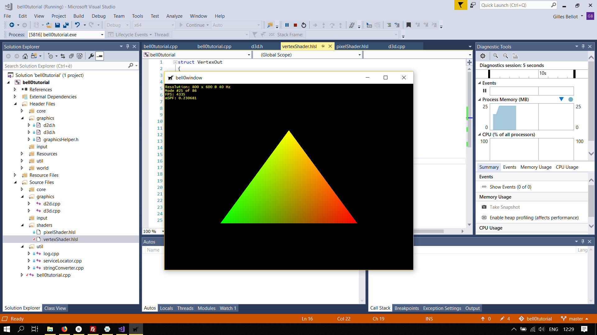

Special shader effects are crucial to create breathtaking visual effects, in movies as well as in games.

We are not quite there yet, obviously, but in this quick tutorial we will write two simple shader effects to get used to
the High-Level Shading language.

## Creating a Triangle

To create a triangle, remember that we need a buffer to hold the vertices:

```cpp
class DirectXGame : core::DirectXApp
{
private:
	Microsoft::WRL::ComPtr<ID3D11Buffer> vertexBuffer;

public:
	...
};
```

The triangle (a small triangle with the top vertex being yellow, the bottom left being green and the bottom right being
red) and buffer are initialized in the *initGraphics()* method:

```cpp
util::Expected<void> DirectXGame::initGraphics()
{
	// create a triangle
	graphics::VERTEX triangleVertices[] = { { 0.0f, 0.1f, 0.3f, 1.0f, 1.0f, 0.0f },
											{ 0.11f, -0.1f, 0.3f, 1.0f, 0.0f, 0.0f },
											{ -0.11f, -0.1f, 0.3f, 0.0f, 1.0f, 0.0f } };

	// set up buffer description
	D3D11_BUFFER_DESC bd;
	bd.ByteWidth = sizeof(graphics::VERTEX) * ARRAYSIZE(triangleVertices);
	bd.Usage = D3D11_USAGE_DEFAULT;
	bd.BindFlags = D3D11_BIND_VERTEX_BUFFER;
	bd.CPUAccessFlags = 0;
	bd.MiscFlags = 0;
	bd.StructureByteStride = 0;

	// define subresource data
	D3D11_SUBRESOURCE_DATA srd = { triangleVertices, 0,0 };

	// create the vertex buffer
	if (FAILED(d3d->dev->CreateBuffer(&bd, &srd, &vertexBuffer)))
		return "Critical Error: Unable to create vertex buffer!";

	// return success
	return {};
}
```

And to draw the triangle, we obviously have to change the *render()* function:

```cpp
util::Expected<int> DirectXGame::render(double /*farSeer*/)
{
	// clear the back buffer and the depth/stencil buffer
	d3d->clearBuffers();
	
	// render

	// print FPS information
	if (!d2d->printFPS().wasSuccessful())
		return std::runtime_error("Failed to print FPS information!");

	// set the vertex buffer
	unsigned int stride = sizeof(graphics::VERTEX);
	unsigned int offset = 0;
	d3d->devCon->IASetVertexBuffers(0, 1, vertexBuffer.GetAddressOf(), &stride, &offset);

	// set primitive topology
	d3d->devCon->IASetPrimitiveTopology(D3D11_PRIMITIVE_TOPOLOGY_TRIANGLELIST);

	// draw 3 vertices, starting from vertex 0
	d3d->devCon->Draw(3, 0);

	// present the scene
	if (!d3d->present().wasSuccessful())
		return std::runtime_error("Failed to present the scene!");

	// return success
	return 0;
}
```

Using the standard shader from the previous tutorials, we get the following image:


Note that in the rasterizer stage, the colours of each pixel on the screen are interpolated from the colours of the
three vertices of the triangle.

## Inverting Colours

As a first effect, we will invert the colours of each vertex. To do that, the vertex shaders sets the colour of each
vertex to 1.0f (maximal value) minus the actual vertex colour:

```c
struct VertexOut
{
	float4 position : SV_POSITION;
	float4 colour : COLOR;
};

VertexOut main(float3 pos : POSITION, float3 col : COLOR)
{
	// create a VertexOut structure
	VertexOut vertexOutput;

	// transform the position into homogeneous coordinates (projective geometry)
	float4 outputPos = { pos.x, pos.y, pos.z, 1.0f };
	vertexOutput.position = outputPos;

	// set the colour (set full alpha)
	float4 outputCol = { 1.0f-col.r, 1.0f-col.g, 1.0f-col.b, 1.0f };
	vertexOutput.colour = outputCol;

	// return position
	return vertexOutput;
}
```


The same effect could be achieved by inverting the colours of each pixel, but obviously that is a lot more work than
simply changing three vertices:

```c
float4 main(float4 pos : SV_POSITION, float4 col : COLOR) : SV_TARGET
{
	col.r = 1.0f - col.r;
	col.g = 1.0f - col.g;
	col.b = 1.0f - col.b;
	col.a = 1.0f - col.a;

	return col;
}
```

## Cold Colours

Colours are divided into what are called warm and cold colors, the yellow and red being termed warm, and the blue cold.
Thus, an easy way to produce cold colours, is to maximize the value of *blue* for each vertex colour (shudders):

```c
struct VertexOut
{
	float4 position : SV_POSITION;
	float4 colour : COLOR;
};

VertexOut main(float3 pos : POSITION, float3 col : COLOR)
{
	// create a VertexOut structure
	VertexOut vertexOutput;

	// transform the position into homogeneous coordinates (projective geometry)
	float4 outputPos = { pos.x, pos.y, pos.z, 1.0f };
	vertexOutput.position = outputPos;

	// set the colour (set full alpha)
	float4 outputCol = { col.r, col.g, 1.0f, 1.0f };
	vertexOutput.colour = outputCol;

	// return position
	return vertexOutput;
}
```


Okay, enough about colours! What about positioning?

## Big Fat Triangles

If triangles eat too much, they get fat, just like humans. This is called *scaling* and can be achieved by simply
multiplying the x and y-coordinates of each vertex by a number bigger than 1:

```c
struct VertexOut
{
	float4 position : SV_POSITION;
	float4 colour : COLOR;
};

VertexOut main(float3 pos : POSITION, float3 col : COLOR)
{
	// create a VertexOut structure
	VertexOut vertexOutput;

	// transform the position into homogeneous coordinates (projective geometry)
	float4 outputPos = { pos.x, pos.y, pos.z, 1.0f };
	outputPos.xy *= 5.0f; // scaling
	vertexOutput.position = outputPos;

	// set the colour (set full alpha)
	float4 outputCol = { col.r, col.g, col.b, 1.0f };
	vertexOutput.colour = outputCol;

	// return position
	return vertexOutput;
}
```



To shrink triangles, it is enough to simply multiply the x and y-coordinates by a number smaller than 1.

---

Obviously those effects can also be combined, this is a fat triangle with inverted colours:

```c
struct VertexOut
{
	float4 position : SV_POSITION;
	float4 colour : COLOR;
};

VertexOut main(float3 pos : POSITION, float3 col : COLOR)
{
	// create a VertexOut structure
	VertexOut vertexOutput;

	// transform the position into homogeneous coordinates (projective geometry)
	float4 outputPos = { pos.x, pos.y, pos.z, 1.0f };
	outputPos.xy *= 5.0f; // scaling
	vertexOutput.position = outputPos;

	// set the colour (set full alpha)
	float4 outputCol = { col.r, col.g, col.b, 1.0f };
	vertexOutput.colour = 1.0f - outputCol; // invert the colours

	// return position
	return vertexOutput;
}
```


---

Now, that wasn't difficult at all! In the next tutorial, we will review our knowledge of constant buffers, i.e. the
manipulation of shader data.

## References

* Microsoft Developer Network ([MSDN](https://msdn.microsoft.com/en-us/library/windows/desktop/ee663274(v=vs.85)))
* Wikipedia