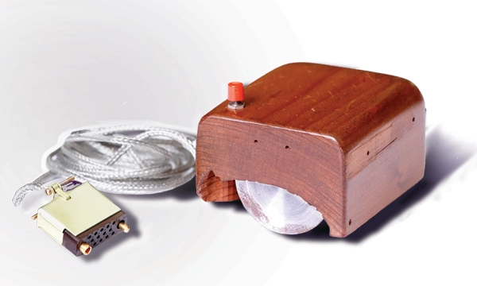

> The mouse was just a tiny piece of a much larger project,
> aimed at augmenting human intellect.
>
> – Dr. Douglas C. Engelbart

Eventually, DirectInput will be responsible to handle user input, yet it is still helpful to learn how to use the Win32
library to access the keyboard and the mouse to handle basic input functionality.

## The Keyboard

A keyboard basically consists of a number of keys, a microcontroller, and some support electronics. The first IBM PC
came with a keyboard that had snap-action switches that gave tactile feedback and made clearly audible clicks when the
keys were pressed far enough. Today, most cheaper keyboards have keys that simply make mechanical contact when
depressed, while more sophisticated keyboards have a magnet under each key that passes through a coil when struck, thus
inducing an electromagnetic current that can be detected. This article is being written on a tactile mechanical keyboard
with audible clicks.

Depressing a key generates an interrupt which invokes the keyboard interrupt handler on the operating system. This
interrupt handler reads a hardware register inside the keyboard controller to get the number of the key that was just
pressed. A second interrupt is created once a key is released, this way, depressing the *Shift* key, then depressing and
releasing the *X* key, the operating system notices that a capital *X* should be written.

Windows processes this incoming stream of information and sends keyboard event messages to the application window, which
the message procedure of the window then has to handle. More precisely, depressing a key on the keyboard generates two
sets of data: the scan code and the ASCII code.

The scan code treats the keyboard as a set of different switches: The scan code registers when a single key is
depressed, but it holds no information on whether any combination of multiple other keys was depressed as well. Scan
codes are handled by the *WM_KEYDOWN* message.

The ASCII code, on the other hand, gives detailed information on what key-combination was depressed. ASCII codes are
handled by the *WM_CHAR* message.

Continuing the above example, scan codes see no difference between *X* and *Shift* + *X*, whereas in ASCII code,
depressing *X*, results in a small *x* and depressing *Shift*+*X* results in a capital *X*.

In the context of computer games, scan codes usually carry all the information needed.
The [WM_KEYDOWN](https://msdn.microsoft.com/en-us/library/windows/desktop/ms646280(v=vs.85).aspx) message has two
parameters, *wParam*, which contains
the [virtual-key code](https://msdn.microsoft.com/en-us/library/windows/desktop/dd375731(v=vs.85).aspx) of the key that
was depressed, and *lParam*, which stores additional information, such as the repeat count, i.e. number of times the
keystroke was repeated as a result of the user holding down the key.

A window procedure could handle the *WM_KEYDOWN* message like this:

```cpp
case WM_KEYDOWN:
	onKeyDown(wParam, lParam);
	return 0;
```

The *onKeyDown* function could then simply switch over the *wParam*:

```cpp
switch (wParam)
{
    case VK_ESCAPE:
		PostMessage(appWindow->mainWindow, WM_CLOSE, 0, 0);
        break;
        
    default: break;
}
```

There is a similar message sent when a key is released, head over to
the [MSDN](https://msdn.microsoft.com/en-us/library/windows/desktop/ms646281(v=vs.85).aspx) to look it up.

This is all nice and easy, but what if access to the keyboard outside the main event loop is desired? The answer is
the [GetAsyncKeyState function](https://msdn.microsoft.com/en-us/library/windows/desktop/ms646293(v=vs.85).aspx). This
function determines whether a key is up or down at the time the function is called, and whether the key was depressed
after a previous call to *GetAsyncKeyState*.

*GetAsyncKeyState* could be used to poll for the status of single keys (whether that is a smart thing to do or not, is
another question). Its prototype is as follows:

```cpp
SHORT WINAPI GetAsyncKeyState(_In_ int vKey);
```

All that has to be done is to feed the function with a virtual-key code and if the high bit of the return value is $1$,
then the key is depressed; otherwise it is not. This way, information about the status of any key on the keyboard can be
requested at any time.

The following two utility functions do just that:

```cpp
inline bool isKeyDown(int keyCode)
{ 
    return ((GetAsyncKeyState(keyCode) & 0x8000) ? 1 : 0); 
};

inline bool isKeyUp(int keyCode) 
{ 
    return ((GetAsyncKeyState(keyCode) & 0x8000) ? 0 : 1);
};
```

Using those functions, keyboard input can be queried for during any moment in the game, for example during the main game
loop (again, whether this makes sense or not, is another discussion):

```cpp
while(...)
{
	// peek for messages
  
	// let the timer tick

	if (!isPaused)
	{
		// compute fps

		// acquire input
        if (isKeyDown(VK_ESCAPE))
		    break;

		// accumulate the elapsed time since the last frame
				
		// now update the game logic with fixed dt as often as possible
		
		// peek into the future and generate the output
	}
}
```

## The Mouse

### The Console-Hell

The mouse is the most common way of allowing users to point at the computer screen and was the answer to the cries of
those computer users who were not computer specialists. Way back, computers of
the [ENIAC](https://en.wikipedia.org/wiki/ENIAC) generation were used by the same people that built them, and for a long
while, computers were still mostly operated by specialists. Their chosen input: the command line interface!
Non-specialists, however, saw those interfaces as downright hostile.

The salvation for us mere mortals came with a patent applied for in 1967, and received in 1970,
by [Dr. Douglas Carl Engelbart](https://en.wikipedia.org/wiki/Douglas_Engelbart), for a wooden shell with two metal
wheels. The patent application described this device as an „X-Y position indicator for a display system“. Engelbart
himself later said that this device was nicknamed the *mouse* because „the tail came out the end“. As is often the case,
Mr. Engelbart never received any royalties for his invention. During an interview, he
said „[SRI](https://en.wikipedia.org/wiki/SRI_International) patented the mouse, but they really had no idea of its
value. Some years later, it was learned that they had licensed it to Apple Computer for something like $40,000.“ He had,
however, changed the life of countless people around the globe.



Nowadays, a mouse is a small plastic *box* that eagerly awaits for its owners return on the table next to the keyboard.
When it is moved around on the table, a little pointer on the screen moves with it, basically allowing the user to point
at the screen. Mice also have a variable number of buttons, I would say naive users prefer one button, since that makes
it harder to press the wrong button (Hello Apple)! Gamers usually prefer mice with multiple (surely more than two)
buttons to better handle the exciting stress encountered during games.

### Let there be LED!

Nowadays, we know three different species of mice: the mechanical mouse, the optical mouse and the optomechanical mouse.

Mechanical mice had two perpendicular rubber wheels (now replaced by a ball) protruding through the bottom. On mouse
movement parallel to its main axis, one of the wheels turned, on movement perpendicular to its main axis, the other
wheel turned\. By measuring changes in the resistance, it was possible to determine how much each wheel had rotated and
to thus compute how far the mouse had moved in each direction.

Optomechanical mice have a rolling ball, rotating two shafts aligned perpendicularly to each other. The shafts are
connected to encoders that have slits through which light can pass, and as the mouse moves, the shafts rotate and light
pulses can strike the detectors; obviously then, the number of pulses detected is proportional to the amount of motion.

---

The optical mouse has no ball (and such, it is definitely not a suitable mouse for Mr. Kahn). Instead, the first mice of
this kind had a Light-Emitting Diode, or LED, and a photodetector on the bottom. As the mouse moves across special
lattice surfaces, the photodetector senses how many lattice cells have been crossed by seeing the changes in the amount
of light being reflected, which electronics inside the mouse then translate to actual data about the mouse movement.

Modern, now surface-independent, optical mice deploy an optoelectronic sensor which takes successive images of the
surface on which the mouse is moved around. Integrating special-purpose image-processing chips into the mouse hardware,
enabled the mouse to detect motion on many different surfaces.

The first modern optical mice were introduced in 1999 by Microsoft, the famous IntelliMouse, based on technology
developed by Hewlett-Packard. In 2004 Logitech then started another revolution with its MX 1000 laser mouse. Using a
small infrared laser instead of an LED significantly increased the resolution of the image taken by the mouse, enabling
superior surface tracking compared to LED-mice. By 2009 Logitech introduced laser mice with two lasers, the *Darkfield*
-mice, capable of tracking movement even on reflecting surfaces, such as glass.

### Mouse Messages

The most common way for a mouse device to send messages is to send a data stream of three bytes each time it is moved at
least a minimum distance. The first byte contains information about the movement in the *x-axis*, while the second byte
tells about movement in the *y-axis*. The third byte encodes the current state of the mouse buttons. Low-level software
in the computer then collects this information and converts the relative movements sent by the mouse to an absolute
position.

There are many Windows messages related to the mouse, for now only two are covered in this tutorial.

#### [WM_MOUSEMOVE](https://msdn.microsoft.com/en-us/library/windows/desktop/ms645616(v=vs.85).aspx)

The *WM_MOUSEMOVE* message contains the position (relative to the client area of the window, (0,0) being in the top left
corner) of the mouse.

```cpp
int mouseX = (int)LOWORD(lParam);
int mouseY = (int)HIWORD(lParam);
int buttons = (int)wParam;
```

The position of the mouse is encoded in the *lParam* parameter while the *wParam* parameter holds information about the
state of the different mouse buttons (*MK_LBUTTON*, *MK_RBUTTON*, *MK_MBUTTON*, …).

Here is an example of how to handle this message:

```cpp
case WM_MOUSEMOVE:
	onMouseMove(wParam, GET_X_LPARAM(lParam), GET_Y_LPARAM(lParam));
	return 0;
```

#### WM_XBUTTONY

To test whether a mouse button was pressed (or released), Windows offers messages of the form $X$BUTTON$Y$, where $X \in
\{\text{L},\text{M},\text{R}\}$ and $Y \in \{\text{DBCLK}, \text{DOWN}, \text{UP}\}$. Those button messages also have
the mouse position encoded in their *lParam*.

The window procedure would do something like the following to handle mouse message:

```cpp
case WM_LBUTTONDOWN:
case WM_MBUTTONDOWN:
case WM_RBUTTONDOWN:
	onMouseDown(wParam, GET_X_LPARAM(lParam), GET_Y_LPARAM(lParam));
	return 0;

case WM_LBUTTONUP:
case WM_MBUTTONUP:
case WM_RBUTTONUP:
	onMouseUp(wParam, GET_X_LPARAM(lParam), GET_Y_LPARAM(lParam));
	return 0;

case WM_LBUTTONDBLCLK:
case WM_MBUTTONDBLCLK:
case WM_RBUTTONDBLCLK:
	onMouseDoubleClick(wParam, GET_X_LPARAM(lParam), GET_Y_LPARAM(lParam));
	return 0;
```

## Putting It All Together

That's it folks. For now, we simply use the window procedure to handle keyboard messages and if the *Escape* key is
pressed, the game closes.

```cpp
case WM_KEYDOWN:
	dxApp->onKeyDown(wParam, lParam);
	return 0;
```

```cpp
void DirectXApp::onKeyDown(WPARAM wParam, LPARAM lParam)
{
	switch (wParam)
	{
		
	case VK_ESCAPE:
		PostMessage(appWindow->mainWindow, WM_CLOSE, 0, 0);
		break;

	default: break;
    
	}
}
```

---

You can download the source code
from [here](https://filedn.eu/ltgnTcOBnsYpGSo6BiuFrPL/Game%20Programming/Fundamentals/Windows/input.7z).

---

In the next tutorial, we will learn how to add custom resources to our window.

---

## References

(in alphabetic order)

* Microsoft Developer Network ([MSDN](https://msdn.microsoft.com/en-us/library/windows/desktop/ee663274(v=vs.85)))
* Structured Computer Organization, by Andrew S. Tanenbaum
* Tricks of the Windows Game Programming Gurus, by André LaMothe