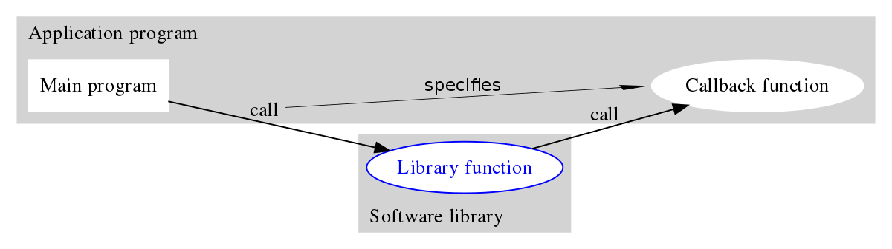
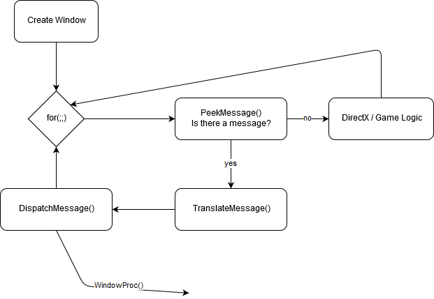
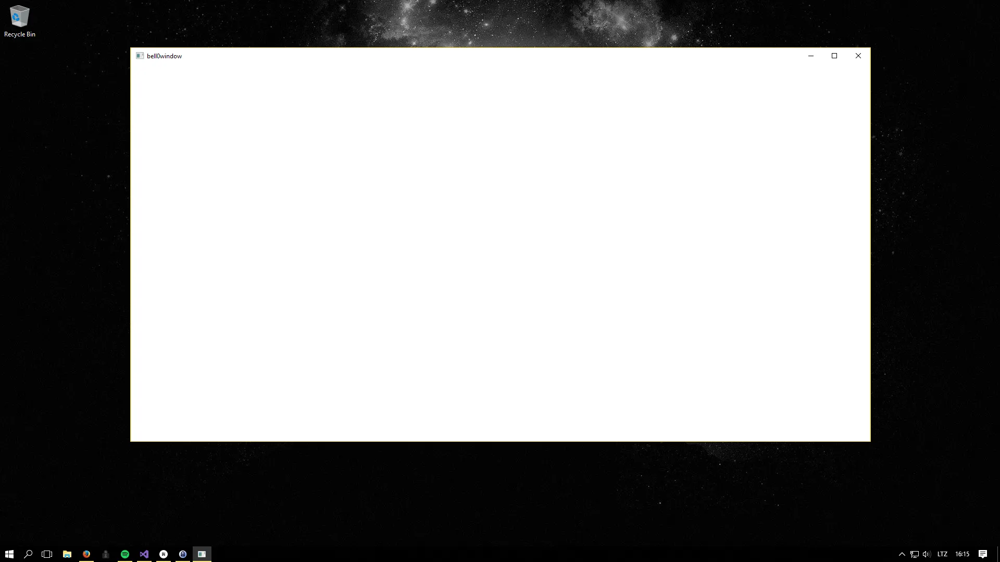

> A window - it's more entertaining than TV. Just ask a cat looking out, or a man looking in on a life he desires.
>
> -- Jarod Kintz, This Book is Not FOR SALE

Even though the goal of these tutorials is to write games that run on Windows, no advanced knowledge about actual
Windows programming is necessary. All that needs to be done is to write a basic Windows program that opens a window,
processes messages and calls the main game loop. That's it.

Thus, to create a fully functional Windows program, five tasks must be completed (clearly $5 < 12$, and I don't know
about you, but since I would rather not compete with Hēraklēs, I shall be content taking those small five steps on my
way to becoming a Windows-Hero!):

1. Create a Window class.
2. Create an event handler or WinProc.
3. Register the Window class with Windows.
4. Create an actual window from the previously created Window class.
5. Create a main event loop that retrieves and dispatches Windows messages to the event handler.


Just imagine the snake being Windows. Now, with this in mind, the first goal is to learn how to create and open a
window. A window is nothing more than a workspace that displays information, such as text and graphics, that the user
can interact with. To work with windows, Windows offers a Window class:

## Creating a Window class

Simply put, a Window class is a structure used by Windows to handle properties and actions of, surprise, a window. The
first step to take when creating a window, is to define its properties by filling out the above-mentioned WNDCLASSEX
structure:

``` cpp
typedef struct _WNDCLASSEX
{
    UINT cbSize;          // size of this structure
    UINT style;           // style flags
    WNDPROC lpfnWndProc;  // function pointer to handler
    int cbClsExtra;       // extra class info
    int cbWndExtra;       // extra window info
    HANDLE hInstance;     // the instance of the application
    HICON hIcon;          // the main icon
    HCURSOR hCursor;      // the cursor for the window
    HBRUSH hbrBackground; // the background brush to paint the window
    LPCTSTR lpszMenuName; // the name of the menu to attach
    LPCTSTR lpszClassName;// the name of the class itself
    HICON hIconSm;        // the handle of the small icon
} WNDCLASSEX;
```

### UINT cbSize

The first field, cbSize, holds the size of the *WNDCLASSEX* structure itself. If this structure is passed as a pointer,
the receiver can always check the first field to decide how long the data chunk will be at the very least, and thus the
class size does not need to be computed during runtime. Obviously, this flag can simply be set by using the *sizeof*
operator.

### UINT style

This member stores the desired style of the window. There are plenty of options available, but the most useful for now
are *CS_HREDRAW* and *CS_VREDRAW*. Those tell Windows to redraw the window whenever it is moved vertically or
horizontally. Please note that while that behaviour is useful for a window, but not for a fullscreen application like a
game, fullscreen-applications won't be considered in this tutorial until a more profound understanding of this entire
Windows and DirectX business is acquired. For a list of all available style options, check
the [MSDN](https://msdn.microsoft.com/en-us/library/windows/desktop/ff729176%28v=vs.85%29.aspx).

### WNDPROC lpfnWndProc

The next field of the *WNDCLASSEX* structure, lpfnWndProc, is a long function pointer to an event handler. Each Window
class needs a callback function, that is, a function that handles events such as the window being moved or resized. This
topic will be covered in detail in a few moments, and we will learn more about handling events in the next tutorial.

### int cbClsExtra and cint bWndExtra

Those two members were originally designed to hold extra runtime information. However, most people do not use these
fields at all and simply set them to 0. In this tutorial, we will simply do that as well.

### HINSTANCE hInstance

This member is a handle to an instance of the application creating the window; this can simply be set to the value
designated by Windows in the *WinMain()* function.

### HICON hIcon

The next field sets the icon that will represent the application. For now, it is easiest to just use a standard icon.
The [LoadIcon() function](https://www.google.de/search?q=loadicon&ie=utf-8&oe=utf-8&gws_rd=cr&ei=YDjYVvy4BITL6ASTn7XYBg)
retrieves a handle to a common icon. Creating and loading a custom icon will be briefly covered in a later tutorial.

### HCURSOR hCursor

This is similar to hIcon in that it is a handle to a graphics object, namely the mouse cursor. Again, for now, it is
easiest to just use a standard mouse cursor.
The [LoadCursor() function](https://msdn.microsoft.com/en-us/library/windows/desktop/ms648391%28v=vs.85%29.aspx)
retrieves a handle to a common cursor. Creating and loading a custom cursor will be briefly covered in a later tutorial.

### HBRUSH hbrBackground

Whenever a window is *changed*, Windows repaints the background of the window's client area with a predefined colour,
using a *brush*. Obviously, hbrBackground is a handle to the brush object that our window wants to be refreshed with.
Requesting a basic system brush is done by calling
the [GetStockObject() function](https://msdn.microsoft.com/en-us/library/windows/desktop/dd144925%28v=vs.85%29.aspx).

### LPCTSTR lpszMenuName

This is a long pointer to a null-terminated constant string of the name of a menu resource to load and attach to the
window. This is not really used for modern games, and thus it will be set to NULL in this tutorial. Note that later on,
much later, this will come handy when creating development tools such as map or asset editors.

### LPCTSTR lpszClassName

Filled with a long pointer to a null-terminated constant string, this member is used to identify a specific window class
structure. This is only useful if an application opens more than one window; Windows then needs to be able to monitor
which window is supposed to do what.

### HICON hIconSm

This is a handle to the icon displayed on the Windows title bar and the desktop taskbar. For now, it is easiest to just
use a standard icon.
The [LoadIcon() function](https://www.google.de/search?q=loadicon&ie=utf-8&oe=utf-8&gws_rd=cr&ei=YDjYVvy4BITL6ASTn7XYBg)
retrieves a handle to a common icon. Creating and loading a small custom icon will be briefly covered in a later
tutorial.

## Registering the Windows Class

Now that the window specifications are fully defined as desired,
the [RegisterClassEx() function](https://msdn.microsoft.com/de-de/library/windows/desktop/ms633587(v=vs.85).aspx) can be
used to register the window class to Windows, that is, to simply tell Windows about the newly *designed* class, as
follows:

``` cpp
WNDCLASSEX wc;
wc.cbClsExtra = 0;										// no extra bytes needed
wc.cbSize = sizeof(WNDCLASSEX);						// size of the window description structure
wc.cbWndExtra = 0;										// no extra bytes needed
wc.hbrBackground = (HBRUSH)GetStockObject(NULL_BRUSH);	// brush to repaint the background with
wc.hCursor = LoadCursor(0, IDC_ARROW);					// load the standard arrow cursor
wc.hIcon = LoadIcon(0, IDI_APPLICATION);				// load the standard application icon
wc.hIconSm = LoadIcon(0, IDI_APPLICATION);				// load the standard small application icon
wc.hInstance = dxApp->appInstance;						// handle to the core application instance
wc.lpfnWndProc = mainWndProc;							// window procedure function
wc.lpszClassName = L"bell0window";						// class name
wc.lpszMenuName = 0;									// no menu
wc.style = CS_HREDRAW | CS_VREDRAW;					// send WM_SIZE message when either the height or the width of the client area are changed

// register the window
if (!RegisterClassEx(&wc))
    return std::invalid_argument("The window class could not be registered; most probably due to invalid arguments!");
```

If the registration succeeds, the return value is a class atom that uniquely identifies the class being registered. If
the function fails, the return value is zero. And please note that all window classes that an application registers are
unregistered when it terminates, no manual cleaning is necessary.

## Creating the Window

Now that Windows knows about the specifics of the window, it can finally be created with a call to
the [CreateWindowEx() function](https://msdn.microsoft.com/de-de/library/windows/desktop/ms632680(v=vs.85).aspx):

``` cpp
HWND CreateWindowEx(
DWORD dwExStyle,     // extended window style
LPCTSTR lpClassName, // pointer to registered class name
LPCTSTR lpWindowName,// pointer to window name
DWORD dwStyle,       // window style
int x,               // horizontal position of window
int y,               // vertical position of window
int nWidth,          // window width
int nHeight,         // window height
HWND hWndParent,     // handle to parent or owner window
HMENU hMenu,         // handle to menu, or child-window identifier
HINSTANCE hInstance, // handle to application instance
LPVOID lpParam);     // pointer to window-creation data
```

The *CreateWindowEx()* function returns a handle to the newly created window, or NULL, if some error occurred.

Here comes a brief description of the parameters of the function.

### DWORD dwExStyle

For games, this can be set to NULL. Check
the [corresponding MSDN page](https://msdn.microsoft.com/en-us/library/windows/desktop/ff700543(v=vs.85).aspx). For now,
we set this to *WS_EX_OVERLAPPEDWINDOW* (see below for an explanation).

### LPCTSTR lpClassName

This is a long pointer to a constant string to the name of the windows class to be created. In this tutorial, that would
be L*bell0window class*.

### LPCTSTR lpWindowName

This long pointer to a null-terminated constant string contains the name, or the title, of the window.

### DWORD dwStyle

This flag describes what the window will look like and how it will behave. In this tutorial, we will set the style to
*WS_OVERLAPPEDWINDOW*: An overlapped window has a title bar and a border. Check
the [MSDN](https://msdn.microsoft.com/en-us/library/windows/desktop/ms632600%28v=vs.85%29.aspx) for all the possible
values.

### int x, int y

Those two parameters hold the position of the upper left-hand corner of the window in pixel coordinates. Simply use
*CW_USEDEFAULT* if the actual location is of no importance (which is most often the case).

### int nWidth, int nHeight

Those set the width and height of the window in pixels. Once again, if the initial dimensions are unimportant,
*CW_USEDEFAULT* can be used.

### HWND hWndParent

This parameter takes a handle to the parent window. If there is no parent, setting this to NULL designates the desktop
to be the parent for this window.

### HMENU hMenu

This is the handle to the menu to attach to the window. For now, this will be NULL.

### HINSTANCE hInstance

This parameter is the handle to the instance of the application creating the window. This can be set by using the
*HINSTANCE* from the *WinMain()* function.

### LPVOID lpParam

This is advanced and not needed for the purposes of this tutorial, thus it will be set to NULL.

---

Now the time has finally come to actually create the window!

``` cpp
// create the window
mainWindow = CreateWindowEx(WS_EX_OVERLAPPEDWINDOW, wc.lpszClassName, L"bell0window", WS_OVERLAPPEDWINDOW, CW_USEDEFAULT, CW_USEDEFAULT, CW_USEDEFAULT, CW_USEDEFAULT, NULL, NULL, dxApp->appInstance, NULL);
if (!mainWindow)
	return std::invalid_argument("The window could not be created; most probably due to invalid arguments!");

// show and update the windows
ShowWindow(mainWindow, SW_SHOW);
UpdateWindow(mainWindow);

// log and return success
util::ServiceLocator::getFileLogger()->print<util::SeverityType::info>("The main window was successfully created.");
	return {};
```

The [ShowWindow function](https://msdn.microsoft.com/en-us/library/windows/desktop/ms633548(v=vs.85).aspx) controls how
the window is to be shown. The first parameter takes the handle to the window and the second parameter controls how the
window is to be shown: *SW_SHOW*, for example, activates the window and displays it in its current size and position.

With a call to
the [UpdateWindow function](https://msdn.microsoft.com/de-de/library/windows/desktop/dd145167(v=vs.85).aspx) Windows is
forced to update a window's (specified by a handle to the window) contents, which generates a *WM_PAINT* message that
needs to be handled by the event handler.

Now that four of the five tasks have been completed successfully, it is time to tackle the infamous event handler.

## Event Handler

The event handler is a [callback function](https://en.wikipedia.org/wiki/Callback_(computer_programming)) called by
Windows from the main event loop of the system whenever an event occurs that a running window must handle. A callback is
an executable code that is passed as an argument to another code, which is then expected to execute (call back) the
argument at some convenient time.



An application only needs to do something about events when Windows tells it so. Otherwise, it can just continue doing
whatever it is supposed to do, until Windows calls in again. A window can handle as many, or as few, events as desired
and pass all other events to the default Windows event handler — please note that the fewer events it handles, the
faster an application can go back to the chores it was meant to do.

To get a working window, only very few messages have to be handled; Windows will take care of all the dirty work. Thank
you, Windows!

The prototype of such an event handler function, also called
a [Window Procedure](https://msdn.microsoft.com/en-us/library/windows/desktop/ms633573(v=vs.85).aspx), is small enough:

``` cpp
LRESULT CALLBACK WindowProc(
HWND hwnd,     // window handle of sender
UINT msg,      // the message id
WPARAM wParam, // further defines message
LPARAM lParam);// further defines message
```

### HWND hwnd

This is a handle to the current window and only really useful when dealing with multiple windows. The event handler
needs, or wants, to know which messages are coming from which window.

### UINT msg

The ID of the actual message that must be handled. For a list of system-defined messages, check
the [MSDN](https://msdn.microsoft.com/en-us/library/windows/desktop/ms644927%28v=vs.85%29.aspx#system_defined).

### WPARAM wParam and LPARAM lParam

Those contain additional information about the message. The exact information stored in those parameters depends on what
message was sent.

---

Handling messages is actually quite easy. When Windows passes a message, that message is placed in an event queue.
The [GetMessage()](https://msdn.microsoft.com/en-us/library/windows/desktop/ms644936(v=vs.85).aspx)
or [PeekMessage()](https://msdn.microsoft.com/en-us/library/windows/desktop/ms644943(v=vs.85).aspx) functions can be
used to retrieve that message from the queue.
The [TranslateMessage() function](https://msdn.microsoft.com/en-us/library/windows/desktop/ms644955(v=vs.85).aspx) then
translates virtual-key messages into character messages and finally
the [DispatchMessage() function](https://msdn.microsoft.com/en-us/library/windows/desktop/ms644934(v=vs.85).aspx)
dispatches the message to the window procedure function, which then, in turn, selects the appropriate measures to deal
with the event.

What most people do is to simply *switch* on the message and to then write code for each specific case. Based on the
actual message, it will be clear whether a further evaluation of the *wParam* and *lParam* parameters is needed. Don't
worry if all of this sounds confusing, it will get apparent once we see a few examples.

For now, let us have a look at some of the possible messages that Windows might send our way (as always, also check
the [MSDN](https://msdn.microsoft.com/en-us/library/windows/desktop/ms644927%28v=vs.85%29.aspx#system_defined) for more
information).

* WM_ACTIVATE: sent when a window is activated (or focused).
* WM_CLOSE: sent when a window is closed.
* WM_CREATE: sent when a window is first created.
* WM_DESTROY: sent when a window is destroyed.
* WM_MOVE: sent when a window has been moved.
* WM_MOUSEMOVE: sent when the mouse has been moved.
* WM_KEYUP: sent when a key is released.
* WM_KEYDOWN: sent when a key is pressed.
* WM_PAINT: sent when a window needs repainting.
* WM_QUIT: sent when the application is terminating.
* WM_SIZE: sent when a window changes size.
* WM_MENUCHAR: sent when a menu is active and the user presses a key that does not correspond to any mnemonic or
  accelerator key.
* WM_MINMAXINFO: sent when the size or position of the window is about to change.

And here is a minimal example for a window procedure function. As we progress with the tutorials, more functionality
will be added.

``` cpp
LRESULT CALLBACK Window::msgProc(HWND hWnd, unsigned int msg, WPARAM wParam, LPARAM lParam)
{
	switch (msg)
	{

	case WM_DESTROY:
		// window is flagged to be destroyed: send a quit message
		util::ServiceLocator::getFileLogger()->print<util::SeverityType::info>("The main window was flagged for destruction.");
		PostQuitMessage(0);
		return 0;
	}

	// let Windows handle other messages
	return DefWindowProc(hWnd, msg, wParam, lParam);
}
```

### WM_DESTROY

When the window is flagged to be destroyed, we send
a [PostQuitMessage(0)](https://msdn.microsoft.com/de-de/library/windows/desktop/ms644945(v=vs.85).aspx) to indicate to
the system that we want to terminate our application (since we only have one window). Basically, this puts a *WM_QUIT*
message in the message queue, which at some point causes the main event loop to bail.

After having processed the *WM_DESTROY* message, it is advised to return $0$.

### DefWindowProc

It is crucial to not lose unhandled messages. This is done using the *passthrough* function *DefaultWindowProc*, which
simply passes unhandled messages onto the Windows message queue for default processing.

## The Main Loop

As seen above, there are two functions to check whether there are messages in the message
queue, [GetMessage()](https://msdn.microsoft.com/en-us/library/windows/desktop/ms644936(v=vs.85).aspx)
and [PeekMessage()](https://msdn.microsoft.com/en-us/library/windows/desktop/ms644943(v=vs.85).aspx).

Using *GetMessage*, once the window is created, it goes into the main event loop, where the *GetMessage* function
actually waits for a message. This is obviously not acceptable for a game that is aiming at delivering 30 frames per
second, at least; There is no time to wait for messages.

This is where the *PeekMessage()* function comes into play. It does not wait for a message, as depicted in the following
diagram:



*PeekMessage* does essentially the same as *GetMessage*, but with one vital difference: If there is no message in the
queue, it allows the application to continue until there actually is an event that must be handled.

Here is the definition of *PeekMessage*:

``` cpp
BOOL PeekMessage(
    LPMSG lpMsg,        // pointer to message structure
    HWND hWnd,          // handle to window
    UINT wMsgFilterMin, // first message
    UINT wMsgFilterMax, // last message
    UINT wRemoveMsg);   // removal flags 
```

What do those parameters mean?

### LPMSG lpMsg

This is a pointer to
a [message structure](https://msdn.microsoft.com/en-us/library/windows/desktop/ms644958(v=vs.85).aspx) that receives
message information. This is the message we switch on in the game loop.

### HWND hWnd

A handle to the window whose messages are to be retrieved. If hWnd is NULL, *PeekMessage* retrieves messages for any
window that belongs to the current thread.

### UINT wMsgFilterMin and UINT wMsgFilterMax

With those parameters, a range filter for messages can be set up. If wMsgFilterMin and wMsgFilterMax are both zero,
*PeekMessage* returns all available messages.

### UINT wRemoveMsg

This flag specifies how messages are to be handled. There are two interesting options for us here:

* PM_NOREMOVE: messages are not removed from the queue after processing by *PeekMessage*.
* PM_REMOVE: messages are removed from the queue after processing by *PeekMessage*.

There are thus two options to use *PeekMessage*. The first option being to call *PeekMessage* with *PM_NOREMOVE* to see
if a message is in the queue, and to then call *GetMessage* to retrieve it. The second and preferred option would be to
use *PM_REMOVE* and use *PeekMessage* to retrieve the messages itself.

Now we finally have all the knowledge we need to tackle our last task: Creating a real-time game loop!

---

Many authors, as well as many online tutorials, propose the following game loop:

``` cpp
util::Expected<int> DirectXApp::run()
{
	MSG msg = { 0 };

	// enter main event loop
	while (msg.message != WM_QUIT)
	{
		// peek for messages
		if (PeekMessage(&msg, 0, 0, 0, PM_REMOVE)) //appWindow->mainWindow
		{
			TranslateMessage(&msg);
			DispatchMessage(&msg);
		}
		else
		{
			// run game logic
		}
	}
	return (int)msg.wParam;
}
```

Unfortunately, this game loop is, at least in my opinion, actually badly designed.

I just can't get my head around this *if — else* flow. If there was a message, the game logic is not updated and that
somehow makes no sense. One might even ask why the game gets a chance to run at all (a new message might have appeared
each time *PeekMessage* got active), but let us think for a moment: The key idea here is that the message processing
will run much faster than the rate at which messages are sent.

Let $t_m$ be the maximal time needed to translate and dispatch a message. It is clear that $t_m$ is very small, i.e.
$t_m = \varepsilon$ for a suitable small choice of $\varepsilon$. Now assuming that Windows is not spamming messages all
the time (most probably Windows sends messages at a regular interval, else the system would clog up), let $f_m >
\varepsilon = t_m$ denote the message frequency (the interval at which messages arrive).

So the *if*-part of the game loop will process the message in at most $t_m < f_m$ time, which leaves no chance for any
new messages to arrive. The next time *PeekMessage* is called, there won't be a new message and the *else*-part of the
game loop is executed, and the game is updated.

While this explains why this loop doesn't prevent the game from running normally, I am by now convinced that it is a bad
design choice.

A much more natural game loop would look like this:

```cpp
util::Expected<int> DirectXApp::run()
{
	MSG msg = { 0 };
	// enter main event loop
	for(;;)
	{
		// peek for messages
		while (PeekMessage(&msg, 0, 0, 0, PM_REMOVE))
		{
			TranslateMessage(&msg);
			DispatchMessage(&msg);
		}

		if (msg.message == WM_QUIT)
			break;			
		
        // update the game logic
	}
	return (int)msg.wParam;
}
```

This game loop processes all messages on the queue and then lets the game run, assuming it is not yet time to quit.
*PeekMessage* should only dispatch the *WM_QUIT* message once the message queue is empty, therefore the last message
processed should indeed be *WM_QUIT*, but this is, unfortunately, not guaranteed. Nonetheless, this execution flow is
much more explicit.

We can still make sure that the applications quits upon receiving a *WM_QUIT* message by adding a simple boolean:

```cpp
util::Expected<int> DirectXApp::run()
{
	bool continueRunning = true;
	MSG msg = { 0 };

	// enter main event loop
	while(continueRunning)
	{
		// peek for messages
		while (PeekMessage(&msg, NULL, 0, 0, PM_REMOVE))
		{
			TranslateMessage(&msg);
			DispatchMessage(&msg);

			if (msg.message == WM_QUIT)
				continueRunning = false;
		}

        // run the game logic
	}
	return (int)msg.wParam;
}
```

And here we are. Our five tasks completed heroically, we are well on our way to becoming modern heroes of the computer
age.


## Putting it all together

To keep our project clean and tidy, I have created a DirectXApp class which, as you can guess, is the main class for a
DirectX application, it coordinates all the other classes. For now, DirectXApp has a window (obviously the window we
just created), which is an instance of a Window class. The window class handles everything related to our window,
including the message procedure.

[Download](https://filedn.eu/ltgnTcOBnsYpGSo6BiuFrPL/Game%20Programming/Fundamentals/Windows/realWorld.7z) the source
code to have a look at the architecture.

### WinMain

```cpp
int WINAPI WinMain(HINSTANCE hInstance, HINSTANCE hPrevInstance, LPSTR lpCmdLine, int nShowCmd)
{
	// try to start the logging service; if this fails, abort the application!
	try { startLoggingService(); }
	catch (std::runtime_error) { ... }

	// create and initialize the game
	DirectXGame game(hInstance);
	util::Expected<void> gameInitialization = game.init();

	// if the initialization was successful, run the game, else, try to clean up and exit the application
	if (gameInitialization.wasSuccessful())
	{
		// initialization was successful -> run the game
		util::Expected<int> returnValue = game.run();

		// clean up after the game has ended
		game.shutdown(&(util::Expected<void>)returnValue);

		// gracefully return
		return returnValue.get();
	}
	else
	{
		// a critical error occured during initialization, try to clean up and the print information about the error
		game.shutdown(&gameInitialization);
		
		// humbly return with an error
		return -1;
	}
}
```

### Game Class

```cpp
class DirectXGame : core::DirectXApp
{
public:
	// constructor and destructor
	DirectXGame(HINSTANCE hInstance);
	~DirectXGame();

	// override virtual functions
	util::Expected<void> init() override;								// game initialization
	void shutdown(util::Expected<void>* expected = NULL) override;		// cleans up and shuts the game down (handles errors)

	// run the game
	util::Expected<int> run();
};
```

```cpp
// constructor and destructor
DirectXGame::DirectXGame(HINSTANCE hInstance) : DirectXApp(hInstance)
{ }
DirectXGame::~DirectXGame()
{ }

// initialize the game
util::Expected<void> DirectXGame::init()
{
	// initialize the core DirectX application
	util::Expected<void> applicationInitialization = DirectXApp::init();
	if (!applicationInitialization.wasSuccessful())
		return applicationInitialization;

	// log and return success
	util::ServiceLocator::getFileLogger()->print<util::SeverityType::info>("Game initialization was successful.");
	return {};
}

// run the game
util::Expected<int> DirectXGame::run()
{
	// run the core DirectX application
	return DirectXApp::run();
}

// shutdown
void DirectXGame::shutdown(util::Expected<void>* expected)
{
	// check for error message
	if (expected != NULL && !expected->isValid())
	{
		// the game was shutdown by an error
		// try to clean up and log the error message
		try
		{
			// do clean up

			// throw error
			expected->get();
		}
		catch (std::exception& e)
		{
			// create and print error message string
			std::stringstream errorMessage;
			errorMessage << "The game is shutting down with a critical error: " << e.what();
			util::ServiceLocator::getFileLogger()->print<util::SeverityType::error>(std::stringstream(errorMessage.str()));
			return;
		}
	}

	// no error: clean up and shut down normally
	util::ServiceLocator::getFileLogger()->print<util::SeverityType::info>("The game was shut down successfully.");
}
```

### DirectX App

```cpp
class DirectXApp
{
protected:
	// application window
	HINSTANCE appInstance;					// handle to an instance of the application
	Window* appWindow;						// the application window (i.e. game window)

	// constructor and destructor
	DirectXApp(HINSTANCE hInstance);
	~DirectXApp();

	util::Expected<int> run();				// enters the main event loop
		
	// virtual methods, must be overriden
	virtual util::Expected<void> init();								// initializes the DirectX application
	virtual void shutdown(util::Expected<void>* expected = NULL);		// clean up and shutdown the DirectX application

public:
	friend class Window;
};
```

```cpp
DirectXApp::DirectXApp(HINSTANCE hInstance) : appInstance(hInstance), appWindow(NULL) { }
DirectXApp::~DirectXApp()
{
	shutdown();
}

util::Expected<void> DirectXApp::init()
{
	// create the application window
	try { appWindow = new Window(this); }
	catch (std::runtime_error)
	{
		return std::runtime_error("DirectXApp was unable to create the main window!");
	}
		
	// log and return success
	util::ServiceLocator::getFileLogger()->print<util::SeverityType::info>("The DirectX application initialization was successful.");
	return {};
}

void DirectXApp::shutdown(util::Expected<void>* expected)
{
	if (appWindow)
		delete appWindow;

	if (appInstance)
		appInstance = NULL;

	util::ServiceLocator::getFileLogger()->print<util::SeverityType::info>("The DirectX application was shutdown successfully.");
}

util::Expected<int> DirectXApp::run()
{
	bool continueRunning = true;
	MSG msg = { 0 };

	// enter main event loop
	while(continueRunning)
	{
		// peek for messages
		while (PeekMessage(&msg, NULL, 0, 0, PM_REMOVE))
		{
			TranslateMessage(&msg);
			DispatchMessage(&msg);

			if (msg.message == WM_QUIT)
				continueRunning = false;
		}

		// run the game logic
	}
	return (int)msg.wParam;
}
```

### Window

```cpp
class Window
{
private:
	HWND mainWindow;						// handle to the main window
	DirectXApp* dxApp;						// the core application class

	util::Expected<void> init();			// initializes the window

public:
	// constructor and destructor
	Window(DirectXApp* dxApp);
	~Window();

	// getters
	inline HWND getMainWindowHandle() { return mainWindow; };

    // the call back function
	virtual LRESULT CALLBACK msgProc(HWND hWnd, unsigned int msg, WPARAM wParam, LPARAM lParam);

	friend class DirectXApp;
};
```

```cpp
Window::Window(DirectXApp* dxApp) : mainWindow(NULL), dxApp(dxApp)
{
	// this is necessary to forward messages
	window = this;

	// initialize the window
	util::Expected<void> rv = this->init();
	if (!rv.isValid())
	{
		// log the error
		try { rv.get(); }
		catch (std::exception& e)
		{
			// create and print error message string
			std::stringstream errorMessage;
			errorMessage << "Creation of the game window failed with: " << e.what();
			util::ServiceLocator::getFileLogger()->print<util::SeverityType::error>(std::stringstream(errorMessage.str()));

			// throw an error
			throw std::runtime_error("Window creation failed!");
		}
	}
}

Window::~Window()
{
	if (mainWindow)
		mainWindow = NULL;

	if (dxApp)
		dxApp = NULL;

	// log
	util::ServiceLocator::getFileLogger()->print<util::SeverityType::info>("Main window class destruction was successful.");
}

util::Expected<void> Window::init()
{
	// specify the window class description
	WNDCLASSEX wc;

	// white window
	wc.cbClsExtra = 0;										// no extra bytes needed
	wc.cbSize = sizeof(WNDCLASSEX);							// size of the window description structure
	wc.cbWndExtra = 0;										// no extra bytes needed
	wc.hbrBackground = (HBRUSH)GetStockObject(NULL_BRUSH);	// brush to repaint the background with
	wc.hCursor = LoadCursor(0, IDC_ARROW);					// load the standard arrow cursor
	wc.hIcon = LoadIcon(0, IDI_APPLICATION);				// load the standard application icon
	wc.hIconSm = LoadIcon(0, IDI_APPLICATION);				// load the standard small application icon
	wc.hInstance = dxApp->appInstance;						// handle to the core application instance
	wc.lpfnWndProc = mainWndProc;							// window procedure function
	wc.lpszClassName = L"bell0window";						// class name
	wc.lpszMenuName = 0;									// no menu
	wc.style = CS_HREDRAW | CS_VREDRAW;						// send WM_SIZE message when either the height or the width of the client area are changed

	// register the window
	if (!RegisterClassEx(&wc))
		return std::invalid_argument("The window class could not be registered; most probably due to invalid arguments!");

	// create the window
	mainWindow = CreateWindowEx(WS_EX_OVERLAPPEDWINDOW, wc.lpszClassName, L"bell0window", WS_OVERLAPPEDWINDOW, CW_USEDEFAULT, CW_USEDEFAULT, CW_USEDEFAULT, CW_USEDEFAULT, NULL, NULL, dxApp->appInstance, NULL);
	if (!mainWindow)
		return std::invalid_argument("The window could not be created; most probably due to invalid arguments!");

	// show and update the windows
	ShowWindow(mainWindow, SW_SHOW);
	UpdateWindow(mainWindow);

	// log and return success
	util::ServiceLocator::getFileLogger()->print<util::SeverityType::info>("The main window was successfully created.");
	return {};
}

LRESULT CALLBACK Window::msgProc(HWND hWnd, unsigned int msg, WPARAM wParam, LPARAM lParam)
{
	switch (msg)
	{

	case WM_DESTROY:
		// window is flagged to be destroyed: send a quit message
		util::ServiceLocator::getFileLogger()->print<util::SeverityType::info>("The main window was flagged for destruction.");
		PostQuitMessage(0);
		return 0;
	}

	// let Windows handle other messages
	return DefWindowProc(hWnd, msg, wParam, lParam);
}
```

---

Now bask in the glory that is an empty window — truly a Herculean feat!



And here is the produced log file:

```
0: 7/7/2017 23:5:53	INFO:    mainThread:	The file logger was created successfully.
1: 7/7/2017 23:5:53	INFO:    mainThread:	The main window was successfully created.
2: 7/7/2017 23:5:53	INFO:    mainThread:	The DirectX application initialization was successful.
3: 7/7/2017 23:5:53	INFO:    mainThread:	Game initialization was successful.
4: 7/7/2017 23:5:54	INFO:    mainThread:	The main window was flagged for destruction.
5: 7/7/2017 23:5:54	INFO:    mainThread:	The game was shut down successfully.
6: 7/7/2017 23:5:54	INFO:    mainThread:	Main window class destruction was successful.
7: 7/7/2017 23:5:54	INFO:    mainThread:	The DirectX application was shutdown successfully.
8: 7/7/2017 23:5:54	INFO:    mainThread:	The file logger was destroyed.
```

## Exercise

Why does the window not get redrawn when it is resized? Why does the computer slow down so dramatically? How can we fix
that?

## Solution

So what went wrong in this tutorial, why doesn't the window behave as expected when being resized? Well actually it does
behave as expected; we passed the *NULL_BRUSH* during registration, that means whenever the window is resized, Windows
tries to paint it, but it has no brush! Thus, the window does not get repainted and eventually Windows will bombard us
with *WM_PAINT* messages that we can't fulfil and thus the entire system clogs.

The solution actually straightforward, simply use *WHITE_BRUSH* instead of *NULL_BRUSH* when defining the window
properties:

``` cpp
wc.hbrBackground = (HBRUSH)GetStockObject(WHITE_BRUSH);	// brush to repaint the background with
```

Go ahead, try it out. Simply change that one line of code and enjoy a working white window to your heart's
content. [Here](https://filedn.eu/ltgnTcOBnsYpGSo6BiuFrPL/Game%20Programming/Fundamentals/Windows/realWorldWindowsApplication.7z)
is the *corrected* source code.

## References

### Literature

(in alphabetic order)

* [Microsoft Developer Network](https://msdn.microsoft.com/en-us/library/windows/desktop/ee663274(v=vs.85))
* Tricks of the Windows Game Programming Gurus, by André LaMothe

### Art

* [Draw.io](https://www.draw.io/)
* Wikipedia