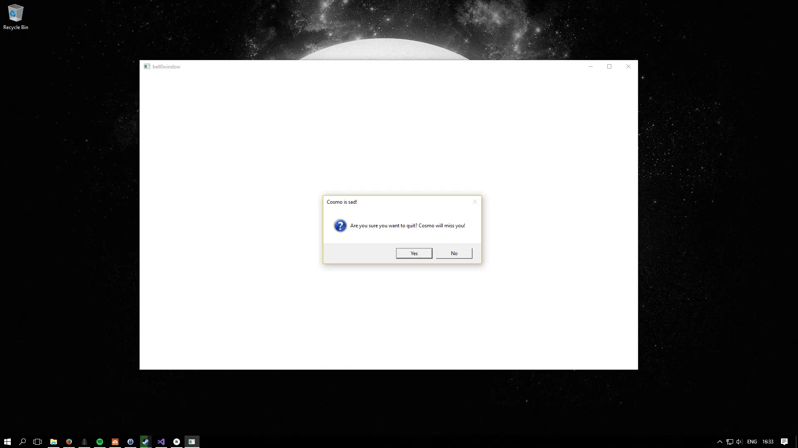
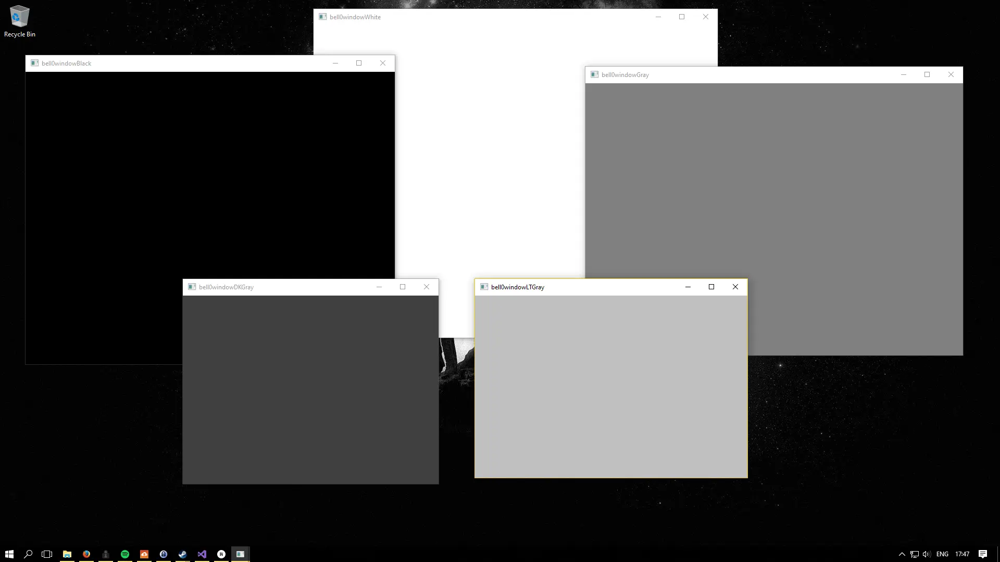

> She knows herself to be at the mercy of events, and she knows by now that events have no mercy.
>
> -- Margaret Atwood, The Blind Assassin

As discussed in previous tutorials, Windows is an event-based operating system and even though a DirectX application usually does not need Windows messages to get its job done, it still needs to handle some events:

## Important Messages

### [WM_DESTROY](https://msdn.microsoft.com/en-us/library/windows/desktop/ms632620(v=vs.85).aspx)
So far only the *WM_DESTROY* message, which is sent when a window is flagged for destruction, has been dealt with by using *PostQuitMessage* to put a *WM_QUIT* message in the message queue.

```cpp
case WM_DESTROY:
	// window is flagged to be destroyed: send a quit message
	util::ServiceLocator::getFileLogger()->print<util::SeverityType::info>("The main window was flagged for destruction.");
	PostQuitMessage(0);
	return 0;
```

### [WM_CLOSE](https://msdn.microsoft.com/en-us/library/windows/desktop/ms632617(v=vs.85).aspx)
The *WM_CLOSE* message indicates that the user is trying to close the application. If so desired, the user could be asked for confirmation whether he really intended to stop playing this wonderful game.

``` cpp
case WM_CLOSE:
	// display a message box and ask the user for confirmation
	if (MessageBox(mainWindow, L"Are you sure you want to quit? Cosmo will miss you!", L"Cosmo is sad!", MB_YESNO | MB_ICONQUESTION) == IDYES)
		return DefWindowProc(mainWindow, msg, wParam, lParam);
	else
		return 0;
```



And if you are wondering who Cosmo is: 

Are you really sure you want to stop playing with Cosmo?

### [WM_MENUCHAR](https://msdn.microsoft.com/en-us/library/windows/desktop/ms646349(v=vs.85).aspx)
This is the most important event to handle. This message is sent when a menu is active and the user presses a key that does not correspond to any mnemonic or accelerator key. 

Since the beep when a non-mnemonic key is pressed is terribly annoying, and since usually games do not work with menus, we beg Windows to please, please don't beep at us by deceiving the system by telling it that the *close the menu* button was actually pressed. This will be extremely useful when switching to a full-screen application, as hearing that annoying beep each time I pressed *alt+enter* surely had a detrimental effect on my physical well-being! Leave now and never come back!

```cpp
case WM_MENUCHAR:
	// very important for your mental health: disables the crazy beeping sound when pressing a mnemonic key
	return MAKELRESULT(0, MNC_CLOSE);	// simply tell Windows that we want the menu closed
```

### [WM_ACTIVATE](https://msdn.microsoft.com/en-us/library/windows/desktop/ms646274(v=vs.85).aspx)
This message is sent when a window gets activated; it has the following parameters: 

```cpp
fActive = LOWORD(wParam);           // activation flag
fMinimized = (BOOL)HIWORD(wParam);  // minimzed flag
hwndPrevious = (HWND)lParam;        // window handle
```
The *fActive* variable is defined by the following parameters:

* WA_CLICKACTIVE: activated by a mouse click.
* WA_ACTIVE: the window has been activated by some means besides the mouse (i.e. keyboard).
* WA_INACTIVE: the window is being deactivated.

The *fMinimized* variable indicates whether the window was minimized and *hwndPrevious* is the handle to the window being activated or deactivated. 

This message is useful, since it allows keeping track of the state of the game window. When the window becomes inactive, the game should be paused; after all, the hero should not be chomped on by some monsters after the player minimized the window to check his favourite math blog! When, and if, the window is activated again, the game should resume. To assure this functionality, a boolean has been added to the *DirectXApp* class, called *isPaused*, which is *true* if and only if the application is paused.

```cpp
case WM_ACTIVATE:
	if (LOWORD(wParam) == WA_INACTIVE)
		dxApp->isPaused = true;
	else
		dxApp->isPaused = false;
    return 0;
```

Obviously, when the window becomes deactivated, the *isPaused* is set to *true*, and when the window becomes active (again), this variable is set to *false*. In the main game loop *isPaused* is used to concede resources to the CPU while the game is inactive, i.e. the game simply does nothing while paused:

```cpp
util::Expected<int> DirectXApp::run()
{
    bool continueRunning = true;
	MSG msg = { 0 };

	// enter main event loop
	while(continueRunning)
	{
		// peek for messages
		while (PeekMessage(&msg, 0, 0, 0, PM_REMOVE))
		{
            TranslateMessage(&msg);
			DispatchMessage(&msg);
            
            if(msg.message == WM_QUIT)
                continueRunning = false;
            
		}

		if (!isPaused)
		{
			// the game is active -> update game logic
		}
	}
	return (int)msg.wParam;
}
```

### [WM_SIZE](https://msdn.microsoft.com/en-us/library/windows/desktop/ms632646(v=vs.85).aspx)
This is another important message for games to handle, as it gets invoked each time the user resizes the game window. Each time that happens, the game universe must be scaled to fit the new dimensions of the client area. For now, it is enough to register the size changes. Later, when DirectX is up and running as well, Direct3D will be used to do the actual resizing.

For this purpose, there is a new function in the *DirectXApp* class, the *onResize* function, which gets called each time resizing occured; it does nothing yet though, besides printing a message to the log file.

The *WM_SIZE* message has the following parameters:

``` cpp
fwSizeType = wParam;           // resizing flag
nWidth = LOWORD(lParam);       // width of client area
nHeight = HIWORD(lParam);      // height of client area
```

The low and high word of *lParam* simply indicate the new client dimensions whereas the *fwSizeType* parameter explains what kind of resizing happened, according to the following values:

* SIZE_MAXHIDE: this message gets sent to all pop-up windows when some other window is maximized.
* SIZE_MAXIMIZED: window has been maximized.
* SIZE_MAXSHOW: this message is sent to all pop-up windows when some other window has been restored to its former size.
* SIZE_MINIMIZED: window has been minimized.
* SIZE_RESTORED: window has been resized, but neither SIZE_MINIMIZED nor SIZE_MAXIMIZED apply.

To keep track of its state, the *Window* class uses three new boolean members, namely *isMinimized*, *isMaximized* and *isResizing*. They are true if and only the window is minimized, maximized respectively being resized.

Here is a barebone code to handle size changes:

``` cpp
case WM_SIZE:
	if (wParam == SIZE_MINIMIZED)
	{
		// when the window is minimized, set the appropriate window flags and pause the application
		isMinimized = true;
		isMaximized = false;
		dxApp->isPaused = true;
	}
	else if (wParam == SIZE_MAXIMIZED)
	{
		// when the window is maximized, set the appropriate window flags, resize the graphics and unpause the application
		isMinimized = false;
		isMaximized = true;
		dxApp->isPaused = false;
		dxApp->onResize();
	}
	else if (wParam == SIZE_RESTORED)
	{
		if (isMinimized)
		{
			// the window was restored and was previously minimized, thus we set minimized to false, resize the graphics and restart the application
			isMinimized = false;
			dxApp->onResize();
			dxApp->isPaused = false;
		}
		else if (isMaximized)
		{
			// the window was resized and was previously maximized, thus we set maximized to false, resize the graphics and unpause the game
			isMaximized = false;
			dxApp->onResize();
			dxApp->isPaused = false;
		}
		else if (isResizing)
		{
			// do nothing until the dragging / resizing has stopped (dragging continously sents WM_SIZE messages, it would be extremely slow (and very pointless) to respond to all them)
		}
		else // resize graphics
			dxApp->onResize();
	}
	return 0;
```
Note that while the window is being dragged around (*else if (isResizing)*) the game is not being resized. It would actually be completely useless to do so, as while the window is being dragged, Windows continuously sends *WM_SIZE* messages: it would be extremely slow and trivially pointless to respond to all of them (and to constantly change the game graphics), and thus it seems much wiser to simply wait until the dragging is done and to only then do all the resizing that must be done.

To notice whether the window is being resized, the following messages must be handled:

### [WM_ENTERSIZEMOVE](https://msdn.microsoft.com/en-us/library/windows/desktop/ms632622(v=vs.85).aspx) and [WM_EXITSIZEMOVE](https://msdn.microsoft.com/en-us/library/windows/desktop/ms632623(v=vs.85).aspx)
If the user drags the edges of the window (to make it smaller or larger) a WM_ENTERSIZEMOVE message is sent once the dragging starts and a WM_EXITSIZEMOVE once the dragging is done (and the window is resized).

In this case, it is advised to respond exactly as above. Please note that while the window is being dragged around, the application is paused.

``` cpp
case WM_ENTERSIZEMOVE:
	// the game window is being dragged around, pause the game
	isResizing = true;
	dxApp->isPaused = true;
	return 0;

case WM_EXITSIZEMOVE:
	// the game window is no longer being dragged around, set the flag to pause, resize the graphics and unpause the game
	isResizing = false;
	dxApp->onResize();
	dxApp->isPaused = false;
	return 0;
```

### [WM_GETMINMAXINFO](https://msdn.microsoft.com/en-us/library/windows/desktop/ms632626(v=vs.85).aspx)
This message is sent when the window is about to be changed in size. The lParam parameter of this message holds a pointer to a [MINMAXINFO structure](https://msdn.microsoft.com/en-us/library/windows/desktop/ms632605(v=vs.85).aspx). The minimum tracking width (x member) and the minimum tracking height (y member) of the window are stored in ptMinTrackSize. By setting those values to 200 each, it can be assured that the window cannot be resized to be smaller than 200 x 200. 

```cpp
case WM_GETMINMAXINFO:
	((MINMAXINFO*)lParam)->ptMinTrackSize.x = 200;
	((MINMAXINFO*)lParam)->ptMinTrackSize.y = 200;
	return 0;
```

## Putting it all together

Here is the new message procedure function of the Window class:
```cpp
LRESULT CALLBACK Window::msgProc(HWND hWnd, unsigned int msg, WPARAM wParam, LPARAM lParam)
{
	switch (msg)
	{

	case WM_ACTIVATE:
		if (LOWORD(wParam) == WA_INACTIVE)	// if the window became inactive, pause the application
			dxApp->isPaused = true;	
		else                                // if the window was activated, unpause the applcation
			dxApp->isPaused = false;	
		return 0;

	case WM_DESTROY:
		// window is flagged to be destroyed: send a quit message
			util::ServiceLocator::getFileLogger()->print<util::SeverityType::info>("The main window was flagged for destruction.");
		PostQuitMessage(0);
		return 0;

	case WM_CLOSE:
		// display a message box and ask the user for confirmation
		if (MessageBox(mainWindow, L"Are you sure you want to quit? Cosmo will miss you!", L"Cosmo is sad!", MB_YESNO | MB_ICONQUESTION) == IDYES)
			return DefWindowProc(mainWindow, msg, wParam, lParam);
		else
			return 0;

	case WM_MENUCHAR:
		// very important for your mental health: disables the crazy beeping sound when pressing a mnemonic key
		return MAKELRESULT(0, MNC_CLOSE);	// simply tell Windows that we want the menu closed
		return 0;

	case WM_SIZE:
		if (wParam == SIZE_MINIMIZED)
		{
			// when the window is minimized, set the appropriate window flags and pause the application
			isMinimized = true;
			isMaximized = false;
			dxApp->isPaused = true;
		}
		else if (wParam == SIZE_MAXIMIZED)
		{
			// when the window is maximized, set the appropriate window flags, resize the graphics and unpause the application
			isMinimized = false;
			isMaximized = true;
			dxApp->isPaused = false;
			dxApp->onResize();
		}
		else if (wParam == SIZE_RESTORED)
		{
			if (isMinimized)
			{
				// the window was restored and was previously minimized, thus we set minimized to false, resize the graphics and restart the application
				isMinimized = false;
				dxApp->onResize();
				dxApp->isPaused = false;
			}
			else if (isMaximized)
			{
				// the window was resized and was previously maxmized, thus we set maximized to false, resize the graphics and unpause the game
				isMaximized = false;
				dxApp->onResize();
				dxApp->isPaused = false;
			}
			else if (isResizing)
			{
				// do nothing until the dragging / resizing has stopped (dragging continously sents WM_SIZE messages, it would be extremely slow (and very pointless) to respond to all them)
			}
			else // resize graphics
				dxApp->onResize();
		}
		return 0;

	case WM_ENTERSIZEMOVE:
		// the game window is being dragged around, set the isResizing flag and pause the game
		isResizing = true;
		dxApp->isPaused = true;
		return 0;

	case WM_EXITSIZEMOVE:
		// the game window is no longer being dragged around, set the isResizing flag to false, resize the graphics and unpause the game
		isResizing = false;
		dxApp->onResize();
		dxApp->isPaused = false;
		return 0;

    case WM_GETMINMAXINFO:
		// prevent the window from becoming too small
		((MINMAXINFO*)lParam)->ptMinTrackSize.x = 200;
		((MINMAXINFO*)lParam)->ptMinTrackSize.y = 200;
		return 0;
	}

	// let Windows handle all other unhandled messages
	return DefWindowProc(hWnd, msg, wParam, lParam);
}
```

The code is available from [here](https://filedn.eu/ltgnTcOBnsYpGSo6BiuFrPL/Game%20Programming/Fundamentals/Windows/events.7z).

Here is the log file from simply starting the game and closing the window, without interacting with it.

```
0: 9/7/2017 19:48:48	INFO:    mainThread:	The file logger was created successfully.
1: 9/7/2017 19:48:48	INFO:    mainThread:	The client resolution was read from the Lua configuration file: 800 x 600.
2: 9/7/2017 19:48:48	WARNING: mainThread:	The window was resized. The game graphics must be updated!
3: 9/7/2017 19:48:48	INFO:    mainThread:	The main window was successfully created.
4: 9/7/2017 19:48:48	INFO:    mainThread:	The DirectX application initialization was successful.
5: 9/7/2017 19:48:48	INFO:    mainThread:	Game initialization was successful.
6: 9/7/2017 19:48:49	INFO:    mainThread:	The main window was flagged for destruction.
7: 9/7/2017 19:48:49	INFO:    mainThread:	The game was shut down successfully.
8: 9/7/2017 19:48:49	INFO:    mainThread:	Main window class destruction was successful.
9: 9/7/2017 19:48:49	INFO:    mainThread:	The DirectX application was shutdown successfully.
10: 9/7/2017 19:48:49	INFO:    mainThread:	The file logger was destroyed.

```

## Exercises

### Exercise 1
Explain line number 2 in the above log file.

### Exercise 2
Change the program code to open more than one window, more precisely, create and open a window of each one of those colours: white, black, gray, light gray and dark gray, and figure out a way to close one window at a time and to only exit the program once every single window is closed.

---

And then **Bill Gates** said there be **Windows** everywhere!



---

By now I am really excited; we covered a lot of ground, we learned about error handling, multitasking and thread-safe logging. We learned quite a bit about the architecture of Windows, and we can define, register and create our own windows as well as write our own event handlers. Furthermore, we had first contact with the powerful scripting language Lua. All in all, I think we have done an excellent job so far.

In the next tutorial, we will learn how to add a high-precision timer to our application, which will prove invaluable for using actual physics in a game. We will also come back to an earlier discussion about how to implement a robust game loop.

## References
### Literature
(in alphabetic order)
 * Microsoft Developer Network ([MSDN](https://msdn.microsoft.com/en-us/library/windows/desktop/ee663274(v=vs.85)))
 * Tricks of the Windows Game Programming Gurus, by André LaMothe

### Photos
 * Wikipedia
 * Josiane Bellot