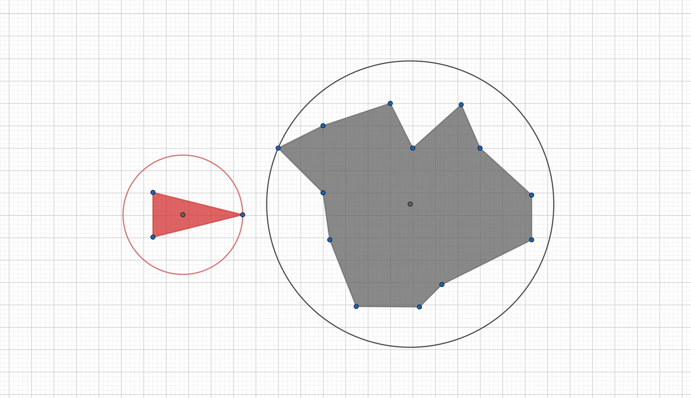
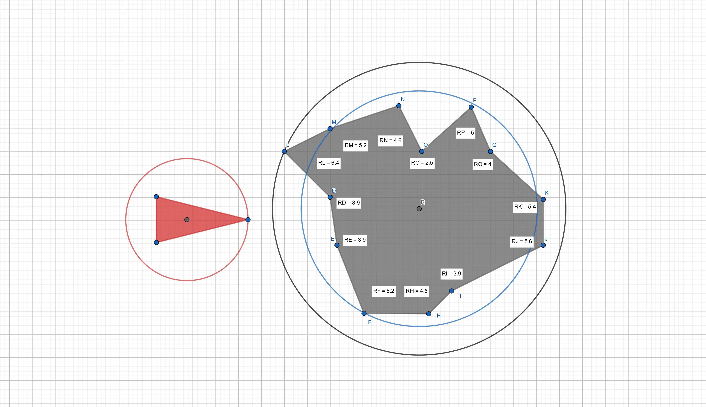
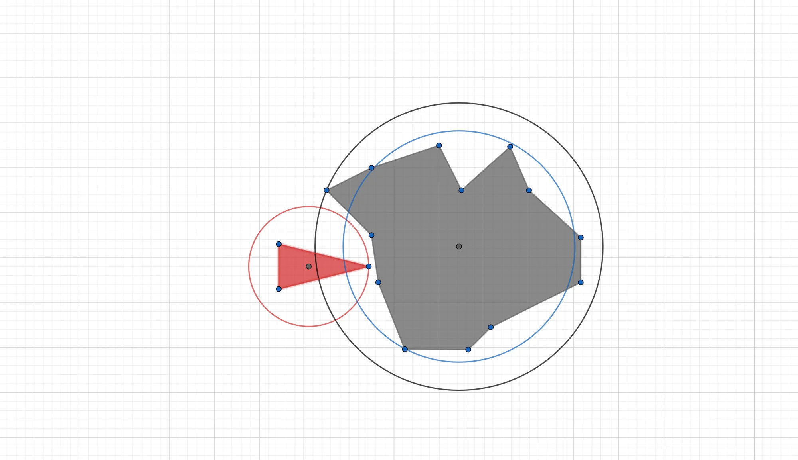
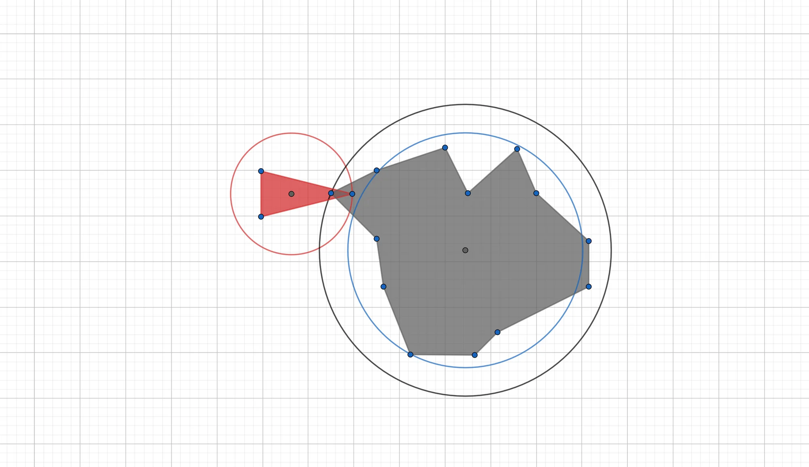
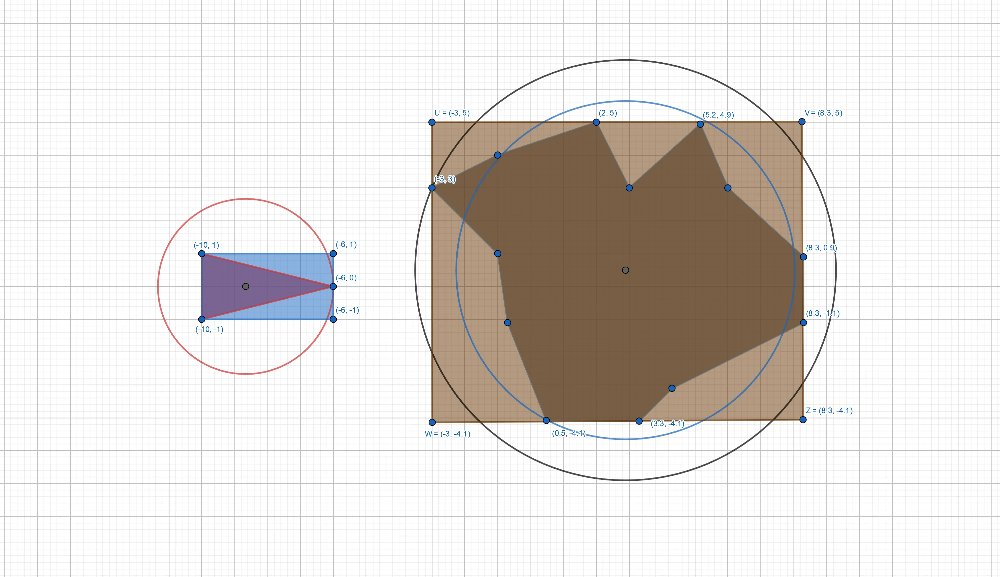
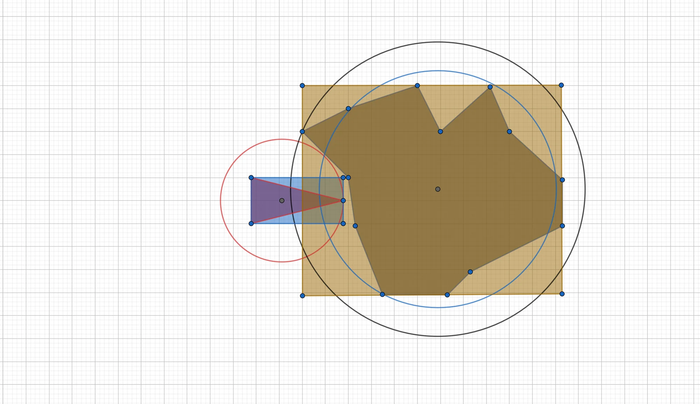
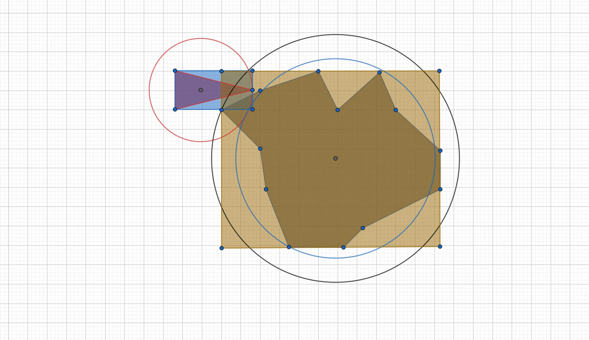

## Method I: Bounding Spheres
A first and rather naive method to test whether two polygons are intersecting, is to embed each polygon into a circle, that is, each polygon is assumed to have an average radius and if these radii overlap, the polygons are said to collide. As an example, look at this spaceship from the Empire racing head-on against a strange asteroid:



### Centroids and Radii
To implement a bounding sphere algorithm, it is thus necessary to be able to compute the centroid of a polygon. Read the *[The Centroid of Convex Polygons]()* article for an explanation on how to compute the centroid of convex polygons (the case of non-convex polygons is similar, more care has to be taken when triangulating the polygon though).

There are many choices for the radii, one can simply take the largest distance between the centroid of the polygon and its vertices (as in the figure above), one can take the distance of each vertex and average these radii, or one can just take some other heuristic. André LaMothe, the author of the book *Tricks of the Windows Game Programming Gurus*, mentions that he likes to use a value that is midway between the average and the farthest vertex. Let us try that out: The average distance for the above asteroid is $4,63$ and the largest distance between the centroid and a vertex is $6,4$, a number midway between the average and the largest distance would thus be, for example, $5,15$.



As illustrated by the figure belows, putting a circular bounding box around polygons will lead to the detection of collisions when there are none, as well as missed collisions.





### Distance and Square Roots
On modern computers, calculating the distance between two points in the Euclidean plane is as easy as computing a square root: Let $A=(x_A,y_A)$ and $B=(x_B,y_B)$ be two points in the Euclidean plane, then the distance $d:=d(A,B)$ between $A$ and $B$ is given by the formula $d(A,B) = \sqrt{(x_2-x_1)^2+(y_2-y_1)^2}$. 

In C++ this looks as follows:

```cpp
float Geometry::distance2D(const D2D1_POINT_2F& A, const D2D1_POINT_2F& B)
{
	float dx = B.x - A.x;
	float dy = B.y - A.y;

	return sqrtf(dx*dx - dy*dy);
}
```

Bear in mind, however, that on earlier hardware, the square root computation took a lot of time. If you want to program a game for older hardware, have a look at the [*Fast Approximate Distance*](https://oroboro.com/fast-approximate-distance/) article, by Rafael Baptista, which explains how to approximate the square root function by a linear combination of the minimum and maximum functions.

Checking for collisions is now as easy as testing a single equation: Let $d$ be the distance between the centroids of two polygons and $r_1$ and $r_2$ their respective radii, then the two polygons collide if, and only if, $d \leq (r_1+r_2)$.

Please note that in light of the discussion about fast distance functions, it is **commonly not even necessary to compute the actual distance between two points**. For example, by squaring the above equation, one gets: $d^2 \leq (r_1+r_2)^2$, thus eliminating the need to compute the square root at all. This is a very practical trick to keep in mind, **the *square distance* is commonly much more favourable to work with** than the actual distance between two points:

```cpp
float Geometry::squareDistance2D(const D2D1_POINT_2F& A, const D2D1_POINT_2F& B)
{
	float dx = B.x - A.x;
	float dy = B.y - A.y;

	return dx*dx - dy*dy;
}
```

A theoretical, and naive, bounding sphere collision detection algorithm between two polygons would thus look like this:

```cpp
bool Geometry::collisionDetection2D(const Polygon& P1, const Polygon& P2)
{
    // compute squared distance between the centroids of the polygons
    float squaredDistance = squareDistance2D(P1.centroid, P2.centroid);
    
    // get the sum of the radii
    float sumRadii = P1.radius + P2.radius;
    
    // if the squared distance is less than the sum of the radii, there is a collision
    if(squaredDistance < sumRaddi * sumRaddi)
        return true;
    else
        return false;
}
```

## Method II: Bounding Boxes
As seen above, approximating a polygonal object by a sphere doesn't always work very well. Another approach would be to approximate the polygon by a rectangular box containing the entire polygon. To do so, computing the four edges of a rectangle, by finding the furthest reaches of the polygon, is enough:



From the above figure, one can conclude that bounding boxes can offer a better approximation as bounding spheres, simply due to their geometrical shape being closer to the shape of most polygons. Both failed collision tests with the bounding sphere algorithm from above would be avoided by the bounding box test in this case:



False positives are still a nuisance, however:



In C++, the code to compute a bounding box is straightforward:

```cpp
void Geometry::computeBoundingBox(const std::vector<D2D1_POINT_2F>& vertices, D2D1_POINT_2F* leftTop, D2D1_POINT_2F* rightBottom)
{
	// this algorithm works with local coordinates
	float minX, maxX, minY, maxY = 0;

	// loop through each vertex
	for (std::vector<D2D1_POINT_2F>::const_iterator it = vertices.begin(); it != vertices.end(); it++)
	{
		if ((*it).x > maxX)
			maxX = (*it).x;

		if ((*it).y > maxY)
			maxY = (*it).y;

		if ((*it).x < minX)
			minX = (*it).x;

		if ((*it).y < minY)
			minY = (*it).y;
	}
}
```

Figuring out if a point is within a rectangle is now trivial: Given a rectangular bounding box by $(x_1, y_1)$ and $(x_2, y_2)$, testing whether a point $(x_0,y_0)$ lies inside that rectangle is as easy as this:

```cpp
if(x0 >= x1 && x0 <= x2)
    if(y0 >= y1 && y0 <= y2)
        // collision
        return true;
```

Thus to detect collisions with bounding boxes, it would now be sufficient to, for example, test any of the four corners of a box against another bounding box, or, if time permits, by using more clever methods. We won't cover any of these in detail, however, until in a later tutorial.

The easiest method is to test for those cases where two bounding boxes definitely can't intersect, i.e. let $B_1$ and $B_2$ be two bounding boxes, then it is clear that there can't be any intersection if, and only if $B_1$ is at the left, top, right, or bottom of $B_2$:

```cpp
// let a and b be two bounding boxes
if((a.max.x < b.min.x) || (b.max.x < a.min.x) || (a.max.y < b.min.y) || b.max.y < a.min.y)
    return false;
else
    return true;
```

---

## References
* [Geogebra](https://www.geogebra.org/)
* Tricks of the Windows Game Programming Gurus, by André LaMothe
* Wikipedia