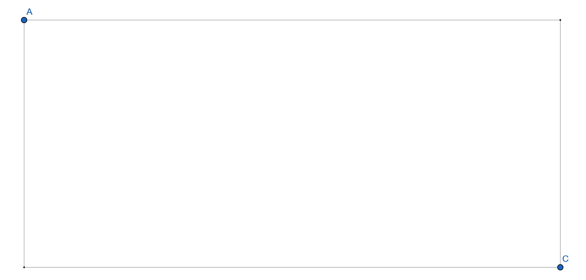

The most important geometrical objects in Flatland are lines, rays, line segments, rectangles, spheres, and polygons.

During the last few tutorials, we learned how to use most of these geometrical objects to do collision detection. In this tutorial, we will give a mathematically sound review of the concepts used in those previous tutorials and explain how to use them in a game project.

## Rays and Line Segments
The tutorial about [basic line intersection]() used an ad hoc approach to lines and line segments. We now want to define those ideas a bit more rigorously. 

A **ray** starts at a specific point, its point of origin, and extends infinitely in a specified direction. To work with rays in games, it is useful to represent them by parametric functions. Let $r$ be a ray, $r_0$ its point of origin and $\vec{v}$ a vector specifying the direction of the ray, then $r$ can be defined as follows: 

$$
\begin{align*}r: \mathbb{R}_{\geq 0} &\to \mathbb{R}^2 \\ t &\mapsto r_0 + t\vec{v}. \end{align*}
$$
For $t=0$, the function results in the point of origin of the ray. As $t$ *grows*, we ride on the ray, further and further away.

A **line segment** is a ray with an *end point*, that is, a line segment actually stops somewhere. A line segment can be represented using the same function definition, but with a closed interval as its domain: 

$$
\begin{align*}r: [0,1] &\to \mathbb{R}^2 \\ t &\mapsto r_0 + t\vec{v}. \end{align*}
$$
Now, as before, for $t=0$ we are at the point of origin of the line segment and for $t=1$ we are at its end point. 

Knowing the point of origin $p_O$ and its endpoint $p_E$, the direction vector $\vec{v}$ of a line segment can be easily computed as follows: $\vec{v} = p_E - p_O$.


To store rays and line segments in C++, a simple structure is sufficient:

```cpp
class Ray2D
{
public:
	mathematics::linearAlgebra::Vector2F startPoint;	// the point of origin
	mathematics::linearAlgebra::Vector2F direction;		// the direction of the ray

	Ray2D();																											// creates an "empty" ray, starting at (0,0) and pointing to (1,0)
	Ray2D(const mathematics::linearAlgebra::Vector2F& origin, const mathematics::linearAlgebra::Vector2F& direction);	// creates a ray with point of origin and direction

	// ride the ray
	mathematics::linearAlgebra::Vector2F ride(const float t) const;	// returns the point on the ray after tracing the ray for t amounts of time
};

class LineSegment2D
{
public:
	mathematics::linearAlgebra::Vector2F startPoint, endPoint;		// the start and ending point of the line segment
	mathematics::linearAlgebra::Vector2F directionVector;			// the vector joining those two points
	mathematics::linearAlgebra::Vector2F normalVector;				// the normal vector of the line segment

	LineSegment2D(mathematics::linearAlgebra::Vector2F startPoint, mathematics::linearAlgebra::Vector2F endPoint);
	LineSegment2D(mathematics::linearAlgebra::Vector2F startPoint, mathematics::linearAlgebra::Vector2F endPoint, mathematics::linearAlgebra::Vector2F normalVector);
};
```

The *ride* function returns the point on the ray or line segment after riding along on the ray or line segment for a specified amount of time.

In addition to the starting and end point, the line segment structure also computes the normal of the segment, in counter-clockwise order.

## Bounding Spheres
The tutorial about [basic collision detection]() introduced bounding spheres. A sphere can be defined by two variables — a vector representing the centre of the sphere, $(c_x, c_y)$, and a scalar for its radius, $r$:

```cpp
class Sphere2D
{
public:
	mathematics::linearAlgebra::Vector2F center;						// the center of the sphere
	float radius;														// the radius of the sphere

	Sphere2D();																// creates the unit sphere (center: (0,0) - radius: 1)
	Sphere2D(const mathematics::linearAlgebra::Vector2F& c, const float r);	// creates a sphere with radius r and center c
    
    mathematics::linearAlgebra::Vector2F point(const float angle);		// returns the coordinates of a point on the circle defined by the angle (between 0 and 2Pi)
};
```

The *point* function returns the coordinates of a point on the circle defined by a specific angle (between 0 and $2\pi$). The coordinates of the point are computed using the parametric form of the circle:

$$
\begin{align*}x &= c_x + r \cos \alpha \\ y &= c_y + r \sin⁡ \alpha,\end{align*}
$$
where $\alpha$ is a parametric variable in the range $0$ to $2\pi$, interpreted geometrically as the angle that the ray from $(c_x, c_y)$ to $(x, y)$ makes with the positive $x$-axis. 


## Bounding Boxes
The same [tutorial]() introduced bounding boxes, or more precisely, axis-aligned bounding boxes, also called *AABB*s. Those boxes can be represented by two points, the upper-left and the lower-right point:

```cpp
class Rectangle2D
{
public:
	mathematics::linearAlgebra::Vector2F upperLeft;						// the upper left corner of the rectangle
	mathematics::linearAlgebra::Vector2F lowerRight;					// the lower right corner of the rectangle

	Rectangle2D();														// the standard constructor constructs the unit rectangle with the upper left corner glued to (0,0)
	Rectangle2D(const mathematics::linearAlgebra::Vector2F& up, const mathematics::linearAlgebra::Vector2F& lr);	// creates a rectangle with the specified extremeties
};
```



To increase accuracy, one could ditch the requirement for axis parallelity. Unfortunately, the price for increased accuracy is a far more complicated collision detection test. We will thus postpone the discussion of those bounding boxes to a later time.

---

What we could do, however, is to use capsules, for example, to define bounding boxes around humanoids. A capsule is a cylinder in 2D, with two hemispheres attached to the top and bottom, or a rounded rectangle. 

---


---


To define such a capsule, a line segment and a radius are needed:

```cpp
class Capsule2D
{
public:
	LineSegment2D lineSegment;				// the line segment defining the capsule
	float radius;							// radius of the circles on each edge

	Capsule2D();							// defines a capsule with segment from (0,0) to (0,1) and radius 0.5f
	Capsule2D(const LineSegment2D& ls, const float r);	// defines a capsule with a specified line segment and radius
	Capsule2D(const mathematics::linearAlgebra::Vector2F& startPoint, const mathematics::linearAlgebra::Vector2F& endPoint, const float r);
};
```

## Polygons
Another important geometrical object are polygons. The word polygon is derived from the Greek words *ολύς*, or *polýs*, which means *many*, and *γωνία*, or *gōnía*, which means *angle*. A polygon is thus an object with many points or angles.


To work with polygons, it is sufficient to store all its vertices and to [compute its centroid]():

```cpp
	class Polygon2D
	{
	public:
		std::vector<mathematics::linearAlgebra::Vector2F> vertices;		// the vertices of the polygon
		mathematics::linearAlgebra::Vector2F centroid;					// the centroid of the polygon

		Polygon2D();													// creates an empty polygon
		Polygon2D(const std::vector<mathematics::linearAlgebra::Vector2F>& v, const mathematics::linearAlgebra::Vector2F& c);	// creates a polygon with a specified list of vertices, the vertices should be given in counter-clockwise order, and a specified centroid
		Polygon2D(const std::vector<mathematics::linearAlgebra::Vector2F>& v); // creates a polygon with a given set of vertices (should be given in counter-clockwise order), the centroid is computed automatically
	};
```

Please note that for the moment, only convex polygons are supported.

---

The bell0bytes game engine provides all of those classes in the mathematics::geometry namespace. You can download the source code [here](https://filedn.eu/ltgnTcOBnsYpGSo6BiuFrPL/Game%20Programming/Flatland/Geometry/colGeo.7z).

---

## References
* Game Programming Algorithms and Techniques, by S. Madhav
* Tricks of the Windows Programming Gurus, by A. LaMothe
* Wikipedia