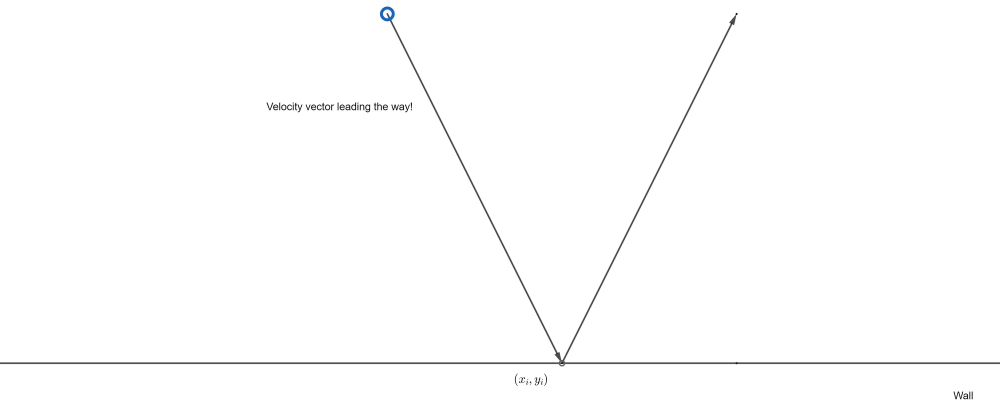
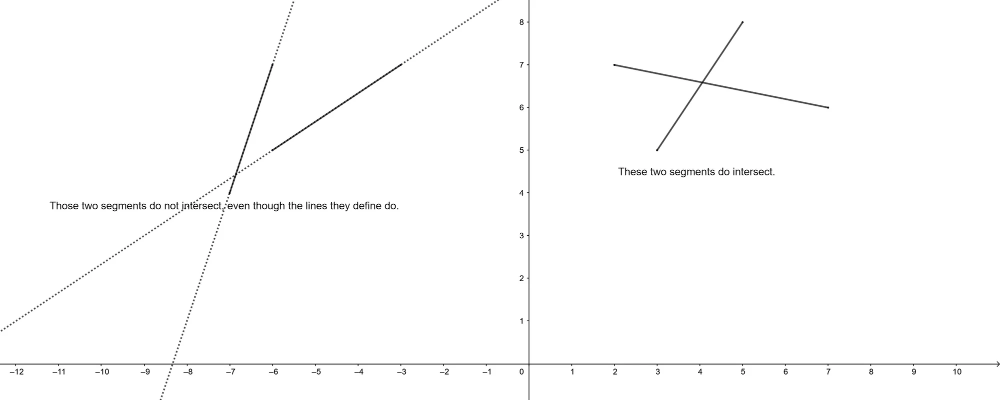
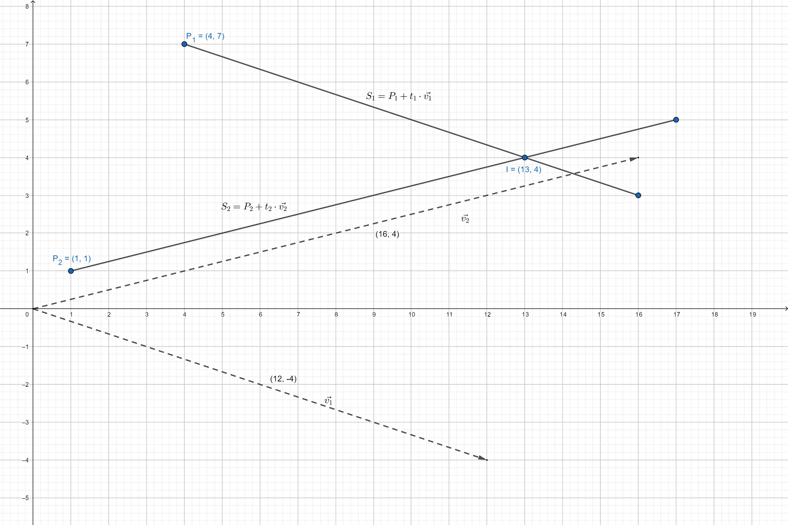

> Heim kommt man nie. Aber wo befreundete Wege zusammenlaufen, da sieht die ganze Welt für eine Stunde wie Heimat aus.
>
> – Hermann Hesse, Demian

## The Intersection Problem
In this tutorial, we want to improve on the collision detection algorithm used in the *Kicker*-demo from previous tutorials. The issue can easily be restated as a line, or segment, intersection problem: As an object moves with a certain velocity, the velocity vector, with origin at the current position of the moving object, leads the way to wherever the object is going to.



Once we know that two line segments actually intersect, computing the intersection point $I=(x_i,y_i)$ is as trivial as solving a system of two linear equations. The hard part is to determine whether two line segments actually intersect, as segments are finite, thus, while the lines they run along on might intersect, the actual segments might not, as shown in the next figure:



## Parametric Representation
To facilitate working with line segments, we will use the parametric representation of lines and segments. Basically, you can imagine a segment as the way between two points. Let $P_0$ be the start of a segment $S$ and $\vec{v}$ the vector joining the point to its designated end point, also called a direction vector, think of your home and a grocery store, for example, then, at the time $t=0$ you are at home and at the time $t=1$ you are at the grocery store. For all values in between, you are *en route* to the store. In formulas, this idea looks as follows: 

$$
S = P_0 + t \cdot \vec{v}.
$$
$P_0$ basically defines an offset, i.e. where the segment starts, away from the centre of the coordinate system, and $t$ encodes how far we have to run along a given direction vector. Refer to this [GeoGebra applet](https://www.geogebra.org/m/Nh5926nC) by Tim Brzezinski to see a parametric representation in action.

### Intersection
To figure out whether two segments $S_1 := P_1 + t_1 \cdot \vec{v}_1$ and $S_2 = P_2 + t_2 \cdot \vec{v}_2$, with $P_1=(x_1,y_1)$ and $P_2=(x_2,y_2)$ are intersecting each other, it is enough to solve the equation $S_1=S_2$ and check whether $t_1$ and $t_2$ are both between $0$ and $1$:

$$
\begin{align*}S_1 = S_2 &\Leftrightarrow P_1 + t_1 \cdot \vec{v}_1 = P_2 + t_2 \cdot \vec{v}_2 \\ &\Leftrightarrow t_1 \cdot \vec{v}_1 - t_2 \cdot \vec{v}_2 = P_2 - P_1. \end{align*}
$$

In matrix notation, this reads as follows: $V\vec{t}=\vec{P}$, where $V=\begin{pmatrix}a&-c\\b&-d\end{pmatrix}$, with $\vec{v}_1=\begin{pmatrix}a\\b\end{pmatrix}$, $\vec{v}_2=\begin{pmatrix}c\\d\end{pmatrix}$, $\vec{t}=\begin{pmatrix}t_1\\t_2\end{pmatrix}$ and $\vec{P}=\begin{pmatrix}x_2-x_1\\y_2-y_1\end{pmatrix}$.

### Colinearity
Now if $\vec{v}_1$ and $\vec{v}_2$ are linearly dependent, there is no need to test for intersection if $P_1$ and $P_2$ aren't already on the same line. It is thus enough to check whether $P_2$ lies on $S_1$ or vice versa, which means that it is enough to check whether there exists a $t \in \mathbb{R}$ such that $P_2 = P_1 + t \cdot \vec{v}_1$, i.e. it is enough to check whether the directional vector between the two points $P_1$ and $P_2$ is collinear with the vector $\vec{v}$. 

If the determinant of the matrix $\begin{pmatrix}x_2-x_1&a\\y_2-y_1&b\end{pmatrix}$ is not zero, then the vectors can't be collinear. If the determinant is zero, all that is left to do is to check whether there exists such a $t$ between $0$ and $1$.

### Linear Independence
Now if the two directional vectors are linearly independent, the matrix $V$ is regular and the above matrix equation can easily be solved by computing the inverse $V^{-1}$ of the matrix $V$: 

$$
V\vec{t}=\vec{P} \Leftrightarrow \vec{t}=V^{-1} \cdot \vec{P}.
$$
### Example
Let $P_1:=(4,7)$, $P_2:=(1,1)$, $\vec{v_1}:=\begin{pmatrix}12 \\\ -4\end{pmatrix}$ and $\vec{v_2}:=\begin{pmatrix}16 \\\ 4\end{pmatrix}$, as depicted in the figure below:



In this example, we have $V=\begin{pmatrix}12&-16 \\ -4 & -4\end{pmatrix}$ and $P=\begin{pmatrix}-3 \\ -6\end{pmatrix}$. The inverse of $V$ is 

$$
V^{-1}=\dfrac{1}{28} \begin{pmatrix}1&-4 \\ -1 & -3\end{pmatrix},
$$
thus

$$
\begin{align*}\vec{t}&=V^{-1} \cdot \vec{P} \\ &= \dfrac{1}{28} \begin{pmatrix}1&-4 \\ -1 & -3\end{pmatrix} \cdot \begin{pmatrix}-3 \\ -6\end{pmatrix} \\ &= \dfrac{1}{4} \begin{pmatrix} 3 \\ 3 \end{pmatrix}.\end{align*}
$$
Plugging $t_1=\frac{3}{4}$ into the equation of $S_1$, we get 

$$
I=\begin{pmatrix}4 \\ 7\end{pmatrix} + \dfrac{3}{4} \cdot \begin{pmatrix}12 \\ -4\end{pmatrix} = \begin{pmatrix} 13 \\ 4 \end{pmatrix}
$$
as desired, which tells us that if we run three quarters of the length of the segment from $P_1$ to its end point, we intersect the other segment $S_2$.

### Implementation
To define line segments in C++, we use a small class:

```cpp
class LineSegment2D
{
private:
	Vector2F startPoint, endPoint;			// the start and ending point of the line segment
	Vector2F directionVector;				// the vector joining those two points
	Vector2F normalVector;					// the normal vector of the line segment

public:
	LineSegment2D();
	LineSegment2D(Vector2F startPoint, Vector2F endPoint);
	LineSegment2D(Vector2F startPoint, Vector2F endPoint, Vector2F normalVector);
	~LineSegment2D() {};

	void setStartingPoint(Vector2F vector) { startPoint = vector; };
	void setEndPoint(Vector2F vector) { endPoint = vector; };
	void projectToVector(const Vector2F& vectorToProjectOn);
	void recomputeDirectionalVector(float radius = 1.0f);
		
	const Vector2F getDirectionalVector() const { return directionVector; };
	const Vector2F getNormalVector() const { return normalVector; };
	const Vector2F getStartPoint() const { return startPoint; };

	friend class Geometry;
};
```

Both constructors compute the directional vector and the first constructor computes the normal vector (clockwise) as well:

```cpp
LineSegment2D::LineSegment2D(Vector2F startPoint, Vector2F endPoint, Vector2F normalVector) : startPoint(startPoint), endPoint(endPoint), normalVector(normalVector)
{
	this->directionVector = endPoint - startPoint;

	// normal vector: (-dy,dx)
	this->normalVector = Vector2F(-directionVector.y, directionVector.x);
	this->normalVector.normalize();
}

LineSegment2D::LineSegment2D(Vector2F startPoint, Vector2F endPoint) : startPoint(startPoint), endPoint(endPoint)
{
	this->directionVector = endPoint - startPoint;

	// normal vector: (-dy,dx)
	this->normalVector = Vector2F(-directionVector.y, directionVector.x);
	this->normalVector.normalize();
}
```

The *recomputeDirectionalVector* method is used to get the direction vector from the centre of a ball to the edge of its radius:

```cpp
void LineSegment2D::recomputeDirectionalVector(float radius)
{
	this->directionVector = this->endPoint - this->startPoint;
	if (this->directionVector.x == 0 && this->directionVector.y == 0)
		return;
	this->directionVector.normalize();
	this->directionVector *= -1.0f*radius;
}
```

Note the negative sign in the normalization of the vector. This is due to the base change between *standard* coordinates and screen coordinates.

The actual test for intersecting between two segments follows the mathematics explained above:

```cpp
bool Geometry::segmentIntersection2D(const LineSegment2D& segment1, const LineSegment2D& segment2, Vector2F* t)
{
	// compute the determinant of the 2x2 matrix
	float det = segment1.directionVector.x * segment2.directionVector.y - segment1.directionVector.y * segment2.directionVector.x;
		
	// if det is 0, the directional vectors are colinear
	if (det == 0)
		return false;

	// compute directional vector between the two starting points
	Vector2F directionalVector = Vector2F(segment2.startPoint.x - segment1.startPoint.x, segment2.startPoint.y - segment1.startPoint.y);

	// compute t1
	float t1 = segment2.directionVector.y * directionalVector.x - segment2.directionVector.x * directionalVector.y;
	t1 /= det;

	// if t1 is not between 0 and 1, the segments can't intersect
	if (0 > t1 || t1 > 1)
		return false;

	// compute t2
	float t2 = -segment1.directionVector.y * directionalVector.x + segment1.directionVector.x * directionalVector.y;
	t2 /= det;

	// if t2 is not between 0 and 1, the segments can't intersect
	if (0 > t2 || t2 > 1)
		return false;

	// else return true
	if (t != NULL)
	{
		t->x = t1;
		t->y = t2;
	}
	return true;

}
```

And all of this greatly simplifies the collision detection test of the *Kicker*-demo:

```cpp
util::Expected<void> PlayState::update(const double deltaTime)
{
	if (isPaused)
		return { };

	// update the ball and table
	ball->update(deltaTime, table->frictionCoeffK);

	// check wall intersections
	int i = -1;
	for (auto wall : table->walls)
	{
		i++;
		if (i != collision)
		{			
			if (mathematics::Geometry::segmentIntersection2D(*wall, *ball->direction))
			{
				mathematics::reflectionVector(ball->velocity, wall->getNormalVector());
				collision = i;
				break;
			}
		}
	}

    ...
		
    // return success
	return { };
}
```

---

While these new ideas greatly improved on the previous algorithms, this is far from being the entire story. In a later series of tutorials about *Computational Geometry*, we will explore topics such as this in greater mathematical detail. 

---

## References
* Geogebra
* Tricks of the Windows Programming Gurus, by A. LaMothe
* Wikipedia