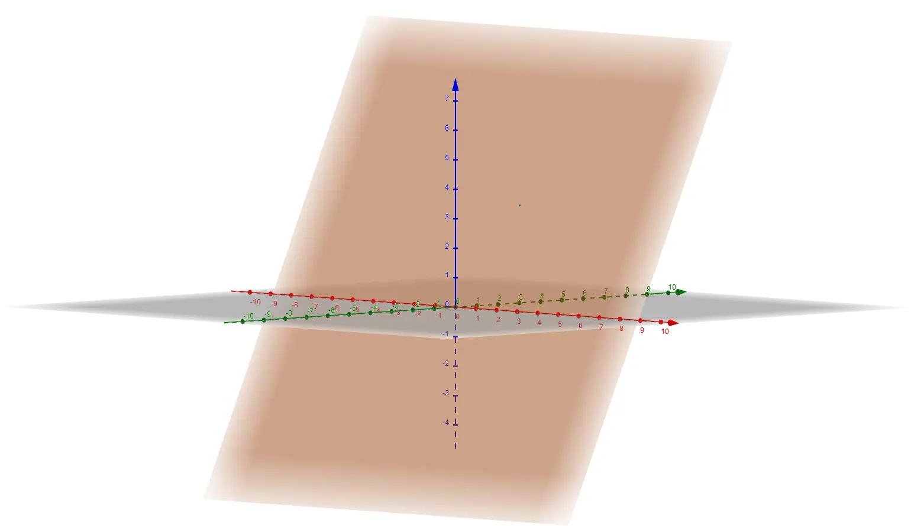
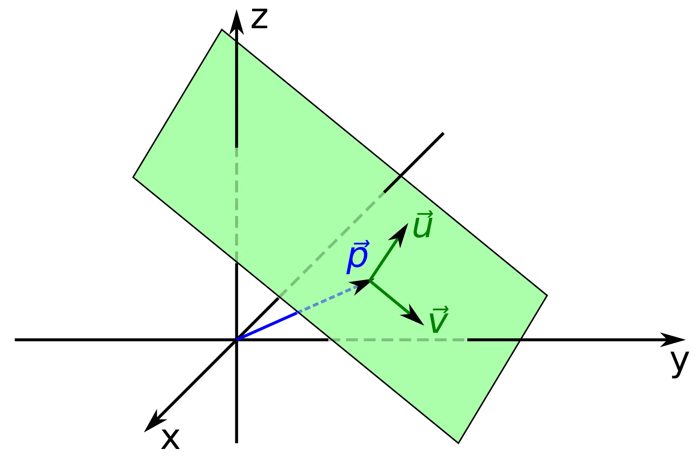
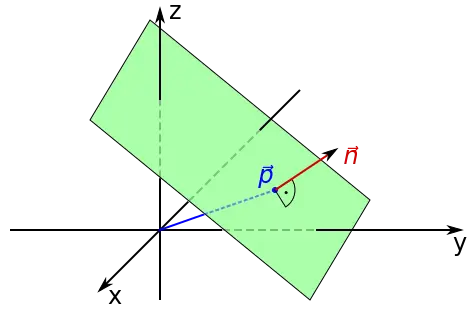

## Planes

A plane is a flat two-dimensional surface that extends infinitely in both directions. The well known standard plane is
the Cartesian product $\mathbb{R}^2 := \mathbb{R} \times \mathbb{R}$, the *points* of the plane, or its elements, are of
the form $(x_1,x_2)$, where $x_1,x_2 \in \mathbb{R}$.

## Two-Dimensional Subspaces

Now consider the standard three-dimensional Euclidean [vector space](https://en.wikipedia.org/wiki/Vector_space)
$\mathbb{R}^3$ equipped with the [standard euclidean scalar product](https://en.wikipedia.org/wiki/Dot_product) $b:
\mathbb{R}^3 \times \mathbb{R}^3 \to \mathbb{R}$, i.e. for two vectors $\vec{v}=(v_1, v_2, v_3)^t$ and $w=(w_1, w_2,
w_3)^t$, the scalar product is $b(\vec{v},\vec{w})=\sum_{i=1}^3v_iw_i$.

### Linear Independence

Two vectors $\vec{v},\vec{w} \in \mathbb{R}^3$ are called linearly independent if, and only if, the following holds:

$
\forall \lambda_1, \lambda_2, \lambda_3 \in \mathbb{R}: \lambda_1v_1 + \lambda_2v_2 + \lambda_3v_3 = 0 \Rightarrow \lambda_1 = \lambda_2 = \lambda_3 = 0,
$ 

or, in other words, if the only representation of the zero vector is trivial.

Obviously, an analogous definition is valid in arbitrary dimensions.

Geometrically speaking, $n$ linearly independent vectors are sufficient to completely describe an $n$-dimensional space,
i.e. two linearly independent vectors are sufficient to completely describe a plane. Just imagine a person describing
the location of his favourite restaurant: "Go three kilometres to the east and four kilometres to the north from here."
The vectors *east* and *north* are linearly independent, thus completely sufficient to describe the position of every
element in the entire plane. Such vectors are also called a generating system for the vector space, or a basis of the
vector space.

The three vectors $e_1 := \begin{pmatrix}1 \\\ 0 \\\ 0\end{pmatrix}$, $e_2 := \begin{pmatrix}0 \\\ 1 \\\ 0\end{pmatrix}$
and $e_3 := \begin{pmatrix}0 \\\ 0 \\\ 1\end{pmatrix}$ are obviously linearly independent and are the standard basis
vectors for the standard three-dimensional vector space $\mathbb{R}^3$.

### Orthogonality

Two vectors $\vec{v}, \vec{w}\in \mathbb{R}^3$ are said to be orthogonal, or perpendicular, if, and only if, $b(\vec{v},
\vec{w}) = 0$.

## Space Representations

### Parametric Description

As two-dimensional subspaces of the three-dimensional Euclidean space, a plane $\mathcal{P}$ can be described in various
ways. The most common description is a parametric form using a *point* and two vectors: $\mathcal{P} = \vec{p} +
s\vec{u} + t\vec{v},$ where $\vec{p}, \vec{u}, \vec{v} \in \mathbb{R}^3$, with $\vec{u}$ and $\vec{v}$ linearly
independent, and $s,t \in \mathbb{R}$ (read $\mathcal{P}$ is the set of all vectors in $\mathbb{R}$ that can be written
in the form $\vec{p} + s\vec{u} + t\vec{v}$, for certain real numbers $s$ and $t$). Basically speaking, $\vec{p}$ is the
position vector of an arbitrary, but fixed point on the plane and the vectors $\vec{u}$ and $\vec{v}$ are vectors with
origin $p$ and pointing in different directions (recall the example from above: the linearly independent vectors
$\vec{u}$ and $\vec{v}$ are sufficient to explain how to get to any location starting at the *point* $p$). The following
image is taken from Wikipedia:

### Normal Form

The preferred way to define a plane $\mathcal{P}$ in a game engine, however, is analogous to how lines are described in
two dimensions, namely using a point-slope form. In the three-dimensional space, planes have a natural description using
a point in the plane and a vector orthogonal to it, its
so-called [normal vector](https://en.wikipedia.org/wiki/Normal_\(geometry\)), to indicate its inclination.

Let $\vec{p} =(p_1, p_2, p_3)^t \in \mathbb{R}^3$ be the position vector of an arbitrary, but fixed point in space and
$\hat{n}=(n_1, n_2, n_3)^t \in \mathbb{R}^3$ be a normalized non-zero vector, then the plane $\mathcal{P} \subset
\mathbb{R^3}$ defined by $\vec{p}$ and $\hat{n}$ consists of all the vectors $\vec{v} = (v_1, v_2, v_3)^t \in
\mathbb{R}^3$, such that the vector $\vec{v}-\vec{p}$, i.e. the vector joining the points defined by $\vec{v}$ and
$\vec{p}$, is perpendicular to the vector $\hat{n}$. Recalling that two vectors $\vec{v}, \vec{w} \in \mathbb{R}^3$ are
perpendicular if, and only if, $b(\vec{v}, \vec{w})=0$, where $b$ is the standard Euclidean scalar product, the above
idea leads to the following equation for a plane: $b(\hat{n},(\vec{v} - \vec{p})) = 0$. Using the bilinearity of the
scalar product, we find that the plane $\mathcal{P}$ can be described as the set of all vectors $\vec{v}$ solving the
following equation: $b(\hat{n},\vec{v}) + d = 0$, where $d=-b(\hat{n},\vec{p})$ can be interpreted as the minimum
distance between the plane and the origin of the Euclidean space.

The following figure is once again taken from Wikipedia:

#### Computing the normal vector of a plane

If a plane is given by its parametric form, $\mathcal{P} = \vec{p} + s\vec{u} + t\vec{v}$, then the normal vector
$\hat{n}$ is the normalized outer product of the vectors $\vec{u}$ and $\vec{v}$, written as $\vec{u} \times \vec{v}$,
or $\vec{u} \wedge \vec{v}$. As above, let $\vec{e}_1, \vec{e}_2$ and $\vec{e}_3$ denote the standard basis of
$\mathbb{R}^3$, then the outer product can be computed as follows:

Or, if you don't like tensors, you can *cheat* a little bit:

$
\begin{align*} \tilde{n} &= \vec{u} \times \vec{v} \\ &= \left(\sum\limits_{i=1}^3(\vec{u} \times \vec{e}_i) \otimes 
\vec{e}_i \right) \cdot \vec{v} \\ &= \begin{pmatrix}0 & -u_3 & u_2 \\ u_3 & 0 & u_1 \\ u_2 & -u_1 & 0\end{pmatrix} 
\cdot \begin{pmatrix}v_1 \\ v_2 \\ v_3\end{pmatrix} \\ &= \begin{pmatrix} u_2v_3 - u_3v_2 \\ -u_1v_3 + u_3v_1 \\ u_1v_2 - u_2v_1 \end{pmatrix}.\end{align*}
$

#### The Normal Vector of Triangles
Now why is this so important in games? Well, especially in a 3D engine, which we will eventually elaborate on later in
these tutorials, most game objects are rendered using plenty of triangles. Modern GPUs love drawing triangles, and thus
polygons are triangulated into triangles (sic!). What do triangles have to do with planes, however? Well, the three
points defining a triangle are always in the same plane, i.e., a triangle is always guaranteed to lie on a single
plane — at least in standard Euclidean geometry. Thus, knowing the vertices of a triangle, it is easily possible to
compute the plane the triangle lies in, which then in return allows for an easy decision whether a given vector lies in
the same plane as the triangle, or not.

Another significant application of the above theory becomes apparent when trying to approximate real-world physics by a
discrete model, for example when trying to model how light is reflected from a surface. When attempting to reflect light
from a surface, the normal vector of that surface must be known. Thus, knowing that game objects can be rendered using
triangles, it is essentially important to be able to compute the normal vector of a triangle? Alas, since the three
vertices of a triangle define a plane, the same technique as above can be used.

Let $A$, $B$ and $C$ be the three vertices of a triangle, in clockwise ordering (we will talk about why the ordering is
critical in another tutorial), and let $\overrightarrow{AB}$ be the vector from $A$ to $B$ and $\overrightarrow{BC}$ be
the vector from $B$ to $C$, then the normal vector of the triangle is $\hat{n} = \dfrac{\overrightarrow{AB} \times
\overrightarrow{BC}}{\|\overrightarrow{AB} \times \overrightarrow{BC}\|}$. To get the equation of the plane the triangle
*lives* in, all that is left to do is to compute the distance of the plane to the origin of the three-dimensional space,
$d = -b(\hat{n},x)$, where $x$ can be substituted by any of the three vertices of the triangle, or rather, their
position vectors.

##### Example

As an example of the above theory, let $A=(1,0,0)$, $B=(2,2,0)$ and $C=(3,0,0)$ be the three vertices of a triangle in
the standard Euclidean space $\mathbb{R}^3$. To compute the normal vector of the triangle (or of the plane the triangle
lives in), the vectors joining $A$ and $B$ as well as $B$ and $C$ must be computed first: $\overrightarrow{AB} =
\begin{pmatrix}1 \\\ 2 \\\ 0\end{pmatrix}$ and $\overrightarrow{BC} = \begin{pmatrix}1 \\\ -2 \\\ 0\end{pmatrix}$. Now
we can compute the outer product of these two vectors: $\tilde{n} = \overrightarrow{AB} \times \overrightarrow{BC} =
\begin{pmatrix}0 \\\ 0 \\\ 5\end{pmatrix}$.

The normal vector is the normalized outer product of those two vectors: $\hat{n} = \dfrac{1}{\\| \tilde{n} \\|} \cdot
\tilde{n} = \dfrac{1}{5} \cdot \tilde{n} = \vec{e}_3$.

To compute the distance to the origin of the three-dimensional space, any one of the three vertices of the triangle can
be used: $d = -b(\hat{n},\vec{A}) = 0$, where $\vec{A}$ is the position vector of the point $A$. (Making a difference
between vectors and points is just of cosmetic nature in this example.)

Finally, the normal-form equation of the plane the triangle lives in can be written as $b(e_3,\vec{v}) = 0$, which means
that the triangle lies in the plane defined by all vectors $\vec{v}$ which are perpendicular to the third base vector of
the three-dimensional space, which is clearly correct, by construction.

## References

* Game Programming Algorithms and Techniques, by Sanjay Madhav
* Lineare Algebra, by Prof. Dr. R. Scharlau
* Tricks of the Windows Game Programming Gurus, by André LaMothe
* Wikipedia