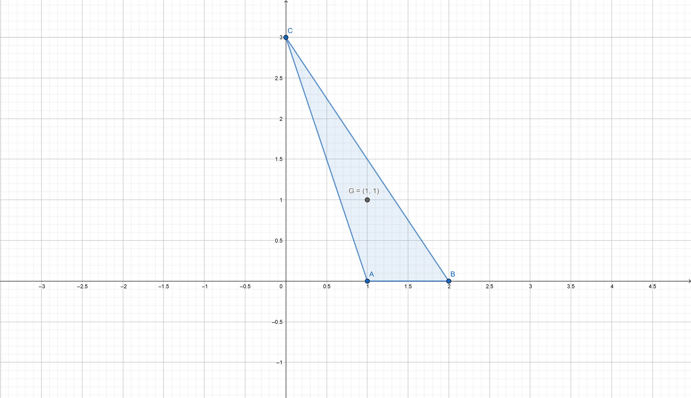

In many games, the game objects interact with each other and very often it is important to detect when game objects collide with others, for example when a missile hits a target. A first and rather easy method to detect such collisions is to *inscribe* the polygon inside a sphere, or a circle in 2D.


To compute the radius of the circle, it is possible to take the distance from the center of the polygon to each vertex and to then average those values, or to simply take the smallest or the largest one, depending on what should be achieved. An often used heuristic is to take a value between the largest possible radius and the average of the radii.

This actually basic idea thus already leads to two mathematical problems that need to be solved: First, the centroid, or the geometrical centre, of a polygon must be found and then, the distance between the centroid and different vertices must be computed (fast!).

The following tutorial explains how to compute the centroid of a convex polygon.

Before tackling the task of computing the centroid of a polygon, it is wise to have a look at the better known problem of computing the centroid of a triangle.

## The Barycentre
Most high school students learn how to compute the coordinates of the centroid of a triangle, also called the barycentre of a triangle. The barycentre is the intersection point of the three lines going through one of the vertices and the middle of the opposite edge of the triangle (as seen in the figure above — the point G is the barycentre of the triangle).

In the language of linear algebra, the coordinates of the barycentre $G$ of a triangle $ABC$, where $A=(x_A,y_A)$, $B=(x_B,y_B)$ and $C=(x_C,y_C)$ are three non-aligned points in $\mathbb{R}^2$, can easily be computed as follows: $G = \left(\dfrac{x_A+x_B+x_C}{3},\dfrac{y_A+y_B+y_C}{3}\right)$, as indeed $G$ is the barycentre of the triangle, if, and only if, $\overrightarrow{GA}+\overrightarrow{GB}+\overrightarrow{GC}=\vec{0}$.

In affine geometry, the above formula can be written as $G = A + \dfrac{1}{3} \cdot \left( \overrightarrow{AB} + \overrightarrow{AC} \right)$. As an example, let $A=(0,0)$, $B=(0,3)$ and $C=(3,0)$ be three points in the plane, then the barycentre of the triangle $ABC$ is $G=\begin{pmatrix}0\\0\end{pmatrix} + \dfrac{1}{3} \cdot \left( \begin{pmatrix}0\\3\end{pmatrix} + \begin{pmatrix}3\\0\end{pmatrix} \right) = \begin{pmatrix}1\\1\end{pmatrix}$.

## Uniform Distribution of Mass
Unfortunately, computing the centroid of a polygon isn't just as easy as computing the barycentre of a triangle; in the case of a polygon simply averaging over the coordinates of the vertices no longer results in the correct coordinates of the centroid — the only exception being [regular polygons](https://en.wikipedia.org/wiki/Regular_polygon). While the centroid of a polygon is indeed its centre of mass, the mass of a polygon is uniformly distributed over its entire surface, not only at the vertices. Note that for simple shapes, such as triangles, rectangles, or the above-mentioned regular polygons, the mass being evenly distributed over the surface is equivalent to the mass being at the vertices only.

In the case of a [convex polygon](https://en.wikipedia.org/wiki/Convex_polygon), it is easy enough to see, however, how [triangulating the polygon](https://en.wikipedia.org/wiki/Polygon_triangulation) will lead to a formula for its centroid.

## The Area of a Triangle
As the mass is distributed over the entire surface of the polygon, it is necessary to compute the area of the triangles resulting from the triangulation. As above, let $ABC$ be a triangle, then the well-known formula, $V=\dfrac{l \cdot h}{2}$, for the area of the triangle, where $l$ is the length of the base of the triangle and $h$ its height, can be reformulated in the language of affine geometry using the [determinant](https://en.wikipedia.org/wiki/Determinant) function: $V = \dfrac{1}{2} \cdot \left| \operatorname{det}\begin{pmatrix}x_A&x_B\\y_A&y_B\end{pmatrix}\right|$. Note that the choice of $A$ and $B$ is irrelevant, the formula holds for any two points, i.e. let $v_1$ and $v_2$ be two vectors defining two sides of the triangle, then $V = \frac{1}{2} \cdot \operatorname{det}(v_1,v_2)$. Using, once again, the example from above, the area of the triangle $ABC$ is $V=\dfrac{1}{2} \cdot \left| \begin{pmatrix}0&3\\3&0\end{pmatrix}\right| = \dfrac{9}{2}$.

## Convex and Closed
With the knowledge we just gathered, we can now tackle the problem of computing the centroid of a convex and closed polygon. Thus let $P$ be a convex and closed polygon defined by its $n$ vertices $V_0 = (x_0, y_0)$, $V_1 = (x_1, y_1)$, …, $V_n = (x_n, y_n)$, noted in a counter-clockwise order, simple to make sure that the determinant computed for the area of a triangle is positive, and thus being able to omit the use of the absolute value.


## Triangle Centroids
As seen above, to compute the centroid and area of a triangle in vector notation, the vectors between a fixed vertex, $V_1$, for convenience, and the other vertices of the triangle are needed. Thus let $v_i = V_{i+1}-V_1$, for $i=1$, $2$, … $n-1$ be those vectors between $V_1$ and the other vertices. After triangulation, there are $n-2$ adjacent triangles with centroids $C_i = A_1 + \frac{1}{3}\cdot\left(v_i + v_{i+1}\right)$, for $i=1$, $2$, …, $n-2$.


## Triangle Areas
Let us denote the areas of the triangles with a lower $w$, for weight. In vector notation, the weight of the triangles resulting from the triangulation are $w_i = \frac{1}{2} \cdot \operatorname{det}(v_i, v_{i+1})$, $i=1$, $2$, …, $n-2$. The total area $W$ of the polygon is thus $W = \sum\limits_{i=1}^{n-2}w_i = \frac{1}{2}\sum\limits_{i=1}^{n-2}\operatorname{det}(v_i,v_{i+1})$.

The name *weight* is well suited as, as visualized in the figure below, the area of the triangle measures how much of the entire mass of the polygon is contained in the triangle, thus by how much the barycentre of that triangle influences the location of the centroid of the polygon. Think of an election: the more inhabitants in a region, the more delegates that region sends to the central government, the more influence it has on global politics.


## Centroid of the Polygon
To now finally compute the coordinates of the centroid $C_P$ of the polygon $P$, it is thus sufficient to divide the sum of the *weighted* centroids of the triangles by the total area of the polygon: $C_P = \frac{1}{W}\sum\limits_{i=1}^{n-2}w_iC_i$. To resemble the formula for the barycentre of a triangle in affine space, the above formula can be rewritten as follows: 

$$
C_P = A_1 + \dfrac{1}{3}\dfrac{\sum\limits_{i=1}^{n-2}\operatorname{det}(v_i,v_{i+1}) \cdot (v_i+v_{i+1})}
{\sum\limits_{i=1}^{n-2}\operatorname{det}(v_i,v_{i+1})},
$$ 

or, using coordinates in Euclidean space: 

$$
C_P = \dfrac{1}
{3}\left(\dfrac{\sum\limits_{i=1}{n}(x_i+x_{i+1})(x_iy_{i+1}-x_{i+1}y_i)}{\sum\limits_{i=1}{n}(x_iy_{i+1}-x_{i+1}y_i)
}, \dfrac{\sum\limits_{i=1}{n}(y_i+y_{i+1})(x_iy_{i+1}-x_{i+1}y_i)}{\sum\limits_{i=1}{n}(x_iy_{i+1}-x_{i+1}y_i)} \right).
$$

Note that these formulas are correct, even if the vertices are not given in counter-clockwise order: The determinants might become negative, but the computed coordinates will be correct.

Obviously, the formula to calculate the centroid of a polygon contains the case of the barycentre of a triangle, as in the case of $n=3$ the formula reads: $C_P = \frac{1}{W} \cdot w_1 \cdot C_1 = \frac{1}{w_1} \cdot w_1 \cdot C_1 = C_1$.


## Source Code
In C++, the discussed ideas translate to the following code:

```cpp
void Geometry::computeCentroid(const std::vector<D2D1_POINT_2F>& vertices, D2D1_POINT_2F* centroid)
{
	float centroidX = 0, centroidY = 0;
	float det = 0, tempDet = 0;
	unsigned int j = 0;
	unsigned int nVertices = (unsigned int)vertices.size();

	for (unsigned int i = 0; i < nVertices; i++)
	{
		// closed polygon
		if (i + 1 == nVertices)
			j = 0;
		else
			j = i + 1;

		// compute the determinant
		tempDet = vertices[i].x * vertices[j].y - vertices[j].x*vertices[i].y;
		det += tempDet;

		centroidX += (vertices[i].x + vertices[j].x)*tempDet;
		centroidY += (vertices[i].y + vertices[j].y)*tempDet;
	}

	// divide by the total mass of the polygon
	centroidX /= 3*det;
	centroidY /= 3*det;

	centroid->x = centroidX;
	centroid->y = centroidY;
}
```

## Examples
As a first example, consider the three points $A=(1,0)$, $B=(2,0)$ and $C=(0,3)$ in the Euclidean plane, then the barycentre of the triangle $ABC$ is the point $G=(1,1)$:



Clearly, the above formula leads to the same result: $C_P = \frac{1}{W} \cdot w_1 \cdot C_1 = \frac{2}{3} \cdot \frac{3}{2} \cdot (1,1) = (1,1)$, or in coordinate form: $G=\dfrac{1}{3}\left(\dfrac{3 \cdot 0 + 2 \cdot 6 + 1 \cdot (-3)}{0+6-3},\dfrac{0 \cdot 0 + 3 \cdot 6 + 3 \cdot (-3)}{3} \right) = \frac{1}{3} \cdot (\frac{9}{3},\frac{9}{3})=(1,1)$.

For a more complicated example, let $V_1=(1,0)$, $V_2=(2,1)$, $V_3=(0,3)$, $V_4=(-1,2)$ and $V_5=(-2,-1)$ be five points in the Euclidean plane and $P$ the polygon defined by those five points:


To compute the centroid $C_P = (x_C,y_C)$ using the coordinates of the five vertices, it is a good idea to first compute the *weights*: $w_1 = 1 \cdot 1 - 0 \cdot 2 = 1$, $w_2=6$, $w_3=3$, $w_4=5$ and $w_5=1$. The $x$-coordinate of the centroid can now be computed as follows: $x_C = \frac{1}{3} \cdot \frac{3 \cdot 1 + 2 \cdot 6 + (-1) \cdot 3 + (-3) \cdot 5 + (-1) \cdot 1}{16} = \frac{1}{3} \cdot \frac{-4}{16}=-\frac{1}{12}\approx0,08$. The $y$-coordinate of the centroid can be computed equivalently: $y_C = \frac{1}{3} \cdot \frac{1+24+15+5-1}{16} = \frac{1}{3} \cdot \frac{11}{4} = \frac{11}{12} \approx 0,92$. Thus, the centroid of the above polygon $P$ is $C_P = (-\frac{1}{12},\frac{11}{12})$.

## Formula to remember
In later tutorials, we will learn how to detect collisions between games objects. To do so, we must find the centre of the game objects, which are often given as convex polygons (think of aircraft, for example). Thus, the important thing to remember from this tutorial is the following formula to compute the centroid of a convex polygon:

$$
C_P = \dfrac{1}{3}\left( \dfrac{\sum\limits_{i=1}{n}(x_i+x_{i+1})(x_iy_{i+1}-x_{i+1}y_i)}{\sum\limits_{i=1}{n}(x_iy_{i+1}-x_{i+1}y_i)}, \dfrac{\sum\limits_{i=1}{n}(y_i+y_{i+1})(x_iy_{i+1}-x_{i+1}y_i)}{\sum\limits_{i=1}{n}(x_iy_{i+1}-x_{i+1}y_i)} \right).
$$

## References
* [Calculating the area and centroid of a polygon](http://paulbourke.net/geometry/polygonmesh/) by [Paul Bourke](http://paulbourke.net/)
* [Geogebra](https://www.geogebra.org/)
* [Wikipedia](https://en.wikipedia.org/wiki/Centroid)