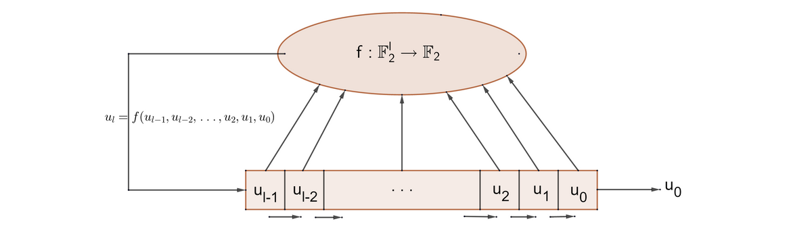
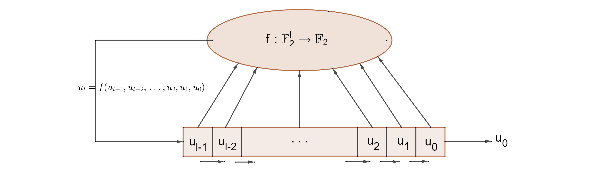

This tutorial introduces linear feedback shift registers (LFSR) and explains the Berlekamp - Massey algorithm to find
the shortest LFSR for a given binary output sequence. An implementation of the algorithm in C++ is provided as well.



## Feedback Shift Registers

Feedback shift registers, or FSRs, for short, were probably first invented
by [Solomon Golomb](https://en.wikipedia.org/wiki/Solomon_W._Golomb) and Robert Tausworthe. This tutorial is but a brief
introduction to the theory of FSRs. We will learn, however, how to find the shortest linear FSR for a given binary
output sequence.

An FSR of length $l$ is specified by a Boolean function $f: \mathbb{F}_2^l \to \mathbb{F}_2$, the so-called
**feedback function**. Let $u_0, u_1,$ ..., $u_{l-1}$ be the initial input stream for such a shift register, then the
output consists of the rightmost bit $u_0$, while all the other bits are shifted to the right by one position. The
leftmost cell is then filled by the new bit $u_l = f(u_{l-1}, u_{l-2},$ ..., $u_0)$. Thus the shift register can be
fully defined by the recursive formula $u_n = f(u_{n-1}, u_{n-2}, ..., u_{n-l})$ for $n \geq l$.



The first $l$ bits $u_0$, $u_1$, ..., $u_{l-1}$ are called the **start value**, or the **seed**, of the FSR and the
**key expansion** transforms the short sequence $u = (u_0, u_1, ..., u_{l-1})$ of length $l$, which is called the
effective key, into a key stream $u_0, u_1, u_2, ...$ of arbitrary length. In a cryptographic context, those bits
form the secret key system.

The simplest and best understood FSRs are the so-called **linear-feedback shift register**, or LFSRs. The feedback
function of LSFRs is a linear map.

## Linear Maps

A boolean function $f: \mathbb{F}_2^n \to \mathbb{F}_2$ is called a **linear form**, if its degree is $1$ and its
absolutely term is $0$, and is thus of the form $f(x) = \sum\limits_{i=1}^ns_ix_i,$ where $s_i \in
\mathbb{F}_2$ for all $i=1, 2, ..., n$. Over $\mathbb{F}_2$ a linear form is thus a partial sum $\alpha_{I}(x) =
\sum\limits_{i \in I}x_i,$ where $I=\\{i \mid s_i = 1\\}.$

It is easy to see that there are exactly $2^n$ Boolean linear forms in $n$ variables and they naturally correspond to
the power set $\mathcal{P}(\\{1,2, ..., n\\})$.

Boolean linear functions are actual linear mappings in the sense of linear algebra, that is, a boolean linear function
$f: \mathbb{R}_2^n \to \mathbb{F}_2$ is a linear map, if and only if, for all $x, y \in \mathbb{F}_2^n$ and $\alpha
\in \mathbb{F}_2$: $f(x+y) = f(x) + f(y)$ and $f(\alpha x) = \alpha f(x)$.

Using a linear map, the iteration of the shift registers takes the following form: $u_n = \sum\limits_{i \in
I}u_{n-i}.$ Obviously the operation of such a register is deterministic, thus the seed completely defines how the
register works. Likewise, because the register has but a finite number of possible states, it must eventually enter a
repeating cycle. Nonetheless, with a well-chosen feedback function, LFSRs can produced long cycles of bits that appear
to be pseudo-random.

## Fibonacci LFSRs

The [Fibonacci](https://en.wikipedia.org/wiki/Fibonacci) LFSR only feeds a few bits back into the feedback function.
Those bits that actually affect the next state are called **taps**. The taps are then XORed, which is equivalent to the
addition in $\mathbb{F}_2$, with the output bit and then fed back into the leftmost bit. The information about the taps
can be represented using a polynomial in $\mathbb{F}_2[X]$, the so-called feedback polynomial $P_f$. For example, in
a 16-bit LFSR, the following polynomial defines the $1$st, $3$rd, $12$th and $16$th bits as the taps: $P_f =
X^{16} + X^{12} + X^3 + X + 1$.

The LFSR is said to be of maximal length, if and only if, the corresponding feedback polynomial is primitive. The above
polynomial is indeed primitive.

The following C++-code creates a $16$-bit LFSR with a given feedback polynomial:

```cpp
// 16-bit Fibonacci Linear-Feedback Shift Register defined by a feedback polynomial
unsigned int lfsrFib16(uint16_t& seed, std::vector<int> feedbackPolynomial, std::string& output, int steps)
{
	uint16_t lfsr = seed;			// the initial seed for the LFSR defined by the feedbackPolynomial		
	uint16_t bit = 0;				// the output of the linear feedback function
	unsigned int cycle = 0;			// the cycle length of the LSFR
	unsigned int size = feedbackPolynomial.size();	
	do 
	{
		bit = 0;
		// compute the new (leftmost) bit using the tabs defined by the primitive feedback polynomial
		for (unsigned int i = 1; i < size; i++)
			if (feedbackPolynomial[i] != 0)
				bit ^= (lfsr >> (size - 1 - i));

		// output the rightmost bit, and set the last bit to the newly computed bit
		output.push_back(std::to_string(lfsr%2)[0]);
		lfsr = (lfsr >> 1) | (bit << 15);
		
		// increase the period
		cycle++;
		steps--;
	} while (lfsr != seed && (steps > 0 || steps < 0));
	seed = lfsr;
	output.swap(output);
	return cycle;
}
```

The code is rather self-explanatory. The first actual line of code, inside the "do-while" loop, simply takes the bits
that are tapped, as defined by the feedback polynomial, and computes their sum by XORing them. The second line then "
outputs" the rightmost bit, by shifting everything to the right, and then replaces the last bit of the LSFR by the
output of the feedback function just calculated in the first step. Note that by invoking the LSFR with a negative number
for "steps", the LFSR will continue to output bits until it has reached the end of its cycle, whose length it will
return.

As an example, let us create a LFSR with the polynomial from above:

```cpp
int main()
{
	// define the feedback polynomial: X^16 + X^12 + X^3 + X + 1
	std::vector<int> feedbackPolynomial;			
	for (unsigned int i = 0; i < 17; i++)
		feedbackPolynomial.push_back(0);
	feedbackPolynomial[0] = 1;
	feedbackPolynomial[1] = 1;
	feedbackPolynomial[3] = 1;
	feedbackPolynomial[12] = 1;
	feedbackPolynomial[16] = 1;
	
	// set the seed (initial state of the LFSR)
	uint16_t seed = 0xB9B9;							// the initial seed

	// create the output vector
	std::string output;
	
	// print starting message
	std::cout << "Creating a LFSR with ";
	outputFeedbackPolynomial(feedbackPolynomial);
	std::cout << "Seed: " << std::bitset<16>(seed) << std::endl << std::endl;

	// let the feedback shift register work
	unsigned int steps = 25;
	lfsrFib16(seed, feedbackPolynomial, output, steps);
	std::cout << "Output after " << steps << " steps: ";
	std::cout << output << std::endl;
	
	return 0;
}
```

And here is the output:

    Creating a LFSR with Feedback Polynomial:  X^16 + X^12 + X^3 + X + 1
    Seed: 1011100110111001

    Output after 25 steps: 1001110110011101010010011

## Matrix Form

Binary LFSRs can be expressed by matrices in $M_n(\mathbb{F}_2)$, by using
the [Frobenius](https://en.wikipedia.org/wiki/Ferdinand_Georg_Frobenius) companion matrix of the monic feedback
polynomial. Let $P_f = X^n + a_{n-1}X^{n-1} + ... + a_1X+X_0$ be a monic feedback polynomial, then the
companion matrix $C_{P_f}$ is defined as

$C_{P_f} := \begin{pmatrix}0 & 1 & 0 & ... & 0 \\ 0 & 0 & 1 & ... &
0 \\ \vdots & \vdots & \vdots & \vdots & \vdots \\ a_0 & a_1 & a_2 & ... & a_{n-1} \end{pmatrix}.
$

Let further $(u_0, u_1, ..., u_{n-1})^t$ be the seed of the LFSR, then the state of the LFSR after k steps is given by:

$\begin{align} \begin{pmatrix}u_k \\ u_{k+1} \\ u_{k+2} \\ \vdots \\ u_{k+n-1} \end{pmatrix} &=
\begin{pmatrix}0 & 1 & 0 & ... & 0 \\ 0 & 0 & 1 & ... & 0 \\ \vdots & \vdots & \vdots & \vdots & \vdots \\ a_0 &
a_1 & a_2 & ... & a_{n-1} \end{pmatrix} \cdot \begin{pmatrix} u_{k-1} \\ u_k \\ u_{k+1} \\ \vdots \\
u_{k+n-2} \end{pmatrix} \\ &= \begin{pmatrix}0 & 1 & 0 & ... & 0 \\ 0 & 0 & 1 & ... & 0 \\ \vdots & \vdots &
\vdots & \vdots & \vdots \\ a_0 & a_1 & a_2 & ... & a_{n-1} \end{pmatrix}^k \cdot \begin{pmatrix} u_0 \\ u_1 \\
u_2 \\ \vdots \\ u_{n-1} \end{pmatrix}, \end{align}$

thus the Frobenius matrix completely determines the behaviour
of the LFSR. Using matrix notation it is very easy to generalize LFSR to arbitrary fields.

## Applications and Weakness

LFSRs can be implemented in hardware, which makes them very useful for on-the-field deployment, as they generate
pseudo-random sequences very quickly, and this makes them useful in applications that require very fast generation of a
pseudo-random sequence, such
as [direct-sequence spread spectrum (DSSS)](https://en.wikipedia.org/wiki/Direct-sequence_spread_spectrum) radios, for
example. One example of a DSSS is the [IEEE 802. 11b specification](https://en.wikipedia.org/wiki/IEEE_802.11#802.11b)
used in wireless networks.

LFSRs have also been used for generating an approximation of [white noise](https://en.wikipedia.org/wiki/White_noise) in
various [programmable sound generators](https://en.wikipedia.org/wiki/Programmable_sound_generator).

LFSRs have long been used
as [pseudo-random number generators](https://en.wikipedia.org/wiki/Pseudorandom_number_generator) for use
in [stream ciphers](https://en.wikipedia.org/wiki/Stream_cipher), especially in the military, due to the ease of
construction from simple electromechanical or electronic circuits. Unfortunately, with their linearity comes a huge
weakness. Even just a small piece of the output stream is enough to reconstruct an identical LSFR using
the [Berlekamp](https://en.wikipedia.org/wiki/Elwyn_Berlekamp) - [Massey](https://en.wikipedia.org/wiki/James_Massey)
algorithm. Obviously, once the LFSR is known, the entire output stream is known.

Important LFSR-based stream ciphers still in use nowadays include the A5/1 and the A5/2 ciphers used in GSM cell phones,
or the E0 cipher used in Bluetooth. The A5/2 cipher has been broken and both A5/1 and E0 have serious weaknesses.

## The Berlekamp - Massey Algorithm

Now that we know how to construct a LSFR, let us learn how to reconstruct one from knowing an output bit string. The
first idea that comes to mind, obviously, is to abuse the linearity of the LFSR. Assume further, that the length of the
LSFR is known, then it is clear that a simple matrix inversion is enough to reconstruct the feedback polynomial. The
difficulty then is to find the length $l$ of the LFSR.

Enter the Berlekamp - Massey algorithm. Basically speaking, this algorithm starts with the assumption that the length of
the LSFR is $l=1$, and then iteratively tries to generate the known sequence and if it succeeds, everything is well, if
not, $l$ must be increased. The following explanations follow the original paper of Berlekamp.

To solve a set of linear equations of the form $S_{i+\nu} + \Lambda_1 S_{i+\nu-1} + ... +
\Lambda_{\nu-1}S_{i+1} + \Lambda_{\nu}S_i=0,$a potential instance of $\Lambda$ is constructed step by step. Let
$C$ denote such a potential candidate, it is sometimes also called the "connection polynomial" or the "error locator
polynomial" for $L$ errors, and defined as $C = c_L X^L + c_{L-1}X^{L-1} + ... + c_2X^2 + c_1X + 1.$The goal of
the Berlekemp - Massey algorithm is to now determine the minimal degree $L$ and to construct $C$ such, that $S_n +
c_1 S_{n-1} + ... + c_L S_{n-L} = 0,$for all $L \leq n \leq N-1,$ where $N$ is the total number
of [syndromes](https://en.wikipedia.org/wiki/Decoding_methods#Syndrome_decoding), and $n$ is the index variable used to
loop through the syndromes from $0$ to $N-1$.

With each iteration, the algorithm calculates the discrepancy $d$ between the candidate and the actual feedback
polynomial: $d = S_k + c_1 S_{k-1} + ... + c_L S_{k-L}.$If the discrepancy is zero, the algorithm assumes that
$C$ is a valid candidate and continues. Else, if $d \neq 0$, the candidate $C$ must be adjusted such, that a
recalculation of the discrepancy would lead to $d=0$. This re-adjustments is done as follows: $C = C -
\dfrac{d}{b}X^mB,$where $B$ is a copy of the last candidate $C$ since $L$ was updated, $b$ a copy of the last
discrepancy since $L$ was updated, and the multiplication by $X^n$ is but an index shift. The new discrepancy can now
easily be computed as $d = d - \dfrac{d}{b}b = d - d = 0.$

Now all that is left to do is to increase $L$, the number of errors, as needed. If $L$ equals the actual number of
errors, then during the iteration, the discrepancies will become $0$ before $n$ becomes greater or equal to $2L$.
Otherwise the algorithm will accordingly set $L=n+1-L$, which limits $L$ to the number of available syndromes used to
calculate the discrepancies. The polynomial $B$ will be reset to a temporary copy of $C$.

In what follows we will derive and implement the Berlekamp - Massey algorithm over the finite field with two elements.

## Berlekamp - Massey over $\mathbb{F}_2$

There are a few natural simplifications to the above algorithm when working over the finite field of characteristic $2$.
First note that there is no division, thus $\dfrac{d}{b} = d$. Now let $u_0, u_1, u_2, ..., u_{n-1}$ be the bits of
an input stream and let $B$ and $C$ be two $n$-dimensional vectors, defining polynomials, filled with zeros, except for
their first entry. Further define two variables $L=0$, the number of errors, and $m=-1$. Now the algorithm loops over
the length of the input stream. Let $n$ be the looping variable from $n=0$ to $N$:

* Compute the discrepancy $d := u_i + c_1u_{i-1} + c_2 u_{i-2} + ... + c_L u_{i-L}$.

* **If** $d=0$, then $C$ is a polynomial which annihilates the stream from $n-L$ to $n$.

* **Else**:

    * Copy $C$ into a new array $T$.
    * Set $c_{n-m} = c_{n-m} + b_0$, $c_{n-m+1} = c_{n-m+1} + b_1$, ..., $c_{n-1}=c_{n-1}+b_{m-1}$.
    * **If** $L \leq \dfrac{n}{2}$, set $L=n+1-L$, $m=n$ and $B=T$.
    * **Else**: do nothing.

Without further ado, behold the C++ implementation of the above algorithm:

```cpp
// Berlekamp - Massey algorithm
unsigned int BerlekampMassey(std::string s, std::vector<int>* o)
{

	// definitions and initialization
	const unsigned int N = s.length();		// the length of the input stream
	unsigned int L = 0;						// the number of errors ; minimal size of the LSFR at output
	unsigned int d = 0;						// the discrepancy between between the connection polynomial and the actual polynomial
	int m = -1;								// the number of iterations since L and B have been updated
	
	std::vector<int> B, C, T;				// polynomials
											// C: a candidate for the feedback polynomial, also called connection polynomial, or error locator polynomial
											// B: copy of the last known connection polynomial
											// T: temporary copy of the connection polynomial
	B.push_back(1);
	for (unsigned int i = 1; i < N; i++)
		B.push_back(0);
	C = B;

	// enter the main loop of the algorithm
	for (unsigned n = 0; n < N; n++)
	{
		// compute the discrepancy 
		d = 0;
		for (unsigned int i = 0; i <= L; i++)
			// d = s_n + sum_{i=1}^L C_i * s_{n-i}
			d ^= C[i] * (s[n-i] == '0' ? 0 : 1);

		// if d is zero, the algorithm assumes that C and L are correct for the moment
		if (d != 0)
		{
			// d is not zero, thus there is a discrepancy
			// create a temporary copy of the connection polynomial
			T = C;
			
			// now adjust the connection polynomial such, that a recalculation of the discrepancy would be zero
			for (unsigned int i = 0; (i+n-m)<N; i++)
				C[n-m+i] ^= B[i];

			// increase the number of errors
			if (L <= (n>>1))
			{
				// 2L <= n ; thus L does not equal the actual number of errors
				L = n + 1 - L;
				m = n;
				B = T;
			}
		}
	}

	// output polynomial for the LSFR and its minimal length
	*o = C;
	o->resize(L+1);
	std::reverse(o->begin(), o->end());
	return L;
}
```

Now let us test the algorithm with the output from the linear feedback shift register from above:

```cpp
int main()
{
	// define the feedback polynomial: X^16 + X^12 + X^3 + X + 1
	std::vector<int> feedbackPolynomial;			
	for (unsigned int i = 0; i < 17; i++)
		feedbackPolynomial.push_back(0);
	feedbackPolynomial[0] = 1;
	feedbackPolynomial[1] = 1;
	feedbackPolynomial[3] = 1;
	feedbackPolynomial[12] = 1;
	feedbackPolynomial[16] = 1;
	
	// set the seed (initial state of the LFSR)
	uint16_t seed = 0xB9B9;							// the initial seed

	// create the output vector
	std::string output;
	
	// print starting message
	std::cout << "Creating a LFSR with ";
	outputFeedbackPolynomial(feedbackPolynomial);
	std::cout << "Seed: " << std::bitset<16>(seed) << std::endl << std::endl;

	// let the feedback shift register work
	unsigned int steps = 25;
	lfsrFib16(seed, feedbackPolynomial, output, steps);
	std::cout << "Output after " << steps << " steps: ";
	std::cout << output << std::endl;

	// invoke Berlekamp - Massey
	std::vector<int> lsfrFP;
	unsigned int l = BerlekampMassey(output, &lsfrFP);
	
	std::cout << "\nInvoking Berlekamp - Massay on the output: " << std::endl;
	std::cout << "Minimal Length: " << l << "." << std::endl;
	outputFeedbackPolynomial(lsfrFP);

	return 0;
}
```

And here is the output:

    Creating a LFSR with Feedback Polynomial:  X^16 + X^12 + X^3 + X + 1
    Seed: 1011100110111001

    Output after 25 steps: 1001110110011101010010011

    Invoking Berlekamp - Massay on the output:
    Minimal Length: 13.
    Feedback Polynomial:  X^13 + X^12 + X^11 + X^10 + X^9 + X^8 + X^7 + X^6 + X^3

Happy coding!

## References

* Wikipedia