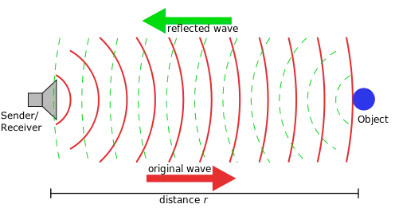
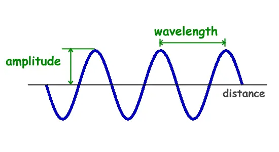
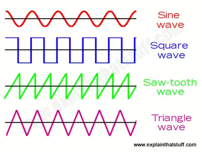
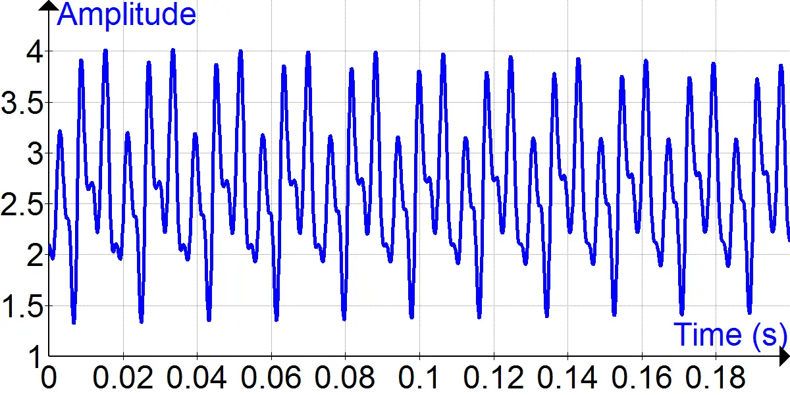
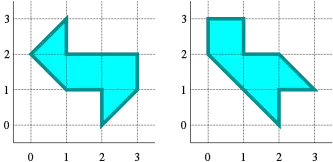
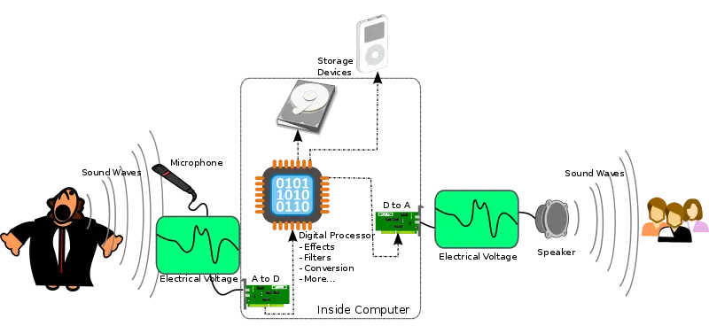
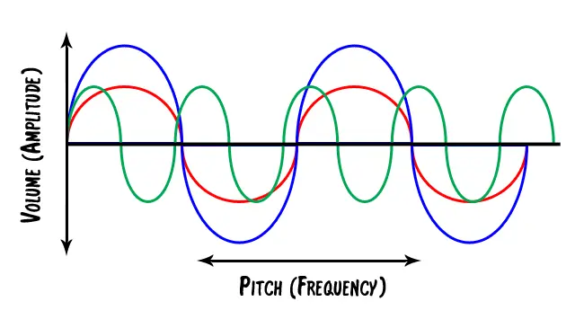

> There is in souls a sympathy with sounds:
> And as the mind is pitch'd the ear is pleased
> With melting airs, or martial, brisk or grave;
> Some chord in unison with what we hear
> Is touch'd within us, and the heart replies.
>
> -- William Cowper

Sound is an important component of modern computer games, without sounds, games lose a lot of atmospheric detail.

## Sound

*Sound* is a vibration that propagates as an audible wave of pressure through a transmission medium such as a gas,
liquid or solid. Obviously, those mechanical waves travel with different velocities as the medium varies, for example
sound travels a lot faster through water (1478 m/s) than through air (344 m/s) — which is
why [sonars](https://en.wikipedia.org/wiki/Sonar) work so well in water.



Besides its velocity, there are two other parameters to a sound wave: its amplitude and its frequency.

The amplitude is a measure of how much air volume is moved over a single period of time. Large speakers (and big-mouthed
people) move more air, thus the sound they emit is *stronger* or more *intense*.



A frequency, strictly speaking, is the number of occurrences of a repeating event per unit of time. In our context, the
frequency, or wavelength, is how many complete waves are emitted per second by the sound source. The frequency is
measured in [Hertz](https://en.wikipedia.org/wiki/Heinrich_Hertz) (Hz).

Most human beings can hear sounds in the range between 20 and 20000 Hz. The average male has a voice that ranges from 20
to 2000 Hz, while the voice of an average female ranges from 70 to 3000 Hz. (Note to all the feminists: there are
differences between men and women — men have more bass and women have more treble.)


Mathematically speaking, the velocity of sound, $v$, can be computed using its frequency $f$, and its amplitude
$\lambda$, as follows: $v = f \cdot \lambda$.

Also, note that sounds with the same frequency and the same amplitude might still sound differently, due to having
different wave forms (think of sinus waves or sawtooth waves).



---

Our ears have numerous little hair-like structures called
*[stereocilia](https://en.wikipedia.org/wiki/Stereocilia_(inner_ear))*, which are responsible to catch sound waves. Each
of these cilia can detect sound waves of different frequencies. Once a sound wave enters the ear, the cilia resonate and
send the according signals to the brain, which then transforms those signals into the perception of sound. (Can you
imagine creatures that do not hear, but see sound?)

The form of a single pure tone will always be a sine wave, with an arbitrary frequency and amplitude. Mixed thousands of
those pure tones together, we get the *spectrum* of a sound. The most basic waveform is the sine wave, as all other
waveforms can be represented by linear combinations of several sine waves. This is the topic
of [Fourier analysis](https://en.wikipedia.org/wiki/Fourier_analysis), which we will postpone to later, more advanced,
tutorials.



For now, I just want to give a short outlook into the beautiful world of mathematics.

## Can you hear the shape of a drum?

A famous mathematical question is whether you can actually hear the shape of a drum. To hear the shape of a drum is to
infer information about the shape of the drumhead from the sound it makes. *Can One Hear the Shape of a Drum?* was the
title of an [article](https://www.maa.org/sites/default/files/pdf/upload_library/22/Ford/MarkKac.pdf)
by [Mark Kac](https://en.wikipedia.org/wiki/Mark_Kac)in
the [American Mathematical Monthly](https://en.wikipedia.org/wiki/American_Mathematical_Monthly) in 1966, but the
phrasing of the title is due to [Lipman Bers](https://en.wikipedia.org/wiki/Lipman_Bers). The mathematics behind that
questions can be traced all the way back to [Hermann Weyl](https://en.wikipedia.org/wiki/Hermann_Weyl).

The frequencies at which a drumhead can vibrate depends on its shape.
The [Helmholtz](https://en.wikipedia.org/wiki/Hermann_von_Helmholtz) equation calculates the frequencies if the shape is
known. These frequencies are the eigenvalues of the [Laplacian](https://en.wikipedia.org/wiki/Pierre-Simon_Laplace) in
the space. A central question is whether the shape can be predicted if the frequencies are known. No other shape than a
square vibrates at the same frequencies as a square. Kac did not know whether it was possible for two different shapes
to yield the same set of frequencies.

Mathematically speaking, a drum is conceived as an elastic membrane, which is represented by a domain in the plane. Two
domains are called *isospectral*, or *homophonic*, if they have the same spectrum, i.e. the same eigenvalues. The
Dirichlet eigenvalues are precisely the fundamental tones that the drum in question is capable of producing, i.e. they
appear naturally as [Fourier](https://en.wikipedia.org/wiki/Joseph_Fourier) coefficients in the wave equation of the
emitted sound wave. The question can thus be reformulated as follows: What can be inferred on the domain if one only
knows its eigenvalues?

[John Milnor](https://en.wikipedia.org/wiki/John_Milnor) immediately observed that a theorem
by [Ernst Witt](https://en.wikipedia.org/wiki/Ernst_Witt) implied the existence of two $16$-dimensional tori with the
same eigenvalues but different shapes. The two-dimensional problem remained unanswered until 1992,
when [Carolyn Gordon](https://en.wikipedia.org/wiki/Carolyn_S._Gordon), [David Webb](https://en.wikipedia.org/wiki/David_Webb_(mathematician))
and Scott Wolpert constructed a pair of regions in the plane, concave polygons, with different shapes but with the same
eigenvalues, thus negatively answering the question: for man shapes, one can not hear the shape of the drum
*completely*.

This is an image of the two surfaces with the same spectrum that they had constructed. Notice that both polygons have
the same area and perimeter.



Some information might still be acquired. Mr. Zelditch showed that the question can be answered positively for certain
convex planar regions with analytic boundary, and today it is known that the set of isospectral domains is compact in
the $C^\infty$-topology.

## Digital versus MIDI

There are two kinds of sounds that a computer can produce: *[digital](https://en.wikipedia.org/wiki/Digital_audio)* and
*synthesized*. Digital sounds are recordings of sounds, while synthesized sounds are programmed reproductions of sounds
based on algorithms.

### Digital Sound

Digital sound obviously needs *digitalization*, i.e. a way to encode data in a digital form of ones or zeros. Just as an
electrical signal can create sounds by causing a magnetic field to move the cone magnet of a speaker, *talking* to a
speaker creates the opposite effect. That means that the speaker then produces electrical signals based on the
vibrations it *feels*.

Thus, with proper hardware, it is possible to digitize sounds. Once the sound is recorded into memory, it can be
processed or simply played back with a digital to analogue converter.



The number of samples of a sound recorded per second is called the *sample rate*. If we want to reproduce a sound, the
sample rate must be at least twice the frequency of the original sound. Thus, for example, if we intend to reproduce a
human voice, the sound must be sampled at 4000 Hz. The mathematical reasoning behind this is that if we can sample the
highest frequency sine wave of a sound, we can sample all the lower ones as well. Can you figure out why you need the
double of the frequency to sample a sine wave? (Hint: Sine waves do rise and fall.) For the mathematically interested,
have a look at the [Nyquist-Shannon theorem](https://en.wikipedia.org/wiki/Nyquist%E2%80%93Shannon_sampling_theorem).

The second parameter of a sound, the amplitude, also plays a crucial role when sampling a sound. The so called
*amplitude resolution* defines how many values are available for the amplitude. For example, with a 16-bit resolution,
there are $65536$ possible values.

To conclude: Digital sound is a recording or sampling of sound converted into a digital form from an analogue signal.

### Synthesized Sound

Synthesized sound isn't a *real* sound converted into a digital form; it is a mathematical reproduction of a sound.
Playing back a single tone is easy, but real sound is made up of many frequencies, they have undertones, overtones and
harmonics, for example. Thus, to produce full sound, the hardware must be able to play back many *base* sounds
simultaneously.



One of the first attempts to create synthesized sounds was the
so-called [Frequency modulation (FM) synthesis](https://en.wikipedia.org/wiki/Frequency_modulation_synthesis). FM
synthesis feeds the output of a signal back to itself, thus modulating the signal and creating harmonics from the
original single sine wave.

About the same time as FM synthesis, a technical standard for music synthesis was introduced,
the [Musical Instrument Digital Interface (MIDI)](https://en.wikipedia.org/wiki/MIDI) standard. Instead of digitalizing
a sound, a MIDI document describes a sound as key, instruments and special codes:

```
Channel 1: B sharp
Channel 2: C flat
```

A drawback to this format is, that the synthesis is up to the hardware, and thus different hardware produces different
sounds. The considerable gain in memory size compared to digital music (a few kilobytes against a few megabytes) often
made up for that drawback, though.

---

To further increase the quality of synthetic sound, a process
called [wave table synthesis](https://en.wikipedia.org/wiki/Wavetable_synthesis) was introduced. Basically, wave table
synthesis works like this: the wave table has a number of real, sampled digital sounds which can be played back at any
desired frequency and amplitude by a digital signal processor. Obviously, this takes up a bit more memory again, but the
increase in quality is often worth it. As computers got faster, it also became possible to have software
synthesizer-based wave table systems.

To take things even further, [wave guide synthesis](https://en.wikipedia.org/wiki/Digital_waveguide_synthesis) was
introduced. By using special hardware, the sound synthesizer can generate a mathematical model of an instrument and then
actually play it! With this technology, the human ear can no longer perceive a difference between *real* and
*synthesized* sound.

---

So much for a basic introduction to the theory of sound. Let us briefly examine what type of sound is needed in a game.

## Basic Sound System

At the most basic level, a sound system must be able to play back sounds at any given time. This can be done using our
newly implemented event queue.

Unfortunately, playing one sound at a time is not good enough in most cases. Imagine a dog running around in the garden,
playing fetch, for example. If we played the same footstep sound all the time, it would become repetitive and boring
rapidly, we thus already need different sound files for the *same* sound effect.

Another important thing to consider is that a computer only has a finite number of *sound channels* it can use at the
same time, thus, sometimes, the game has to prioritize sounds, i.e. we have to play back those sounds that are important
and ignore the less important ones. An example of this would be two cars crashing into each other on a road next to the
garden our dog is playing in. Further, imagine that the dog has invited many of his friends to play with. Obviously, the
sound of the cars crashing would be more important than playing back a *pawstep* sound for each dog in the garden.

To be able to do this, our game engine will handle something we will call *sound events*. A sound event is a map (I love
mappings!) between a game event and a sound (or multiple sounds). The game will not directly call for a sound to be
played, but it will rather trigger a sound event.

There is another thing we have to consider: From how far away do we want the car crash to be heard? It would be quite
useful if we could define a maximum distance for sound to travel — we will call this the *fallof* of a sound event.

This leads to the following first draft of a sound event:

```cpp
struct SoundEvent
{
    unsigned int fallof;
    unsigned int priority;
    
    std::vector<SoundFiles*> sounds;
}
```

There is yet another thing we have to think about. Imagine the game world having different undergrounds, such as grass
and stone, or even caves for the dog to explore. Obviously, the pawsteps will sound differently in each scenario. We
thus need to be able to switch between sounds based on game variables:

```cpp
struct SoundEvent
{
    unsigned int fallof;
    unsigned it priority;

    std::map<std::string, std::vector<SoundFiles*> > sounds;
}
```

Now the map stores pairs of strings and vectors of sound files to be able to associate different conditions with
different sound files.

We will see further examples of this in the next tutorial, when we will actually implement a sound system. Take note
though that creating different sound files with all those little changes to the footstep sound will take a lot of
memory. It would most probably be better to use digital signal processing (see above) to simply alter the sounds on the
go.

---

In the next tutorial, we will learn how to use XAudio2 to implement a basic sound system.

---

## References
### Literature
(in alphabetic order)
* Game Programming Algorithms, by Sanjay Madhav
* Game Programming Patterns, by Robert Nystrom
* Microsoft Developer Network ([MSDN](https://msdn.microsoft.com/en-us/library/windows/desktop/ee663274(v=vs.85)))
* Tricks of the Windows Game Programming Gurus, by André LaMothe
* Wikipedia

### Art
* [Anaesthesia UK](http://www.frca.co.uk/)
* [Eveor's Music Information and Resource Center](https://deveorthemusicteacher.wordpress.com/)
* [Explain That Stuff](https://www.explainthatstuff.com/)
* [Music Crash Courses](http://www.musiccrashcourses.com/)
* [University of Houston](https://www.uh.edu/)
* [University of Minnesota Duluth](http://www.d.umn.edu/)
* Wikipedia