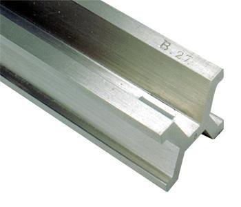
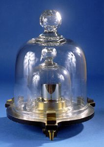
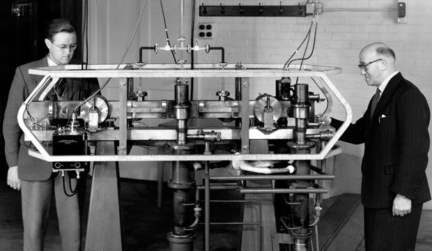

> It is impossible to escape the impression that people commonly use false standards of measurement — that they seek power, success and wealth for themselves and admire them in others, and that they underestimate what is of true value in life.
> 
> – Sigmund Freud, Civilization and Its Discontents

The goal of physics is to gain a more in-depth understanding of the world we live in, as everything in nature obeys the laws of physics. The journey into programming a physics engine starts, as so many journeys do, by learning the very basic concepts of physics. I mean it, this tutorial just gives an overview of the most basic notions used in physics.

To quantify physical observations, certain basic physical quantities must be measured. Surprisingly enough, three of these quantities are enough for our purposes: the length, the mass, and the time.

## Length
Early civilizations often associated units of length with the human body. The Egyptians, for example, defined the *cubit* to be the distance from the elbow to the tip of the middle finger. Another historical unit for the length is the *foot*. The foot was a part of many local systems of units, including the Greek, Roman, Chinese, French, and English systems. It varied in length from country to country, from city to city, and sometimes from trade to trade.

These inexact units of measurement made it very difficult to barter, to trade and to compare the results of physical experiments, thus, in the year 1793, the French Academy of Sciences, decided to define a standard unit of length. This new unit was to be equal to one ten-millionth of the distance from the North Pole to the equator of the earth. The French named this new unit *mètre*, from the Greek word *metron*, meaning *measure*.

In 1889, the *Bureau International des Poids et Mesures (BIPM)*, located in Sèvres, France, constructed a prototype of a metre, to be able to maintain comparisons between the standard metre and other units of measurement. From then on, the metre was defined to be the distance between two lines on a platinum-iridium bar, measured at the melting point of ice.

As technology advanced, however, so did the desire for an even more precise definition of a metre. Since 1983 the meter is defined to be the distance travelled by light in a vacuum in $\frac{1}{299792458}$ of a second. Wonderfully precise, isn't it?

Commonly used multiples of the metre are the decimetre (dm: $10^{-1}m$), the centimetre (cm: $10^{-2}m$), the millimetre (mm: $10^{-3}m$), the micrometre ($\mu$m: $10^{-6}m$), the nanometre (nm: $10^{-9}m$) and the kilometre (km: $10^3m$).

Below is a list of some typical lengths:

| Description                        | Length (in m)        |
|:----------------------------------:|:--------------------:|
| Distance: Earth - Andromeda Galaxy | $2 \cdot 10^{22}$    |
| Diameter: Milky Way                | $8 \cdot 10^{20}$    |
| Distance: Light Year               | $9,46 \cdot 10^{15}$ |
| Distance: Earth - Sun              | $1,5 \cdot 10^{11}$  |
| Radius: Earth                      | $6,37 \cdot 10^6$    |
| Diameter: Aorta                    | $1,8 \cdot 10^{-2}$  |
| Diameter: Red Blood Cell           | $8 \cdot 10^{-6}$    |
| Diameter: Hydrogen Atom            | $10^{-10}$           |
| Diameter: Proton                   | $2 \cdot 10^{-15}$   |

## Mass
Mass is measured in kilograms (kg). Whereas the metre is defined as a natural physical quantity, the kilogram was defined theoretically to be the mass of a particular platinum — iridium alloy cylinder at the BIPM.

Please note that the kilogram is not defined as the weight of the cylinder. Weight and mass are different quantities which, in every language, are often confused. The mass is an intrinsic, unchanging property of an object, whereas the weight, in contrast, is a measure of the gravitational force acting on an object, which obviously can vary depending on the location of the object. The force of gravity will be discussed in a later tutorial, for now, just know that an object weighs more on Earth than on the Moon, but the mass of the object remains unchanged.

As metric prefixes may not be concatenated, for the measure of the mass of an object, prefixes are used with the unit gram, not kilogram, which already has a prefix as part of its name. The most commonly used multiples of a gram are, obviously, the kilogram ($kg: 10^3 g$), the milligram ($mg: 10^{-3} g$), the microgram ($\mu g: 10^{-6} g$), the nanogram ($ng: 10^{-9} g$) and the picogram ($pg: 10^{-12} g$).

Below is a list of a few standard weights:

| Description    | Mass (in kg)         |
|:--------------:|:--------------------:|
| Milky Way      | $4 \cdot 10^{41}$    |
| Sun            | $2 \cdot 10^{30}$    |
| Earth          | $5,97 \cdot 10^{24}$ |
| Elephant       | $5,4 \cdot 10^3$     |
| Car            | $1,2 \cdot 10^3$     |
| Human          | $70$                 |
| Bee            | $1,5 \cdot 10^{-4}$  |
| Red Blood Cell | $10^{-13}$           |
| Bacterium      | $10^{-15}$           |

## Time
Time is, quite simply, defined by its measurement: time is what a clock reads. The most accurate timekeepers today, and used since the year 1955, are the so-called atomic clocks, which are based on the characteristic frequencies of the radiation emitted by caesium-133 atoms. Time is measured in seconds (s) and these atomic clocks have a typical accuracy of about $1$ second in about $300000$ years! More precisely, the second is defined to be the time it takes for radiation from a caesium-133 atom to complete $9192631770$ cycles of oscillation.

Often used multiples of the second are the millisecond ($ms: 10^{-3}s$), the microsecond ($\mu s: 10^{-6} s$) and the nanosecond ($ns : 10^{-9} s$).

Below is a list of a few interesting time measurements:

| Description               | Time (in s)         |
|:-------------------------:|:-------------------:|
| Age: Universe             | $5 \cdot 10^{17}$   |
| Age: Earth                | $1,3 \cdot 10^{17}$ |
| Lifetime: Human           | $2 \cdot 10^9$      |
| One Year                  | $3 \cdot 10^7$      |
| One Day                   | $8,6 \cdot 10^4$    |
| Delta: Heartbeats         | $0,8$               |
| Reaction Time: Human      | $0,1$               |
| Cycle: Visible Light Wave | $2 \cdot 10^{-15}$  |

---

As said above, this tutorial was meant as a completely basic introduction to the basic notions of physics. In the next tutorial, we will learn about one-dimensional kinematics.

## References
* Physics, by James S. Walker
* Wikipedia