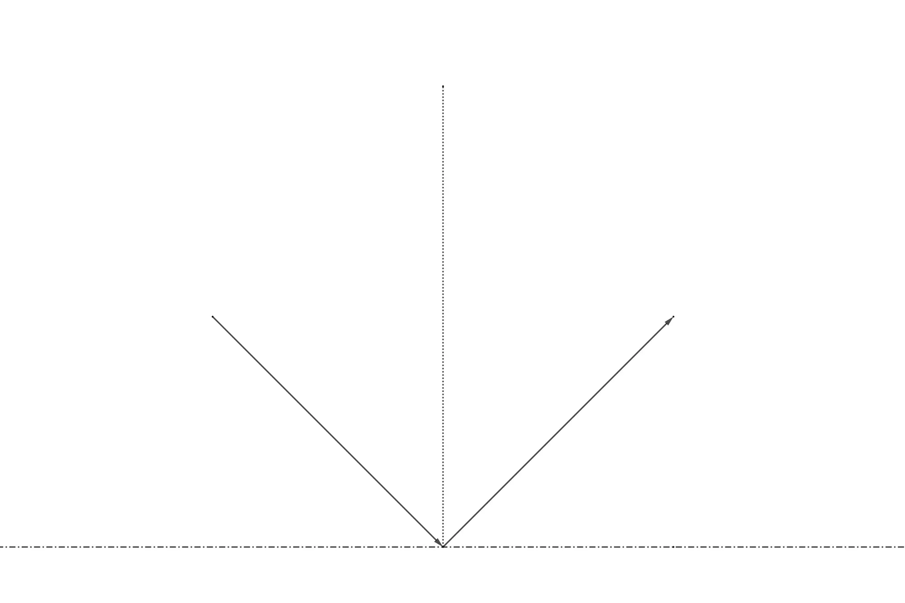
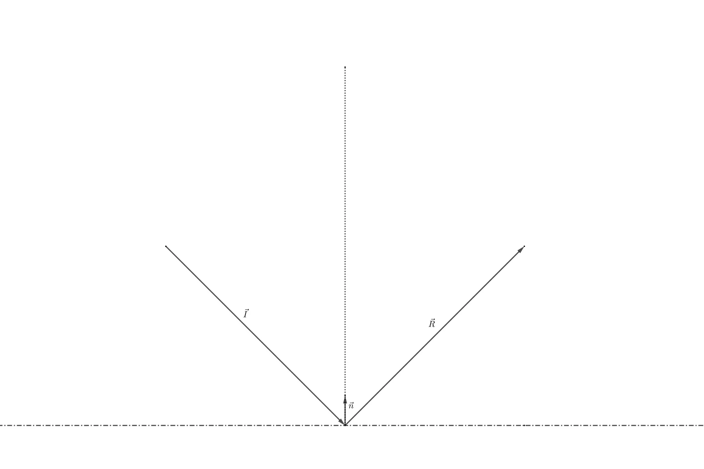
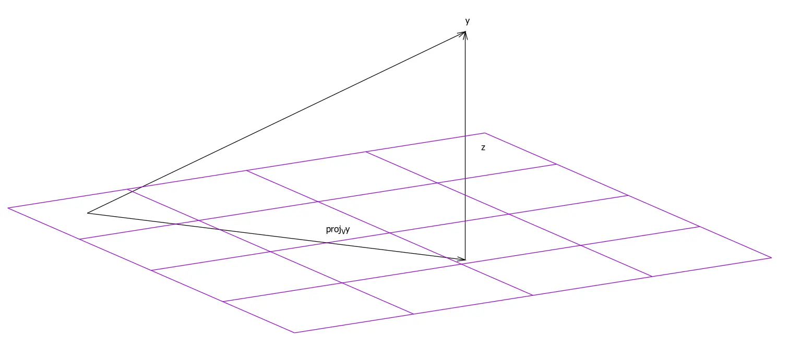

> A faith that cannot survive collision with the truth is not worth many regrets.
>
> -- Arthur C. Clarke, The Exploration of Space

## Simple Bounce Physics

A [previous tutorial]() showcased a *Kicker*-table with a ball bouncing off its edges. This behaviour is easily
simulated by observing that the angle of reflection equals the angle of incidence. When the ball hits one of the sides
of the table, then it always reflects off the side at an angle equal and opposite to its initial trajectory.
‌

Here is the C++-code of that demo:

```cpp

void Ball::collision()
{
	// compute new starting velocity
	velocity->x = initialVelocity * std::cosf(angle);
	velocity->y = initialVelocity * std::sinf(angle);

	// adjust sign of the acceleration
	acceleration->x = std::copysignf(acceleration->x, -velocity->x);
	acceleration->y = std::copysignf(acceleration->y, -velocity->y);
}

util::Expected<void> PlayState::update(const double deltaTime)
{
	if (isPaused)
		return { };

	// update the ball and table
	ball->update(deltaTime, table->frictionCoeffK);

	// check boundaries
	if (ball->position->x < table->leftX + ball->radius)
	{
		ball->position->x = table->leftX + ball->radius;
		ball->initialVelocity = ball->velocity->getLength();
		ball->angle = (float)(M_PI - ball->angle);
		ball->collision();
	}
	if (ball->position->x > table->rightX - ball->radius)
	{
		ball->position->x = table->rightX - ball->radius;
		ball->initialVelocity = ball->velocity->getLength();
		ball->angle = (float)(M_PI - ball->angle);
		ball->collision();
	}
	if (ball->position->y < table->leftY + ball->radius)
	{
		ball->position->y = table->leftY + ball->radius;
		ball->initialVelocity = ball->velocity->getLength();
		ball->angle = (float)(2*M_PI - ball->angle);
		ball->collision();
	}
	if (ball->position->y > table->rightY - ball->radius)
	{
		ball->position->y = table->rightY - ball->radius;
		ball->initialVelocity = ball->velocity->getLength();
		ball->angle = (float)(2*M_PI - ball->angle);
		ball->collision();
	}
    
    ...
}
```

This seems to be a bit too complicated — there is no way I want to think about angles each time I want an object to
bounce from a surface. In the following, we will derive a much easier formula by using simple geometry and a
mathematical technique called *projection*.

## Planes of any Orientation

This tutorial tries to give a better explanation to the above phenomenon by deriving the equations of reflection from
any hypersurface, i.e. off a line in 2D and off a plane in 3D. Once again, we observe that the angle of reflection
equals the angle of incidence relative to the normal vector of the plane:


If you forgot what the normal vector of a plane is, check out [this tutorial]().

In the 2D case, basically speaking, the normal vector of a line can be found by using the scalar product $b:
\mathbb{R}^2 \times \mathbb{R}^2 \mapsto \mathbb{R}$ of the underlying vector space. Let $P_1 := (x_1,y_1)$ and
$P_2 := (x_2, y_2)$ be two points in a plane, and $\vec{v} = (x_2-x_1, y_2-y_1)$ the vector joining those two points,
then the normal vector $\vec{n}$ of the line defined by those two points must satisfy: $b(\vec{n},\vec{v})=0$, i.e.
$v_xn_x+v_yn_y=0$, which is satisfied for the vector $n=(-v_y,v_x)$. All that is now left to do is to normalize the
vector: $\vec{n}=\frac{1}{{v_x}2+{v_y}2}\vec{n}$.

### Projections

Now, how does the normal vector help to find the vector of reflection? First, the projection of the vector of incidence
along the normal vector must be computed (think of the shadow cast by shining a light from the left of the above
figure). The following figure shows the projection of a point to a vector space:



A projection on a vector space $V$ is an idempotent linear map $P: V \mapsto V$. If the vectors $v_1, v_2, ..., v_s$
define a basis of $V$, the projection of any point $y$ to the vector space $V$ can be computed using the underlying
scalar product $b$ as follows: $\operatorname{proj}_V y := \sum\limits_{i=1}^s\dfrac{b(y,v_i)}{b(v_i,v_i)}v_i$.

Thus, in our 2D-example, the projection of the vector $\vec{I}$ to the line defined by the vector $\vec{n}$, denoted by
$\vec{I^{'}}$, can be computed using the scalar product of the underlying vector space as follows: $\vec{I^{'}} = b(
-\vec{I},\vec{n}) \cdot \vec{n}$. Basically, this just tells us that the shadow cast by the vector $\vec{I}$ is $-b(
\vec{I},\vec{n})$ times the vector $\vec{n}$. The negative sign comes from the fact that we have chosen the origin of
our coordinate system to be the origin of the normal vector.

### Finding the Vector of Reflection

Now finding the vector of reflection, $\vec{R}$, is rather easy. Using the shadow we just cast, we can find a vector
$\vec{L}$ joining the starting point of the vector of incidence and the normal vector: $\vec{L} = \vec{I}+\vec{I^{'}}$,
thus the vector of reflection is given by: $\vec{R} = \vec{I^{'}} + \vec{L}$, which yields the desired result:
$\vec{R} = 2 \cdot \vec{I^{'}} + \vec{I}$, where $\vec{I^{'}} = b(-\vec{I},\vec{n}) \cdot \vec{n}$, thus, if we really
want to express the vector of reflection purely by the vector of incidence and the normal vector: $\vec{R} = -2b(
\vec{I},\vec{n}) \cdot \vec{n} + \vec{I}$. This is surely easier than having to think about angles all the time.

### An Example

As an example, let us compute the reflection vector when the vector of incidence is given by $-\vec{I}=(-4,2)$ and the
normal vector by $(0,1)$: $$\begin{align}\vec{R}&=2 \cdot \vec{I^{'}} + \vec{I} \\&= -2b((4,-2),(0,1))\cdot(0,1)+(
-4,2) \\ &=4 \cdot (0,1) + (4,-2) \\ &= (0,4)+(4,-2) \\ &= (4,2).\end{align}$$

## Implementation

The function to compute the vector of reflection is straightforward, we simply use the above formula to change the
vector of incidence to become the vector of reflection:

```cpp
namespace mathematics
{
	float scalarProduct2F(Vector2F x, Vector2F y)
	{
		// standard scalar product
		return x.x * y.x + x.y * y.y;
	}
    
    ...
    
	void reflectionVector(Vector2F* incidence, Vector2F normal)
	{
		// compute projection: b(-I,n)n
		float coef = -2 * scalarProduct2F(*incidence, normal);

		// return the vector of reflection: r = -2b(I,n)n+I
		*incidence += normal * coef;
	}
    
    ...
}
```

With this function, it is now possible to greatly simplify the above code to handle the collision of the ball with the
walls of the *Kicker*-table:

```cpp
util::Expected<void> PlayState::update(const double deltaTime)
{
	if (isPaused)
		return { };

	// update the ball and table
	ball->update(deltaTime, table->frictionCoeffK);

	// check boundaries
	if (ball->position->x < table->leftX + ball->radius)
		// left wall
		mathematics::reflectionVector(ball->velocity, table->normalLeft);
	if (ball->position->x > table->rightX - ball->radius)
		// right wall
		mathematics::reflectionVector(ball->velocity, table->normalRight);
	if (ball->position->y < table->leftY + ball->radius)
		// top wall
		mathematics::reflectionVector(ball->velocity, table->normalTop);
	if (ball->position->y > table->rightY - ball->radius)
		// bottom wall
		mathematics::reflectionVector(ball->velocity, table->normalBottom);
            
    ...
}
```

As you can see, it is no longer necessary to think about angles and Pi or whatever, all that needs to be done is to
define a normal vector for each wall and the rest is just mathemagical. (I have always wanted to make that joke!)

***

In the next tutorial, we will learn how to improve the above collision detection code.

***

## References

* Geogebra
* Tricks of the Windows Programming Gurus, by A. LaMothe
* Wikipedia