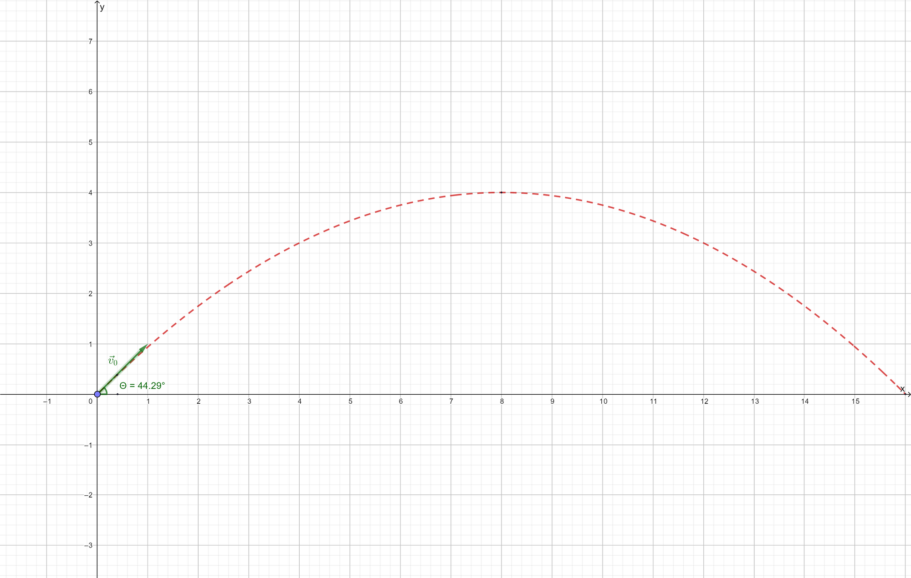
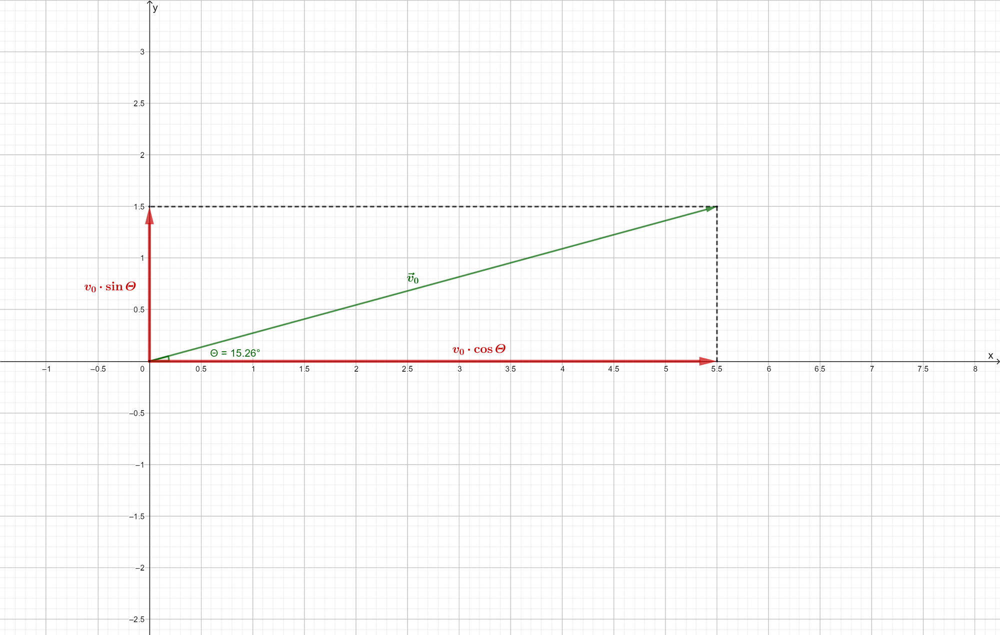
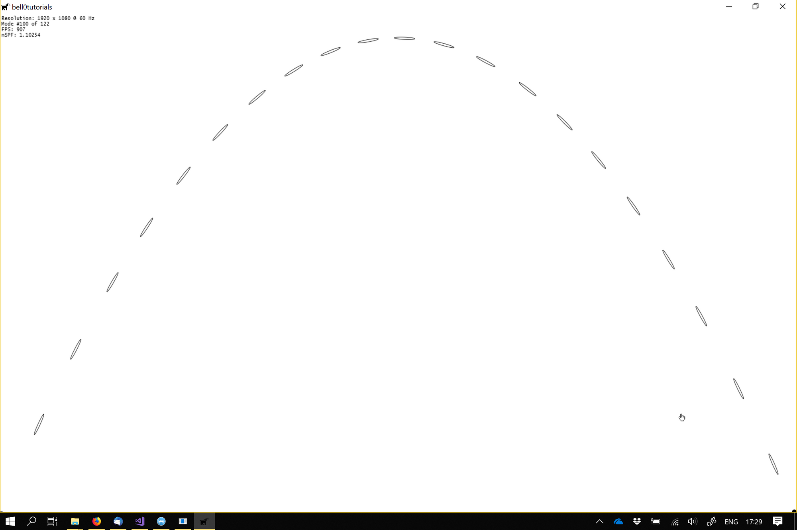

> La parole est un projectile qui tue à distance.
>
> -- Adolphe d'Houdetot, Dix épines pour une fleur.

It is time to apply the independence of vertical and horizontal motion to strengthen the power of our military! It is
time to launch our first projectiles.

***

Let $\vec{f} \in \mathbb{R}^n$ be a force. As in the previous tutorials, by abuse of language, we will write $f = \lVert
\vec{f} \rVert$, if it is clear, from the context, that we are only interested in the magnitude of the force, and not in
its direction or sens.

***

## Basic Equations

A projectile is an object that is launched into motion and then allowed to follow a path determined solely by the
influence of gravity. Air resistance and the Earth's rotation are ignored for the moment.

To simulate projectile motion, the equations of motion of the previous chapter can be used. Since gravity only adds
negative vertical acceleration, the acceleration vector can be set to $\vec{a} = \begin{pmatrix} 0 \\\ g\end{pmatrix}$,
where $g$ stands for the acceleration caused by gravitation: on Earth, the acceleration of gravity is averaged to be
$9,81 \frac{m}{s^2}$. The equations of motion thus look as follows:

$$
\begin{align}x &= x_0 + {v_x}_0 \cdot t \\ y &=
y_0 + {v_y}_0 \cdot t - \dfrac{1}{2}gt^2. \end{align}
$$

## Launch Angle

To simplify the computations, the launch site of the projectile is always set to the centre of the coordinate system.
The figure below shows a projectile being launched with an initial velocity $\vec{v}_0$ and at an angle $\varTheta$.
‌


Since the projectile starts at the origin of the coordinate system, its initial position is $x_0 = 0$ and $y_0 = 0$. The
first task is to find the $x$ and $y$ coordinates of the initial velocity vector, which can be done using trigonometric
functions:$$\vec{v}_0 = \begin{pmatrix}v_0 \cdot \cos\varTheta \\ v_0 \cdot \sin \varTheta \end{pmatrix},$$where $v_0$
is the launch speed of the projectile (c.f. figure below).



The launch angle of the projectile is $\varTheta = 15,26^\circ$ and its initial speed is at $\approx 5,7 \frac{m}{s}$,
thus the initial horizontal velocity is ${v_0}_x = 5,7 \cdot \cos 15,26 \approx 5,7 \cdot 0,96 \approx 5,47
\frac{m}{s}$, and the initial vertical velocity ${v_0}_y = 5,7 \cdot \sin 15,26 \approx 0,26 \approx 1,48 \frac{m}{s}$.

***

Using this new idea, the equations of motion for a projectile launched with an initial speed $v_0$ and at an angle
$\varTheta$, transform into the following: 

$$
\begin{align}x &= x_0 + t \cdot v_0 \cdot \cos \varTheta \\\ y &= y_0 + t
\cdot v_0 \cdot \sin \varTheta - \frac{1}{2}gt, \end{align}
$$

where $(x_0,y_0)$ is the launch site of the projectile.

***

We will only discuss frictional forces in later tutorials, but just as an idea, to add, for example, a small wind force,
slowing down a bullet, a small negative vertical acceleration $f$ could be used:

$$
\begin{align}x &= x_0 + t \cdot v_0
\cdot \cos \varTheta - \frac{1}{2}ft^2\\\ y &= y_0 + t \cdot v_0 \cdot \sin \varTheta - \frac{1}{2}gt. \end{align}
$$

## Key Characteristics

To complete this rather short tutorial, some key characteristics of projectile movement are briefly explained.

### Height, Range and Time

The total time $t$ for which the projectile remains in the air is called the **time of flight**. The time it takes for a
projectile, launched from the centre of the coordinate system, to hit the ground, can be calculated by solving the
equation $0 = {v_y}_0 - \frac{1}{2}gt^2$. The solution is $t = \dfrac{2v_0}{g}\sin\varTheta$.

If the projectile is instead launched from a launch site located at $A=(x_0, y_0)$, then the time it takes for the
projectile to hit the ground can be calculated by solving the equation $0 = y_0 + {v_y}y_0 - \frac{1}{2}gt^2$. The
positive solution of that equation is 

$$
t = \dfrac{v_0 \cdot \sin \varTheta + \sqrt{v_0^2 \cdot \sin^2\varTheta + 2 \cdot
g \cdot y_0}}{g},
$$ 

which, for $y_0$, simplifies to the above solution of a launch from the centre of the coordinate system.

***

The **peak** $h$, or the **maximal height**, above its launch site, obtainable by a projectile, can be calculated by
observing that the projectile will continue to rise until $v_y=0$, that is, until its velocity in the $y$-direction
becomes $0$, thus until $0 = v_0\sin\varTheta - gt$. The time it takes to reach the peak is $t=\dfrac{v_0
\sin\varTheta}{g}$, and the actual peak of the projectile is thus $h := \dfrac{v_0^2 \cdot \sin^2\varTheta}{2g}$.

***

The **range** $d$ of a projectile is the **maximal horizontal distance** the projectile travels before it hits the
ground. The range can be calculated by plugging in the time it takes the projectile to hit the ground into the equation
for the motion in the $x$-axis. The actual solution is 

$$
d = \dfrac{v_0^2 \cdot \sin2\varTheta}{2g}\left(1+\sqrt{1+\dfrac{2\cdot g \cdot y_0}{v_0^2 \cdot \sin^2\varTheta}} \right),
$$ 

for a projectile launched at an initial height of $y_0$, thus $d = \dfrac{v_0^2}{g}\sin2\varTheta$,
for a projectile launched from the centre of the coordinate system.

Note that the range depends inversely on the acceleration of gravity, thus the smaller the gravity, the larger the
range; this means that a projectile launched on the Moon, where the acceleration of gravity is about $\frac{1}{6}$
smaller than on Earth, travels about six times as far as it would on our blue planet.

As the range varies with the double of the initial launch angle, the maximal reach can be obtained by using a launch
angle of $45^\circ$, as $\sin 90^\circ = 1.$ Obviously this is only true if there is no air resistance at all. The
maximal range is then given by $d=\dfrac{v_0^2}{g}$.

### Symmetrical Range

When wondering at what range to shoot a projectile, the following symmetry might be handy. Under ideal conditions (no
air resistance), the maximal range is obtained by a launch angle of $45^\circ$. Now launching a projectile with an angle
of $\varTheta$, with $0^\circ \leq \varTheta \leq 90^\circ$, obviously, leads to the same range as launching with an
angle of $(90-\varTheta)^\circ$.

### Angle of Reach

Given a distance $\mathfrak{d}$, the **angle of reach** is the angle $\varTheta$ at which a projectile must be launched
in order for its range to achieve the desired distance, given an initial speed $v_0$. If the projectile was launched
from the centre of the coordinate system, then the angle of reach is the solution of the equation: $sin2\varTheta =
\dfrac{g \cdot \mathfrak{d}}{v_0^2}$. The two solutions, see above, are $\varTheta = \dfrac{1}{2}\sin^{-1}\dfrac{g \cdot
\mathfrak{d}}{v_0^2}$ and $\varTheta = 90^\circ - \dfrac{1}{2}\sin^{-1}\dfrac{g \cdot \mathfrak{d}}{v_0^2}$.

### Angle to Hit

To **hit a target** located at a point $T=(x_T, y_T)$, when fired from the centre of the coordinate system, with an
initial speed of $v_0$, the projectile must be launched at an angle of 

$$
\varTheta = \tan^{-1} \dfrac{v_0^2 \pm
\sqrt{v_0^4 - g \cdot \left( g \cdot x_T^2 + 2 \cdot y_T \cdot v_0^2 \right)}}{g \cdot x_T}.
$$

If the roots are imaginary, then the initial speed of the projectile was not fast enough to reach the desired target.

***

The case where both roots are the same is very intriguing, as it defines **the angle that allows for the lowest launch
speed**. For that to happen, the value under the square root must be zero, thus the solutions to the equation $v_0^4 - 2
\cdot y_T \cdot v_0^2 - g3x_T2 = 0$ must be found. 

Those solutions are $v_0 = \pm \sqrt{g \cdot y_T - \sqrt{g^2 \cdot
\left( x_T^2 + y_T^2 \right)}}$ and $v_0 = \pm \sqrt{g \cdot y_T + \sqrt{g^2 \cdot \left(x_T^2 + y_T^2 \right)}}$. Using
a completely positive solution, the above equation for the angle required to hit the target reduces to $\varTheta =
\tan^{-1} \left(\dfrac{y_T}{x_T} + \sqrt{\dfrac{y_T2}{y_T2}+1} \right)$. Now let $\alpha := \tan^{-1}\dfrac{y_T}{x_T}$,
then a solution to the equation is given by $\tan\varTheta = \dfrac{\sin \alpha + 1}{\cos \alpha}$, thus $\varTheta =
\alpha + \dfrac{\pi}{4}$.

In other words, to be able to use the lowest possible launch speed, the launch angle should be chosen as the arctangent
of the ratio of the elevation of the target over the distance of the target, plus $\frac{\pi}{4}$, which means one half
of the angle between the target and the opposite of the vector of the acceleration of gravitation.

### Symmetrical Velocity

Note that when a projectile hits the ground, its velocity in the $y$-direction is $v_y = v_0 \cdot \sin \varTheta - gt =
v_0 \cdot \sin\varTheta -g\dfrac{2v_0}{g}\sin\varTheta = -v_0 \sin\varTheta$, which is the opposite of its initial
velocity. Under ideal conditions (no air resistance), the speed of the projectile is the same *on hit* than *on launch*.

## Implementation

Implementing projectile movement can once again be done using the symplectic integrator from the previous chapters.

To facilitate working with projectiles, I created a new class called *Projectile*:

```cpp
class Projectile
{
private:
	// key characteristics
	float launchSpeed;						// launch speed in pixels per second
	float launchAngle;						// launch angle in degree
	float gravity;							// acceleration of gravity in pixels per second
	float range;							// range in pixels
	float peak;								// peak in pixels
	float timeOfFleight;					// in seconds

	// update
	mathematics::Vector2F position;			// the current position of the projectile (in pixels)
	mathematics::Vector2F velocity;			// the current velocity of the projectile (in pixels per second)
	mathematics::Vector2F acceleration;		// the current acceleration of the projectile (in pixels per seconds squared)
		
	// recompute initial velocity and key characteristics
	void computeInitialVelocityAndKeyCharacteristics();
		
public:
	// constructor
	Projectile(const float launchSpeed, const float launchAngle, const float launchX = 0.0f, const float launchY = 0.0f, const float gravity = 9.81f, const float frictionX = 0.0f);
		
	// update and farseer
	void update(const double dt);			// updates the position of the projectile - uses semi-implicit Euler integration
		
	// recalibrate projectile
	void setLaunchAngle(const float angle);
	void reduceLaunchAngle();
	void increaseLaunchAngle();
	void reduceLaunchSpeed();
	void increaseLaunchSpeed();
	void increaseGravity();
	void decreaseGravity();

	// getters
	float getPositionX() const { return position.x; };
	float getPositionY() const { return position.y; };
	float getRange() const { return range; };
	float getVelocityX() const { return velocity.x; };
	float getVelocityY() const { return velocity.y; };
	float getMovementDirection() const;
};
```

The constructor simply sets the initial values:

```cpp
Projectile::Projectile(const float launchSpeed, const float launchAngle, const float launchX, const float launchY, const float gravity, const float frictionX) : launchSpeed(launchSpeed), launchAngle(launchAngle), gravity(gravity)
{
	// set starting position
	position.x = launchX;
	position.y = launchY;

	// set initial acceleration
	acceleration.x = -frictionX;
	acceleration.y = this->gravity;

	// compute initial velocity
	computeInitialVelocityAndKeyCharacteristics();
}
```

The key characteristics are computed as explained above:

```cpp
// compute initial velocity and key characteristics
void Projectile::computeInitialVelocityAndKeyCharacteristics()
{
	// get launch angle in radians
	float launchAngleRad = ((float)M_PI / 180)*launchAngle;

	// compute starting velocity
	float cosAngle = std::cosf(launchAngleRad);
	float sinAngle = std::sinf(launchAngleRad);
	velocity.x = launchSpeed * cosAngle;
	velocity.y = -launchSpeed * sinAngle;

	// calculate characteristics
	if (position.x == 0 && position.y == 1080)
	{
		// starting position is at the lower left of the screen
		timeOfFleight = (2 * launchSpeed / gravity)*sinAngle;
		range = (launchSpeed*launchSpeed / gravity) * 2 * sinAngle*cosAngle;
	}
	else
	{
		timeOfFleight = (launchSpeed*sinAngle + std::sqrtf(launchSpeed*launchSpeed*sinAngle*sinAngle + 2 * gravity*position.y)) / gravity;
		range = (launchSpeed*launchSpeed*std::sinf(2 * launchAngleRad)) / (2 * gravity) * (1 + std::sqrtf(1 + (2 * gravity*position.y) / (launchSpeed*launchSpeed*sinAngle*sinAngle)));
	}

	peak = (launchSpeed * launchSpeed * sinAngle * sinAngle) / (2 * gravity);
}
```

To update the position of a projectile, the symplectic Euler integrator is used once again:

```cpp
// update position
void Projectile::update(const double dt)
{
	// update the position and velocity of the projectile using semi-implicit Euler integration
	Kinematics::semiImplicitEuler(position, velocity, acceleration, dt);
}
```

To use the class, simply create a projectile and launch it. Here is the code for the rendering function of a little demo
I created:

```cpp
util::Expected<void> PlayState::render(const double farSeer)
{
	// render preview for the current projectile
	dxApp.getGraphicsComponent().get2DComponent().drawEllipse(currentProjectile->getPositionX(), currentProjectile->getPositionY(), 5.0f, 1.2f);
	dxApp.getGraphicsComponent().get2DComponent().drawEllipse(currentProjectile->getRange(), 1080, 5.0f, 5.0f);

	// render projectiles
	for (unsigned int i = 0; i < projectiles.size(); i++)
	{
		// render landing zone
		dxApp.getGraphicsComponent().get2DComponent().fillEllipse(projectiles[i].getRange(), 1080, 5.0f, 5.0f);

		// render projectile
		dxApp.getGraphicsComponent().get2DComponent().setRotationMatrix(projectiles[i].getMovementDirection(), projectiles[i].getPositionX(), projectiles[i].getPositionY());
		dxApp.getGraphicsComponent().get2DComponent().drawEllipse(projectiles[i].getPositionX() + projectiles[i].getVelocityX()*farSeer*dxApp.getPhysicsDeltaTime(), projectiles[i].getPositionY() + projectiles[i].getVelocityY()*farSeer*dxApp.getPhysicsDeltaTime(), 25.0f, 2.5f);
        dxApp.getGraphicsComponent().resetTransformation();
	}

    // print FPS information
	dxApp.getGraphicsComponent().getWriteComponent().printFPS();

	// return success
	return { };
}
```

Note that in order for the ellipses to *point* in the direction of movement, a rotation matrix is set using a formula
from the previous tutorial on two-dimensional motion: $\Theta = \tan^{-1}\dfrac{v_y}{v_x}.$

Furthermore, the far seer is used to guess the position of a projectile, if there is some time left over that could not
be processed during the update of the game world. If you can't recall why exactly we use a far seer in our game
loop, [reread the following tutorial on the game loop](https://bell0bytes.eu/the-game-loop/). Basically, to make sure we
can simulate our mathematical and physical world with as much precision as possible, a fixed time step is used to do
numerical integration, for example, yet sporadically, there is still some unprocessed time left over, and the renderer
then makes an educated as to where the projectile should be drawn.

***



***

The entire source code can be downloaded
from [here](https://filedn.eu/ltgnTcOBnsYpGSo6BiuFrPL/Game%20Programming/Mathematics/Physics/Kinematics/projectiles.7z).
In the demo, use the arrow keys to change the launch angle (left and right arrow keys) as well as the launch velocity (
up and down arrow keys). The acceleration of gravity can be changed by pressing *A* or *Q*.

***

In the next tutorial, we will learn about Newton's laws of motion. For now though, enjoy the missile barrage!

## References

* Geogebra
* Physics, by James S. Walker
* Tricks of the Windows Programming Gurus, by A. LaMothe
* Wikipedia