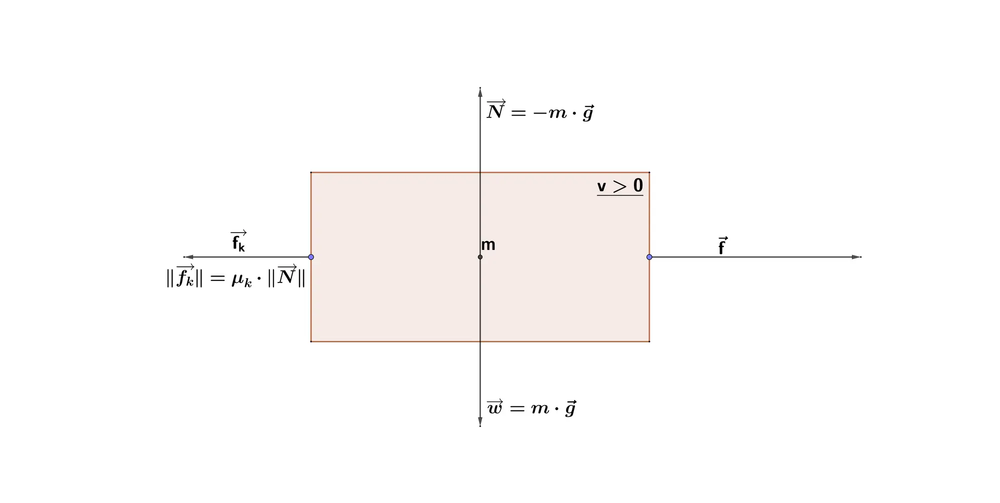
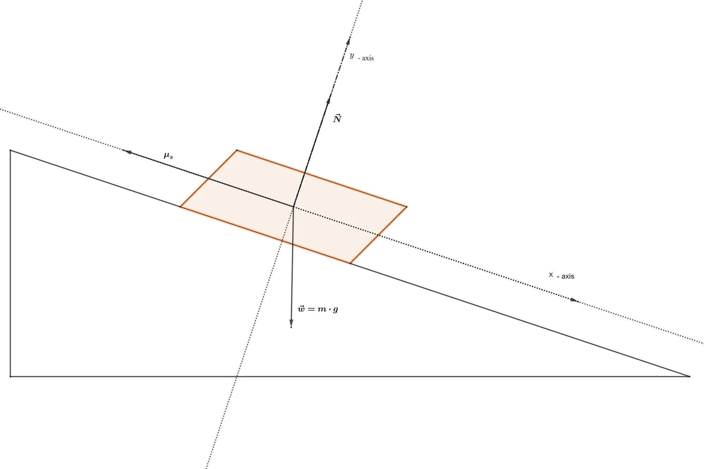

This tutorial introduces the notion of friction. Basically speaking, friction is any force that retards or consumes
energy from another system — like Facebook.

In all previous tutorials, all surfaces were assumed to be smooth, and that objects could slide as far as they wanted,
without encountering any resistance to their motion. Yet, it is clear that no surface is perfectly smooth, as even the
smoothest looking surfaces are rough and jagged when viewed at the atomic level.

People often associate friction as something that should be reduced and eliminated at best. For example, automobiles use
roughly forty percent of the available energy to overcome friction from thermal conversion or mechanical frictions,
which means that about twenty percent of the petrol tanked is used for nothing but to overcome internal frictions.
Clearly, reducing that friction would be very desirable.

On the other hand, however, there would be no movement without friction. It is the friction between our feet and the
Earth that allows us to move — just look at how hard it is when friction is but reduced when trying to walk on ice, for
example.

Since friction is caused by random, microscopic irregularities and since it is affected by factors that cannot be
controlled, it is impossible to state a simple law of nature that would govern all frictional forces. It is however
possible to state a few rules of thumb that allow to compute approximations to model frictional forces well enough.

---

Let $\vec{f} \in \mathbb{R}^n$ be a force. As in the previous tutorials, by abuse of language, we will write $f = \lVert
\vec{f} \rVert$, if it is clear, from the context, that we are only interested in the magnitude of the force, and not in
its direction or sens.

---

## Kinetic Friction

Kinetic friction comes into play whenever surfaces slide against each other. The force generated by this type of
friction will be denoted by $\vec{f}_k$. As a general rule of thumb, the norm of the force of kinetic friction is
proportional to the magnitude of the normal force $\vec{N}$ acting upon an object: $f_k = \mu_k \cdot N = \mu_k \cdot m
\cdot g$, where $g$ is the acceleration due to gravity. The constant expressing that proportionality is the *
*coefficient of kinetic friction**. In other words, the greater $\mu_k$ the greater the friction. Note that the above
equation is not a vector equation, as the direction of the kinetic friction is, in general, not the same as the
direction of the normal force, but parallel to the direction of motion, in the opposite direction.

It is also important to note that the magnitude of kinetic friction does not depend on the relative speed of the
surface, nor on the area of contact between surfaces. This second statement might be a bit counterintuitive, but it
follows the same reasoning used
when [computing the centroid of a convex polygon](https://bell0bytes.eu/centroid-convex/): If the area of contact is
considerable, the normal force is spread out over a large area, resulting in small forces per area, and thus the atomic
imperfections are not pressed as deeply against each other. If the area of contact is small, the atomic imperfections in
that area come into consideration with full force.



## Static Friction

Static friction is the force that keeps two surfaces from moving relative to one another — once again due to atomic
imperfections of the surfaces that are in contact. Static friction is often stronger than kinetic friction because when
surfaces are in static contact, their imperfection, i.e. the microscopic hills and dents, had time to deeply nestle into
each other.

There is an upper limit to the magnitude of static friction, denoted by $f_{sm}$, which denotes the point at which the
static friction can no longer keep an object from being moved, thus the force of static friction, noted by $f_s$, can
have any value between zero and the maximal value mentioned above: $0 \leq f_s \leq f_{sm}$, where the magnitude of $f_
{sm}$ is once again proportional to the magnitude of the normal force $f_{sm} = \mu_s \cdot N$, with $\mu_s$ being
called the **coefficient of static friction**.

As for kinetic friction, the static friction does not depend on the area of contact.

The coefficient of static friction is, as was already mentioned, often greater than the coefficient of kinetic friction.
The following table lists a few of the most common frictional coefficients:

|        Material        | Kinetic Friction | Static Friction |
|:----------------------:|:----------------:|:---------------:|
| Rubber on dry Concrete |       0,8        |       0,9       |
|     Steel on Steel     |       0,57       |      0,74       |
|    Wood on Leather     |       0,4        |       0,5       |
|    Rubber on Grass     |       0,35       |      0,35       |
| Rubber on wet Concrete |       0,25       |       0,3       |
|      Steel on Ice      |       0,06       |       0,1       |
|     Glass on Glass     |       0,4        |      0,94       |

## Anti-Lock Breaking Systems

Imagine a car driving on the road with the tires rolling freely. Is the friction between the tires and the road kinetic
or static?

The answer might be a bit surprising, the friction between the tires and the road is actually static. An easier way to
understand that, is to watch your motion: Each time your foot is on the ground, it is actually static, as in, not moving
relative to the ground. The same is true for the tires of a car: as long as the tires are rolling, the friction is
static: if the car skips, however, the friction is kinetic. It follows that a car can be stopped in less distance over
time if its wheels are rolling than if its wheels are locked up, which is the idea behind
the [anti-lock breaking system (ABS)](https://en.wikipedia.org/wiki/Anti-lock_braking_system). When the brakes are
applied on a car with ABS, an electronic sensor detects whether a wheel is about to start skidding, and if so, a small
computer quickly modulates the hydraulic pressure in the brake lines in short bursts, causing the brakes to release and
then reapply in rapid succession. This way, the tire can continue rolling, and thus static friction still determines the
stopping distance over time.

## Implementation

As seen in the [previous tutorial](../newtons-laws-of-motion/), all forces can be represented in the same way
$\sum\limits_{\vec{f}\in \mathcal{F}}\vec{f} = m \cdot \vec{a}$, thus, to model friction, it is enough to add the
magnitude of the frictional force as a negative acceleration to the by now well-known equation of motion $\ddot{x} = f(
t,x,\dot{x}),$ and once again
the [symplectic semi-implicit Euler integrator](../bell0bytes.eu/one-dimensional-kinematics/) will do all the hard work
for us. Note that it is possible to apply as many frictional forces to an object as needed, by simply adding them up.

### Demo: Kicker

As an example, I created a small kicker or air hockey demo. Pressing the space button fires a ball on a virtual kicker
table in a random direction. Using the arrow keys, the direction of movement and the initial velocity of the ball can be
changed. The keys *Q* and *A* can be used to increase or decrease the coefficient of kinetic friction.

The position of the ball is updated using semi-implicit Euler, as follows:

```cpp
void Ball::update(const double deltaTime, const float frictionK)
{
	if (isRolling)
	{
		physics::Kinematics::semiImplicitEuler(*position, *velocity, *acceleration, deltaTime);

		// adjust sign of the acceleration
		acceleration->x = std::copysignf(acceleration->x, -velocity->x);
		acceleration->y = std::copysignf(acceleration->y, -velocity->y);

		if (velocity->getSquareLength() < 0.1f)
			reset(frictionK);
	}
}
```

Once the symplectic integrator returns the new position and velocity of the ball, the new acceleration is set to point
in the opposite direction of the movement using
the [std::copysignf](https://en.cppreference.com/w/c/numeric/math/copysign) function.

Note that to simulate collisions with the rectangular table, it is sufficient to remember that the angle of reflection
equals the angle of incidence. Read the [tutorial about basic collision response](../basic-ad-hoc-collision-response)
for more details on this subject.

---

<video width="800" height="450" controls>
  <source src="https://filedn.eu/ltgnTcOBnsYpGSo6BiuFrPL/Videos/bell0bytes/Game%20Programming%20Tutorials/DirectX%2011/Kinetic%20Friction%20Demo.mp4" type="video/mp4">
Your browser does not support HTML5 videos.
</video> 

---

You can download the source code
from [here](https://filedn.eu/ltgnTcOBnsYpGSo6BiuFrPL/Game%20Programming/Mathematics/Physics/Kinematics/friction.7z).

---

## Friction on an Inclined Plane

To see how friction works on an inclined plane, it is useful to first analyse the situation of a mass $M$ being in
equilibrium on an inclined plane. We set the axes of the coordinate system to be along the movement of the object, i.e.
the $x$-axis is o the same line as the static friction vector, and the $y$-axis is perpendicular to the $x$-axis:



To see what happens, we break down the forces into their $x$- and $y$-components.

For the $x$-axis, we have a force due to gravity, namely $f_{x_g} = m \cdot g \cdot \operatorname{sin}\varTheta$, where
$\varTheta$ is the angle of inclination, and a force due to the static frictional coefficient, namely $f_{x_s} = -N
\cdot \mu_s$. Since the object is in equilibrium, the sum of those forces, noted as $\sum F_x$ is zero: $\sum F_x = f_
{x_g} + f_{x_s} = m \cdot g \cdot \operatorname{sin}\varTheta - N \cdot \mu_s = 0$.

For the $y$-axis, we only have the gravitational force to consider, which is in the opposite direction of the normal
force: $\sum F_y = N - m \cdot g \cdot \cos \varTheta = 0$.

From this second equation, we can deduce the value of the normal force: $N = m \cdot g \cdot \cos \varTheta$, thus the
first equation can be written as: $\sum F_x = m \cdot g \cdot \sin \varTheta - m \cdot g \cdot \cos \varTheta \cdot
\mu_s = 0$, thus $\mu_s = \dfrac{\sin \varTheta}{\cos \varTheta} = \tan \varTheta$. From this equation, we can deduce
the *critical angle*, $\varTheta_!$ at which the mass starts to slide, $\varTheta_! = \operatorname{arctan}\mu_s$, or,
in English, the critical angle is equal to the inverse tangent of the static coefficient of friction.

---

Now what happens when the mass actually starts to slide? As we have seen, the movement is governed by the following
equation: $\sum F_x = m \cdot g \cdot (\sin \varTheta - \cos \varTheta \cdot \mu_k)$. Note the use of the coefficient of
kinetic friction in this formula!

---

To use this in a game, remember that $F = m \cdot a$, thus each cycle the velocity of the mass is increased by $a_x = g
\cdot (\sin \varTheta - \cos \varTheta \cdot \mu_k)$ in the $x$-direction. Just note that all the computations were done
in the coordinate system defined by the object itself. To use the coordinate system of the underlying screen, simply
multiply the new velocity vector by the vector $(\cos \varTheta, -\sin \varTheta)$, where $\varTheta$ continues to be
the angle of inclination:

```cpp
// update position
posX += velX;
posY += velY;

// update velocity
velX += cos(theta) * g * (sin(theta) - friction * cos(theta));
velY += sin(theta) * g * (sin(theta) - friction * cos(theta));
```

## References

* Differential Equations, by Prof. Dr. K.-F. Siburg
* Dynamical Systems, by Prof. Dr. K.-F. Siburg
* Geogebra
* Physics, by James S. Walker
* Tricks of the Windows Programming Gurus, by A. LaMothe
* Wikipedia