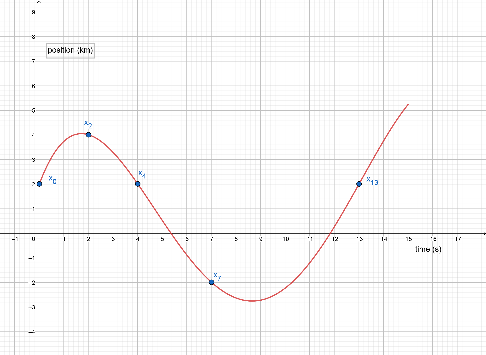
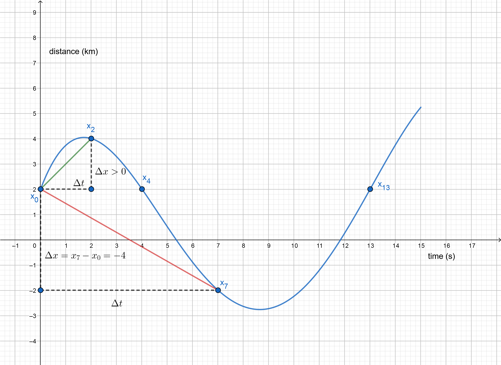
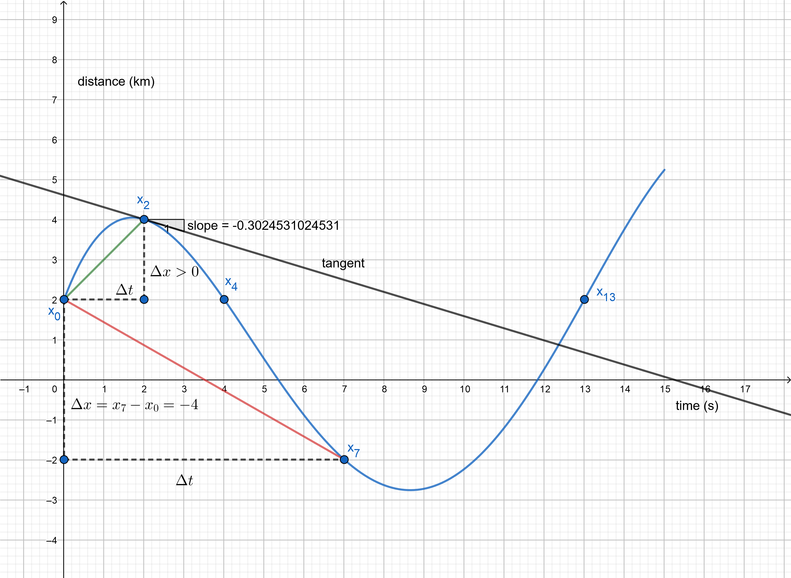
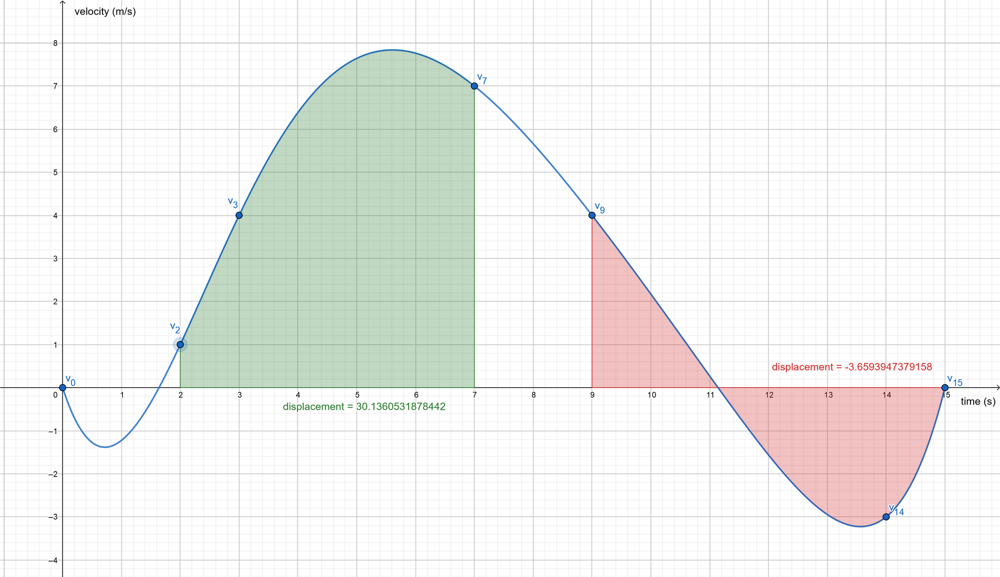
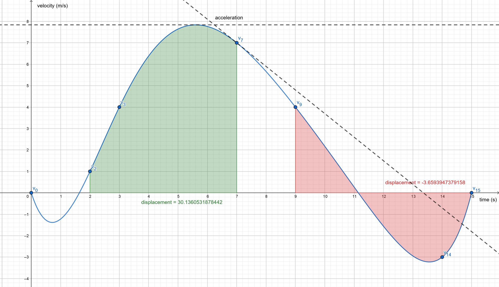
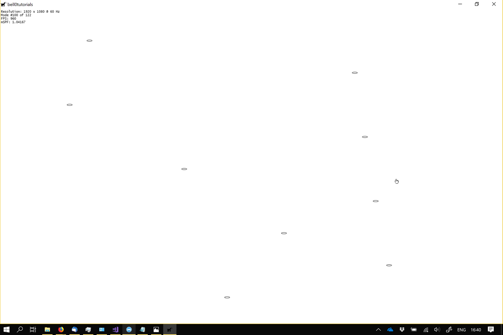

> Between the idea and the reality, between the motion and the act, falls the shadow.
>
> -- T.S. Eliot, The Hollow Men

The term kinematic is the English version of the French word *cinématique*, which is derived from the Greek *κίνημα*, or
*kinema*, meaning *motion*, itself being derived from *κινεῖν*, or *kinein*, which means *to move*.

In this tutorial we will learn about one-dimensional kinematics, i.e., the motion on a straight line, of point
particles. In the following, each time an object is mentioned, the object is thought of as a single point particle.

## Distance and Displacement

To define movement, a coordinate system must be set up first. In all the basic tutorials, the entire action takes place
in the standard Euclidean plane $\mathbb{R}^2$ or the standard Euclidean space $\mathbb{R}^3$, each time equipped with
the standard Euclidean scalar product.

When objects move, they cover a certain **distance**, which is defined as the **total length of travel**, and measured
in metres (m). The **displacement** is defined as the **change in position** of an object over time, and also measured
in metres. Let $t_1$ and $t_2$, with $t_2 > t_1$, be two fixed moments in time and $x_1$ and $x_2$ be the positions of
an object at those exact times, then the displacement of the object is defined as: $$\Delta x = x_2 - x_1.$$Please note
that while the distance covered is always positive, the displacement might be zero or even negative.

Imagine going to the computer store, which is, luckily, only $300m$ away, on a straight line, to buy a new GPU and
immediately returning home afterwards, once again, on a straight line, then the total displacement is $0$, as $x_f =
x_0$, but the distance covered obviously is equal to $600m$. A negative displacement simply means movement in the
negative direction, as defined by the coordinate system.

Defining the position of an object to be a mathematical function of time, $x: \mathbb{R} \to \mathbb{R}$, $t \mapsto x(
t)$, mapping an instant of time to the actual position of the object at that exact time, the motion of an object can be
visualized by the graph of the function.



In the above graph one can see that while between $t=0$ and $t=4$ the object travels 4 km, its total displacement is
$\Delta x = x_4-x_2=2-2=0$, indicating that it moved an equal distance in the positive and negative direction. Between
$t=4$ and $t=7$, the total distance travelled by the object is $4km$, the displacement is negative, however, indicating
a movement in the negative direction (to the left in the first figure of this tutorial): $\Delta x = x_7 - x_4 = -2 -
2 = -4$. Between $t=7$ and $t=13$, the distance travelled is once again $4km$, and the displacement is positive $\Delta
x = x_{13} - x_7 = 2 + 2 = 4$, indicating a movement in the positive direction (to the right).

## Average Speed and Velocity

Often it is not enough to know how far an object has travelled, but the time it took for the object to reach its
destination is important as well. This is called the **average speed** of an object. Let $d$ be the distance covered and
$t$ be the elapsed time, then the average speed $v_{s_{avg}}$ is defined as $v_{s_{avg}} := \frac{d}{t}$, and measured
in, obviously, meters per second ($\frac{m}{s}$). Note that since both the distance and the elapsed time are always
positive, so is the average speed.

Yet, even knowing the average speed of an object is frequently not satisfying enough. It is also essential to know how
fast an object was moving between certain points in time. This measure is called the **average velocity** of an object
and is defined as the **displacement per time**. Let $x_1$ be the position of an object at the time $t_1$ and $x_2$ its
position at the time $t_2$ (some time after $t_1$, i.e. $t_2 > t_1$), then its average velocity $v_{avg}$ is defined as
$v_{avg} := \frac{\Delta x}{\Delta t} = \frac{x_2 - x_1}{t_2 - t_1}$. Note that, unlike the average speed, the average
velocity also indicates the direction the object is travelling in, as the average velocity is actually negative, if and
only if, $x_1 > x_2$, as depicted in the figure below.

‌

In the figure, one can also see that the slope of a line connecting two points is equal to the average velocity during
that time interval.

Considering the velocity to be a mathematical function of time, $v: \mathbb{R} \to \mathbb{R}$, $t \mapsto v(t)$,
mapping an instant of time to the velocity of an object at that time, the average velocity can be defined in a more
precise way as a definite integral. Let $t_0$ and $t_1$ be two instants of time, then the average velocity between those
time intervals is $$v_{avg} = \dfrac{1}{t_1 - t_0} \int_{t_0}^{t_1}v(t)dt.$$

## Instantaneous Velocity

Even the average velocity of an object does not hold enough information, as most often objects do not travel at the same
velocity all the time (just imagine driving a car) — their velocity changes constantly. It is ideally desirable to know
the velocity of an object at each instant of time (not only during certain time intervals). This is called the *
*instantaneous velocity**, $v$, and can be defined by considering smaller and smaller time intervals, or mathematically:
$$v = \lim_{\Delta t \to 0} \frac{\Delta x}{\Delta t}.$$Note that the magnitude of the instantaneous velocity is called
the instantaneous speed (think of the speedometer in a car). The instantaneous velocity can also be interpreted as the
velocity that an object would continue to travel at, if no forces, no longer interacted with it.

Geometrically, the instant velocity at the time $t$ is the slope of the tangent line at $x_t$:



To be more precise, the instantaneous velocity of an object, at any particular moment in time, can be expressed as the
derivative of the position with respect to time: $$v = \lim_{\Delta t \to 0}\dfrac{\Delta x }{\Delta t} =
\dfrac{dx}{dt}.$$

Drawing the graph of the velocity function, one can see that the displacement of an object can be expressed as the area
under the graph between two time points, or, the displacement function $x$ is the integral of the velocity function $v$:
$x = \int v dt.$



A negative velocity simply means that the object is speeding ahead in the negative direction, as defined by the
underlying vector space.

Between $t=2$ and $t=7$, the area under the graph of the function $v$ is positive, meaning the object mostly in the
positive direction, whereas the area between the graph and the $x$-axis is negative between $t=9$ and $t=15$, indicating
a net movement in the negative direction.

## Acceleration

As velocity describes the change of position over time, acceleration is the rate of change of velocity over time. The
concept of acceleration is one of the most important concepts in classical physics. In later chapters we will learn that
Galileo showed that falling bodies move with constant acceleration and how Newton managed to find a relation between
acceleration and force. It is thus essential to have a good understanding of the concept of acceleration.

The average acceleration is defined analogously to the average velocity. Let $v_1$ and $v_2$ be the velocities of an
object measured at times $t_1 < t_2$, then the average acceleration, $a_{avg}$, is defined as $$a_{avg} := \frac{\Delta
v}{\Delta t} = \frac{v_2 - v_1}{t_2 - t_1}.$$The acceleration of an object is thus measured in meters per second
squared: $\dfrac{\dfrac{m}{s}}{s} = \dfrac{m}{s^2}$.

Similarly to the instantaneous velocity, the instantaneous acceleration, $a$, at a specific time, can be computed by
taking smaller and smaller time intervals: $a := \lim_{\Delta t \to 0}\dfrac{\Delta v}{\Delta t}$.

Note that, in one dimension, if the velocity and the acceleration of an object have the same sign, the speed of the
object increases. When the velocity and the acceleration have opposite signs, the speed of the object decreases.

To be mathematically more precise, the instantaneous acceleration at a point in time is defined as the derivative of
velocity with respect to time: $a = \dfrac{dv}{dt}$. The velocity can then be considered as the area under the graph of
the acceleration function $a: \mathbb{R} \to \mathbb{R}$, $t \mapsto a(t)$, mapping an instant of time to the
acceleration of an object at that exact time, or, thinking about integrals again, the velocity is the integral of the
acceleration with respect to the time: $v = \int a dt$.



The figure above shows the acceleration as the slope of the tangent at a specific point. One can see that at the peak of
its velocity, the object has no acceleration for a brief moment of time (tangent line parallel to the $x$-axis), and the
negative slope means a negative acceleration, which corresponds to the object losing velocity, i.e. slowing down.

## Motion with Uniform Acceleration

In the case of uniform or constant acceleration, it is relatively easy to derive simple formulas to describe the motion
of an object. In an idealized world, without friction, for example, motion with constant acceleration can be used to
model a wide range of everyday phenomena.

If an object has constant acceleration, its average and instantaneous accelerations are obviously the same. Let $t_1 <
t_2$ be two arbitrary chosen times, then $a = a_{avg} = \dfrac{v_{t_2} - v_{t_1}}{t_2-t_1}$. Since the choice of time is
not significant for constant acceleration, it seems wise to set $t_1 = 0$, simplifying the formula to $a =
\dfrac{v-v_0}{t},$where $v_0$ is the initial velocity of the object. It is thus possible to express the velocity of an
object as an affine function of time: $v = v(t) = v_0 + at$, which means that the velocity of an object at time $t$ is
the initial velocity plus $t$ times its acceleration.

The next question to ask is how far an object moves in a given time. Using the same simplification as above, the formula
of the average velocity reduces to $v_{avg} = \dfrac{x-x_0}{t}$, thus $x=x_0 + v_{avg} \cdot t$. Since in the case of
constant acceleration, the average velocity is simply the average of the initial and final velocities, this formula can
be further simplified to express the position of an object as an affine function of time: $x = x(t) = x_0 +
\dfrac{1}{2}(v_0 + v)t$.

Finally, substituting $v=v_0+at$, the formula to compute the position of an object after a certain time $t$, under
constant acceleration, looks as follows: $x = x(t) = x_0 + v_0t + \dfrac{1}{2}at^2$.

Implementing motion with uniform acceleration in C++ is now straightforward:

```cpp
float Kinematics::posUM(const float x0, const float v0, const float a, float dt)
{
	return x0 + v0 * dt + 0.5f * a * dt * dt;
}
```

## Free Fall

Free fall, the motion of an object falling freely under the influence of gravity and gravity alone, is probably the most
famous example of motion with constant gravity. [Galileo](https://en.wikipedia.org/wiki/Galileo_Galilei) was most likely
the first to postulate that falling bodies moved with constant acceleration. The acceleration produced by the gravity,
$g$, on Earth is about $g:=a=9,81 \dfrac{m}{s^2}$, thus, if $x_0$ is set to $0$ (by moving the centre of the coordinate
system, if you are so inclined), the formula to compute the position of an object in free fall after a certain time $t$
is as easy as $x = x(t) = \dfrac{1}{2}gt^2$.

## Hamiltonian Systems and Symplectic Integration

As stated above, the problem of an object in motion is a classical mechanical problem. Recall that $x: \mathbb{R} \to
\mathbb{R}$ and $y: \mathbb{R} \to \mathbb{R}$ were defined as two functions determining the position and velocity of an
object at any time $t$. Let further $\dot{x}$ and $\ddot{x}$ be the derivative and the second derivative of the position
function. Newton declared that all motions of a system are uniquely determined by their initials positions $(x(t_0) \in
\mathbb{R}$ and initial velocities, given by the derivative of the position ($\dot{x}(t_0)$). In particular, the initial
position and velocity uniquely determine the acceleration, in other words, there is a function $F: \mathbb{R} \times
\mathbb{R} \times \mathbb{R} \to \mathbb{R}$ such, that $\ddot{x} = F(t,x,\dot{x})$. This equation is called Newton's
equation of motion. For a mathematically more precise introduction into the equation of motion, refer to the tutorial
*Galileo versus Newton* ([[galileoNewton]] Galileo vs. Newton).

By the year 1833, Sir [William Hamilton](https://en.wikipedia.org/wiki/William_Rowan_Hamilton) had invented a new theory
to reformulate those classical mechanical problems in a more modern way, providing a more abstract understanding of the
theory. The main advantage of this new theory comes from
the [symplectic](https://en.wikipedia.org/wiki/Symplectic_manifold) structure
of [Hamiltonian systems](https://en.wikipedia.org/wiki/Hamiltonian_system).

Newton's equation of motion takes the form: $$x(t) = x(0) + \dot{x}(0) \cdot t + \frac{1}{2}\ddot{x}(t)\cdot t^2,$$which
can be transformed into a system of differential equations of the first order $$\begin{cases} v =\dfrac{dx}{dt} \\\ a =
\dfrac{dv}{dt},\end{cases}$$ which can then be written as $$\begin{cases} \dfrac{dx}{dt} = f(t,v) \\ \dfrac{dv}{dt} = g(
t,x),\end{cases}$$where $f$ and $g$ are given functions (the velocity and acceleration functions, which can both vary
over time). Those two functions are [symplectomorphisms](https://en.wikipedia.org/wiki/Symplectomorphism), which means
that they conserve the [symplectic two-form](http://faculty.tcu.edu/richardson/Seminars/symplectic.pdf) $\omega := dx
\wedge dv$.

The equations of motion take this form if the Hamiltonian is of the form $\mathcal{H} = T(t,v) + V(t,x)$, where $T$ is
the sum of all kinetic and $V$ the sum of all potential energy, which happens to be the case in this situation.

The goal of this tutorial is not to give an introduction into Hamiltonian Systems, but rather to solve the equations of
motion, thus, given the initial conditions $x(t_0) = x_0$ (the initial position of the object) and $v(t_0)=v_0$ (the
initial velocity of the object), how can the above so-called system
of [differential equations](https://en.wikipedia.org/wiki/Differential_equation) be solved algorithmically, i.e. how do
we compute the position and velocity of our game objects at any given moment in time?

## Numerical Integration and Implementation

To algorithmically, or numerically, solve the above system of differential equations, the equations of motion, a
technique called [numerical integration](https://en.wikipedia.org/wiki/Numerical_integration) is used. Numerical
integration basically repeats certain small steps again and again, i.e., in this case, objects start at an initial
position with an initial velocity and then, using small-time steps, the new velocity and position are computed, which
are then set as the new initial positions and velocities. Thus, numerical integration tries to find an approximate
discrete solution to a continuous problem by iteration.

One such approximate discrete solution of the Hamiltonian equations of motion can be produced by iterating $$v_{n+1} =
v_n + g(t_n, x_n) \cdot \Delta t$$and $$x_{n+1} = x_n + f(t_n, v_{n+1}) \cdot \Delta t,$$where $\Delta t$ is the time
step and $t_n = t_0 + n \cdot \Delta t$ denotes the time after $n$ steps.

This technique is called [semi-implicit Euler integration](https://en.wikipedia.org/wiki/Semi-implicit_Euler_method),
named after the Swiss mathematician [Leonhard Euler](https://en.wikipedia.org/wiki/Leonhard_Euler). This integration
technique is a [symplectic integrator](https://en.wikipedia.org/wiki/Symplectic_integrator), which means it is well
suited to solve Hamiltonian systems, i.e. it also conserves the symplectic form $\omega$, which means that it can
conserve the energy of the system quite well.

Note that to compute the position of the object at the time $t+1$, the velocity at the time $t+1$ is used instead of the
velocity at the time $t$. Using the velocity at the time $t$ instead, leads to
the [standard Euler method](https://en.wikipedia.org/wiki/Euler_method), which is not a symplectic integrator, though.
As a consequence, the symplectic semi-implicit Euler method almost conserves the energy of the Hamiltonian system,
while, very often, the energy increases steadily when using the standard Euler method, resulting in a loss of accuracy.

After all that scary talk about abstract mathematics, implementing the semi-implicit Euler method to solve the equations
of motions is actually straightforward:

```cpp
void Kinematics::semiImplicitEuler(float& pos, float& vel, const float acc, const float dt)
{
	vel += acc * dt;
	pos += vel * dt;
}
```

As an example, assume that nine bullets are shot from guns positioned at the left of the screen. The initial positions
of the centres of the bullets are stored in an array called *centres*, the initial velocities are stored in the
*velocities* array and the accelerations in the *accelerations* array. The motion of the bullets can then be modelled as
follows, just please note that in a game, the position, and velocity are obviously measured in pixels, or pixels per
second, instead of meters and meters per second: 1 pixel usually corresponds to about $0,000264583 m$:

```cpp
const float Kinematics::metersPerPixel = 0.000264583f;		// 1 pixel = 0.000264583 meters

util::Expected<void> PlayState::update(const double deltaTime)
{
	if (isPaused)
		return { };

	// get meters per pixel
	const float mpp = physics::Kinematics::metersPerPixel;

	// update position based on symplectic integration of the equations of motion
	for (unsigned int i = 0; i < centers.size(); i++)
	{
		// the "even" bullets move with non-constant acceleration
		if (i % 2 != 0)
			accelerations[i] += rand()%10 * mpp;

		// symplectic integrator: semi-implicit Euler
		physics::Kinematics::semiImplicitEuler(centers[i].x, velocities[i], accelerations[i], deltaTime);
			
		// wrap screen
		if (centres[i].x > dxApp.getGraphicsComponent().getCurrentWidth())
		{
			centres[i].x = 0.0f;
			accelerations[i] = rand()%10 * mpp;
			velocities[i] = rand()%100 * mpp;
		}
	}

	// return success
	return { };
}

util::Expected<void> PlayState::render(const double farSeer)
{
	// let the far seer update the positions if necessary
	for (unsigned int i = 0; i < centers.size(); i++)
		centers[i].x += velocities[i]*farSeer;

	// render circles
	for (unsigned int i = 0; i < centers.size(); i++)
		dxApp.getGraphicsComponent().get2DComponent().drawEllipse(centers[i].x, centers[i].y, 10.0f, 2.5f);

	// print FPS information
	dxApp.getGraphicsComponent().getWriteComponent().printFPS();

	// return success
	return { };
}
```



That's it. All in all, one-dimensional kinematics are rather easy to handle, but the theory behind Hamiltonian systems
and symplectic integrators can be a bit intimidating. Just **remember to update the velocity before updating the
position**, and you are all set!

## References

* Dynamical Systems, Prof. Dr. K.-F. Siburg
* Dynamical Systems, C. Robinson
* Geogebra
* Physics, by James S. Walker
* Tricks of the Windows Programming Gurus, by A. LaMothe
* Wikipedia