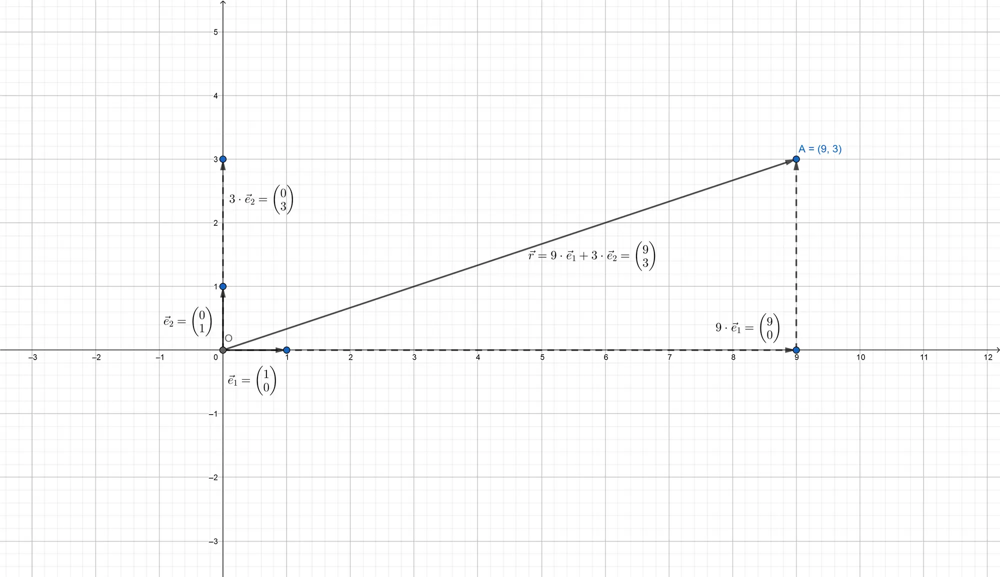
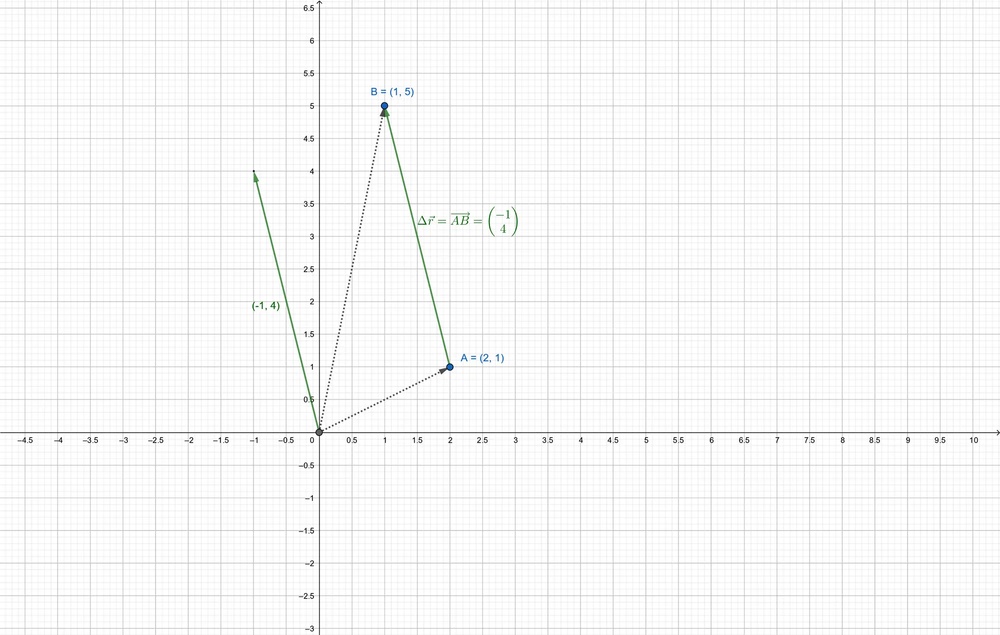
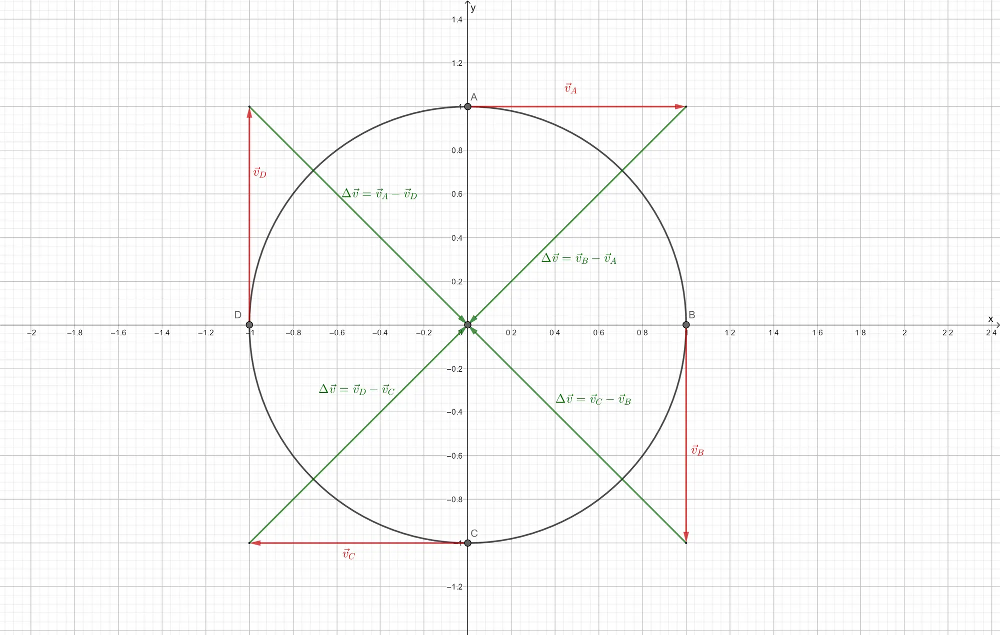
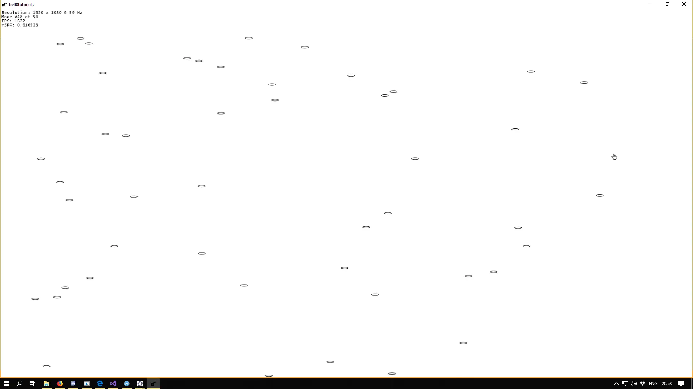

The basic idea to extending the study of kinematics to two dimensions is surprisingly easy: horizontal and vertical
motions are independent. Or, in other words, each motion behaves as if the other motion were not present. The **TL:DR**
version of this tutorial is: **Everything works just as it used to in one dimension, including the symplectic
integration**.

In what follows, we will give a geometrical explanation as to how two-dimensional motion works, the internal
computations, using symplectic integration, do not change, however.

To code information about movement in more than one direction, vectors are used. In this tutorial, all vectors are
elements of the standard two-dimensional vectors space $\mathbb{R}^2$, with the standard basis $\vec{e}_1 =
\begin{pmatrix}1 \\ 0\end{pmatrix}$ and $\vec{e}_2 = \begin{pmatrix}0 \\ 1\end{pmatrix}$, as well as equipped with the
standard scalar product. An element $v = \begin{pmatrix}v_x \\ v_y\end{pmatrix} \in \mathbb{R}^2$ can thus be
represented by the standard basis as follows: $$v = \begin{pmatrix}v_x \ v_y \end{pmatrix} := v_x \cdot \vec{e}_1 + v_y
\cdot \vec{e}_2.$$

Let $\vec{f} \in \mathbb{R}^n$ be a vector. By abuse of language, we will write $f = \lVert \vec{f} \rVert$, if it is
clear, from the context, that we are only interested in the magnitude of the force, and not in its direction or sens.

Please note that, unlike in one dimension, the graphs of the position and velocity functions are no longer subsets of
$\mathbb{R}^2$. In the two-dimensional case, those functions look a bit differently. Let $x: \mathbb{R} \to \mathbb{R}$
and $y: \mathbb{R} \to \mathbb{R}$ two functions defining the position of an object on the $x$, resp. the $y$-axis, with
respect to time, then the two-dimensional position function $f$ can be defined as $f: \mathbb{R} \to \mathbb{R}^2$, $t
\mapsto \begin{pmatrix}x(t) \\ y(t)\end{pmatrix}$. Let further $v_x: \mathbb{R} \to \mathbb{R}$ and $v_y: \mathbb{R} \to
\mathbb{R}$ be two functions defining the velocity of an object when moving in the $x$, resp. the $y$-direction, then
the function $g$ describing the velocity of the object can be defined as $g := \mathbb{R} \to \mathbb{R}^2$, $t \mapsto
\begin{pmatrix}v_x(t) \\ v_y(t) \end{pmatrix}.$ The graphs of $f$ and $g$ are thus subsets of $\mathbb{R}^3$.

## Position and Displacement

The **position** of an object is coded in a two-dimensional vector $\vec{r} = \begin{pmatrix}r_x \\ r_y\end{pmatrix}$,
where $r_x,r_y \in \mathbb{R}$ denote the objects position in the $x$-axis and $y$-axis respectively. The following
figure shows the vector with coordinates $\begin{pmatrix}9\3\end{pmatrix}$, which means $9$ units to the right (the
direction of $\vec{e}_1$) and $3$ units up (the direction of $\vec{e}_2$):



Please note that in the standard plane, vectors correspond to the *points they are pointing to*. The position of the
object is equal to the *position* of the point *A* in the figure above.

The two-dimensional **displacement** of an object can then easily be computed as $$\Delta \vec{r} = \vec{r}_2 - \vec{r}_
1 = \begin{pmatrix}x_2 - x_1 \ y_2 - y_1\end{pmatrix},$$where $\vec{r_1} = \begin{pmatrix}x_1 \\ y_1 \end{pmatrix}$
denotes the position of the object at a time $t_1$ and $\vec{r_2} = \begin{pmatrix}x_2 \\ y_2\end{pmatrix}$ the position
of the object at a time $t_2 > t_1$.

The displacement vector can be considered the vector joining two *points* in the plane and its coordinates are the
difference of the coordinates of the *end point* $B=(x_B, y_B)$ and the *starting point* $A = (x_A, y_A)$: $$\Delta
\vec{r} = \overrightarrow{AB} := \begin{pmatrix} x_B - x_A \\ y_B - y_A \end{pmatrix}.$$
As an example, let the starting point be $A=(2,1)$ and the end point be $B=(1,5)$, then the displacement vector is
$\overrightarrow{AB} = \begin{pmatrix}-1 \\ 4\end{pmatrix},$ which means a negative displacement in the direction of the
$x$-axis and a positive displacement in the direction of the $y$-axis.



## Velocity and Speed

As in the one-dimensional case, the **average velocity** vector $\vec{v}_{avg} = \begin{pmatrix} {v_{avg}}_{x} \\ {v_
{avg}}_y \end{pmatrix}$ is defined as the displacement over time: $\vec{v}_{avg} = \dfrac{1}{\Delta t} \cdot \Delta
\vec{r}$.

As an example, assume that a dog is observed initially at the position $A=(2,3)$ and three seconds later at the position
$B=(5,2)$, then the average velocity of the dog during that time was: $$v_{avg} = \dfrac{1}{3}\begin{pmatrix}3 \\
-1\end{pmatrix}=\begin{pmatrix}1\\ -\dfrac{1}{3}\end{pmatrix},$$which means that its average velocity in the
$x$-direction was ${v_{avg}}_x = 1 \dfrac{m}{s}$ and its average velocity in the $y$-direction was ${v_{avg}}_y =
-\dfrac{1}{3} \dfrac{m}{s}$.

Note that as stated in the introduction, both average velocities are completely independent of each other, or, in other
words, we would have got the same result, had we computed them separately one after the other. Try it out if you don't
believe me.

The **instantaneous velocity** $\vec{v}$ is also defined, analogously to the situation in one dimension, by using the
derivative: $$\vec{v} = \lim_{\Delta t \to 0}\dfrac{1}{\Delta t} \cdot \Delta \vec{r} = \dfrac{d\vec{r}}{dt}.$$
Geometrically, the average velocity points in the same direction as the displacement vector, while the instantaneous
velocity is a vector tangent to the curve of the motion.

To actually compute the **speed** $s$ of an object, the norm of the velocity vector must be computed using the scalar
product: $s = \lVert \vec{v} \rVert = \sqrt{v_x2+v_y2}$.

Please note that, as before, the vector of the instantaneous velocity shows the direction an object is moving in. The *
*direction** $\Theta$, expressed as an angle relative to the $x$-axis, can be computed using
the [arctangent](https://en.wikipedia.org/wiki/Inverse_trigonometric_functions#arctan) function: $\Theta =
\tan^{-1}\dfrac{v_y}{v_x}$.

As an example, imagine a trout swimming around with a velocity of $\vec{v} = \begin{pmatrix}3 \\ 4\end{pmatrix}$, then
the speed of the trout is $s = \sqrt{3^2 + 4^2} = 5 \dfrac{m}{s}$ and the direction of movement is $\Theta =
\tan^{-1}\dfrac{4}{3} = 53^{\circ}$, which means the velocity vector creates an angle of $53^{\circ}$ degrees with
respect to the $x$-axis, i.e. the trout was swimming to the northeast.

It might also be interesting to note that when one is only interested in comparing the speed of two objects, it is not
necessary to compute the square root. Let $s_1$ and $s_2$ be the speed of two objects, then $s_1 < s_2 \Leftrightarrow
s_1^2 < s_2^2$, as the square root function is continuous.

While computing the square root is no longer as costly as a few years ago, saving some computational time (for free) is
always a good thing!

## Acceleration

The **average acceleration** vector $\vec{a}_{avg}$ is the change in the velocity vector over time: $$\vec{a}_{avg} =
\dfrac{1}{\Delta t} \cdot \Delta \vec{v}_{avg}.$$Note that an object can accelerate even if its speed is constant, just
imagine a car driving in a circle with constant speed:



In the figure above, the car drives at a constant speed, but the velocity changes as it's the direction of motion keeps
changing. Which means that the car accelerates without changing its speed.

Also note that the direction of the acceleration need not point in the direction of motion, it won't do so in most
cases.

The **instantaneous accelerations** $\vec{a}$ is defined by using the derivative: $$\vec{a} = \lim_{\Delta t \to
0}\dfrac{1}{\Delta t} \cdot \Delta \vec{v} = \dfrac{d\vec{v}}{dt}.$$
As an example, imagine a car travelling northwest (at an angle of $135^\circ$) at $9 \frac{m}{s}$. Eight seconds later,
it has rounded a corner, and is now speeding south at $25 \frac{m}{s}$. To find the average acceleration of the car
during those eight seconds, we must first compute the initial, $\vec{v}_i$, and final, $\vec{v}_f$, velocities:
$\vec{v}_i = \begin{pmatrix}-6,36 \\ 6,36 \end{pmatrix}$ and $\vec{v}_f = \begin{pmatrix} 0 \\ -25\end{pmatrix}.$ The
change in velocity is thus $\Delta \vec{v} = \begin{pmatrix}6,36 \\ -31,36 \end{pmatrix}$. Knowing the change in
velocity, it is now possible to compute the average acceleration: $\vec{a}_{avg} = \begin{pmatrix}0,795 \\
-3,92\end{pmatrix}$. The average acceleration was thus approximately $4 \frac{m}{s^2}$ and the angle of the direction of
the average acceleration, regarding the $x$-axis, was $\Theta = -78,54^\circ$, i.e. the direction of the average
acceleration was to the southeast.

---

I created a primitive [Geogebra](https://www.geogebra.org/) applet to let you toy around with a particle, called Cosmo,
moving around a winding path. Use the slider to move Cosmo around, and see how the velocity and acceleration vectors,
computed using the derivative, change. You can use the mousewheel to zoom in and out, and holding the left mouse button
allows you to move the viewport. Alternatively, click [here](https://ggbm.at/fyyryjuk), to open the applet in GeoGebra.

---

<iframe scrolling="no" title="Two-Dimensional Motion" src="https://www.geogebra.org/material/iframe/id/fyyryjuk/width/800/height/600/border/888888/sfsb/true/smb/false/stb/false/stbh/false/ai/false/asb/false/sri/false/rc/true/ld/true/sdz/true/ctl/true" width="800px" height="600px" style="border:0px;"> </iframe>

---

## Implementation

As stated in the introduction, nothing really changes when it comes to approximating a discrete solution to the
equations of motion. Recall that $x: \mathbb{R} \to \mathbb{R}^2$ and $v: \mathbb{R} \to \mathbb{R}^2$ are the two
functions giving the position and the velocity of an object at any moment in time. Let further $\dot{x}$ and $\ddot{x}$
be the derivative and second derivative of $x$, then the equation of motion looks the same as in the previous tutorial:
$x(t) = x(0) + \dot{x}(0) \cdot t + \frac{1}{2}\ddot{x}(t)t^2$, which once again translate to the same system of
differential equations: $$\begin{cases} v =\dfrac{dx}{dt} \\ a = \dfrac{dv}{dt}\end{cases}.$$

The C++-code for the symplectic integrator thus remains impertinently easy:

```cpp
void Kinematics::semiImplicitEuler(mathematics::Vector2F& pos, mathematics::Vector2F& vel, const mathematics::Vector2F acc, const double dt)
{
	vel += acc * dt;
	pos += vel * dt;
}
```

As a little demo, I started an alien invasion:

```cpp
util::Expected<void> PlayState::update(const double deltaTime)
{
	if (isPaused)
		return { };

	// get meters per pixel
	const float mpp = physics::Kinematics::metersPerPixel;

	// update position based on symplectic integration of the equations of motion
	for (unsigned int i = 0; i < centers.size(); i++)
	{
		// symplectic integrator: semi-implicit Euler
		physics::Kinematics::semiImplicitEuler(centerVecs[i], velocities[i], accelerations[i], deltaTime);
			
		// wrap screen
		unsigned int width = dxApp.getGraphicsComponent().getCurrentWidth();
		unsigned int height = dxApp.getGraphicsComponent().getCurrentHeight();

		if (centerVecs[i].x > width)
		{
			centerVecs[i].x = width;
			accelerations[i].x = -accelerations[i].x;
			velocities[i].x = -velocities[i].x;
		}

		if (centerVecs[i].x < 0)
		{
			centerVecs[i].x = 0.0f;
			accelerations[i].x = -accelerations[i].x;
			velocities[i].x = -velocities[i].x;
		}

		if (centerVecs[i].y < 0)
		{
			centerVecs[i].y = 0.0f;
			accelerations[i].y = -accelerations[i].y;
			velocities[i].y = -velocities[i].y;
		}

		if (centerVecs[i].y > height)
		{
			centerVecs[i].y = height;
			accelerations[i].y = -accelerations[i].y;
			velocities[i].y = -velocities[i].y;
		}
	}

	// return success
	return { };
}
```



You can download the source code
from [here](https://filedn.eu/ltgnTcOBnsYpGSo6BiuFrPL/Game%20Programming/Mathematics/Physics/Kinematics/symplecticIntegrator.7z).

---

So far the *symplecticness* of the semi-implicit Euler method has really worked out quite well for us. Handling motion,
in any dimensions, is totally easy!

In the next tutorial, we will learn how to simulate projectile motion! Fire in the hole!

## References

* Geogebra
* Physics, by James S. Walker
* Tricks of the Windows Programming Gurus, by A. LaMothe
* Wikipedia