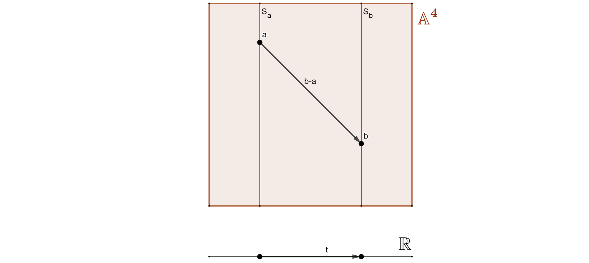

In a few previous tutorials, we briefly talked about physical properties, without really explaining the mathematics
behind those concepts. This tutorial tries to remedy that situation. In what follows, space is three-dimensional and
Euclidean, and time is one-dimensional. The goal of this tutorial is to define and investigate the structure of
space-time and the corresponding group of transformations, and to analyze the constraints imposed by Galileo's principle
of relativity on Newton's equation of motion.

## Galileo's Principle of Relativity

In the [tutorial about Newton's three laws of motion](../newtonslawsofmotion), Galileo's principle of relativity 
was briefly mentioned when
the concept of an inertial frame of reference was explained. Galileo stated that there exist coordinate systems, called
inertial frames of reference, possessing the following two properties:

* All the laws of nature are the same in all inertial coordinate systems, at all moments of time.
* All coordinate systems in uniform rectilinear motion, regarding an inertial one, are themselves inertial.

In other words, as seen in the example in the previous tutorial, if a coordinate system attached to the earth is
inertial, then it is impossible to detect the motion of the train, which is moving uniformly in a straight line, by
experiments conducted entirely inside the cars of the train.

## Newton's Principle of Determinacy

In [this tutorial about kinematics]() it was mentioned, that Newton determined that the initial state of a mechanical
system, i.e. knowing the initial positions and velocities of the objects in the system, uniquely determine the motion of
the system.

In what follows, we try to bring those two concepts together. To do so, we must first define the space we live in.

## A Space of Time

Let $\mathbb{R}^n$ denote the standard $n$-dimensional vector space, and $\mathbb{A}^n$ the $n$-dimensional affine
space, distinguished from $\mathbb{R}^n$ by the fact that there is no fixed origin. As a group, $\mathbb{R}^n$ acts on
$\mathbb{A}^n$ as the group of translations, i.e. as mappings of the form $\mathbb{R}^n \times \mathbb{A}^n \to
\mathbb{A}^n$, $(v, a) \mapsto v+a$. Thus, the sum of two points in the affine space is not defined, but their
difference is defined to be an element of $\mathbb{R}^n$. More precisely, for every two points $a, b \in \mathbb{A}^n$,
there exists a unique $v \in \mathbb{R}^n$, denoted $b-a$, such that $b=v+a$.

In other words, an affine space is a principal homogenous space, or a torsor, for the action of the additive group of
the vector space as defined above, which means that the stabilizer subgroup of every point is trivial. Equivalently,
this means that the vector space acts freely and transitively on the affine space.

Further, let the vector space be equipped with a positive definite symmetric bilinear form $b: \mathbb{R}^n \times
\mathbb{R}^n \to \mathbb{R}$, called a scalar product. The scalar product defines a so-called Euclidean structure on the
vector space $\mathbb{R}^n$ and enables the definition of the distance between two points $a,b \in \mathbb{A}^n$ in the
corresponding affine space: $$d(a,b) := \lVert b-a \rVert := \sqrt{b(b-a,b-a)}.$$An affine space with such a distance
function is called a Euclidean space.

### Galilean Structure

To model physical phenomena, one often gives them a home in a Galilean space-time structure. This structure consists of
three components.

#### The Universe

The actual universe is a four-dimensional affine space $\mathbb{A}^4$. Note that for many centuries, the universe was
given by a linear space, the geocentric system of the universe. The points of $\mathbb{A}^n$ are called **events**. It
is clear that the translation space of the universe is the vector space $\mathbb{R}^4$.

#### Time

Time is defined as a linear map $t: \mathbb{R}^4 \to \mathbb{R}$, from the translation space of the affine space to the
so-called **time-axis**. The time interval between two events $a$ and $b$ is $t(b-a)$. If that number is zero, then the
two events are said to happen simultaneously. The set of all events simultaneous to an event $a$ forms a
three-dimensional affine subspace $S\_a \subset \mathbb{A}^4$.

#### Distance

The distance between simultaneous events $a$ and $b$ is defined as the norm of the vector joining the two events: $$d(
a,b) = \lVert b-a \rVert = \sqrt{b(b-a, b-a)},$$where $b$ is a scalar product on $\mathbb{R}^3$. Thus, the space of
simultaneous events is a three-dimensional Euclidean space.

An affine space $\mathbb{A}^4$, equipped with a Galilean space-time structure, is called a **Galilean space**. The *
*Galilean group** is now defined as the set of all structure-preserving mappings from the Galilean space into itself.
Its elements are called **Galilean transformations**. It is clear that Galilean transformations are affine maps
$\mathbb{A}^4 \to \mathbb{A}^4$, which preserve time intervals as well as the distance between simultaneous events, i.e.
they must also preserve the Euclidean structure, the so-called metric, and are thus also called *isometries*.

The standard **Galilean coordinate space** is the space $\mathbb{R} \times \mathbb{R}^3$, as the Euclidean structure of
$\mathbb{R}^3$ naturally induces a Galilean structure. Furthermore, every Galilean transformation of $\mathbb{R} \times
\mathbb{R}^3$ is a composition of a rotation, a translation and a uniform motion.

A **uniform motion with velocity** $v$ is a map of the form: $$u: \mathbb{R} \times \mathbb{R}^3 \to \mathbb{R} \times
\mathbb{R}^3, (t,x) \mapsto (t, x + vt).$$

**Translations** by a fixed vector $s$ obviously take the following form: $$\tau\_{s}: \mathbb{R} \times \mathbb{R}^3
\to \mathbb{R} \times \mathbb{R}^3, (t, x) \mapsto (t + \lVert s \rVert, x + s).$$

A **rotation of the coordinate axes** looks like this: $$\rho: \mathbb{R} \times \mathbb{R}^3 \to \mathbb{R} \times
\mathbb{R}^3, (t, x) \mapsto (t, Rx),$$where $R: \mathbb{R}^3 \to \mathbb{R}^3$ is an orthogonal transformation.

Since the standard Galilean coordinate space is easy to work with, it would be desirable for all other Galilean spaces
to be isomorphic to $\mathbb{R} \times \mathbb{R}^3$, and indeed it is true that all Galilean spaces are isomorphic to
each other and in particular, isomorphic to the standard Galilean coordinate space $\mathbb{R} \times \mathbb{R}^3$.

## The Equation of Motion

A **motion** in an $n$-dimensional space is a differentiable map $x: I \subseteq \mathbb{R} \to \mathbb{R}^n$, also
sometimes called a position map. The image of $x$ is called a trajectory or **curve** in $\mathbb{R}^n$.

The derivative $\dot{x}(t\_0) = \dfrac{dx}{dt}\bigg\rvert\_{t=t\_0}=\lim\_{h \to 0}\dfrac{x(t\_0+h)-x(t\_0)}{h}$ is
called the **velocity** vector at the point $t\_0 \in I$.

The second derivative $\ddot{x}(t\_0) = \dfrac{d^2x}{dt}\bigg\rvert\_{t=t\_0}$ is called the **acceleration** vector at
the point $t\_0 \in I$.

In what follows, all functions are continuously differentiable as many times as necessary.

***

The movement of $N$ objects, considered as points in a three-dimensional Euclidean space, is given by $N$ position maps:
$x\_i: \mathbb{R} \to \mathbb{R}^3$, $i=1, 2,$ … $, n$, and their graphs are called **world lines**. The direct product
of $N$ copies of the $\mathbb{R}^3$ is called the **configuration space** of the system of $N$ points and the motion
maps naturally define a new map $x: \mathbb{R} \to \mathbb{R}^{3N}$, of the time axis into the configuration space. This
new map is called the motion of a system of $N$ points in the Galilean coordinate system on $\mathbb{R} \times
\mathbb{R}^3$.

***

As seen before, according to Newton, all motions of a system are uniquely determined by their initial positions and
velocities. In particular, the initial configuration of a system uniquely determines the acceleration, that is, there
exists a function $f: \mathbb{R} \times \mathbb{R}^{3N} \times \mathbb{R}^{3N} \to \mathbb{R}^{3N}$ such, that
$\ddot{x}=f(t,x,\dot{x})$. This second-order differential equation is called **Newton's equation of motion**. From a
mathematical standpoint, knowing $f$ means knowing the entire system of objects in motion.

Note that in the previous tutorials the motion of a single object, thus the case $N=1$, was studied.

## Galilean Invariance

Since under Galileo's principle of relativity the transformation of the world lines of a given system define new world
lines of the same system with new initial conditions, several conditions are imposed on Newton's equation of motion.

### Time Invariance

One of the three possible Galilean Transformations was a time translation, or a uniform movement. Invariance under a
time translation means that the laws of nature must be true at any moment in time, which means that if $x=\varphi(t)$ is
a solution to the equation of motion, then for any $s \in \mathbb{R}$, so must be $x=\varphi(t+s)$.

It follows that, in an inertial frame of reference, or an inertial coordinate system, the function $f$ does not depend
on the time, i.e. Newton's equation of motion can be rewritten as: $\ddot{x} = f(x, \dot{x})$.

### Translation Invariance

A second possible Galilean Transformation was the simple translation. Invariance regarding a translation means that the
space must be homogenous. More precisely, this means that if $x\_i = \varphi\_i(t)$, $i=1, 2$, …, $n$, is the motion of
a system satisfying Newton's equation of motion, then so must be $\varphi\_i(t)+\tau$, where $\tau \in \mathbb{R}^3$ is
an arbitrary translation vector.

It follows that the right-hand side of the equation of motion in an inertial frame of reference does not depend on the
choice of a coordinate system, i.e. it does not matter which point is taken as the considered origin of the affine
space, i.e. it is possible to work with an affine basis. Further, using the invariance with respect to time, Newton's
equation of motion in an inertial frame of reference can be rewritten as: $\ddot{x\_i} = f\_i((x\_j - x\_k)\_{j,k}, (
\dot{x}\_j - \dot{x}\_k)\_{j,k})$, with $i,j,k = 1, 2$, …, $n$.

### Rotational Invariance

The last Galilean transformation to consider is the rotation in three-dimensional space. Invariance regarding such
rotations means that the space is isotropic, which means *uniform in all orientations*. The word isotropy is derived
from the two Greek words isos (ἴσος), meaning *equal*, and tropos (τρόπος), meaning *way*, thus, basically speaking,
rotational invariance means that *all directions are the same*. If $\varphi\_i$ is the motion of a system of points
satisfying Newton's equation of motion, and $G: \mathbb{R}^3 \to \mathbb{R}^3$ is an orthogonal map, then so must the
motion $G \circ \varphi\_i$ satisfy Newton's equation of motion.

In other words, invariance with respect to an orthogonal map means just that, invariance under an orthogonal map: $f(Gx,
G\dot{x})=Gf(x,\dot{x})$.

## Law of Inertia

In a mechanical system consisting of only one point, the acceleration in an inertial coordinate system is zero. As there
is only one point in motion, the equation of motion can be written as $\ddot{x} = f(t,x,\dot{x})$, with $f: \mathbb{R}
\times \mathbb{R}^3 \times \mathbb{R}^3 \to \mathbb{R}^3$. Now, as in an inertial frame of reference the equation must
be invariant with respect to time, we get $\ddot{x} = f(x, \dot{x}).$ It follows from the invariance regarding
translations, that $\ddot{x}$ does not depend on the position and velocity: $\ddot{x} = f(0,0)$. Thus, with the
invariance regarding orthogonal maps, it follows from $Gf(0,0) = f(G(0),G(0)) = f(0,0)$, that $a = \ddot{x} = 0$.

## References

* Differential Equations, by Prof. Dr. K.-F. Siburg
* Dynamical Systems, by Prof. Dr. K.-F. Siburg
* Geogebra
* Wikipedia