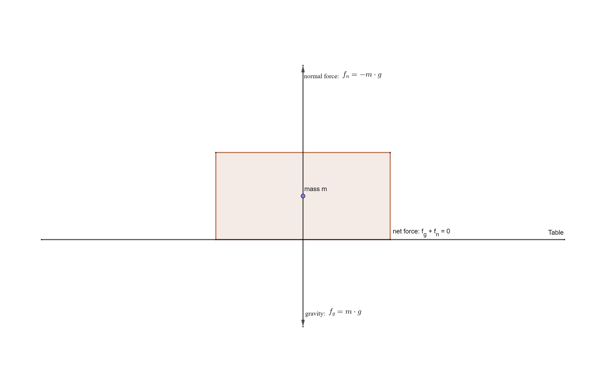

> If I have seen further it is by standing on the shoulders of Giants.
>
> -- Isaac Newton

All of us are proud of our freedom, yet we are all bound and have our very existence constrained and regulated by three
fundamental, yet elementary, laws of physics: Newton's Laws of Motion. Studying these laws is essential and allows going
beyond the simple descriptions of motion, as seen in the previous
tutorials, to actually study the causes of motion, called **dynamics**: Generally speaking, dynamics is the study of how
a physical system develops, or alters over time, and why.

One example of how much of a powerful tool, Newtonian dynamics can be, was the prediction of the return date of a comet
by Edmund Halley. While Newton's Laws of Motion rule supreme when it comes to everyday phenomena, what follows in this
tutorial is not the complete truth for objects moving near the speed of light and for objects comparable in size to
atoms.

This tutorial just briefly introduces the three laws of motion. For a more mathematical introduction into the equation
of motion, read the tutorial „Galileo versus Newton“.

---

Let $\vec{f} \in \mathbb{R}^n$ be a force. As in the previous tutorials, by abuse of language, we will write $f = \lVert
\vec{f} \rVert$, if it is clear, from the context, that we are only interested in the magnitude of the force, and not in
its direction or sense.

---

## Mass and Force

Let's begin the journey into Newtonian dynamics by covering two of the most important fundamental physical concepts:
mass and force.

### Mass

All matter has mass. Mass is both a property of a physical body and a measure of its resistance to acceleration when a
force is applied to it. The mass of an object also determines the strength of its gravitational attraction to other
bodies.

It is essential to note that mass is different from the weight of an object. An often occurring misconception is that
people say that they weigh, for example, 70 kg. The first thing to notice is that kilograms are not the metric measure
of weight, but that of mass. Weight is measured in Newton, abbreviated by N, and related to the mass of an object by the
following formula: $W = m \cdot g$, where $W$ is the weight of an object, m its mass and g the strength of the
gravitational field pulling at the object in question. Thus, if the gravitational field is constant, mass is
proportional to weight, making it unproblematic to use the same unit for both concepts in such cases. Conceptually
speaking, mass refers to an intrinsic property of an object, whereas weight measures an object's resistance to deviating
from its course in free fall.

In the context of this tutorial, mass can be considered a measure of how difficult it is to change the velocity of an
object — to get an object to start moving, if it is at rest, to stop its motion or to change its direction of motion, if
it is already moving. As an early and easy example, imagine trying to *stop* a baseball that is coming right at you. Not
too difficult, right? Now imagine trying to do the same with a car, racing at you at full speed? (Please don't actually
try this out!) Not so easy any more, right? I am sure you agree now that the car has a much greater mass than the
baseball, it is quite simply a lot more challenging to alter the motion of the car, than that of the baseball.

### Force

Undoubtedly, one of the most important concepts in physics is **force**. Simply put, a force is a push or a pull. As an
easy example, just look at any object on your desk; a book, perhaps. Gravity is pulling the book towards the centre of
the Earth, while the table is exerting an upwards force, making sure the book doesn't disappear to China. Forces, and
the mass of an object, are also why trying to pick up an object from the floor can cause some pain in the lower back of
your body.

A force is a vectorial property: it has a **direction** and a **norm**, the magnitude of the force. In general, there
are many forces acting upon an object at any given time. For example, the book on the table experiences a downward force
due to gravity and an upward force due to the table. If it is pushed across the table, it also experiences a horizontal
force. The total force, or net force, exerted on an object, is the vector sum of the individual forces acting on the
object.

Force is measured in Newtons, abbreviated by N. One Newton is defined as the force required to give one kilogram of mass
an acceleration of $1 \frac{m}{s^2}$, thus $1 N = \dfrac{kg \cdot m}{s^2}$. The reason for this definition will be seen
below.

In video games, the concept of forces can be practical, when, for example, trying to apply artificial forces, like
explosions, to game objects, and computing the resulting acceleration. Most importantly, though, a thorough
understanding of dynamics is important to properly handle collisions.

## Newton's First Law of Motion

In his „Philosophiæ Naturalis Principia Mathematica“, Newton states his First Law of Motion as follows:

> Lex I: Corpus omne perseverare in statu suo quiescendi vel movendi uniformiter in directum, nisi quatenus a viribus
> impressis cogitur statum illum mutare.

Translated to English, the law states:

> Law I: Every body persists in its state of being at rest or of moving uniformly straight forward, except insofar as it
> is compelled to change its state by force impressed.

This law was actually first enounced by Galileo, and is also known as the **law of inertia**, from the Latin word
“iners“, meaning idle or sluggish. In other words, “Inertia” is thus the resistance, of any physical object, to any
change or alteration in its velocity. An object is “sluggish” in the sense that, if at rest, it won't start moving until
“forced” to, and, if already moving, it won't alter its speed or direction, unless a force causes the change. According
to the law of inertia, being at rest and moving with constant velocity are actually the same state.

Mathematically, the law of inertia can be formulated using the derivative of the velocity, i.e. the acceleration. Let
the mass of an object be a non-zero constant, and let further $\mathcal{F}$ be the set of all forces acting upon that
object, then $\sum\limits_{\vec{f} \in \mathcal{F}} \vec{f} = 0 \Leftrightarrow \vec{a} = \dfrac{d\vec{v}}{dt} = 0$.
Thus, a physical body has no acceleration, if and only if, the sum of all the forces acting on it is zero. In light of
the previous tutorials, this is also known as *uniform motion*.

Just as an anecdotal note: It was a bit tricky to actually spot the law of inertia, as on the Earth's surface, inertia
is often masked by the evil head of friction and air resistance, which decrease the speed of moving objects. This misled
the famous Greek philosopher Aristotle, among many others, to believe, that objects would move only as long as force was
applied to them.

### Inertial Frame of Reference

Imagine a pedestrian, standing still, watching a cargo train pass by with constant velocity. On one of the trailers, a
worker sits next to his lunch box. From the point of view of the worker on the train, the lunch box has no net force
acting upon it, and thus it is at rest. From the pedestrian's perspective, the lunch box also has no net force acting
upon it, and thus it continues to move with constant velocity. Actually, both people see the lunch box moving with
constant velocity: that velocity just happens to be zero from the perspective of the worker sitting next to it. It is
said that both observers are in an **inertial frame of reference**, that is, a frame of reference in which the law of
inertia holds.

Such a frame of reference can simply be thought of as a coordinate system within an affine space. This allows for a more
modern reformulation of the first Law of Motion: *In an inertial frame of reference, an object either remains at rest or
continues to move at a constant velocity, unless acted upon by a force.*

What happens when the train suddenly comes to a halt? Although from the perspective of the worker there is still no
force acting upon the lunch box, the lunch box will fly around, in fact, it simply continues to move forward with the
same velocity, while the train comes to a halt. While this is a perfectly normal behaviour from the pedestrian's
perspective, for the worker in the train it looks as if the lunch box had suddenly accelerated, which is a violation of
Newton's First Law of Motion. Clearly, his frame of reference was no longer inertial. In general, any frame that
accelerates relative to an inertial frame is non-inertial.

Even though the surface of the Earth accelerates slightly, due to its rotational and orbital motions, that acceleration
is so small, that the Earth's surface can be considered an inertial frame of reference.

### Galilean Invariance

In his *Dialogue Concerning the Two Chief World Systems*, Galileo described that the laws of motion are the same in all
inertial frames. Today, if two frames are inertial, they are called invariant, or, more precisely, Galilean invariant.
Basically stating, the laws of motion are invariant under the choice of a coordinate-system for the affine space, i.e.
forces and accelerations are invariant under the choice of coordinate systems.

For a more thorough introduction into space-time, inertial frames and Galilean Invariance, read the tutorial
called [Galileo versus Newton](../galileonewton).

## Newton's Second Law of Motion

The following is the second law of motion as stated in the *Philosophiæ Naturalis Principia Mathematica*:

> Lex II: Mutationem motus proportionalem esse vi motrici impressae, et fieri secundum lineam rectam qua vis illa
> imprimitur.

Translated to English, that means:

> Law II: The alteration of motion is ever proportional to the motive force impress'd; and is made in the direction of
> the right line in which that force is impress'd.

Basically speaking, the second law of motion states that *unbalanced forces cause accelerations directly proportional to
the forces*.

The second law of motion might actually be easier to understand when expressed mathematically. Let $\vec{v}$ be the
velocity of an object with a constant mass $m$, then the **momentum** of the object is defined as $\vec{p} = m \vec{v}$.
The momentum is thus measured in $\frac{kg \cdot m}{s}$.

Now the second Law of Motion states that the rate of change of the momentum of an object is directly proportional to the
net force applied to it, and the change in momentum takes place in the direction of the applied net force, thus, let
once again $\mathcal{F}$ be the set of forces applied to the object, then $\sum\limits_{\vec{f} \in
\mathcal{F}}\vec{f} = \dfrac{d\vec{p}}{dt}.$ Since the mass is constant, Newton's second Law of Motion can also be
expressed by terms of the acceleration $\vec{a}$ of the object: $\sum\limits_{\vec{f} \in \mathcal{F}}\vec{f} =
\dfrac{d\vec{p}}{dt} = \dfrac{d(m\vec{v})}{dt} = m \cdot \dfrac{d\vec{v}}{dt} = m \vec{a}$, thus the net force applied
to an object produces a proportional acceleration, the factor of proportionality being the mass of the object.

To see that the first and second law of motion are consistent, assume that an object has zero net force acting upon it,
then the acceleration of the object must be zero, which means that the object is in a state of uniform motion.
Conversely, if an object moves with uniform motion, its net acceleration is zero as well, and thus it has zero net force
acting upon it.

As an example, assume that the net force acting on a car has a norm of $650 N$. Knowing that the car accelerates at
$\frac{4}{10} \frac{m}{s^2}$, calculate the mass of the car. Since the net force and the acceleration of a body always
point in the same direction, it is sufficient to compare the norms of the two vectors, thus $m = \frac{6500}{4} = 1625$
kg.

### Impulse and Momentum Transfer

Now in classical mechanics, an **impulse**, $\vec{J}$, is defined as the integral of a force $\vec{F}$ over a time
interval: $\vec{J} := \int_{\Delta t}\vec{F}dt$. Since, as seen above, the force is the time derivative of momentum, it
follows that an impulse is the variation of momentum: $\vec{J} = \Delta \vec{p} = m \cdot \Delta \vec{v}$. This
relationship between impulse and momentum will be essential in later tutorials, when we tackle the problem of collisions
and impacts.

As another example, which will eventually lead us to **momentum transfer**, in a later tutorial though, note that a bee
with a mass of $m_B := 1,5 \cdot 10^{-4}$ kg can have as much of a momentum than a train of a mass of $m_T := 10^6$ kg.
Further, imagine that the train is slowly moving with a speed of $v_T := 1 \frac{m}{s}$. How fast must the bee fly to
have the same momentum as the train? Well, the norm $p_{T}$ of the momentum of the train $\vec{p}_T$ is $p_T = m_T \cdot
v_T = 10^6 \cdot 1 = 10^6 \frac{kg \cdot m}{s}.$Now let $v_B$ be the speed of the bee and $m_B$ and $p_B$ its mass,
respectively the norm of its momentum $\vec{p}_B$, then $v_B = \frac{p_B}{m} = \frac{10^6}{1,5 \cdot 10^{-4}} = 6,6
\cdot 10^9 \frac{m}{s},$ or $2,4 \cdot 10^{10}$ kilometres per hour. The moral of the story? If you ever see a bee
eating a Flash-mushroom — hide!

In other words, using the impulse equation from above, $\vec{J} = m \cdot \Delta \vec{v}$, if a body, even a body with a
small mass, experiences a considerable variation in its velocity, the resulting impulse can be huge!

### Variable-Mass System

The above theory is only valid for objects with a fixed mass. Any mass that is gained or lost will cause the momentum to
change, without an external force being applied, and thus different equations are necessary to model systems with a
variable mass, such as, for example, rockets. Rockets burn fuel and then eject spent gases, that is, for a rocket, its
mass is another function of time: $m: \mathbb{R} \to \mathbb{R}$, $m \mapsto m(t)$, where $m(t)$ defines the mass of the
object at the time $t$. Using the product formula for the differentiation leads to a **wrong** formula: $\sum\limits_
{\vec{f} \in \mathcal{F}}\vec{f} = m(t) \cdot \dfrac{d\vec{v}}{dt} + \vec{v}(t) \cdot \dfrac{dm}{dt}$.

Observing that the above formula does not play well with Galilean invariance, is enough to note that it is simply wrong.
To derive a correct equation of motion for an object with variable mass, one must apply the second law of motion to the
entire *system*, which once again has constant mass: $\sum\limits_{\vec{f} \in \mathcal{F}}\vec{f} + \vec{u} \cdot
\dfrac{dm}{dt} = m \cdot \dfrac{d\vec{v}}{dt},$where $\vec{u}$ is the velocity vector of the varying mass relative to
the body.

One such formula is the [Tsiolkovsky rocket equation](https://en.wikipedia.org/wiki/Tsiolkovsky_rocket_equation),
derived from the above equation by the Russian engineer, and one of the fathers of modern
rocketry, [Konstantin Tsiolkovsky](https://en.wikipedia.org/wiki/Konstantin_Tsiolkovsky): $\Delta \vec{v} = v_e \cdot
\operatorname{ln}\dfrac{m_0}{m_f} = I_{sp} \cdot g \cdot \operatorname{ln}\dfrac{m_0}{m_f},$where $m_0$ is the initial
total mass of the rocket, $m_f$ the final total mass, $v_e = I_{sp} \cdot g_0$ the effective exhaust velocity, $I_{sp}$
the specific impulse in dimension of time and $g$ the acceleration of gravity. We won't cover the motion of vehicles
based on the principle of a rocket until way later in these tutorials.

## Newton's Third Law of Motion

The original citation of Newton's Third Law of Motion is as follows:

> Lex III: Actioni contrariam semper et æqualem esse reactionem: sive corporum duorum actiones in se mutuo semper esse
> æquales et in partes contrarias dirigi.

Translated to English, this reads:

> Law III: To every action there is always opposed an equal reaction: or the mutual actions of two bodies upon each
> other are always equal, and directed to contrary parts.

The third law of motion simply states that all forces between two objects exist in equal magnitude and opposite
direction, that is, if an object $A$ exerts a force $F_A$ (action) on object $B$, then the object $B$ exerts a force
$F_B = -F_A$ (the reaction) on $A$. The two forces are always of the same nature, that is, the reaction force is of the
same nature as the action force.

An important example of Newton's Third Law of Motion, which we encounter all the time, is that of basic movement. When
we walk, we push against the floor, and the floor pushes against us. This is easier to imagine when swimming: a person
interacts with the water, pushing it back, and the water reacts by pushing that person forward.

### Normal Forces

Going back to one of the examples at the beginning of this tutorial, imagine an object lying on a table. In the figure,
the weight pulled at the object and another force pushed it upwards. This is the principle of action and reaction. The
reacting force is always perpendicular to the acting force, and called the **normal force**. In this case, the cause for
the reaction force is that the top of the table fights against being compressed, no matter how small that compression
might be.

This was a rather short and theoretical tutorial, but it was necessary to better understand the principles of classical
mechanics. In the following tutorials, we will study some applications of Newton's Laws of Motion, such as friction,
strings, springs, translational equilibrium and circular motion.

## References

* Geogebra
* Physics, by James S. Walker
* Tricks of the Windows Programming Gurus, by A. LaMothe
* Wikipedia